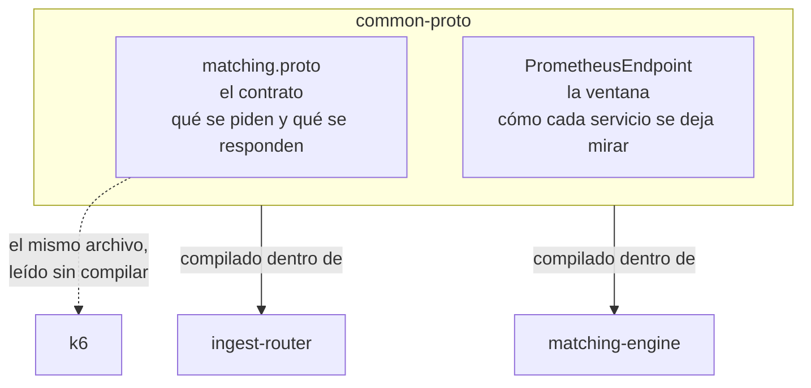

# common-proto — el idioma que los tres hablan

Es el único módulo del repositorio que **no se despliega**. No abre un puerto, no atiende una petición y no aparece en el `docker compose`. Es una biblioteca: los otros dos servicios la compilan dentro de sí mismos.

Parece, por eso, la pieza aburrida del proyecto — un cajón de tipos compartidos. **Y sin embargo aquí es donde vive el diseño de la medición del experimento.** Un campo de cuarenta caracteres en el contrato es lo que le da al experimento dos relojes en vez de uno. Y con dos relojes, sus conclusiones se vuelven falsables.

## Qué contiene, y por qué esas dos cosas juntas



Dos cosas que a primera vista no tienen relación: un contrato de mensajes y un servidorcito de métricas. Lo que las une es que **ambas son acuerdos que ningún servicio puede romper por su cuenta**. Si un motor respondiera un campo distinto, o publicara sus métricas con otro formato, dejaría de ser comparable con el resto. Y una corrida deja de servir en el momento en que sus piezas no se pueden comparar entre sí.

---

# El contrato

El archivo completo son cincuenta líneas. Vale la pena leerlas como lo que son: **el vocabulario del negocio, escrito antes que el código**.

## Lo que un cliente envía

```protobuf
message OrderRequest {
  string order_id = 1;
  string symbol = 2;         // clave de sharding: hash(symbol) % N
  Side side = 3;
  int64 price_cents = 4;     // precio en centavos: sin aritmética flotante
  int64 quantity = 5;
  int64 client_ts_nanos = 6; // opcional: timestamp del generador
}
```

Seis campos, y tres de ellos cargan una decisión de arquitectura:

**`symbol` es la clave del reparto.** No es un dato descriptivo: es lo que decide qué motor atiende la orden. El comentario lo dice porque el campo no lo delata solo. Un lector podría suponer que el reparto es por `order_id`, que es lo natural si uno busca balancear parejo. Repartir por símbolo es lo contrario: **agrupa a propósito**, para que todas las órdenes de una acción caigan siempre en el mismo motor y nadie más toque ese libro.

**`price_cents` es un entero, no un decimal.** Un precio de 100,25 viaja como `10025`. La razón no es de precisión contable sino de camino crítico: comparar dos enteros de 64 bits es una instrucción, y comparar dos decimales de punto flotante abre la puerta a que `100,10 + 100,20` no dé exactamente `200,30`. En un libro de órdenes, dos precios que deberían ser iguales y no lo son producen un cruce que no ocurre.

**`client_ts_nanos` está y no se usa.** Es un campo opcional para diagnóstico que el prototipo deja en cero. Se declara porque agregarlo después obligaría a versionar el contrato; declararlo ahora cuesta nada.

## Lo que el motor responde

```protobuf
message OrderResponse {
  string order_id = 1;
  Status status = 2;
  int64 matched_quantity = 3;
  int64 engine_latency_micros = 4; // arribo al motor → materialización
  int32 shard_id = 5;
}
```

**Aquí está el campo que sostiene el experimento.** `engine_latency_micros` es lo que el motor tardó desde que la orden le llegó hasta que quedó resuelta, medido con su propio reloj interno. Sin él, el experimento tendría una sola cifra: la que mide el generador de carga desde afuera, que incluye la red, la serialización y el router.

Con él tiene dos, y la resta entre ambas es el costo del transporte. Eso convierte una pregunta imposible —*«el p95 subió, ¿de quién es la culpa?»*— en una pregunta con respuesta. **El contrato no transporta solo el resultado del negocio: transporta la evidencia de cómo se produjo.**

`shard_id` hace lo mismo para el reparto. Cada respuesta dice qué motor la atendió, así que un observador externo puede verificar —sin acceso a los servidores— que un símbolo dado siempre cae en el mismo lugar. El generador de carga usa exactamente eso para contar violaciones de enrutamiento.

## Los estados, y el que no parece de negocio

```protobuf
enum Status {
  STATUS_UNSPECIFIED = 0;
  RESTING = 1;            // quedó en el libro esperando contraparte
  PARTIALLY_MATCHED = 2;  // se materializó parte; el resto queda en el libro
  MATCHED = 3;            // materializada por completo
  REJECTED = 4;           // backpressure: cola/ring llenos
}
```

Los tres primeros son vocabulario de bolsa. **El cuarto es una decisión de arquitectura ascendida a vocabulario.**

`REJECTED` no significa que la orden fuera inválida. Significa que el sistema estaba lleno y prefirió decir que no antes que aceptarla y tardar una eternidad. Es la táctica de amortiguación —*cola acotada con contrapresión*— hecha palabra: el diseño eligió **frenar la entrada antes que prometer una latencia incumplible**, y esa elección tenía que ser visible para el cliente o no sería una elección, sería una caída.

El `STATUS_UNSPECIFIED = 0` es obligatorio en Protobuf 3: el valor cero es el que toma un campo ausente, y dejarlo con significado propio haría que un mensaje viejo se leyera como algo que nadie quiso decir.

## El servicio: una sola operación

```protobuf
service MatchingIngest {
  rpc SubmitOrder(OrderRequest) returns (OrderResponse);
}
```

Una llamada, unaria, sin flujo continuo. **Y la misma interfaz la implementan dos servicios distintos** — el router y el motor. El router la recibe y la reenvía sin traducir nada, así que desde el punto de vista de un cliente los dos son intercambiables. Es lo que permite apuntar el generador de carga directo a un motor para medirlo sin el router de por medio.

## Cómo el contrato se vuelve código Java

Nadie escribe las clases `OrderRequest` u `OrderResponse`: las genera el compilador de Protobuf durante la compilación.

```kotlin
protobuf {
    protoc { artifact = "com.google.protobuf:protoc:${libs.versions.protobuf.get()}" }
    plugins {
        id("grpc") { artifact = "io.grpc:protoc-gen-grpc-java:${libs.versions.grpc.get()}" }
    }
    generateProtoTasks { all().forEach { task -> task.plugins { id("grpc") } } }
}
```

Dos generadores encadenados. El primero, `protoc`, convierte cada `message` en una clase Java inmutable con su constructor por pasos. El segundo, el plugin de gRPC, produce además el andamiaje del servicio: la clase base que el servidor extiende y el *stub* que el cliente invoca.

De ahí salen las mil ochocientas líneas de Java que nadie mantiene y que aparecen bajo `build/generated`. **La regla que importa: ese código no se edita ni se versiona.** La fuente de verdad son las cincuenta líneas del `.proto`; todo lo demás es un artefacto de compilación que se puede borrar y reconstruir.

El módulo declara sus dependencias como `api` y no como `implementation`, y eso no es un detalle: significa que quien dependa de `common-proto` **hereda también** las clases de gRPC y Protobuf. Es lo correcto aquí, porque un servicio que recibe un `OrderRequest` necesita poder nombrar el tipo `com.google.protobuf.Message` del que hereda.

---

# La ventana

La segunda mitad del módulo es una sola clase de cien líneas que abre un `/metrics` para que Prometheus lo lea.

## Por qué no se usó una librería

Existe un cliente oficial de Prometheus para Java. No se usó, y la razón está escrita en el propio archivo:

> *Un cliente de Prometheus traería una dependencia y su modelo de registro global al camino de medición. Lo que hace falta aquí es publicar percentiles que ya están calculados por HdrHistogram cada diez segundos, así que el trabajo real es serializar texto.*

El trabajo pesado —acumular latencias y calcular percentiles— ya lo hace HdrHistogram dentro del motor. Lo que faltaba era convertir números en líneas de texto. Para eso alcanza el servidor HTTP que viene dentro del JDK:

```java
HttpServer server = HttpServer.create(new InetSocketAddress(port), 0);
server.createContext("/metrics", exchange -> { ... });
```

Cero dependencias nuevas, cero entradas en el catálogo de versiones, cero configuración global compartida entre clases.

## El detalle que evita que la medición se contamine

Este es el punto delicado, y la clase está construida alrededor de él.

```java
public static PrometheusEndpoint start(int port, Supplier<String> exposicion) {
    server.createContext("/metrics", exchange -> {
        byte[] cuerpo = exposicion.get().getBytes(StandardCharsets.UTF_8);
        ...
    });
}
```

El endpoint recibe un `Supplier<String>` — una función que devuelve texto. **No recibe los histogramas.** Quien la implementa, en el motor, devuelve una cadena que otro hilo ya dejó armada diez segundos antes:

```java
AtomicReference<String> exposicion = new AtomicReference<>("# shard iniciando\n");
PrometheusEndpoint.start(metricsPort, exposicion::get);
```

La consecuencia es que **el hilo HTTP no toca un histograma, no toma un candado y no compite con el hilo escritor**. Prometheus puede raspar cada segundo o cada minuto y la latencia medida no cambia.

Si el endpoint calculara los percentiles en el momento del raspado, cada visita de Prometheus tomaría el candado que el escritor necesita para registrar la siguiente orden. **El instrumento alteraría lo que está midiendo**, y la corrida ya no diría nada sobre el sistema: diría algo sobre la frecuencia de raspado.

El servidor corre además en un solo hilo marcado como demonio:

```java
server.setExecutor(Executors.newSingleThreadExecutor(r -> {
    Thread t = new Thread(r, "metrics-http");
    t.setDaemon(true);
    return t;
}));
```

Un hilo basta porque atender un raspado es copiar una cadena. Y que sea demonio significa que no impide que el proceso termine — al apagar el motor, nadie espera a que el servidor de métricas cierre.

## La sonda de vida, y por qué gana el orden correcto

```java
// El contexto "/metrics" gana por prefijo mas largo.
server.createContext("/", exchange -> { ... "ok\n" ... });
```

Hay dos rutas registradas: `/metrics` y `/`. El servidor del JDK resuelve por **prefijo más largo**, así que una petición a `/metrics` nunca cae en la raíz aunque `/` también la cubra. La raíz existe para que Docker Compose pueda preguntar *«¿ya estás vivo?»* sin pedir el bloque entero de métricas.

## La línea que parece cosmética y no lo es

```java
sb.append(String.format(Locale.ROOT, "%.6f", valor))
```

`Locale.ROOT` es obligatorio. En una máquina configurada en español, `String.format("%.6f", 3.14)` produce `3,140000` — **con coma**. Prometheus lee eso, no puede convertirlo a número y **descarta la muestra completa**, en silencio.

El resultado sería una métrica que aparece en unos entornos y no en otros, sin ningún error en los registros. Es el tipo de defecto que cuesta una tarde encontrar, y una palabra prevenir.

## Los cuantiles, escritos una sola vez

```java
public static final double[] CUANTILES = {50.0, 95.0, 99.0, 99.9};
public static final String[] ETIQUETAS_CUANTIL = {"0.5", "0.95", "0.99", "0.999"};
```

Dos arreglos paralelos: el valor que se le pide a HdrHistogram y la etiqueta con que Prometheus lo nombra. Están juntos y expuestos para que **el motor y el router no puedan discrepar**. Si el motor publicara `quantile="0.95"` y el router `quantile="95"`, una consulta que cruce ambos servicios no encontraría nada — y no fallaría: devolvería vacío.

---

## Qué se rompe si tocas esto

| Cambio | Qué se cae |
|---|---|
| Renumerar un campo del `.proto` | Todo cliente compilado antes lee basura. Los números son la identidad del campo en el cable, no el nombre |
| Quitar `engine_latency_micros` | El experimento pierde su segundo reloj y ya no puede separar el motor del transporte |
| Quitar `shard_id` | Nadie puede verificar el reparto desde afuera; se vuelve un acto de fe |
| Cambiar `price_cents` a `double` | Vuelve la aritmética de punto flotante al camino crítico y con ella los cruces que no ocurren |
| Calcular métricas dentro del `Supplier` | El raspado empieza a competir con el hilo escritor y la medición se contamina a sí misma |
| Perder `Locale.ROOT` | Prometheus descarta muestras en silencio en cualquier máquina con coma decimal |

**La regla de oro del módulo:** un campo del contrato es para siempre. Agregar es barato —un número nuevo, y los clientes viejos lo ignoran—; quitar o renumerar rompe a todos a la vez.

---

*Siguiente pieza: la [puerta de entrada](ingest-router.html), que es quien decide a qué motor va cada orden.*
