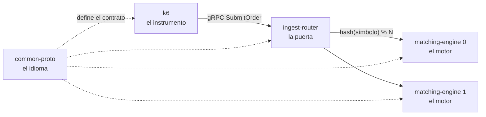

# Cómo está hecho por dentro

El sistema son **tres servicios y un instrumento**. Tres se despliegan; el cuarto los mide, y sin él las otras tres piezas serían una afirmación sin evidencia.

Esta sección recorre cada pieza desde lo que hace hasta la línea de código que lo hace. El orden de lectura no es arbitrario:

| Pieza | Qué es | Por qué va en este lugar |
|---|---|---|
| **[common-proto](common-proto.html)** | El idioma común | Nada se entiende sin saber qué se dicen entre sí |
| **[ingest-router](ingest-router.html)** | La puerta de entrada | Decide qué motor atiende cada orden, y a quién le dice que no |
| **[matching-engine](matching-engine.html)** | El motor | Donde vive la apuesta del diseño: un solo hilo, en memoria, sin esperar a nadie |
| **[k6](k6.html)** | El instrumento | Lo que convierte «creemos que aguanta» en «medimos que aguanta» |

**Un mapa de dependencias, para orientarse.** `common-proto` no depende de nadie y todos dependen de él. El router conoce a los motores solo por una lista de direcciones. Los motores no se conocen entre sí — no comparten memoria, ni disco, ni un solo mensaje. Esa ausencia de vínculo es el diseño, no un pendiente: es lo que permite que agregar un motor sea agregar capacidad y no agregar coordinación.

*El qué se prueba está en la [ficha del experimento](../experimento.html); los resultados, en la [evidencia de corridas](../evidencia-corridas.html).*
