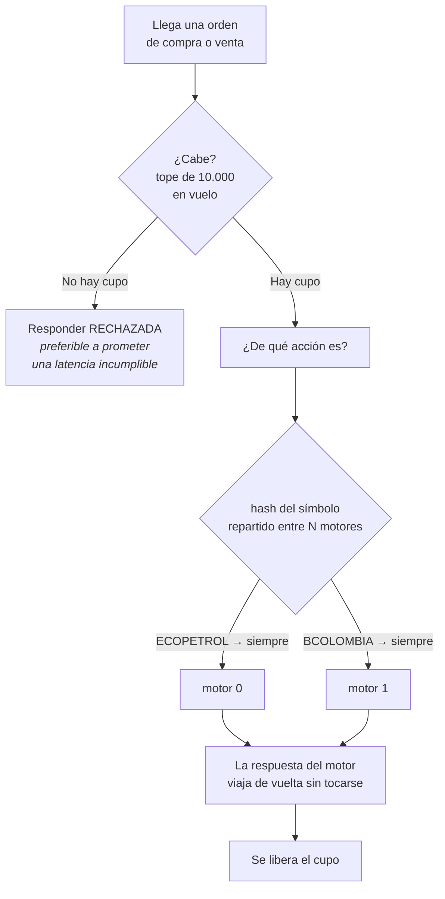
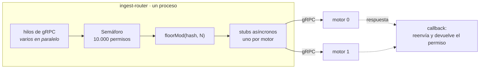

# ingest-router — la puerta, y el portero

Es el único servicio con un puerto abierto al exterior. Todo lo que entra al sistema pasa por aquí.

Y es, a propósito, **el servicio más tonto de los tres**. No guarda órdenes, no las interpreta, no las valida, no las transforma. Su trabajo entero cabe en dos decisiones, y las dos son inmediatas:

> **¿Hay espacio? Si no, digo que no.**
> **¿A quién le toca? A quien le tocó siempre.**

Esa pobreza es el diseño. Un router que pensara sería un punto de coordinación, y un punto de coordinación en el camino crítico es exactamente lo que el patrón LMAX existe para eliminar. **La inteligencia del router está en lo que se niega a hacer: nunca encola de más, nunca busca el motor menos ocupado, nunca recuerda nada de una orden después de responderla.**

## Qué hace, en términos del negocio



Lo importante de ese dibujo es la palabra **siempre**. Un símbolo no se reparte entre motores según quién esté más libre: cae siempre en el mismo. Eso es lo que garantiza que **un libro de órdenes tenga un solo dueño**, y por lo tanto que ese dueño pueda trabajar sin candados.

Es también su límite conocido: si una sola acción concentra el tráfico, los demás motores no pueden ayudarle. Eso es lo que la hipótesis H2b puso a prueba, y lo que la [evidencia](../evidencia-corridas.html) terminó reencuadrando.

## Cómo funciona por dentro



Dos piezas de estado, y ninguna es una cola de órdenes:

| Pieza | Qué es | Para qué |
|---|---|---|
| `Semaphore inFlight` | Un contador de permisos | El tope de solicitudes simultáneas |
| `List<...Stub> shardStubs` | Una lista de conexiones | A quién reenviar, por posición |

El router **nunca almacena una orden**. La recibe, la pasa y olvida — lo único que retiene mientras tanto es un permiso del semáforo, que son unos pocos bytes.

---

# El código, línea por línea

## La decisión de reparto

```java
int shard = Math.floorMod(request.getSymbol().hashCode(), shardStubs.size());
```

Una línea. Merece tres párrafos.

**Es determinística y sin estado.** No consulta una tabla, no pregunta a un servicio de descubrimiento, no recuerda decisiones anteriores. Dos routers arrancados en máquinas distintas, sin hablarse, mandan `ECOPETROL` al mismo motor. Eso permite escalar el router horizontalmente sin coordinación alguna.

**Es `floorMod`, no `%`.** La diferencia es un defecto real, no una preferencia de estilo. En Java, `hashCode()` devuelve un entero con signo, así que puede ser negativo — y `-7 % 2` da `-1`, no `1`. Con el operador de resto, el símbolo cuyo hash sea negativo intentaría entrar en la posición `-1` de la lista y el servicio lanzaría una excepción. `floorMod` siempre devuelve un resultado del signo del divisor: entre `0` y `N-1`, siempre.

**Y el conjunto de símbolos importa tanto como la fórmula.** El reparto es solo tan parejo como lo permitan los hashes de los nombres que existan. Con seis símbolos de prueba el reparto salía 67 % / 33 % con dos motores, y con cuatro dejaba uno **ocioso**. Los 36 nemotécnicos que hoy usa el generador se eligieron verificando que repartan exacto: 18/18 con dos motores y 9/9/9/9 con cuatro. Es un detalle del banco de pruebas, no del patrón. Pero medir el desbalance de una lista de nombres y creer que se mide el patrón es un error fácil de cometer.

## El freno, y por qué no es una cola

```java
private final Semaphore inFlight;

public RouterService(List<...Stub> shardStubs, int queueCapacity) {
    this.inFlight = new Semaphore(queueCapacity);
}
```

La táctica se llama *cola acotada con contrapresión*, pero **aquí no hay ninguna cola**. Hay un contador de permisos, inicializado en 10.000.

La distinción es la que importa. Una cola guarda las órdenes que no puede atender todavía; un semáforo simplemente **no deja entrar** a la 10.001. Guardar sería prometer que en algún momento se atenderá, y una promesa así, bajo carga sostenida, se convierte en una espera que crece sin fin. Rechazar es decir la verdad de inmediato.

```java
if (!inFlight.tryAcquire()) {
    rejectedByBackpressure.incrementAndGet();
    responseObserver.onNext(OrderResponse.newBuilder()
            .setOrderId(request.getOrderId())
            .setStatus(Status.REJECTED)
            .setShardId(-1)
            .build());
    responseObserver.onCompleted();
    return;
}
```

**`tryAcquire()`, no `acquire()`.** La versión sin `try` esperaría a que se libere un permiso, y esperar es exactamente lo que no puede pasar: el hilo de gRPC que atiende esta orden quedaría bloqueado, y con él la capacidad de atender las siguientes. `tryAcquire()` responde ahora mismo, con `true` o con `false`, y nunca duerme a nadie.

El `setShardId(-1)` es una convención pequeña y útil: dice *«ningún motor vio esta orden»*. Un `0` habría sido ambiguo, porque el motor cero existe.

## El reenvío asíncrono, que es donde está la sutileza

```java
shardStubs.get(shard).submitOrder(request, new StreamObserver<>() {
    @Override public void onNext(OrderResponse value) {
        responseObserver.onNext(value);
    }
    @Override public void onError(Throwable t) {
        inFlight.release();
        responseObserver.onError(t);
    }
    @Override public void onCompleted() {
        inFlight.release();
        responseObserver.onCompleted();
    }
});
```

El *stub* es **asíncrono**: `submitOrder` regresa de inmediato, antes de que el motor haya contestado. El hilo de gRPC que trajo la orden queda libre en ese instante, y la respuesta llegará después por el callback, en otro hilo.

Esto es lo que hace que **un motor lento no consuma hilos del router**. Con la variante bloqueante, cada orden en vuelo ocuparía un hilo esperando; con diez mil órdenes en vuelo harían falta diez mil hilos. Aquí el router sostiene diez mil órdenes con el puñado de hilos que gRPC administra por su cuenta.

**El permiso se devuelve en los dos finales posibles**, `onCompleted` y `onError`, y no en `onNext`. Es la parte frágil del método y conviene entender por qué está así:

- `onNext` puede invocarse varias veces en un flujo continuo. Liberar ahí soltaría un permiso por mensaje y el contador se desbordaría hacia arriba, dejando el tope sin efecto.
- Si `onError` no liberara, cada fallo de un motor **filtraría un permiso**. El router iría perdiendo capacidad de a una, sin ningún síntoma, hasta empezar a rechazar todo con el sistema vacío. Es el defecto clásico de esta forma, y es silencioso.

## Los contadores, y por qué son de dos tipos distintos

```java
private final AtomicLong rejectedByBackpressure = new AtomicLong();
private final LongAdder received = new LongAdder();
private final LongAdder[] routed;
```

Tres contadores y **dos clases diferentes**, elegidas por cómo se usa cada uno.

`LongAdder` reparte la cuenta en varias celdas internas, una por hilo que la toque, y solo las suma cuando alguien pide el total. Es la opción correcta para algo que muchos hilos incrementan sin parar y alguien lee de vez en cuando. Así son `received`, que crece con cada orden, y `routed[]`, que crece con cada reenvío.

`AtomicLong` mantiene un solo valor. Es más simple, y aquí alcanza porque los rechazos son un evento raro: en las corridas oficiales el contador debe quedarse en cero.

`routed[]` es un arreglo con un contador por motor, y es **la evidencia del reparto vista desde el router**:

> *Si el conjunto de símbolos desbalancea, se ve aquí antes de que el desbalance se disfrace de problema de latencia.*

Es una idea que vale más allá de este servicio. Un motor lento y un motor que recibe el doble de tráfico producen el mismo síntoma —el p95 sube— y exigen arreglos opuestos. Contar el reparto separa las dos causas antes de que haya que adivinar.

---

# Cómo arranca y qué se le puede cambiar

## Las conexiones se abren una vez

```java
for (String target : shardsSpec.split(",")) {
    ManagedChannel channel = ManagedChannelBuilder.forTarget(target.trim())
            .usePlaintext()
            .build();
    channels.add(channel);
    stubs.add(MatchingIngestGrpc.newStub(channel));
}
```

Un canal por motor, creado al arrancar y reutilizado por todas las órdenes. gRPC multiplexa muchas llamadas sobre una sola conexión HTTP/2, así que abrir una conexión por orden sería pagar el saludo de red millones de veces sin necesidad.

`usePlaintext()` desactiva el cifrado. Es defendible aquí —todo el tráfico viaja dentro de la máquina, entre contenedores— y **es una limitación declarada, no un olvido**: en un despliegue real ese tramo va cifrado.

**El orden de la lista es la identidad de cada motor.** El router no conoce nombres: el motor de la posición 0 es el que recibe los símbolos cuyo hash da 0. Cambiar el orden de `SHARDS` reasigna todos los símbolos de golpe, y con eso los libros quedarían partidos entre dos motores.

## Las perillas

| Variable | Valor por omisión | Qué cambia |
|---|---|---|
| `PORT` | `8080` | Puerto gRPC de entrada |
| `SHARDS` | `localhost:9090` | Lista de motores, separada por comas. **Su orden importa** |
| `QUEUE_CAPACITY` | `10000` | Solicitudes simultáneas antes de rechazar |
| `METRICS_PORT` | `8085` | Puerto de `/metrics` |
| `RUN_ID` | `sin-id` | Etiqueta de la corrida en todas sus métricas |

## Las métricas, y una diferencia con el motor

```java
private static String exponer(RouterService router, int queueCapacity, String runId) {
    StringBuilder sb = new StringBuilder(1024);
    ...
}
```

El router arma su texto de métricas **en el momento del raspado**, y el motor no. La diferencia está explicada en el propio código:

> *A diferencia de la del motor se arma en el momento del raspado, porque son cinco contadores atómicos y no hay histogramas que drenar: leerlos no le cuesta nada al camino crítico.*

Leer cinco contadores es leer cinco números. Drenar un histograma, en cambio, exige un candado que el hilo escritor también necesita — por eso el motor construye su texto por adelantado. **Dos servicios, dos estrategias, y la razón es la misma en ambos: que observar no cueste.**

Lo que publica:

| Métrica | Qué dice |
|---|---|
| `router_requests_total` | Órdenes recibidas, aceptadas y rechazadas |
| `router_rejected_total` | Rechazadas por el freno. **Debe ser 0 en las fases oficiales** |
| `router_inflight` | En vuelo en este instante |
| `router_queue_capacity` | El tope, publicado para poder leer el anterior como porcentaje |
| `router_routed_total{shard}` | Cuántas fueron a cada motor: la evidencia del reparto |

Publicar la capacidad al lado de la ocupación es un detalle deliberado. Sin ella, un tablero muestra *«3.200 en vuelo»* y nadie sabe si eso es holgado o inminente. Con ella, la consulta se escribe sola.

---

## Lo que este servicio no hace, y es intencional

- **No valida órdenes.** Ni precio, ni cantidad, ni existencia del símbolo. Esa lógica pertenece al motor y en el prototipo está modelada como costo, no implementada.
- **No reintenta.** Si un motor falla, el error viaja al cliente sin más. Reintentar dentro del router duplicaría órdenes, y una orden duplicada en una bolsa es peor que una orden perdida.
- **No balancea por carga.** Iría contra el reparto determinístico: si una orden pudiera ir al motor menos ocupado, dos órdenes del mismo símbolo podrían separarse y el libro tendría dos dueños.
- **No conserva estado entre órdenes.** Es lo que lo vuelve replicable sin coordinación — varios routers idénticos toman las mismas decisiones sin hablarse.

**El resumen:** el router es una función pura con un contador al lado. Todo lo demás que podría hacer, lo delega o lo rechaza. Por eso nunca aparece en la explicación de por qué una corrida salió lenta.

---

*Siguiente pieza: el [motor](matching-engine.html), donde vive la apuesta del diseño.*
