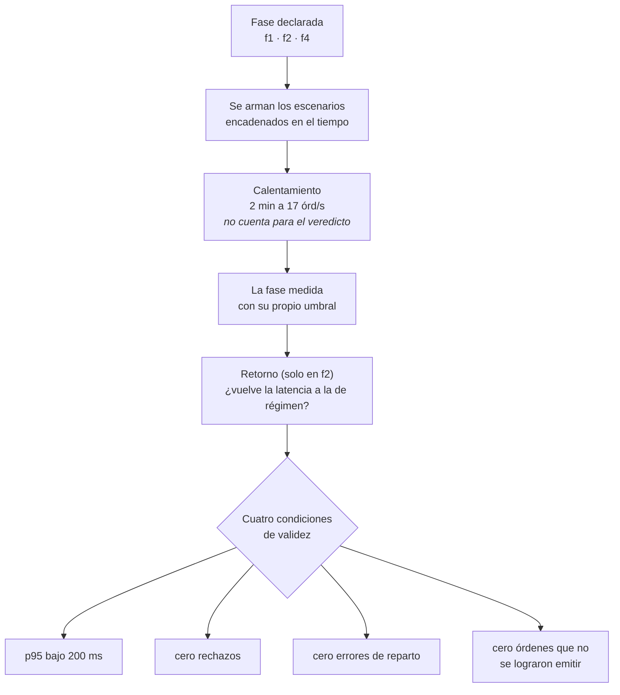
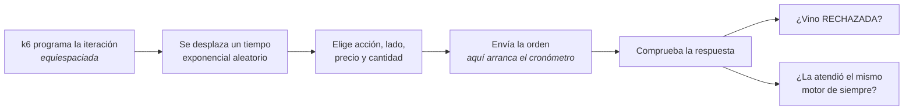

# k6 — el instrumento, no el cliente

Las otras tres piezas construyen un motor. Esta decide si el motor sirve.

Y ahí está el problema que la ordena entera: **un generador de carga mal armado no falla, miente.** No se cae, no lanza errores, no deja rastro en los registros. Simplemente entrega un percentil optimista, y el equipo declara cumplido un requisito que no se cumple.

Este archivo de doscientas setenta líneas está construido alrededor de **tres mentiras concretas** que un generador puede contar, y de cómo se le cierra la puerta a cada una:

| La mentira | Cómo aparece | Cómo se cierra |
|---|---|---|
| Dejar de pedir cuando el sistema se atasca | El p95 sale bajo porque las peores órdenes nunca se enviaron | Modelo de tasa de llegada, y descartes que invalidan la corrida |
| Llegar como un metrónomo | La fila nunca acumula y los percentiles salen optimistas | Desplazamiento exponencial en cada llegada |
| Medir la máquina virtual mientras arranca | El veredicto incluye los primeros minutos de compilación | Calentamiento como escenario aparte, sin umbral |

## Qué hace, visto desde afuera



## Cómo emite cada orden



El desplazamiento va **antes** del envío, y eso es deliberado: el cronómetro de k6 solo mide la llamada, así que esa espera no contamina la cifra.

---

# Las tres mentiras, y el código que las cierra

## 1 · Dejar de pedir cuando el sistema se atasca

Es la mentira más común, y tiene nombre propio: **omisión coordinada**.

Un generador con «cien usuarios que envían órdenes en bucle» se acompasa sin querer con el sistema que mide. Si el sistema se pone lento, los cien usuarios se quedan esperando y **dejan de enviar** — así que las órdenes que habrían llegado durante el atasco nunca existieron. El percentil se calcula sobre las que sí salieron, que son las de los momentos buenos.

La defensa es el tipo de ejecutor:

```javascript
executor: 'constant-arrival-rate',
rate: RATE_A,
timeUnit: '1s',
```

**Tasa de llegada, no cantidad de usuarios.** Le dice a k6 *«emite diecisiete órdenes por segundo, pase lo que pase»*, y k6 va tomando clientes de un grupo para cumplirlo. El ritmo lo fija el reloj, no el sistema medido.

Pero el grupo es finito, y ahí la mentira vuelve por la puerta de atrás. Si todos los clientes están ocupados esperando respuesta, k6 **descarta** la iteración que tocaba: carga que nunca se aplicó. De ahí el cuarto umbral:

```javascript
dropped_iterations: ['count==0'],
```

> *k6 descarta una iteracion cuando no tiene un cliente virtual libre. Eso es carga que NUNCA se aplico, y a partir de ahi el modelo abierto degenera en uno cerrado: la latencia pasa a ser (clientes / throughput) y mide el generador, no el sistema.*

Cuando eso pasa, el número que k6 reporta como p95 **no es un p95**. Es el percentil `95 × observadas ÷ intentadas` — con veintiséis pérdidas sobre cincuenta y seis mil da un p94,96, indistinguible; con veinte mil sobre setenta y cuatro mil da un **p69,3**, que es otra cosa por completo.

## 2 · Llegar como un metrónomo

Esta es más sutil, y el archivo le dedica veinte líneas de explicación porque no es evidente.

Los ejecutores de tasa de llegada de k6 reparten las iteraciones **en fracciones exactas**: a diecisiete por segundo, una orden cada 58,8 milisegundos, siempre. Eso no es tráfico: es un metrónomo.

> *El problema no es de realismo sino de validez. Con llegadas deterministas la varianza del arribo es 0 y, por Kingman, la espera en cola se desploma: el ring buffer nunca acumula, el backpressure jamás se activa y el p95/p99 sale optimista. El criterio se cumpliría sin someter la hipótesis a su propia condición.*

Una fila se forma porque las llegadas se **agolpan**. Si están perfectamente espaciadas y el sistema atiende cada una antes de la siguiente, no hay fila nunca. Y la parte interesante del experimento, que es la cola, desaparece del resultado.

La corrección son seis líneas:

```javascript
function exponentialSeconds(meanSeconds) {
  if (meanSeconds <= 0) return 0;
  // Math.random() ∈ [0,1) ⇒ (1 − r) ∈ (0,1]: nunca se evalúa log(0).
  return -Math.log(1 - Math.random()) * meanSeconds;
}
```

Cada orden se desplaza un tiempo aleatorio de distribución exponencial antes de salir. La superposición de muchos flujos así **converge a un proceso de Poisson conservando la tasa media** — el mismo resultado que sostiene buena parte de la teoría de colas. En números: la variabilidad del arribo pasa de 0,00 a 0,89, donde Poisson vale 1, sin desviar la tasa.

El `1 - Math.random()` no es adorno. `Math.random()` puede devolver exactamente cero, y el logaritmo de cero es infinito negativo: una sola orden se demoraría para siempre.

```javascript
const JITTER_FACTOR = __ENV.JITTER_FACTOR === undefined ? 8 : Number(__ENV.JITTER_FACTOR);
const JITTER_MEAN_SECONDS = JITTER_FACTOR / PEAK_RATE;
```

**La media del desplazamiento se expresa relativa a la tasa**, no en segundos fijos. Con eso, el costo en clientes virtuales —que por la ley de Little es tasa × duración— sale independiente de la tasa: un experimento a 84 órdenes por segundo necesita el mismo grupo que uno a 17. Y `JITTER_FACTOR=0` restaura el metrónomo, para poder comparar las dos cosas en un A/B.

## 3 · Medir la máquina virtual mientras arranca

Java compila su código sobre la marcha: los primeros minutos de cualquier proceso son sistemáticamente más lentos. Meter eso en el veredicto es medir el arranque, no el régimen.

La ficha del experimento siempre pidió un calentamiento que no se midiera. La solución obvia —correr dos minutos y descartarlos al analizar— es una nota al pie que alguien termina olvidando. Aquí el calentamiento es **un escenario aparte**:

```javascript
const calentamiento = {
  executor: 'constant-arrival-rate',
  rate: RATE_A,
  duration: CALENTAMIENTO,
  ...
};

f1: {
  ...
  startTime: CALENTAMIENTO,   // arranca cuando el calentamiento termina
}
```

Y los umbrales se aplican **por escenario**:

```javascript
[`grpc_req_duration{scenario:${PHASE}}`]: ['p(95)<200'],
```

> *El calentamiento aporta trafico y no aporta veredicto.*

Queda fuera del criterio **por construcción**, no por una convención que hay que recordar. Es la diferencia entre un proceso que depende de la disciplina y uno que no puede hacerse mal.

---

# Las decisiones que no son mentiras, pero deciden el resultado

## El retorno como escenario propio

```javascript
f3: {
  executor: 'ramping-arrival-rate',
  startRate: RATE_B,
  startTime: seg(segundos(CALENTAMIENTO, rampa, pico)),
  stages: [
    { target: RATE_A, duration: caida },
    { target: RATE_A, duration: drenaje },
  ],
}
```

La ficha le pide al experimento algo que el pico no puede responder: *«al bajar, la fila se vacía y la latencia vuelve a la de régimen»*. Mientras el retorno vivía dentro del mismo escenario del pico, **sus percentiles quedaban promediados con los que había que superar**. La pregunta era incontestable con los datos que se recogían.

Sacarlo a escenario propio, con su propio umbral, la volvió contestable: 31,01 ms contra los 31,09 de la fase de régimen.

La función `segundos()` existe solo para encadenar los tiempos sin escribir a mano una suma que se desincroniza al cambiar una duración:

```javascript
function segundos(...duraciones) {
  return duraciones.reduce((acc, d) => {
    const n = Number(d.slice(0, -1));
    return acc + (d.endsWith('m') ? n * 60 : n);
  }, 0);
}
```

## Umbrales en todas las fases, incluso donde no deciden nada

```javascript
// k6 publica el desglose por escenario --grpc_req_duration{scenario:f4}-- SOLO
// si existe un umbral sobre ese submetrico.
```

Este es un comportamiento de la herramienta que cuesta una corrida descubrir. **Sin un umbral declarado, k6 no publica las estadísticas de ese escenario por separado.** La fase de partición caliente no tenía uno, así que no reportaba ni su percentil aparte del calentamiento ni sus órdenes descartadas: el extractor leía vacío y nadie se enteraba.

Poner umbrales uniformes hace que una fase exploratoria se marque como fallida al pasar de 200 ms, y eso está bien:

> *Que F4 marque la corrida como fallida cuando pasa de 200 ms no es un problema: F4 es exploratoria y quien decide si eso importa es el PLAN (columna criterio), no el codigo de salida de k6.*

**El umbral hace que se publiquen las cifras; el plan decide qué significan.** Separar esas dos cosas es lo que permite usar la misma herramienta para verificar un contrato y para buscar un punto de quiebre.

## Los 36 símbolos, elegidos midiendo

```javascript
// Los 6 anteriores repartían 67 %/33 % con N=2 y dejaban un shard OCIOSO con
// N=4 — eso mide el desbalance del conjunto, no el patrón. Estos 36 nemotécnicos
// de la BVC reparten exacto: 18/18 (N=2) y 9/9/9/9 (N=4).
const SYMBOLS = PHASE === 'f4' ? ['HOT'] : [ 'PROMIGAS', 'PFDAVVNDA', ... ];
```

El reparto es `floorMod(hashCode(símbolo), N)`, así que **el conjunto de nombres decide el balance**. Con seis símbolos, uno de los cuatro motores no recibía nada — y una corrida así no mide el patrón: mide los hashes de seis cadenas.

La lista actual se verificó para que reparta exacto en las dos topologías. Es una dependencia frágil y el comentario lo advierte: **al cambiar la lista hay que volver a verificar el reparto.**

Y la fase de partición caliente usa un solo símbolo, `'HOT'`, que es la forma más simple de concentrar el 100 % del tráfico en un único motor.

## La verificación del reparto, hecha desde afuera

```javascript
const routingViolations = new Counter('shard_routing_violations');
const shardBySymbol = {};
...
if (shardBySymbol[symbol] === undefined) {
  shardBySymbol[symbol] = sid;
} else if (shardBySymbol[symbol] !== sid) {
  routingViolations.add(1);
}
```

Cada respuesta trae el identificador del motor que la atendió, así que el generador puede comprobar que **un símbolo sea respondido siempre por el mismo**. Es la garantía central del diseño verificada desde el único lugar que no confía en la implementación: afuera.

El mapa es por cliente virtual, porque los clientes de k6 no comparten estado. Pero el enrutamiento es determinístico, así que **una sola violación en cualquiera de ellos basta** para delatar un reparto inconsistente.

## Precios que garantizan cruces

```javascript
const priceCents = 10000 + Math.floor(Math.random() * 21) - 10;
```

Precios entre 99,90 y 100,10. La dispersión es minúscula a propósito: con precios muy separados, casi ninguna orden encontraría contraparte y todas quedarían en reposo. El libro crecería sin parar y el emparejamiento —el trabajo que se quiere medir— casi no ocurriría.

## La conexión, una sola vez por cliente

```javascript
let connected = false;
export default function () {
  if (!connected) {
    client.connect(TARGET, { plaintext: true });
    connected = true;
  }
  ...
}
```

k6 ejecuta esta función en cada iteración. Sin la bandera, cada orden abriría una conexión nueva y el cronómetro mediría el saludo de red, no el sistema.

---

# Cómo se corre, y qué significa cada resultado

```bash
k6 run -e PHASE=f1 poc.js                    # régimen
k6 run -e PHASE=f2 poc.js                    # rampa, pico y retorno
k6 run -e PHASE=f4 -e PEAK=120 poc.js        # partición caliente, más allá del contrato
k6 run -e PHASE=f2 -e SMOKE=1 poc.js         # versión corta, para probar el montaje
k6 run -e PHASE=f1 -e JITTER_FACTOR=0 poc.js # arribo periódico, para comparar
```

| Variable | Por omisión | Qué cambia |
|---|---|---|
| `PHASE` | `f1` | Qué escenarios se arman |
| `TARGET` | `localhost:8080` | A dónde apuntar. Puede ser el router o un motor directo |
| `PEAK` | `84` | La tasa del pico. Es la perilla del barrido del punto de quiebre |
| `SMOKE` | — | Versión corta de todas las duraciones |
| `JITTER_FACTOR` | `8` | Cuánto se desplaza cada llegada. `0` = metrónomo |

## Los cuatro umbrales, y qué invalida cada uno

```javascript
thresholds: {
  [`grpc_req_duration{scenario:${PHASE}}`]: ['p(95)<200'],
  ...(PHASE === 'f2' ? { 'grpc_req_duration{scenario:f3}': ['p(95)<200'] } : {}),
  orders_rejected_backpressure: ['count==0'],
  shard_routing_violations:     ['count==0'],
  dropped_iterations:           ['count==0'],
}
```

| Umbral | Qué significa fallar |
|---|---|
| `p(95)<200` por escenario | **El criterio del contrato.** Es el veredicto |
| `orders_rejected_backpressure` | El sistema se llenó. La corrida no midió el régimen que decía medir |
| `shard_routing_violations` | Un símbolo cayó en dos motores. **El diseño se rompió**, no la carga |
| `dropped_iterations` | El generador no logró emitir todo. La latencia deja de ser publicable |

Los tres últimos son de **validez**, no de resultado: no dicen si el sistema es bueno, dicen si la corrida sirve para responder la pregunta.

---

## Por qué esta pieza está en la sección de arquitectura

No se despliega, no atiende peticiones y no tiene usuarios. Pero sin ella el proyecto entero sería un diseño con un argumento a favor.

Un motor de emparejamiento con un solo escritor es una **apuesta**: que quitar la coordinación gana más de lo que cuesta serializar el trabajo. Esa apuesta se puede defender en una pizarra y se puede rebatir en la misma pizarra. Lo único que la resuelve es un instrumento con tres virtudes: que aplique la carga que dice aplicar, que no deje de pedir cuando el sistema sufre, y que declare inválida su propia medición cuando algo salió mal.

**Las tres piezas anteriores hacen que el sistema funcione. Esta hace que lo que digamos sobre él sea cierto.**

---

*El detalle de qué corrida responde a qué pregunta está en el [diseño del experimento](../diseno-experimento.html); lo que contestaron, en la [evidencia de corridas](../evidencia-corridas.html).*
