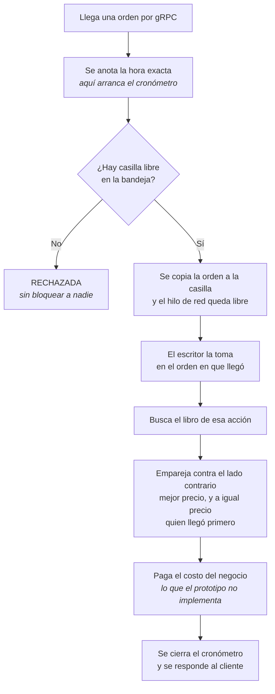
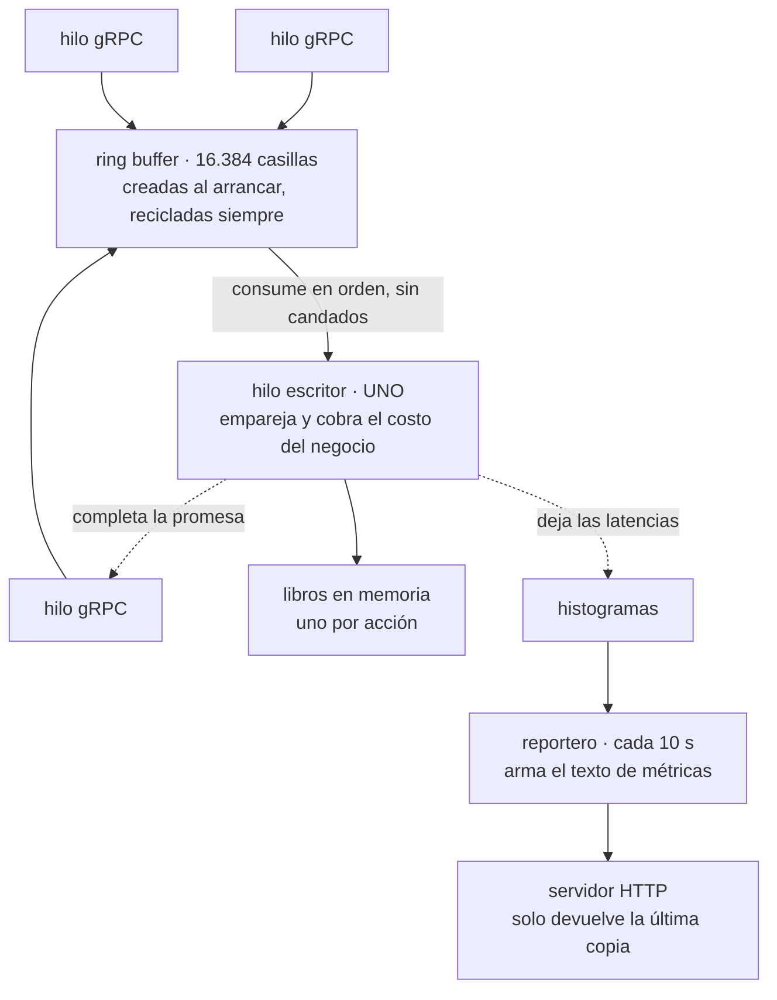

# matching-engine — un solo hilo, y esa es la idea

Aquí vive la apuesta del proyecto, y es contraintuitiva: **el motor es rápido porque hace una cosa a la vez.**

La reacción natural ante «hay que procesar más órdenes» es agregar hilos. Este diseño hace lo contrario. Cada partición tiene **un único hilo** que toca el libro de órdenes. Los demás —los que atienden la red— solo le dejan trabajo en una bandeja y se van.

El razonamiento es que en un sistema de baja latencia el tiempo casi nunca se va en calcular. Se va **esperando**: esperando un candado, esperando a la base de datos, esperando que otro hilo suelte una línea de caché. Un solo escritor no espera a nadie, nunca, porque no hay nadie más con quien competir. La exclusión mutua no se consigue con candados: se consigue porque **no hay un segundo hilo del que excluirse**.

Un proceso = una partición = un hilo escritor = varios libros de órdenes.

## El viaje de una orden



**Dos tiempos distintos viven dentro de ese recorrido**, y separarlos es lo que hace útil toda la medición del experimento:

- **La espera** — desde que la orden llega hasta que el escritor la toma. Es tiempo haciendo fila. Vale casi cero mientras haya holgura, y se dispara cuando el motor se acerca a su techo.
- **El servicio** — desde que el escritor la toma hasta que la resuelve. Es el trabajo real, y **no depende de la carga**.

Ver un percentil 95 alto no dice nada por sí solo. Saber cuál de los dos sumandos creció es lo que distingue *«hay que agregar particiones»* de *«hay que abaratar la orden»* — dos arreglos opuestos frente al mismo síntoma.

## La estructura por dentro



Tres grupos de hilos con papeles que no se cruzan:

| Hilos | Cuántos | Qué tocan |
|---|---|---|
| De red (gRPC) | Varios | Solo escriben en casillas libres del anillo |
| **Escritor** | **Uno** | Los libros de órdenes. Nadie más los toca |
| Observadores | Dos | Copias de histogramas y una cadena de texto |

---

# El código, clase por clase

Siete archivos. Los recorremos en el orden en que una orden los atraviesa.

## 1 · El borde: `IngestGrpcService`

Es lo primero que toca la orden, y su método principal cabe en una pantalla.

```java
public void submitOrder(OrderRequest request, StreamObserver<OrderResponse> responseObserver) {
    long arrivalNanos = System.nanoTime();   // t0 de la medida
    CompletableFuture<OrderResponse> completion = new CompletableFuture<>();

    long sequence;
    try {
        sequence = ringBuffer.tryNext();
    } catch (InsufficientCapacityException backpressure) {
        rejected.increment();
        // ... responde REJECTED y termina
        return;
    }

    try {
        OrderSlot slot = ringBuffer.get(sequence);
        slot.set(request.getOrderId(), request.getSymbol(), request.getSide(),
                request.getPriceCents(), request.getQuantity(), arrivalNanos, completion);
    } finally {
        ringBuffer.publish(sequence);
    }

    completion.whenComplete((response, error) -> { ... });
}
```

**`System.nanoTime()` en la primera línea.** Antes de reservar nada, antes de copiar nada. Si el cronómetro arrancara después de conseguir casilla, la espera por conseguirla quedaría fuera de la medición — y sería justamente el tiempo que interesa cuando el sistema está saturado. **La primera línea del método es una decisión de honestidad de la medición.**

**`tryNext()`, no `next()`.** La diferencia es la misma que en el router. `next()` espera a que se libere una casilla; `tryNext()` lanza una excepción de inmediato. Con la versión que espera, un anillo lleno bloquearía los hilos de red uno tras otro hasta que el servicio dejara de responder. Desde afuera eso se ve como un cuelgue, no como un rechazo. Con `tryNext()`, el sistema lleno **responde**: dice `REJECTED`.

**`publish()` dentro de un `finally`.** Es la línea más importante del bloque. Al reservar una casilla, el anillo la marca como comprometida; si algo fallara entre la reserva y la publicación —una excepción al copiar los campos— esa casilla quedaría reservada para siempre. El escritor se detendría ahí, esperando un evento que nadie va a publicar, y **el motor entero se congelaría en silencio**. El `finally` garantiza que la casilla se publique pase lo que pase.

**La promesa desacopla la respuesta.** El hilo de red no espera el resultado: crea un `CompletableFuture` y se va. Cuando el escritor termine, completará esa promesa y el callback enviará la respuesta. Por eso un motor ocupado no consume hilos de red — la orden espera en el anillo, no en un hilo.

## 2 · La bandeja: `OrderSlot`

```java
public final class OrderSlot {
    String orderId; String symbol; Side side;
    long priceCents; long quantity; long arrivalNanos;
    CompletableFuture<OrderResponse> completion;

    void set(...) { ... }
    void clear() { this.orderId = null; this.symbol = null; this.side = null; this.completion = null; }
}
```

Una clase de campos mutables, sin encapsulamiento, que en cualquier otro contexto sería un error de diseño. Aquí es el punto.

Las 16.384 casillas se crean **una sola vez, al arrancar**, y se reciclan para siempre. Bajo carga sostenida el motor no crea ni un objeto nuevo por orden. Y no crear objetos es no darle trabajo al recolector de basura, que es la causa número uno de latencias largas y aisladas en Java.

Los campos son de paquete y no privados a propósito: el manejador los lee directo, sin pasar por métodos de acceso. Es una micro-optimización que en la mayoría del código sería injustificable; en el camino crítico de un motor de emparejamiento, es coherente con todo lo demás.

## 3 · El cableado: `EngineMain`

Aquí se arma la máquina. El corazón son cinco líneas:

```java
Disruptor<OrderSlot> disruptor = new Disruptor<>(
        OrderSlot::new,
        ringSize,
        matcherThreadFactory,
        ProducerType.MULTI,          // varios hilos gRPC publican; consume UNO solo
        new BlockingWaitStrategy());
```

**`ProducerType.MULTI`** dice que varios hilos van a publicar a la vez. Es obligatorio: gRPC atiende con un grupo de hilos y cualquiera puede recibir una orden. La alternativa, `SINGLE`, es más rápida pero corrompería el anillo en silencio si dos hilos publicaran a la vez — no fallaría, produciría datos mal.

**El tamaño es potencia de dos** —16.384— porque el anillo calcula la posición con una operación de bits en vez de una división. Es la clase de detalle que define al patrón.

**`BlockingWaitStrategy`** decide qué hace el escritor cuando no hay trabajo: se duerme y espera a que lo despierten. Las alternativas —ceder el turno, o girar en vacío— responden más rápido pero **queman un núcleo entero por partición**, incluso ociosas. En una máquina compartida con el generador de carga, eso falsearía la medición. Está anotado en el código como deuda a re-evaluar con datos.

### El cableado de la bitácora, y por qué son tres

```java
switch (journalMode) {
    case PARALELO -> disruptor.handleEventsWith(journal, matcher).then(cleaner);
    case SERIE    -> disruptor.handleEventsWith(journal).then(matcher).then(cleaner);
    case OFF      -> disruptor.handleEventsWith(matcher).then(cleaner);
}
```

Tres líneas que son **tres contratos distintos con el cliente**:

| Disposición | Cómo se lee | Qué promete el acuse |
|---|---|---|
| `OFF` | solo empareja | Nada sobre durabilidad |
| `PARALELO` | registra **y** empareja, a la vez | «Tu orden se procesó». El registro puede no haber llegado a disco |
| `SERIE` | registra, **después** empareja | «Tu orden está a salvo». Y el costo de registrar se suma a la latencia |

No hay una correcta. Son dos garantías diferentes, y el experimento midió el precio de cada una: en paralelo cuesta **+0,9 %** de la mediana, en serie **+19 %**.

### El detalle más fino del proyecto

```java
EventHandler<OrderSlot> cleaner = (slot, seq, endOfBatch) -> slot.clear();
```

La limpieza de la casilla es un manejador aparte, encadenado **siempre al final**. Y el motivo está escrito donde uno esperaría encontrar la limpieza:

> *NO se limpia el slot aqui. Con el journal en PARALELO este manejador no es el ultimo en ver el evento, y limpiarlo seria una condicion de carrera: el journaler leeria campos ya anulados.*

Es exactamente el defecto que un cambio razonable habría introducido. Con la bitácora apagada, limpiar al final del emparejamiento funciona perfecto. Al encender el modo paralelo, los dos consumidores leen la misma casilla **a la vez**. Quien limpie primero le borra los datos al otro, que empezaría a escribir `null` en el registro sin lanzar un error.

**La regla que resuelve:** con consumidores en paralelo, la casilla pertenece al anillo hasta que **todos** pasaron. Solo un manejador que corre después de todos puede tocarla.

## 4 · El escritor: `MatchingHandler`

El único consumidor. Su método es el camino crítico completo del sistema.

```java
public void onEvent(OrderSlot slot, long sequence, boolean endOfBatch) {
    long startNanos = System.nanoTime();
    waitRecorder.recordValue(Math.max(1, (startNanos - slot.arrivalNanos) / 1_000));

    OrderBook book = books.computeIfAbsent(slot.symbol, s -> new OrderBook());
    long matched = book.match(slot.side, slot.priceCents, slot.quantity, slot.orderId);

    businessLogic.apply();

    long endNanos = System.nanoTime();
    serviceRecorder.recordValue(Math.max(1, (endNanos - startNanos) / 1_000));

    long latencyMicros = (endNanos - slot.arrivalNanos) / 1_000;
    latencyRecorder.recordValue(Math.max(1, latencyMicros));
    ...
    slot.completion.complete(response);
}
```

**Los libros viven en un `HashMap` común y corriente.**

```java
private final Map<String, OrderBook> books = new HashMap<>();
```

No un `ConcurrentHashMap`. Y no es un descuido: es la consecuencia visible de todo el diseño. Un solo hilo toca este mapa, así que la versión concurrente solo agregaría el costo de una sincronización que nadie necesita. **Cuando el diseño garantiza el aislamiento, las estructuras concurrentes dejan de ser prudencia y pasan a ser desperdicio.**

**Los dos cronómetros comparten `startNanos`.** La espera termina exactamente donde empieza el servicio, así que los dos sumandos cubren el total sin hueco ni traslape. Es lo que permite afirmar que `total = espera + servicio` **para cada orden** — aunque, importante, no para los percentiles: cada uno es el percentil de su propia población, y la orden que más espera no suele ser la que más cuesta.

**El `Math.max(1, ...)` está por un límite del histograma.** HdrHistogram no registra ceros, y una latencia de menos de un microsegundo redondea a cero al dividir. Sin ese piso, las órdenes más rápidas simplemente no se contarían — y el percentil se calcularía sobre una población a la que le faltan justamente las mejores.

## 5 · El libro: `OrderBook`

```java
private final TreeMap<Long, ArrayDeque<Resting>> bids = new TreeMap<>(Comparator.reverseOrder());
private final TreeMap<Long, ArrayDeque<Resting>> asks = new TreeMap<>();
```

Dos estructuras que juntas producen la regla de una bolsa: **mejor precio primero, y a igual precio, quien llegó antes.**

- El `TreeMap` mantiene los precios ordenados. En compras el orden va al revés —el mejor comprador es el que más paga—; en ventas, normal.
- El `ArrayDeque` guarda, dentro de cada precio, la fila de quienes esperan. Se saca por el frente, se agrega por atrás.

El emparejamiento recorre el lado contrario del libro y se detiene apenas puede:

```java
boolean crosses = (side == Side.BUY) ? levelPrice <= priceCents : levelPrice >= priceCents;
if (!crosses) {
    break; // los niveles siguientes son aún peores: no hay más cruce posible
}
```

Ese `break` es lo que vuelve barata la operación. Como los precios están ordenados, el primer nivel que no cruza garantiza que ninguno de los siguientes cruzará tampoco. **No hay que revisar el libro entero: basta con la punta.**

Y una línea que evita una fuga lenta:

```java
if (queue.isEmpty()) {
    levels.remove();
}
```

Un nivel de precio sin nadie esperando se borra del árbol. Sin eso, el libro acumularía niveles vacíos toda la jornada y cada búsqueda se iría haciendo más lenta. Es un deterioro que no aparece en una prueba corta y sí en media hora de pico.

La clase se declara **no segura para hilos, a propósito**, y lo dice en su documentación. Es la afirmación del diseño escrita en el lugar donde alguien podría dudar.

## 6 · El costo: `BusinessLogicModel`

Esta clase no implementa lógica de negocio. **Modela lo que costaría implementarla**, y sin ella todas las mediciones de capacidad del experimento serían falsas.

El razonamiento: en un diseño de un solo escritor el costo por orden se serializa, así que fija directamente el techo — **techo = 1 ÷ costo**. El emparejamiento de juguete del prototipo cuesta microsegundos, así que medir la capacidad así mediría un `TreeMap`, no un motor de bolsa.

```java
private static final double[] WEIGHT = {0.90, 0.09, 0.01};
private static final double[] FACTOR = {1.0, 6.0, 30.0};
```

**No es una constante, y ahí está la gracia.** La mezcla reproduce la forma que tiene el costo real: la mayoría de órdenes son baratas y no cruzan; unas pocas barren varios niveles; una fracción mínima dispara cascadas. Con un costo medio de 8 ms, una orden individual cuesta **4,6 · 27,6 o 138 ms** según su clase. Por eso el percentil 95 del servicio da 27,6 ms y no 8.

```java
private void burn(long targetNanos) {
    long deadline = System.nanoTime() + targetNanos;
    long acc = sink;
    do {
        for (int i = 0; i < SPIN_BATCH; i++) {
            acc = acc * 6364136223846793005L + 1442695040888963407L;
            acc ^= (acc >>> 29);
        }
    } while (System.nanoTime() < deadline);
    sink = acc; // publicar el resultado: sin esto el JIT borraría el bucle
}
```

**Quema procesador; no duerme.** Un `sleep` devolvería el núcleo al sistema: no ensuciaría la caché ni competiría con los hilos de red. Y su granularidad en Java es de milisegundos, así que con eso no se pueden modelar 50 microsegundos. La lógica real consume ciclos, y el modelo también.

La última línea es una defensa contra el compilador. Sin publicar `acc` en un campo, el compilador notaría que el resultado no se usa y **borraría el bucle entero**. Quedaría un modelo de costo que no cuesta nada.

Y la semilla del generador aleatorio es distinta en cada partición:

```java
this.random = new SplittableRandom(SEED + shardId);
```

Con una semilla común todas las particiones sacaban **la misma secuencia** de tiempos de servicio. Como todas reciben la misma tasa, sus órdenes k-ésimas llegan casi a la vez, así que las órdenes caras caían sobre todas **simultáneamente** en vez de repartirse en el tiempo. Eso sincroniza la congestión y engorda la cola del percentil agregado. Era un artefacto del banco que sesgaba a la baja justo el resultado de varias particiones.

## 7 · La bitácora: `JournalHandler`

Escribe cada orden en un archivo antes de que se pierda la memoria del proceso. Dos decisiones vale la pena mirar.

```java
if (endOfBatch) {
    channel.force(false);
    batches++;
}
```

**Un `fsync` por lote, no por orden.** El Disruptor entrega los eventos en lotes y avisa cuál es el último; solo ahí se fuerza la escritura a disco. Bajo carga el lote crece, así que el costo de sincronizar se reparte entre más órdenes: **el sistema se abarata justo cuando más se le exige.** Sincronizar por evento convertiría cada orden en una escritura sincrónica a disco.

```java
private void putAscii(String s) {
    int n = Math.min(s.length(), 255);
    buffer.put((byte) n);
    for (int i = 0; i < n; i++) {
        buffer.put((byte) s.charAt(i));
    }
}
```

**Escribe carácter por carácter para no crear un arreglo.** `s.getBytes()` reservaría memoria en el camino crítico, y el patrón existe precisamente para no hacer eso. Con nemotécnicos e identificadores, que son ASCII, copiar a mano es correcto y no asigna nada.

Un dato honesto de la evidencia: en las corridas medidas, `órdenes por fsync = 1,0`. La amortización que el patrón permite **nunca llegó a activarse**, porque no hubo suficiente presión para formar lotes. El mecanismo está, el beneficio no se demostró.

---

# Cómo se mide a sí mismo

El motor lleva dos niveles de histograma, y la diferencia entre ellos decide qué cifra es publicable.

```java
Recorder latencyRecorder = new Recorder(3);      // ventana de 10 s
Histogram totalCumulative = new Histogram(3);    // suma de todas las ventanas
```

| Nivel | Qué responde | Para qué sirve |
|---|---|---|
| **Ventana** de 10 s | ¿Cómo va ahora? | Dibujar la evolución: cuándo se degrada, si drena |
| **Acumulado** | ¿Cómo estuvo toda la corrida? | **El único percentil comparable con el generador** |

La distinción no es cosmética, y el código la explica:

> *Promediar los p95 por ventana NO da un p95: da la media de una muestra de percentiles, un estadístico distinto que oculta la dispersión entre ventanas.*

Es la misma razón por la que las cifras del tablero corren por encima de las de las tablas oficiales — el tablero solo puede leer ventanas.

```java
synchronized (drainLock) {
    total = latencyRecorder.getIntervalHistogram();
    ...
    exposicion.set(exponer(...));
}
```

**El candado protege una operación que no admite concurrencia.** Vaciar un `Recorder` intercambia sus dos histogramas internos, y dos hilos haciéndolo a la vez perderían muestras. Aquí compiten el reportero de cada diez segundos y el gancho de apagado.

Y una decisión que se nota al leerla: **el texto de Prometheus se arma dentro de ese mismo bloque**, cada diez segundos, y el endpoint solo devuelve la última copia. Así raspar las métricas no toca un histograma ni toma un candado — el observador no puede alterar lo observado.

Al apagarse, el motor escribe la línea que el orquestador extrae:

```
ACUMULADO shard=1 n=83634 total p50=4643us p95=73727us p99=139519us p99.9=233983us max=522751us
        | espera p50=33us p95=49663us | servicio p50=4603us p95=27599us
```

Esa línea **solo es válida si el proceso vivió exactamente una fase**. Por eso cada corrida levanta la topología de cero: un resumen acumulado que abarca dos fases no describe ninguna de las dos.

---

# Las perillas

| Variable | Por omisión | Qué cambia |
|---|---|---|
| `SHARD_ID` | `0` | Identidad de la partición. Decide también su semilla aleatoria |
| `PORT` | `9090` | Puerto gRPC |
| `RING_SIZE` | `16384` | Casillas del anillo. **Potencia de dos** |
| `BIZ_MICROS` | `0` | Costo medio por orden en µs. `0` = apagado |
| `BIZ_DIST` | `mezcla` | Forma del costo: `mezcla` o `lognormal` |
| `JOURNAL` | `off` | `off`, `paralelo` o `serie` |
| `JOURNAL_DIR` | `/var/lib/engine/journal` | Dónde se escribe la bitácora |
| `METRICS_PORT` | `9095` | Puerto de `/metrics` |
| `RUN_ID` | `sin-id` | Etiqueta de la corrida en todas sus métricas |

Al arrancar, el motor escribe en el registro **con qué configuración va a correr**:

```
shard=0 modelo de logica de negocio: mezcla 90/9/1 media=8000us Cs2=3.34 semilla=42 techo_teorico=125 ord/s
shard=0 journal: modo=OFF
shard=0 runtime: availableProcessors=14 maxHeap=512MB
```

Sin esas tres líneas, dos corridas con resultados distintos serían indistinguibles. El orquestador las lee y **aborta la corrida** cuando lo que el motor declara no coincide con lo que el plan pidió. Esa verificación existe por un caso real: una corrida anunció 8 ms y arrancó con la lógica apagada.

`availableProcessors` merece una nota. Con un límite de núcleos, ese número baja, y con él bajan los hilos del recolector, los de compilación y los del servidor gRPC. Una corrida restringida y una libre se ven iguales en la evidencia si nadie lo registra.

---

## Qué se rompe si tocas esto

| Cambio | Qué se cae |
|---|---|
| `ProducerType.SINGLE` | El anillo se corrompe cuando dos hilos publican a la vez. Sin error: con datos mal |
| `next()` en vez de `tryNext()` | Un anillo lleno bloquea los hilos de red; el servicio se cuelga en vez de rechazar |
| Sacar `publish()` del `finally` | Una excepción al copiar deja una casilla reservada para siempre y **congela el motor** |
| Limpiar la casilla en el emparejador | Con la bitácora en paralelo, el registro escribe `null` en silencio |
| `RING_SIZE` que no sea potencia de dos | El Disruptor no arranca |
| Quitar el `sink = acc` del modelo de costo | El compilador borra el bucle y el costo modelado desaparece |
| Semilla común entre particiones | Las órdenes caras se sincronizan y sesgan a la baja el resultado de varias particiones |
| Un `fsync` por orden | Cada orden se vuelve una escritura sincrónica a disco |

**La regla que atraviesa toda la clase:** cualquier cambio que introduzca un segundo hilo sobre el libro de órdenes deroga el diseño entero. La velocidad no viene de hacer muchas cosas a la vez — viene de no tener que ponerse de acuerdo con nadie.

---

*Siguiente pieza: el [instrumento](k6.html), que es lo que convierte todo esto en una afirmación verificable.*
