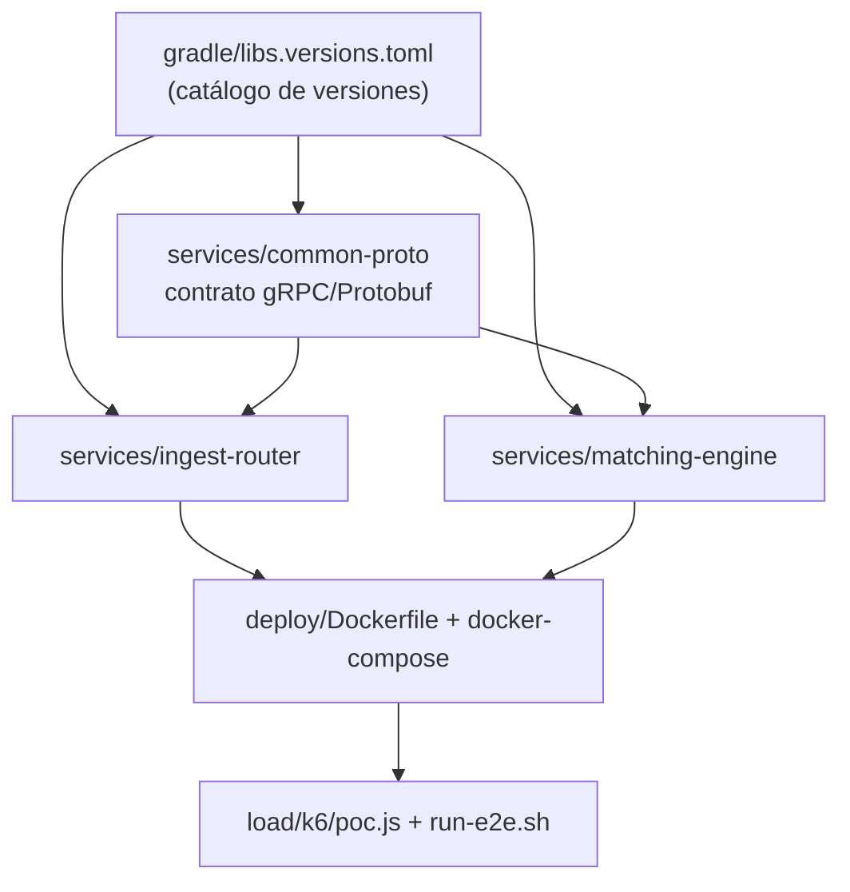

# Construcción de cada componente del proyecto

Este documento explica **cómo se construyó cada pieza** del monorepo: con qué tecnología, qué decisiones se tomaron al armarla y cómo se conecta con el resto. Es el complemento de [Implementación](implementacion.html), que describe cómo funciona el sistema en conjunto; aquí el foco es la construcción de cada componente por separado.

## Mapa de dependencias



---

## 1. El monorepo Gradle (raíz)

**Qué es:** la estructura que permite que tres servicios convivan en un repositorio con convenciones y versiones unificadas.

**Cómo se construyó:** tres archivos hacen todo el trabajo.

- `settings.gradle.kts` declara los módulos (`services:common-proto`, `services:matching-engine`, `services:ingest-router`) y resuelve el plugin de Protobuf desde Maven Central.
- `build.gradle.kts` (raíz) aplica las convenciones comunes a todos los subproyectos: **toolchain de Java 21** (TEC-1) y codificación UTF-8. Ningún módulo repite esta configuración.
- `gradle/libs.versions.toml` es el **catálogo de versiones**: Disruptor 4.0.0, gRPC 1.68.1, Protobuf 4.28.3, HdrHistogram 2.2.2. Cada dependencia se declara una sola vez y los módulos la referencian como `libs.disruptor` — subir una versión es cambiar una línea.

El wrapper (`gradlew` + `gradle/wrapper/`) fija Gradle 8.14.3 para que cualquier integrante compile con la misma versión sin instalar nada.

---

## 2. `services/common-proto` — el contrato

**Qué es:** la única fuente de verdad de la comunicación: el archivo `matching.proto` y los stubs Java que se generan de él.

**Cómo se construyó:** un módulo `java-library` con el plugin `com.google.protobuf`, que engancha dos generadores al build: `protoc` (mensajes) y `protoc-gen-grpc-java` (stubs de servicio). Al correr `./gradlew build`, el código generado aparece en `build/generated/` y los otros dos módulos lo consumen como una dependencia más — nadie escribe ni versiona código generado.

**Decisiones del contrato:**

| Decisión | Por qué |
|---|---|
| `int64 price_cents` en vez de `double` | Sin aritmética flotante en el camino crítico: los centavos son exactos |
| `Status.REJECTED` como valor del enum | El backpressure es semántica del dominio, no un error de transporte gRPC |
| `engine_latency_micros` en la respuesta | Permite contrastar el reloj interno del motor contra el del generador |
| Un único servicio `MatchingIngest` | Router y shards implementan el mismo contrato: k6 puede apuntar a cualquiera |

---

## 3. `services/matching-engine` — el shard LMAX

**Qué es:** el corazón del experimento. Un proceso = una partición = un único hilo escritor.

**Cómo se construyó**, clase por clase, en el orden en que fluye una orden:

**`EngineMain`** — el ensamblaje. Construye el Disruptor con los cuatro parámetros que definen el patrón:

```java
Disruptor<OrderSlot> disruptor = new Disruptor<>(
        OrderSlot::new,          // fábrica: los slots se PREASIGNAN todos al inicio
        ringSize,                // potencia de 2 (default 16384)
        matcherThreadFactory,    // el hilo "matcher-shard-N"
        ProducerType.MULTI,      // publican varios hilos gRPC…
        new BlockingWaitStrategy()); // …pero consume UNO solo
disruptor.handleEventsWith(new MatchingHandler(shardId, latencyRecorder));
```

`BlockingWaitStrategy` es deuda de decisión registrada en E01: es amable con la máquina compartida del PoC; `Yielding`/`BusySpin` bajan aún más la latencia a costa de quemar un núcleo por shard. Después levanta el servidor gRPC y un hilo que loguea percentiles del HdrHistogram cada 10 s.

**`OrderSlot`** — la entrada del ring. Mutable y reciclable a propósito: el Disruptor preasigna todos los slots al arrancar y los reutiliza, de modo que en régimen **el camino crítico no genera basura** (menos presión de GC, la causa #1 de cola larga según el análisis de decisiones). Se rellena con `set(...)` al publicar y se vacía con `clear()` al consumir.

**`IngestGrpcService`** — el borde. Su línea más importante es cómo publica:

```java
try {
    sequence = ringBuffer.tryNext();      // NO bloquea los hilos de gRPC
} catch (InsufficientCapacityException backpressure) {
    // ring lleno → REJECTED inmediato: la cola acotada actuando
}
```

También estampa el `t0 = System.nanoTime()` que define "arribo al motor" para la medida de ASR-02, y entrega la respuesta por un `CompletableFuture` que el handler completa — la respuesta gRPC es asíncrona, ningún hilo espera.

**`MatchingHandler`** — el *single writer*. Único consumidor del ring: procesa en orden de llegada, sin locks. Mantiene un `HashMap<String, OrderBook>` (los libros de sus símbolos), ejecuta el matching, registra la latencia en un `Recorder` de HdrHistogram (thread-safe para que el hilo reportero lea histogramas por intervalo) y completa el futuro.

**`OrderBook`** — el libro de un activo. Prioridad **precio-tiempo** con estructuras estándar del JDK:

```java
// Compras: mejor precio = el más alto primero
TreeMap<Long, ArrayDeque<Resting>> bids = new TreeMap<>(Comparator.reverseOrder());
// Ventas: mejor precio = el más bajo primero
TreeMap<Long, ArrayDeque<Resting>> asks = new TreeMap<>();
```

El `TreeMap` da los niveles de precio ordenados; el `ArrayDeque` da el orden de llegada dentro del nivel (FIFO). `match()` recorre el lado opuesto mientras el precio cruce, llena parcial o totalmente, y deja el remanente en reposo. **No es thread-safe a propósito**: la exclusión mutua la garantiza el diseño (un solo hilo lo toca), no los locks.

---

## 4. `services/ingest-router` — sharding y cola acotada

**Qué es:** la puerta de entrada del sistema y el materializador de dos tácticas: particionamiento por activo y amortiguación con backpressure.

**Cómo se construyó:** dos clases.

**`RouterMain`** lee `SHARDS` (lista `host:puerto` — **el orden define el índice de sharding**), crea un `ManagedChannel` + stub asíncrono por shard, y reporta cada 10 s las solicitudes en vuelo y los rechazos acumulados.

**`RouterService`** concentra el camino crítico en tres movimientos:

```java
if (!inFlight.tryAcquire()) {                    // 1. cola acotada (Semaphore):
    /* REJECTED inmediato */                     //    llena → rechazar, nunca encolar sin límite
}
int shard = Math.floorMod(request.getSymbol().hashCode(), shardStubs.size()); // 2. sharding determinístico
shardStubs.get(shard).submitOrder(request, /* 3. relevo asíncrono de la respuesta */);
```

`String.hashCode` es estable por especificación de Java, así que el mismo símbolo siempre cae en el mismo shard. El router es **sin estado** — no conoce libros ni órdenes — y por eso en el diseño real puede replicarse horizontalmente.

---

## 5. `deploy/` — empaquetado y topología

**`Dockerfile`** — una sola definición multi-etapa construye ambos servicios, parametrizada con `--build-arg SERVICE=...`: la etapa 1 (imagen `gradle:8.14-jdk21`) corre `installDist` del módulo pedido; la etapa 2 copia solo la distribución sobre un JRE 21 liviano. Ahí viven también los flags de la JVM: `-XX:+UseZGC -XX:+ZGenerational` (pausas de GC sub-milisegundo, D-02).

**`docker-compose.yml`** — la topología: `ingest-router` (`:8080`) + `matching-shard-0/1`. Los shards 2 y 3 existen bajo el **perfil `n4`**, y la lista `SHARDS` del router es interpolable (`${SHARDS:-...}`): pasar de N=2 a N=4 no toca código ni archivos, es `make up-n4`. Los `cpuset` de aislamiento por núcleo están comentados porque solo aplican en hosts Linux.

---

## 6. `load/` — el arnés de pruebas

**`k6/poc.js`** — un solo script parametrizado por variables de entorno cubre todas las fases del experimento:

| Variable | Efecto |
|---|---|
| `PHASE=f1\|f2\|f4` | Baseline constante · rampa+pico+retorno · partición caliente (1 símbolo, sin thresholds) |
| `SMOKE=1` | Versión corta (~1–5 min) del mismo perfil |
| `PEAK=n` | Tasa pico libre (default 84/s) — así se construyó la exploración del techo |
| `TARGET=host:puerto` | Apuntar a otro router o directo a un shard |

Las decisiones de construcción que hacen válida la medición: **modelo abierto de llegada** (`constant/ramping-arrival-rate` — la carga es una tasa objetivo, no N usuarios esperando; el modelo cerrado subestima percentiles bajo saturación por *coordinated omission*), **thresholds como criterio ejecutable** (`p(95)<200` y `count==0` de rechazos fallan la corrida en vivo), y el contador propio `orders_rejected_backpressure` que convierte la señal de la táctica de amortiguación en métrica de primera clase.

**`run-e2e.sh`** — el orquestador de un solo comando: topología limpia → F1 → F2+F3 → F4 → F4-explore (250/500/1000) → down. Cada fase deja su salida cruda (`.txt`) y su resumen (`--summary-export` JSON) en `load/k6/results/<timestamp>-<modo>/`, imprime una tabla final y **sale con código de error si una fase oficial incumple** — por eso sirve tal cual como puerta de CI. Se invoca vía `make e2e` (oficial) o `make e2e-smoke` (regresión de ~25 min tras cada cambio de implementación).

---

## 7. `Makefile` — la interfaz operativa

Todo el ciclo de vida en targets autodocumentados (`make help`): build Gradle, topologías N=2/N=4, fases individuales, exploración, comparación de sharding, ciclo E2E y previsualización de docs. La convención de construcción: **ningún comando del proyecto se ejecuta "a mano"** — si un paso se repite, se vuelve target. Eso es lo que hace las corridas reproducibles por cualquier integrante y por CI.

---

## 8. `docs/` — el sitio de documentación

Jekyll sobre GitHub Pages con el tema `just-the-docs` (vía `remote_theme`): navegación lateral, búsqueda integrada y render nativo de los diagramas Mermaid. Se publica automáticamente en cada push a `main` desde la carpeta `docs/` — la página de [Evidencia de corridas](evidencia-corridas.html) es la evidencia externa que enlaza la pestaña Experiments de Helix. `make docs-serve` la previsualiza en local.

---

## Cómo encaja todo (resumen de una línea por pieza)

| Componente | Construido con | Su única responsabilidad |
|---|---|---|
| Monorepo raíz | Gradle 8.14 + toolchain 21 + catálogo | Convenciones y versiones únicas |
| `common-proto` | Protobuf + protoc-gen-grpc-java | El contrato; stubs generados, nunca escritos |
| `matching-engine` | Disruptor 4 + gRPC + HdrHistogram | Un shard: ring → single writer → libro en memoria |
| `ingest-router` | gRPC + `Semaphore` | Sharding determinístico y cola acotada |
| `deploy/` | Docker multi-etapa + compose con perfiles | Topología N=2/N=4 sin tocar código |
| `load/` | k6 (modelo abierto) + bash | Las fases del experimento como código, con veredicto automático |
| `Makefile` | make autodocumentado | Toda operación es un target reproducible |
| `docs/` | Jekyll + just-the-docs | Documentación y evidencia publicadas en cada push |
