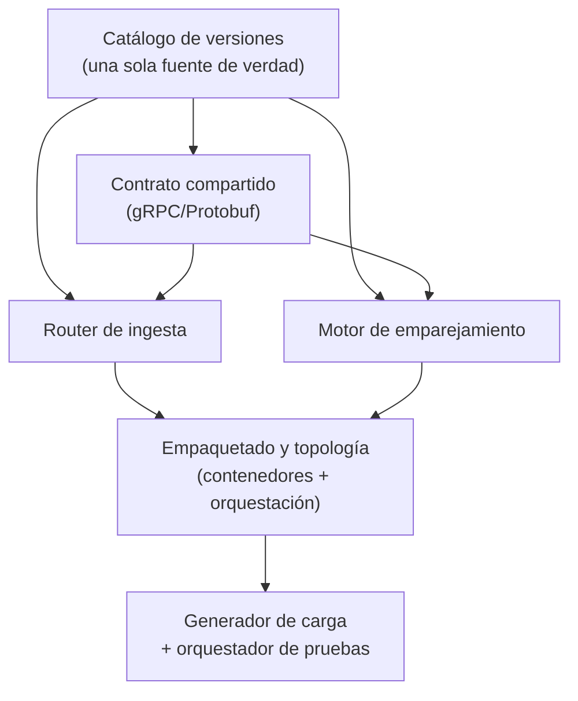

# Las piezas del proyecto

Este documento explica con qué tecnología se construyó cada pieza del monorepo, qué decisiones se tomaron y cómo se conecta con el resto — mismo contenido que [Construcción de componentes](construccion-componentes.html), sin fragmentos de código ni referencias a líneas de archivo.

## Mapa de dependencias

## 1. El monorepo (raíz del proyecto)

**Qué es:** la estructura que permite que los tres servicios convivan en un solo repositorio con convenciones y versiones unificadas, en vez de tres proyectos independientes que pueden desincronizarse.

**Cómo se construyó:** un archivo declara los módulos que componen el proyecto; la configuración raíz aplica a todos los subproyectos las convenciones comunes (versión del lenguaje, codificación de archivos) para que ningún módulo tenga que repetirlas; y un catálogo de versiones centraliza cada dependencia externa (el motor de eventos de alto rendimiento, gRPC, Protobuf, la librería de histogramas de latencia) en un solo lugar — subir una versión es cambiar una línea, no buscarla en tres archivos distintos.

El sistema de construcción queda fijado a una versión específica mediante un *wrapper*, así cualquier persona del equipo compila con exactamente la misma herramienta sin instalar nada por su cuenta.

## 2. El contrato compartido — la única fuente de verdad de la comunicación

**Qué es:** la definición del servicio gRPC y los mensajes Protobuf que router y motor usan para entenderse, más el código generado automáticamente a partir de esa definición.

**Cómo se construyó:** un módulo de librería con el plugin de generación de Protobuf, que engancha dos generadores al proceso de compilación: uno para los mensajes y otro para los stubs del servicio. Al compilar, el código generado aparece automáticamente y los otros dos módulos lo consumen como una dependencia más — nadie escribe ni versiona ese código a mano.

**Decisiones del contrato:**

| Decisión | Por qué |
|---|---|
| Los precios se representan como enteros (centavos), no como número de punto flotante | Sin aritmética flotante en el camino crítico: los centavos quedan exactos, sin errores de redondeo |
| "Rechazado" es un valor válido de la respuesta, no un error de transporte | El backpressure es semántica del dominio del negocio, no una falla de la comunicación |
| La respuesta incluye la latencia interna medida por el motor | Permite contrastar el reloj interno del motor contra el del generador de carga |
| Un único servicio de ingesta, implementado igual por el router y por cada shard | El generador de carga puede apuntar a cualquiera de los dos, para aislar el costo de cada uno |

## 3. El motor de emparejamiento — el shard con un único escritor

**Qué es:** el corazón del experimento. Un proceso = una partición = un único hilo que escribe en los libros de órdenes de esa partición.

**Cómo se construyó**, en el orden en que fluye una orden:

- **El ensamblaje del shard** construye el pipeline de procesamiento con sus cuatro decisiones de diseño: una fábrica que preasigna todas las entradas del buffer al arrancar (no se crea memoria nueva por cada orden en régimen), un tamaño de buffer fijo (potencia de dos), varios hilos de red publicando en paralelo pero un único hilo consumiendo, y una estrategia de espera para ese hilo cuando no hay trabajo. Esa estrategia es una decisión de diseño registrada como deuda técnica: la elegida es amigable con una máquina compartida entre varios procesos; hay alternativas que bajan aún más la latencia a costa de que ese hilo consuma un núcleo completo de forma constante.
- **La entrada del buffer** es reciclable a propósito: se preasignan todas al arrancar y se reutilizan en cada ciclo, para que el camino crítico en régimen no genere basura de memoria — la presión del recolector de basura es, según el análisis de decisiones del proyecto, la causa más probable de colas largas inesperadas.
- **El borde gRPC** publica en el buffer sin bloquear los hilos de red: si no hay espacio, responde con rechazo inmediato (la cola acotada actuando). Marca el instante de "arribo al motor", que define el inicio de la medición de latencia interna, y entrega la respuesta de forma asíncrona — ningún hilo de red queda esperando.
- **El único escritor** es el único consumidor del buffer: procesa en el orden de llegada, sin locks. Mantiene un mapa de los libros de órdenes de sus símbolos, ejecuta el matching, registra la latencia en un histograma pensado para lecturas concurrentes (porque un hilo aparte reporta percentiles cada 10 segundos) y completa la respuesta.
- **El libro de un símbolo** aplica prioridad precio-tiempo con estructuras de datos estándar: una estructura ordenada por precio (mejor precio primero) para cada lado (compra/venta), y dentro de cada nivel de precio, una cola en orden de llegada. El cruce recorre el lado contrario mientras el precio siga coincidiendo, llena total o parcialmente la orden, y deja el remanente en espera. No es segura para concurrencia a propósito: la exclusión mutua la garantiza el diseño (un solo hilo la toca), no un mecanismo de bloqueo.

## 4. El router de ingesta — sharding y cola acotada

**Qué es:** la puerta de entrada del sistema, y donde viven dos tácticas de diseño: el particionamiento por símbolo y la amortiguación de ráfagas con backpressure.

**Cómo se construyó:** el arranque lee la lista de shards disponibles (su orden define a qué índice de partición corresponde cada uno), crea un canal de comunicación y un cliente asíncrono por shard, y reporta periódicamente cuántas solicitudes están en vuelo y cuántas se han rechazado. El camino crítico de cada solicitud hace tres cosas en secuencia: intenta adquirir un cupo de una cola acotada (si está llena, rechaza de inmediato en vez de encolar sin límite), calcula el shard dueño del símbolo con una función de hash determinística, y reenvía la solicitud de forma asíncrona.

La función de hash de cadenas de texto del lenguaje es estable por especificación, así que el mismo símbolo siempre cae en el mismo shard. El router no guarda ningún estado — no conoce libros ni órdenes — y por eso, en un diseño de producción, podría replicarse horizontalmente sin coordinación adicional.

## 5. Empaquetado y topología

Una sola definición de contenedor, parametrizada por el servicio que se quiere construir, sirve para ambos servicios: una etapa de compilación y una etapa final liviana que solo copia el resultado ya compilado. Ahí también se configuran los parámetros de la máquina virtual del lenguaje, incluida la elección de un recolector de basura orientado a pausas muy cortas.

La topología por defecto levanta el router más dos shards; un perfil alternativo agrega dos shards más sin tocar código — pasar de dos a cuatro particiones es cambiar qué perfil se levanta, no reescribir nada. El aislamiento de núcleos de CPU por contenedor está disponible en la configuración pero comentado, porque solo tiene efecto en un sistema operativo Linux nativo.

## 6. El arnés de pruebas de carga

Un único script de generación de carga, parametrizado por variables de entorno, cubre todas las fases del experimento: cuál fase correr, una versión corta para verificar el montaje, la tasa pico a explorar, y contra qué destino apuntar (el router o un shard directo).

Las decisiones que hacen válida la medición: un **modelo abierto de llegada** (la carga es una tasa objetivo, no un número fijo de clientes esperando turno — el modelo cerrado subestima los percentiles bajo saturación), **umbrales como criterio ejecutable** (la corrida falla en vivo si el p95 supera el límite o si aparece algún rechazo en las fases oficiales), y un contador propio de rechazos por backpressure que convierte la señal de esa táctica de diseño en una métrica de primera clase, no en una suposición.

Un orquestador de un solo comando encadena: levantar una topología limpia, correr cada fase en orden, apagar todo, y dejar tanto la salida cruda como un resumen estructurado de cada fase archivados por corrida. Imprime una tabla final y **termina con un código de error si alguna fase oficial incumple su criterio** — por eso sirve tal cual como puerta de validación automática.

## 7. La interfaz operativa del proyecto

Todo el ciclo de vida del proyecto —compilar, levantar cada topología, correr cada fase individual, explorar el punto de quiebre, comparar configuraciones de sharding, correr el ciclo completo del experimento, previsualizar la documentación— está expuesto como comandos autodocumentados. La convención de fondo: ningún paso que se repite se ejecuta "a mano" — se vuelve un comando reproducible por cualquier integrante del equipo o por un sistema de integración continua.

## 8. El sitio de documentación

Generado con un motor de sitios estáticos sobre un tema de documentación con navegación lateral, búsqueda integrada y renderizado nativo de diagramas — se publica automáticamente en cada cambio a la rama principal desde la carpeta de documentación. La página de evidencia de corridas es la que se referencia como evidencia externa del experimento.

## Cómo encaja todo

| Componente | Construido con | Su única responsabilidad |
|---|---|---|
| Monorepo raíz | Sistema de construcción + catálogo de versiones centralizado | Convenciones y versiones únicas para todo el proyecto |
| Contrato compartido | Protobuf + generación automática de stubs gRPC | El contrato; el código se genera, nunca se escribe a mano |
| Motor de emparejamiento | Buffer circular de alto rendimiento + gRPC + histogramas de latencia | Un shard: buffer → único escritor → libro en memoria |
| Router de ingesta | gRPC + cola acotada con semáforo | Sharding determinístico y backpressure |
| Empaquetado y despliegue | Contenedores multi-etapa + orquestación con perfiles | Topología de N=2 o N=4 particiones sin tocar código |
| Arnés de carga | Generador con modelo abierto de llegada + orquestación en script | Las fases del experimento como código, con veredicto automático |
| Interfaz operativa | Comandos autodocumentados | Toda operación es reproducible por cualquiera |
| Documentación | Generador de sitio estático con navegación y diagramas | Documentación y evidencia publicadas en cada cambio |

---

*¿Quieres las versiones exactas de cada herramienta, los fragmentos de código de cada clase y el detalle línea por línea de cada decisión? Eso está en la versión técnica: [Construcción de componentes](construccion-componentes.html).*
