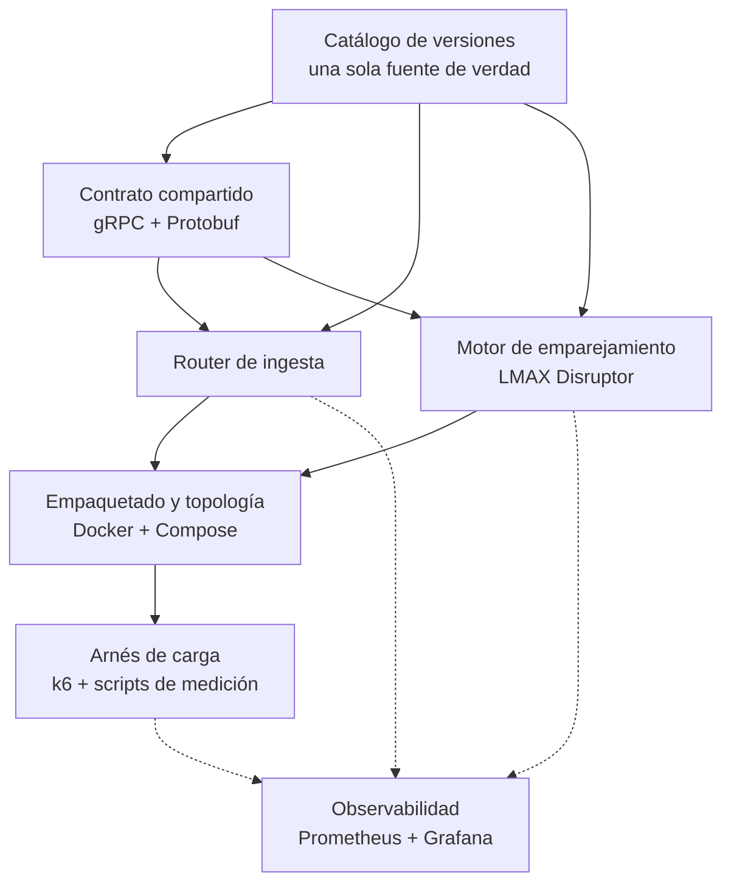

# Con qué está construida cada pieza

El prototipo son tres servicios Java, un arnés de carga con cinco scripts y una topología de contenedores con su propia observabilidad. Este documento dice con qué se construyó cada pieza y qué decisión hay detrás.

Hay una decisión que se repite en todas las piezas: **nada que se haga dos veces se hace a mano.** Las versiones viven en un catálogo y no en tres archivos; el código del contrato se genera y no se escribe; cada corrida es un comando; y una corrida que no se pueda verificar no se reporta. El experimento tiene que poder repetirlo alguien más.

## Mapa de dependencias

## 1. El monorepo — un repositorio, tres servicios

**Qué es.** Un *monorepo*: los tres servicios conviven en un solo repositorio con convenciones y versiones unificadas, en vez de ser tres proyectos que pueden desincronizarse.

**Con qué.** Gradle. El proyecto raíz declara los tres módulos y les aplica las mismas convenciones —Java 21, codificación UTF-8— para que ninguno tenga que repetirlas.

**La decisión.** Un **catálogo de versiones** centraliza cada dependencia externa en un solo archivo: LMAX Disruptor 4.0.0, gRPC 1.68.1, Protobuf 4.28.3, HdrHistogram 2.2.2 y SLF4J 2.0.16. Subir una versión es cambiar una línea, no buscarla en tres archivos distintos.

La herramienta de construcción queda fijada por un *wrapper* —un arrancador versionado que vive dentro del repositorio— en Gradle 8.14.3. Cualquiera compila con exactamente la misma herramienta sin instalar nada por su cuenta.

## 2. El contrato compartido — lo único que router y motor tienen que acordar

**Qué es.** La definición del servicio gRPC y de los mensajes Protobuf con los que el router y el motor se entienden, más el código Java que sale de esa definición.

**Con qué.** Un módulo de librería con el plugin de Protobuf para Gradle, que engancha dos generadores al proceso de compilación: uno para los mensajes y otro para los clientes y servidores del servicio. Al compilar, ese código aparece solo y los otros dos módulos lo consumen como una dependencia más. **Nadie lo escribe ni lo versiona a mano.**

**Las decisiones del contrato:**

| Decisión | Por qué |
|---|---|
| Los precios son enteros de centavos, no números con decimales flotantes | Sin aritmética flotante en el camino crítico: los centavos quedan exactos, sin errores de redondeo |
| "Rechazado" es un valor válido de la respuesta, no un error de transporte | Frenar la entrada es una decisión del negocio, no una falla de la comunicación |
| La respuesta incluye la latencia que el motor midió por dentro | Permite contrastar el reloj del motor contra el del generador de carga |
| Un solo servicio de ingesta, implementado igual por el router y por cada motor | El generador puede apuntar a cualquiera de los dos, y así se aísla el costo del router |

## 3. El motor de emparejamiento — un proceso, una partición, un escritor

**Qué es.** El corazón del experimento. Un proceso equivale a una partición del universo de activos, y esa partición la escribe **un solo hilo**.

**Con qué.** LMAX Disruptor 4.0.0 para la cola de entrada, gRPC para el borde de red y HdrHistogram para medir la latencia. Nada más: no hay base de datos, ni caché, ni broker.

Estas son sus piezas, en el orden en que las recorre una orden.

**El anillo de entrada** es un *ring buffer*: un arreglo circular de casillas que se preasignan al arrancar y se reciclan en cada vuelta. En régimen el camino crítico no pide memoria nueva, así que no alimenta al recolector de basura. Esa presión es, según el análisis de decisiones del proyecto, la causa más probable de una cola larga inesperada.

**El borde gRPC** publica en el anillo sin bloquear los hilos de red. Si no hay casilla libre responde con rechazo inmediato: así se ve la fila con límite haciendo su trabajo. Ahí también estampa el instante de "arribo al motor", que abre la medición interna de latencia.

**El único escritor** consume el anillo en orden de llegada, sin candados. Guarda los libros de sus símbolos, ejecuta el cruce, registra la latencia y completa la respuesta. Un hilo aparte lee esos histogramas cada diez segundos, así que la librería de medición está elegida para admitir esa lectura concurrente.

**El libro de un símbolo** aplica prioridad precio-tiempo con estructuras estándar de Java: un mapa ordenado por precio para cada lado —compras de mayor a menor, ventas de menor a mayor— y dentro de cada nivel una cola por orden de llegada. El cruce recorre el lado contrario mientras el precio siga coincidiendo, llena la orden total o parcialmente y deja el remanente en reposo. **No es seguro para concurrencia a propósito:** la exclusión mutua la garantiza el diseño, no un candado.

**El modelo de costo por orden** simula la lógica de negocio que el prototipo no implementa —validar, verificar riesgo y saldos, calcular comisiones, generar el trato—. Quema CPU en el hilo del escritor en vez de dormir, porque un `sleep` devuelve el núcleo y no ensucia la caché. Muestrea una distribución sesgada, no una constante: por defecto, una mezcla de tres clases de orden (90 % baratas, 9 % seis veces más caras, 1 % treinta veces más caras). Cada partición usa su propia semilla, de modo que las órdenes caras no caigan sobre todas al mismo tiempo.

**La bitácora** escribe cada orden en un archivo de solo-anexado y fuerza el volcado a disco una vez por lote, no una vez por orden. Escribe sin reservar memoria, reutilizando un búfer directo. Se puede cablear de tres formas —apagada, en paralelo con el cruce, o encadenada antes de él— y **la diferencia entre esas tres es exactamente la afirmación que hay que probar** sobre mantener el registro fuera del camino crítico.

**La limpieza de la casilla** va encadenada al final, después de todos los consumidores. Tiene que ir ahí: con dos consumidores en paralelo, ninguno de los dos puede modificar el evento mientras el otro lo lee.

**El endpoint de métricas** publica en formato de texto de Prometheus lo que el hilo del reporte ya calculó: los percentiles de la última ventana de diez segundos, los acumulados de la corrida y el punto de operación declarado. Lo sirve el servidor HTTP del propio JDK, sin agregar una dependencia al catálogo. Y devuelve una cadena que otro hilo dejó armada, de modo que **raspar las métricas no puede alterar la medición que está observando**.

**Una decisión que quedó registrada como deuda.** La estrategia con la que el escritor espera cuando no hay trabajo es amable con una máquina compartida entre varios procesos. Hay alternativas que bajan más la latencia, a costa de que ese hilo queme un núcleo entero de forma permanente. Se re-evaluará con datos, no por gusto.

## 4. El router de ingesta — reparto por símbolo y fila con límite

**Qué es.** La puerta de entrada del sistema, y donde viven dos tácticas del diseño: repartir por activo y frenar las ráfagas antes de que entren.

**Con qué.** gRPC y un semáforo de la librería estándar. Nada más.

**Cómo funciona.** Al arrancar lee la lista de motores disponibles, cuyo orden define qué índice de partición le toca a cada uno, y abre un canal y un cliente asíncrono por motor. Cada diez segundos reporta cuántas solicitudes tiene en vuelo y cuántas rechazó. El camino crítico de cada solicitud hace tres cosas seguidas: pide un cupo de la fila con límite y rechaza de inmediato si está llena, calcula el motor dueño del símbolo con una función de dispersión determinística, y reenvía sin esperar.

La función de dispersión de cadenas de texto de Java está fijada por especificación, así que el mismo símbolo cae siempre en el mismo motor. El router **no guarda estado alguno** —no conoce libros ni órdenes— y por eso, en un despliegue real, se podría replicar sin coordinación entre réplicas.

## 5. Empaquetado y topología

**Con qué.** Una sola definición de contenedor sirve para los dos servicios, parametrizada por cuál se quiere construir. Tiene dos etapas: una compila con Gradle sobre JDK 21, y la final —liviana, sobre Eclipse Temurin 21— solo copia el resultado. Ahí se fijan también los parámetros de la máquina virtual, incluido **ZGC**, un recolector de basura orientado a pausas cortísimas.

**Los perfiles de arranque de la máquina virtual se anexan, nunca se reemplazan.** Cuando se enciende la grabación de diagnóstico, sus opciones se suman a las que ya existen. Reemplazar la cadena entera apagaría el recolector de basura sin avisar, y la corrida perfilada estaría midiendo otra configuración.

**La topología** por defecto levanta el router más dos motores; un perfil alternativo agrega dos más sin tocar código. Pasar de dos a cuatro particiones es cambiar qué perfil se levanta.

**Los límites de recursos son una llave de nivel superior, a propósito.** La forma más conocida de declararlos en Compose —`deploy.resources`— **se ignora en silencio** fuera de un clúster Swarm: el archivo queda escrito, el límite no existe y la corrida parece confinada sin estarlo. Por eso la cuota de CPU, la fijación a núcleos concretos y el tope de memoria se declaran como llaves directas del servicio. Y por eso hay un comando que lee el grupo de control real del contenedor en vez de creerle al archivo.

La fijación a núcleos concretos solo muerde en un anfitrión Linux: en macOS, Docker corre dentro de una máquina virtual. La del router sigue comentada, porque nunca hizo falta restringirlo.

**Ocho volúmenes con nombre** guardan lo que las corridas producen: uno de bitácora y uno de grabaciones de diagnóstico por cada una de las cuatro particiones. La bitácora no puede escribirse en la capa de escritura del contenedor, que es un sistema de archivos superpuesto y no representa a un disco de verdad.

## 6. La observabilidad

**Qué es.** Prometheus guardando la serie de tiempo y Grafana dibujándola. Existe por una razón concreta: el veredicto de una corrida se decidía leyendo el resumen de texto de k6 y haciendo `grep` sobre los logs. Eso responde *¿pasó o no pasó?*, pero no responde *¿qué hizo el sistema durante los cuarenta minutos?* — ni deja ver el instante en que se degrada.

**La decisión que lo hace útil:** las dos mitades de la medición entran a la **misma base de tiempo**. Prometheus raspa lo que los servicios miden por dentro, y k6 le escribe por remoto lo que un cliente experimenta por fuera. Tenerlas juntas es lo que permite restar los dos relojes en un panel en vez de a mano.

**Aprovisionado desde el repositorio.** La fuente de datos y el tablero se cargan del disco en cada arranque: viven en `deploy/observabilidad/` y se revisan como código. Nadie configura Grafana a mano ni exporta un JSON desde la interfaz. Y se lee sin credenciales, porque pedir usuario para ver una evidencia la vuelve inservible como evidencia.

El tablero se lee de arriba hacia abajo: primero si la corrida cumple —peor p95 por ventana contra los 200 ms, rechazos, iteraciones descartadas, violaciones de enrutamiento— y después por qué. Debajo van la latencia del cliente por escenario, la descomposición interna en espera contra servicio, el reparto entre particiones y la diferencia entre los dos relojes. En la primera fila, junto al veredicto, va el **punto de operación**: ninguna cifra del tablero se lee sin el costo por orden al lado.

## 7. El arnés de pruebas de carga

**Con qué.** k6 como generador, con soporte nativo de gRPC, y cinco scripts de shell que lo orquestan.

**El generador** es un solo script parametrizado por variables de entorno que cubre todas las fases: cuál correr, una versión corta para verificar el montaje, la tasa pico a explorar y contra qué apuntar. Tres decisiones lo hacen válido como instrumento:

- **Modelo abierto de llegada.** La carga se expresa como una tasa objetivo, no como un número fijo de clientes esperando turno. El modelo cerrado subestima los percentiles bajo saturación, porque cuando el sistema se atasca el generador deja de pedir.
- **Umbrales como criterio ejecutable.** La corrida falla en vivo si el percentil 95 supera el límite, o si aparece un rechazo en las fases oficiales. El criterio de éxito no se evalúa después leyendo una tabla: lo evalúa la corrida.
- **Los rechazos son una métrica de primera clase.** Un contador propio los cuenta, así que la señal de la fila con límite es un dato y no una suposición.

**Los cinco scripts** convierten en un comando cada pregunta que el experimento hace. Uno corre el ciclo completo. Los otros cuatro barren el costo por orden hasta encontrar el presupuesto, comparan cuotas de CPU, comparan las tres disposiciones de la bitácora y perfilan una fase con la grabadora de diagnóstico de la máquina virtual.

**Los cuatro scripts de comparación comparten un guardián de validez**, y esa es la pieza más importante del arnés. Antes de leer una cifra, verifica que todas las respuestas hayan sido correctas y que el motor haya alcanzado a publicar su resumen final. Sin ese guardián, una topología muerta produce números excelentes: un servicio caído responde más rápido que uno vivo. Esa corrida existió, se reportó y estuvo a punto de convertirse en una conclusión.

**El orquestador del ciclo completo** encadena todo: levanta una topología limpia, corre cada fase en orden, apaga, y archiva por corrida tanto la salida cruda como un resumen estructurado. Imprime una tabla final y **termina con código de error si alguna fase oficial incumple su criterio**, así que sirve tal cual como puerta de validación automática.

## 8. La interfaz operativa

Todo el ciclo de vida está expuesto como comandos autodocumentados y agrupados por sección: compilar, levantar cada topología, abrir el tablero, correr cada fase, los cuatro estudios que producen las tablas de la evidencia, y verificar que los límites de recursos se aplicaron de verdad.

La regla que decide qué entra: **un comando existe si produce evidencia que la documentación cita, o si es parte del ciclo diario.** Lo que solo parametrizaba a otro comando se pasa como variable —`make f4 PEAK=500`, no un comando por cada tasa—, y con ese criterio la lista bajó de treinta a veintitrés. La convención de fondo sigue siendo la misma: **ningún paso que se repite se ejecuta a mano.**

## 9. El sitio de documentación

Jekyll con el tema *just-the-docs*, que trae navegación lateral, búsqueda integrada y renderizado nativo de diagramas Mermaid. GitHub Pages lo publica desde la carpeta `docs/` de la rama principal, sin necesidad de un flujo de trabajo propio: cada cambio que se integre queda publicado. La página de evidencia de corridas es la que el registro del curso enlaza como evidencia externa del experimento.

## Cómo encaja todo

| Componente | Construido con | Su única responsabilidad |
|---|---|---|
| Monorepo raíz | Gradle 8.14.3 + catálogo de versiones | Convenciones y versiones únicas para todo el proyecto |
| Contrato compartido | Protobuf 4.28.3 + gRPC 1.68.1, código generado | El contrato; el código se genera, nunca se escribe |
| Motor de emparejamiento | LMAX Disruptor 4.0.0 + gRPC + HdrHistogram 2.2.2 | Una partición: anillo → único escritor → libro en memoria (+ bitácora) |
| Router de ingesta | gRPC + semáforo de la librería estándar | Reparto determinístico por símbolo y freno de entrada |
| Empaquetado y despliegue | Docker multi-etapa (Temurin 21, ZGC) + Compose con perfiles | Topología de 2 o 4 particiones sin tocar código, con límites verificables |
| Arnés de carga | k6 ≥ 0.49 + cinco scripts de shell | Las preguntas del experimento como comandos, con veredicto automático |
| Interfaz operativa | Comandos autodocumentados en el Makefile | Toda operación es reproducible por cualquiera |
| Observabilidad | Prometheus + Grafana, aprovisionados desde el repositorio | Las dos mitades de la medición en una sola línea de tiempo |
| Documentación | Jekyll + just-the-docs + Mermaid | Documentación y evidencia publicadas en cada cambio |

---

¿Cómo viaja una orden por dentro de todo esto, qué se mide y con qué números salió? Eso está en [Implementación](implementacion.html) y en la [Evidencia de corridas](evidencia-corridas.html).
