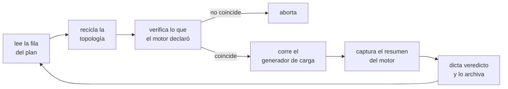
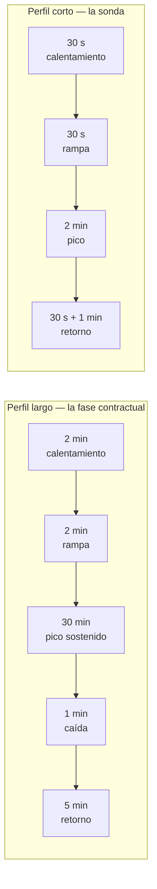
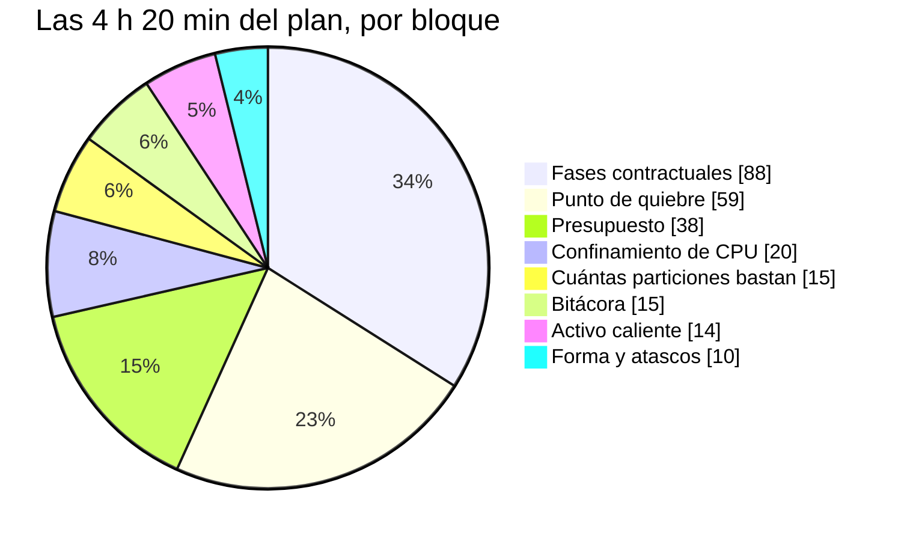

# Cuarenta preguntas por responder

El sistema que se pone a prueba es un **motor de emparejamiento**: recibe
órdenes de compra y de venta sobre un activo financiero y las casa entre sí. Es
un prototipo, construido para comprobar si una forma concreta de organizarlo
—el libro de órdenes en memoria, con las órdenes repartidas por activo entre
varias *particiones* que trabajan en paralelo— cumple lo que el sistema promete.

Y lo que promete es un número. En operación normal, y también en condiciones de
pico —cinco veces ese tráfico, sostenido durante media hora—, **95 de cada 100
órdenes deben emparejarse en menos de 200 milisegundos**. Ese es el requisito
que decide si la arquitectura sirve.

Comprobarlo con una sola prueba de carga respondería *«¿aguanta?»* y poco más.
Pero la pregunta real tiene más aristas: ¿aguanta *hasta dónde*? ¿Con cuántas
particiones? ¿Qué pasa si cada orden cuesta más trabajo del previsto? ¿Y si todo
el tráfico cae sobre una sola partición? ¿Y si se le recortan núcleos de CPU?
Cada una de esas preguntas se responde mejor por separado, moviendo un solo
factor a la vez y dejando el resto fijo.

Por eso `make experimento` no corre una prueba: corre **cuarenta corridas
cortas y controladas**, y cada una responde una pregunta distinta. Todas sirven
a las tres *apuestas de diseño* que el equipo hizo sobre la arquitectura —las
hipótesis **H1**, **H2** y **H2b** de la [ficha del experimento](experimento.html)—
y cada corrida deja escrito a cuál de ellas pone a prueba.

## Cómo está armado el experimento

Antes de entrar en cada corrida, conviene ver la forma general. Hay tres piezas:

- **El plan** — una tabla de texto con las cuarenta corridas, una por fila. Dice
  *qué* se corre.
- **El orquestador** — un único programa que lee esa tabla y la ejecuta corrida
  por corrida. Dice *cómo* se corre.
- **Las guardas de validez** — un conjunto de comprobaciones que deciden si una
  corrida terminada se puede creer o hay que descartarla.

Las tres secciones siguientes son esas tres piezas, en ese orden.

## El plan: qué se corre es un dato

Las cuarenta corridas no son cuarenta programas. Son **cuarenta filas** en un
archivo de texto, `load/plan.tsv`. La idea de diseño es separar *qué* se mide de
*cómo* se ejecuta: los parámetros de cada corrida viven como datos en una tabla,
y la lógica que los ejecuta está escrita **una sola vez**.

Una fila de ejemplo:

```
grupo        id         hipótesis  fase  perfil  n  variables                  criterio
h2-quiebre   q-n2-180   H2         f2    corto   2  BIZ_MICROS=8000;PEAK=180   p95<200
```

Se lee así: la corrida `q-n2-180` pone a prueba la apuesta **H2**; somete la
fase de pico, repartida sobre **2 particiones**, a **180 órdenes por segundo**,
con un **costo declarado de 8 ms por orden**; y la aprueba o reprueba un solo
criterio: que **95 de cada 100 órdenes** se resuelvan en **menos de 200 ms**.
Ese número —el percentil 95, abreviado **p95**— es el que decide en todo el
experimento.

La ventaja práctica: **agregar un punto de medición es agregar una línea** a la
tabla, no escribir un programa nuevo.

Antes esto eran seis guiones de shell, uno por pregunta. Cada uno traía su
propia copia del ciclo *levantar → correr → capturar → extraer* y sus propias
reglas sobre qué hacía válida una corrida. Seis copias de la misma lógica son
seis sitios donde puede divergir — y divergieron. Por eso ahora hay un solo
orquestador, `load/experimento.sh`.

## Qué hace el orquestador con cada fila

Para cada fila del plan, el orquestador repite siempre el mismo ciclo:



Lee los parámetros de la fila, monta el sistema desde cero, comprueba que
arrancó como pedía la fila, le aplica la carga durante el tiempo que marque el
perfil, recoge los números que publica el motor, decide si pasó o no pasó,
archiva todo y sigue con la fila siguiente.

Dos de esos pasos no son obvios, y **cada uno se agregó después de que un error
real se colara en resultados ya publicados**. No se diseñaron por precaución;
se diseñaron por escarmiento.

**Reciclar la topología en cada corrida, no una sola vez al principio.**
«Topología» es todo el montaje que procesa las órdenes: el componente que las
reparte y las particiones que hacen el trabajo. El motor no va reportando su
latencia sobre la marcha: la entrega solo cuando se apaga, y en forma de
**percentiles acumulados** de toda la vida del proceso. Si el mismo proceso
viviera varias corridas seguidas, ese resumen las mezclaría y no se podría
atribuir a ninguna. La única forma de que las cifras describan **una sola
corrida** es que el proceso haya existido exactamente durante esa corrida. Es un
requisito de la medición, no una manía de limpieza.

**Verificar lo que el motor declaró, en vez de confiar en lo que se pidió.**
Pedir algo en el plan no garantiza que el sistema arrancara así. Pasó de verdad:
una corrida pedía un costo de 8 ms por orden y arrancó con esa lógica de negocio
**apagada** (costo cero). Nadie lo notó hasta mucho después, con los resultados
ya publicados. Ahora el orquestador lee del **registro de arranque del motor**
qué se activó de verdad y **aborta la corrida** si no coincide con la fila.

**La observabilidad es la excepción: no se recicla nunca.** Prometheus es la
base de datos que anota, segundo a segundo, qué hace el sistema; Grafana dibuja
con esos datos el tablero que queda como evidencia. Los dos siguen encendidos
las más de cuatro horas completas, porque Prometheus necesita **una línea de
tiempo continua**: recoge las métricas de cada servicio y además recibe lo que
el generador de carga mide desde afuera. Si se reiniciara con cada corrida, esa
línea quedaría partida en cuarenta pedazos —y durante cada reinicio el generador
no tendría dónde escribir—, y el tablero dejaría de servir para ver el momento
exacto en que el sistema se degrada. Cada corrida se distingue igual dentro del
tablero porque sus datos llevan una **etiqueta con el identificador de la
corrida**.

## Dos perfiles: la fase completa y la sonda

No todas las corridas duran lo mismo. Cada una usa uno de dos perfiles, y la
diferencia no es de rigor sino de propósito.



| | Perfil largo | Perfil corto |
|---|---|---|
| Para qué | El veredicto de los requisitos de calidad | Explorar un eje: la tasa, el costo, los núcleos |
| Cuántas corridas | 3 | 37 |
| Cuánto dura | 14 a 40 min | 3,4 a 4,9 min |
| Qué sostiene | Media hora de pico, como pide el contrato | Dos minutos, suficiente para estabilizar |

El **perfil largo** reproduce lo que exige el contrato —media hora de pico
sostenido— y da el veredicto formal. El **perfil corto** es una *sonda*: sirve
para mover un solo factor a la vez y ver a partir de qué punto el sistema deja
de cumplir; dos minutos de pico bastan para que las cifras se estabilicen.

**El calentamiento es un escenario aparte en los dos perfiles**, y queda fuera
del criterio por construcción. «Calentamiento» es el arranque, cuando la máquina
virtual de Java todavía está compilando y optimizándose: aporta tráfico, pero no
debe aportar veredicto. Medido en una corrida corta, la diferencia no es
cosmética — con el calentamiento dentro, el percentil 99,9 daba **125 ms**; el
escenario ya estabilizado da **15 ms**.

---

## Las cuarenta corridas

Las corridas se agrupan por la apuesta que ponen a prueba:

- **H1** — que el registro durable de cada orden (la *bitácora*) puede
  mantenerse fuera del camino crítico, sin costar latencia.
- **H2** — que repartir la carga entre más particiones sube, de forma
  proporcional, cuánto tráfico aguanta el sistema.
- **H2b** — qué ocurre cuando esa repartición no ayuda, porque todo el tráfico
  se concentra en un solo activo (un *activo caliente*).

Cada grupo tiene un nombre corto (`oficial`, `h2-quiebre`, …) que sirve para
correrlo solo, con `make grupo G=<nombre>`.

### Las tres fases contractuales  ·  `oficial`

| Corrida | Qué somete | Dura |
|---|---|---|
| **OFICIAL · régimen · 17 órd/s · 12 min** | ¿Responde a tiempo en operación normal? | 14 min |
| **OFICIAL · pico 5× · 84 órd/s · 30 min** | ¿Aguanta el pico 5× repartido, y vuelve a régimen al bajar? | 40 min |
| **OFICIAL · todo el pico en UN activo** | ¿Se cae con todo el pico contractual en un solo activo? | 34 min |


*Las tres fases contra el límite de 200 ms. La barra se llena contra el
contrato, así que su longitud es el presupuesto de latencia consumido.*

### ¿Cuántas particiones bastan?  ·  `h2-minimo`

| Corrida | Qué somete | Dura |
|---|---|---|
| **¿Cuántas bastan? · 1 partición · 84 órd/s** | ¿Basta UNA partición para el pico contractual? | 4,9 min |
| **¿Cuántas bastan? · 2 particiones · 84 órd/s** | ¿Bastan dos? | 4,9 min |
| **¿Cuántas bastan? · 4 particiones · 84 órd/s** | ¿Cuánto margen dan cuatro? | 4,9 min |


*La misma carga de 84 órdenes/s repartida entre 1, 2 y 4 particiones. La menor
que quede verde es el mínimo que satisface el contrato — y ese número la ficha
lo exige medido, no supuesto.*

### El punto de quiebre, por topología  ·  `h2-quiebre`

| Corrida | Qué somete | Dura |
|---|---|---|
| **Quiebre · 1 partición · 90 órd/s** | Punto de quiebre con 1 partición | 4,9 min |
| **Quiebre · 1 partición · 100 órd/s** | Punto de quiebre con 1 partición | 4,9 min |
| **Quiebre · 1 partición · 110 órd/s** | Punto de quiebre con 1 partición | 4,9 min |
| **Quiebre · 1 partición · 120 órd/s** | Punto de quiebre con 1 partición | 4,9 min |
| **Quiebre · 2 particiones · 180 órd/s** | ¿El quiebre se duplica al duplicar particiones? | 4,9 min |
| **Quiebre · 2 particiones · 200 órd/s** | ¿El quiebre se duplica al duplicar particiones? | 4,9 min |
| **Quiebre · 2 particiones · 220 órd/s** | ¿El quiebre se duplica al duplicar particiones? | 4,9 min |
| **Quiebre · 2 particiones · 240 órd/s** | ¿El quiebre se duplica al duplicar particiones? | 4,9 min |
| **Quiebre · 4 particiones · 360 órd/s** | ¿Y al cuadruplicarlas? | 4,9 min |
| **Quiebre · 4 particiones · 400 órd/s** | ¿Y al cuadruplicarlas? | 4,9 min |
| **Quiebre · 4 particiones · 440 órd/s** | ¿Y al cuadruplicarlas? | 4,9 min |
| **Quiebre · 4 particiones · 480 órd/s** | ¿Y al cuadruplicarlas? | 4,9 min |


*Un panel por topología, no doce barras en uno: doce no caben sin encimarse, y
así el número de particiones lo dice el título y cada barra solo lleva su tasa.
El punto de quiebre es la primera que se pone en rojo.*

### El activo caliente  ·  `h2b-caliente`

| Corrida | Qué somete | Dura |
|---|---|---|
| **Activo caliente · 84 órd/s en UN activo** | El pico contractual, todo en un activo | 3,4 min |
| **Activo caliente · 100 órd/s en UN activo** | ¿Dónde deja de responder a tiempo una partición caliente? | 3,4 min |
| **Activo caliente · 110 órd/s en UN activo** | ¿Dónde deja de responder a tiempo una partición caliente? | 3,4 min |
| **Activo caliente · 120 órd/s en UN activo** | ¿Dónde deja de responder a tiempo una partición caliente? | 3,4 min |


*Todo el tráfico sobre un solo activo, subiendo la tasa. La barra de 84 órd/s es
el pico contractual: si sale verde, la apuesta H2b queda refutada.*

### La bitácora  ·  `h1-bitacora`

| Corrida | Qué somete | Dura |
|---|---|---|
| **Bitácora · apagada** | Línea base sin registro durable | 4,9 min |
| **Bitácora · en paralelo** | ¿Cuesta latencia registrar en paralelo? | 4,9 min |
| **Bitácora · en serie (camino crítico)** | ¿Y ponerlo en el camino crítico? | 4,9 min |


*Aquí se mira la mediana del motor y no el percentil 95, porque el efecto es de
medio milisegundo y el ruido del banco es de varios.*

### El confinamiento de CPU  ·  `h2-cpu`

| Corrida | Qué somete | Dura |
|---|---|---|
| **CPU · sin límite** | Línea base sin límite de CPU | 4,9 min |
| **CPU · 2 núcleos** | ¿Y con dos núcleos por partición? | 4,9 min |
| **CPU · 1 núcleo** | ¿Cabe una partición en UN núcleo? | 4,9 min |
| **CPU · medio núcleo** | ¿Y en medio? | 4,9 min |


*Cada partición confinada a 2, 1 y medio núcleo, contra la corrida sin límite. El
prototipo corre sobre 14 CPU, cosa que ningún despliegue real hace.*

### El presupuesto de tiempo de servicio  ·  `presupuesto`

| Corrida | Qué somete | Dura |
|---|---|---|
| **Presupuesto · orden de 5 ms** | ¿Hasta cuánto puede costar una orden con el pico repartido? | 4,9 min |
| **Presupuesto · orden de 10 ms** | ¿Hasta cuánto puede costar una orden con el pico repartido? | 4,9 min |
| **Presupuesto · orden de 12 ms** | ¿Hasta cuánto puede costar una orden con el pico repartido? | 4,9 min |
| **Presupuesto · orden de 13 ms** | ¿Hasta cuánto puede costar una orden con el pico repartido? | 4,9 min |
| **Presupuesto · orden de 15 ms** | ¿Hasta cuánto puede costar una orden con el pico repartido? | 4,9 min |
| **Presupuesto caliente · orden de 5 ms** | ¿Y con todo el pico en una sola partición? | 3,4 min |
| **Presupuesto caliente · orden de 8 ms** | ¿Y con todo el pico en una sola partición? | 3,4 min |
| **Presupuesto caliente · orden de 9 ms** | ¿Y con todo el pico en una sola partición? | 3,4 min |
| **Presupuesto caliente · orden de 10 ms** | ¿Y con todo el pico en una sola partición? | 3,4 min |


*El presupuesto es el último costo por orden que queda en verde. Es el
entregable del experimento: una cota falsable sin conocer todavía la lógica de
negocio.*

### La forma de la distribución  ·  `forma`

| Corrida | Qué somete | Dura |
|---|---|---|
| **Forma · lognormal (cola sin tope)** | ¿Depende el resultado de la FORMA de la distribución del costo? | 4,9 min |

### Los atascos aislados  ·  `jfr`

| Corrida | Qué somete | Dura |
|---|---|---|
| **Atascos · grabación de la JVM** | ¿Qué causa los atascos de cientos de milisegundos? | 4,9 min |

---

## Cuánto dura

El plan completo son unas **4 h 20 min**, repartidas así entre los ocho bloques:



| Bloque | Corridas | Duración |
|---|---|---|
| Fases contractuales | 3 | 88 min |
| Punto de quiebre | 12 | 59 min |
| Presupuesto | 9 | 38 min |
| Confinamiento de CPU | 4 | 20 min |
| ¿Cuántas particiones bastan? | 3 | 15 min |
| Bitácora | 3 | 15 min |
| Activo caliente | 4 | 14 min |
| Forma y atascos | 2 | 10 min |
| **Total** | **40** | **≈ 4 h 20 min** |

Tres cuartas partes de ese tiempo son medición. La cuarta parte restante es **el
precio de montar el sistema limpio antes de cada corrida**: unos 25 segundos de
reciclado, cuarenta veces, suman casi 17 minutos. Se pagan a propósito, por la
razón explicada más arriba.

**Si no hace falta todo:**

| Comando | Duración | Qué da |
|---|---|---|
| `make oficial` | ~1 h 30 min | Solo el veredicto de los requisitos de calidad |
| `make grupo G=h2-quiebre` | ~59 min | Los doce puntos del punto de quiebre |
| `make grupo G=h2-minimo` | ~15 min | Cuántas particiones bastan |
| `make smoke` | 1,5 min | Que el montaje responde |

Una corrida interrumpida **se reanuda sobre su propio directorio** y omite las
que ya están completas. Es válido porque cada corrida levanta su propio montaje
y no comparte estado con las demás — esa independencia ya era requisito de la
medición.

## Qué hace válida una corrida

Que una corrida **termine** no significa que se pueda **creer**. Hay tres
guardas que deciden si la medición cuenta, y las tres nacieron de un error que
llegó a publicarse.

**Que el motor haya respondido.** Un sistema caído produce cifras excelentes: un
servicio muerto responde más rápido que uno vivo. Se exige que todas las
respuestas hayan sido correctas y que el motor alcanzara a publicar su resumen.

**Que lo que corrió sea lo que se pidió.** La configuración real con la que
arrancó el motor se lee de su propio registro y se compara con lo que declaraba
la fila del plan.

**Que la carga se haya aplicado entera.** El generador de carga es **k6**, una
herramienta que empuja una **tasa objetivo** de órdenes por segundo en lugar de
simular un número fijo de clientes que esperan turno. Cuando se queda sin
capacidad para sostener esa tasa, descarta órdenes — y descarta justo las de los
momentos peores, cuando el sistema iba más lento. A partir de ahí la cifra deja
de medir el motor y pasa a medir al propio generador. La regla para detectarlo
mira la proporción de órdenes descartadas: cuantas más se pierden, más se aleja
el número del p95 que dice ser. Con **26 órdenes descartadas sobre 28.000** el
efecto es imperceptible —sigue siendo, a efectos prácticos, un p95—. Con
**11.111 sobre 39.000** ya no es un p95 sino una cifra mucho más optimista, otra
cosa por completo. Por debajo de cierto umbral, la corrida no publica su
latencia.

> **Completa no es lo mismo que válida.** Una corrida que incumplió su criterio
> está completa y no se repite: la decisión ya se tomó. Repetirla hasta que pase
> sería elegir el resultado.

## Cómo se ve mientras corre


*El experimento entero en una imagen. El contador del motor se reinicia con cada
corrida —cada una levanta su topología—, así que cada diente es una corrida: la
**altura** son las órdenes que procesó y la **pendiente**, a qué ritmo. Los tres
dientes altos de la izquierda son las fases contractuales largas; a la derecha,
las sondas. Un diente más bajo de lo esperado significa que la carga no se
aplicó entera.*


*La descomposición que decide qué se ataca. Si domina la **espera**, la orden
hace fila y hay que agregar particiones. Si domina el **trabajo**, hay que
abaratar la orden y más particiones no ayudan. En escala logarítmica porque un
atasco aislado de más de un segundo aplasta contra el eje todo lo demás, que
vive entre los microsegundos y las decenas de milisegundos.*

El tablero se organiza por hipótesis: cada bloque abre con la apuesta escrita y
debajo trae las corridas que la ponen a prueba. Se abre con `make tablero`, y se
genera desde el mismo plan que ejecuta el experimento — así los nombres de las
corridas no se pueden desincronizar.

## Cómo repetirlo

```bash
make build                  # compila los 3 módulos
make up                     # topología + Prometheus + Grafana
make smoke                  # 1,5 min: verifica el montaje
make plan                   # qué se va a correr y a qué hipótesis sirve
make experimento            # las 40 corridas (~4 h 20 min)
make tablero                # la evidencia en vivo
```

Cada corrida archiva su salida cruda, su resumen y el registro del motor en
`load/k6/results/<marca de tiempo>/`, más una tabla con el veredicto de las
cuarenta. Los resultados están en la [Evidencia de corridas](evidencia-corridas.html);
qué se apuesta, en la [ficha del experimento](experimento.html); y cómo está
construido lo que ejecuta todo esto, en [Implementación](implementacion.html).
