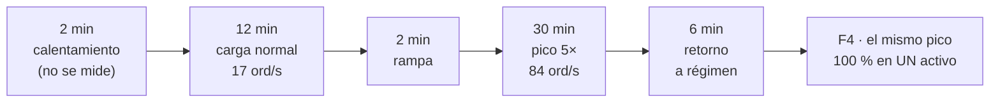

# ¿Aguantó el diseño? — lo que midieron las corridas

El experimento E01 puso a prueba un motor de emparejamiento que procesa las órdenes **de a una, en memoria y sin esperar a nadie**. Esta página trae lo que midió, cómo se leen esas cifras y qué queda sin probar.

Todo lo de aquí sale de un solo ciclo de medición del 5 de septiembre de 2026, con el mismo instrumento de punta a punta: el ciclo oficial de cuatro fases y seis estudios encadenados detrás. Cada tabla dice con qué comando se repite.

## El veredicto, primero

El contrato del sistema son dos requisitos de calidad críticos: **ASR-02**, la latencia en operación normal, y **ASR-03**, aguantar un pico de cinco veces esa carga durante media hora. Los dos piden lo mismo: que **95 de cada 100 órdenes** salgan en menos de 200 ms. Esa cifra —el **percentil 95**, abreviado *p95*— es la que decide, y es la que se repite en toda esta página.

> **ASR-02 ✅** — carga normal (17 órdenes/s) durante 12 minutos: **p95 = 31,3 ms** contra un presupuesto de 200 ms.
>
> **ASR-03 ✅** — rampa al pico de 5×, sostenido 30 minutos: **p95 = 77,2 ms**. Y al bajar, la latencia **vuelve** a la de carga normal: 30,6 ms.
>
> **Partición caliente ✅ con margen** — todo el pico concentrado en un solo activo: **p95 = 152,4 ms**. Cumple, pero el margen baja de 6,4× a 1,3×.
>
> Cero órdenes rechazadas, cero órdenes que el generador no logró emitir y cero errores de reparto en las tres fases oficiales.

Pero el número que conviene llevarse **no es ninguno de esos percentiles**, porque todos dependen de un supuesto:

> **El presupuesto: una orden puede costar hasta 12,6 ms** con el pico repartido entre dos particiones, y **8,5 ms** si todo cae en una sola.

El prototipo no implementa la lógica de negocio real: validar, verificar riesgo y saldos, calcular comisiones, generar el trato. Por eso se declaró un costo de 8 ms por orden y se barrió alrededor. Cuando la lógica exista, se mide su costo y se compara contra esos 12,6 ms. Esa afirmación es verificable desde hoy; los percentiles de arriba, solo bajo el supuesto de los 8 ms.

## Cómo se leen estos números

**Dos relojes miden lo mismo desde extremos distintos.** El generador de carga cronometra la llamada completa, como la ve un cliente. El motor cronometra desde que la orden le llega hasta que queda resuelta. **La diferencia entre ambos es el costo del transporte y del router.**

**Y el reloj de adentro se parte en dos.** La **espera** es lo que la orden hizo fila antes de que el escritor la tomara; el **servicio** es lo que costó procesarla. `total = espera + servicio`, y saber cuál de los dos creció es lo que distingue *«hay que agregar particiones»* de *«hay que abaratar la orden»*.

Una línea de las que el motor publica al cerrar, descifrada:

```
ACUMULADO shard=1 n=83599 total p50=4635us p95=75007us p99=140415us p99.9=233855us max=493055us
        | espera p50=29us p95=51391us | servicio p50=4603us p95=27599us
```

| Campo | Qué dice |
|---|---|
| `shard=1` | La partición que la emitió. Hubo dos, y cada una publica la suya |
| `n=83599` | Órdenes que procesó en la fase. Sumadas con las de la otra partición dan **exactamente** las 167.430 que contó el generador |
| `total p50=4635us` | La mitad de las órdenes salieron en menos de **4,6 ms** |
| `total p95=75007us` | Solo 5 de cada 100 pasaron de **75 ms** |
| `espera p95=51391us` | El percentil 95 de la cola: **51 ms** |
| `servicio p95=27599us` | El percentil 95 del trabajo real: **27,6 ms** |

**Ojo con sumar esa última línea:** `total = espera + servicio` vale **para cada orden**, no para los percentiles. Cada uno es el percentil de su propia población, y la orden que más espera no suele ser la que más cuesta. Aquí 51 y 27,6 dan 79, no 75.

**Tres advertencias antes de comparar nada:**

1. **`S` es una media, no el costo de cada orden.** El modelo muestrea tres clases: 90 % baratas, 9 % seis veces más caras, 1 % treinta veces más caras. Con S = 8 ms, una orden individual cuesta **4,6, 27,6 o 138 ms** según su clase. Por eso `servicio p95` da 27,6 ms y no 8.
2. **Ninguna diferencia menor al 14 % es interpretable.** Tres corridas de la *misma* configuración dieron 70,5 / 79,0 / 81,4 ms. Ese es el piso de ruido del banco: **±7 %**. Ver «Lo que este instrumento no puede distinguir».
3. **El calentamiento no cuenta.** Cada fase arranca con dos minutos que quedan fuera del criterio, porque una máquina virtual que todavía está compilando no debe decidir el veredicto.

## El entorno, y qué se declaró

Una sola máquina —macOS sobre Apple Silicon, 14 CPU visibles— con Docker Compose: router más **dos particiones**, sin límites de CPU salvo donde se indique. El generador corre en el mismo equipo y el tráfico viaja por el bucle local.

El punto de operación quedó escrito por el propio motor al arrancar, y es la primera línea de cada registro crudo:

```
mezcla 90/9/1 media=8000us Cs2=3.34 semilla=42 techo_teorico=125 ord/s
```

Dice la forma de la distribución del costo por orden, su media de 8 ms, cuánto varía una orden de otra (`Cs2`, la variabilidad relativa del servicio), la semilla del generador aleatorio —distinta en cada partición, para que las órdenes caras no caigan sobre todas a la vez— y el techo que esa media implica: **125 órdenes por segundo**.

Los arribos son **irregulares**, no acompasados: cada orden se desplaza un tiempo exponencial, lo que reproduce un proceso de Poisson conservando la tasa. Con llegadas perfectamente espaciadas la fila nunca acumula y los percentiles salen optimistas. Los 36 activos del conjunto de prueba reparten **18/18** entre las dos particiones.

**Cada fase corre sobre una topología recién levantada.** No es higiene: el resumen acumulado de una partición solo es de esa fase si el proceso vivió exactamente esa fase.

## El ciclo oficial — cuatro fases



| Fase | Qué somete | Órdenes | p50 | **p95** | p99 | p99.9 | máx | Veredicto |
|---|---|---|---|---|---|---|---|---|
| **F1 · ASR-02** | 17/s · 12 min · 36 activos | 14.280 | 7,8 ms | **31,3 ms** | 139,6 ms | 145,2 ms | 203,6 ms | ✅ 6,4× de margen |
| **F2 · ASR-03** | 84/s · 30 min sostenidos | 167.430 | 5,4 ms | **77,2 ms** | 140,8 ms | 223,6 ms | 493,7 ms | ✅ 2,6× de margen |
| **F3 · retorno** | de vuelta a 17/s · 6 min | — | 7,0 ms | **30,6 ms** | 129,8 ms | 142,1 ms | 163,0 ms | ✅ vuelve a F1 |
| **F4 · caliente** | 84/s · **un solo activo** | 159.300 | 12,6 ms | **152,4 ms** | 249,4 ms | 365,8 ms | 570,6 ms | ✅ 1,3× de margen |

*Órdenes de F2 incluye las de las tres ventanas de esa corrida. Se reproduce con `make e2e BIZ_MICROS=8000`.*

**F3 responde su propia pregunta.** La ficha del experimento pide verificar que, al bajar del pico, «la fila se vacía y la latencia vuelve a la de F1». Vuelve: **30,6 ms contra 31,3 ms**. Hasta este ciclo la comparación era imposible de hacer, porque F3 vivía dentro de la misma ventana que el pico y sus percentiles quedaban promediados con los que había que superar.

**Por dentro, F2 se ve así:**

| | partición 0 | partición 1 |
|---|---|---|
| Órdenes | 83.831 | 83.599 |
| total p95 | 69,4 ms | 75,0 ms |
| **espera p95** | **45,3 ms** | **51,4 ms** |
| **servicio p95** | **27,6 ms** | **27,6 ms** |

El reparto salió 50,07 % / 49,93 %, el balance que producen los 36 activos del conjunto. Y en el percentil 95 **la cola pesa cerca del doble que el trabajo** —unos 48 ms contra 27,6—: el motor está encolando, no atascado.

## Hasta cuánto puede costar una orden

Se barrió el costo por orden hasta encontrar el punto donde el criterio deja de cumplirse.

**Con el pico repartido entre dos particiones** (`make sweep-service`):

| Costo por orden | p95 del cliente | espera p95 | servicio p50 | |
|---|---|---|---|---|
| 0 (lógica apagada) | 5,8 ms | 0,2 ms | 0,02 ms | ✅ |
| 5 ms | 22,6 ms | 13,8 ms | 2,9 ms | ✅ |
| 10 ms | 127,1 ms | 98,3 ms | 5,8 ms | ✅ |
| **12 ms** | **184,8 ms** | 156,5 ms | 6,9 ms | ✅ el último que pasa |
| **13 ms** | **211,8 ms** | 183,4 ms | 7,5 ms | ❌ el primero que falla |
| 15 ms | 264,0 ms | 246,0 ms | 8,6 ms | ❌ |

> **Presupuesto ≈ 12,6 ms por orden**, acotado por medición: 12 ms pasa con 185 ms y 13 ms falla con 212 ms.

**Con todo el pico en una sola partición** (`make sweep-hot`):

| Costo por orden | p95 del cliente | espera p95 | |
|---|---|---|---|
| 5 ms | 67,8 ms | 53,0 ms | ✅ |
| **8 ms** | **163,8 ms** | 151,2 ms | ✅ el último que pasa |
| **9 ms** | **242,4 ms** | 231,9 ms | ❌ |
| 10 ms | 367,6 ms | 355,8 ms | ❌ |
| 12 ms | **2,74 s** | 2,73 s | ❌ colapso |

> **Presupuesto ≈ 8,5 ms por orden.**

**Y aquí está el hallazgo que reordena el diseño.** Repartir el pico entre dos particiones sube el presupuesto de 8,5 a 12,6 ms. Eso es **1,48×, no 2×**.

No es una ineficiencia: es aritmética. **Repartir la carga reduce la espera, nunca el servicio.** Bajar la ocupación acorta la fila, pero el tiempo de servicio es latencia también, y subir el presupuesto lo sube directo. En las tablas se ve sin ambigüedad: la columna de espera se mueve con todo, la de servicio solo sigue a `S`.

> **Corolario:** ninguna cantidad de particiones permite que una orden que cuesta 200 ms cumpla un contrato de 200 ms. El particionamiento es la herramienta contra la **espera**, no contra el **costo por orden**.

## El motor no se quiebra: topa

Se le pidió a una sola partición 250, 500 y 1.000 órdenes por segundo, con todo el tráfico en un activo.

| Tasa pedida | **Tasa lograda** | p95 | espera p95 | Órdenes que el generador no pudo emitir |
|---|---|---|---|---|
| 84/s | 84/s | 152,4 ms | 141,2 ms | 0 |
| 250/s | **119/s** | 7,12 s | 7,11 s | 15.382 |
| 500/s | **121/s** | 7,13 s | 7,13 s | 48.748 |
| 1.000/s | **122/s** | 7,15 s | 7,15 s | 116.032 |

Pedir cuatro veces más produce **exactamente el mismo resultado**. Pasado el techo, la tasa que se pide deja de ser un parámetro del sistema: solo cambia cuántas órdenes se quedan sin entrar.

Y ese techo no es una sorpresa: con un costo medio de 8 ms por orden y un solo escritor, la aritmética predice `1/S` = **125 órdenes/s**. Medido: **119 a 122**. El diseño de único escritor entrega entre el **95 y el 98 %** de su techo teórico, y ese techo es toda la capacidad que hay.

> **La protección por rechazo nunca se activó.** Con la fila del router en 10.000 solicitudes, ni siquiera a 1.000 órdenes/s hubo un solo rechazo. El sistema **se degrada por latencia mucho antes que por rechazo**, así que ese criterio, por sí solo, no protege de nada.

## ¿Depende el resultado de cómo se distribuye el costo?

El modelo por defecto es una mezcla de tres clases, **acotada por construcción**: ninguna orden puede costar más de 30 veces la media. La lógica real no tiene esa cota. Se repitió la misma corrida con una distribución continua y sin tope, con la misma media y la misma variabilidad, de modo que lo único que cambia es la **forma**.

| | mezcla (acotada) | lognormal (sin tope) | |
|---|---|---|---|
| p95 del cliente | 81,4 ms | 60,5 ms | −26 % |
| p99 | 142,9 ms | 140,1 ms | sin cambio |
| **p99.9** | **201,0 ms** | **384,5 ms** | **+91 %** |
| **máximo** | **244,0 ms** | **583,7 ms** | **+139 %** |
| **servicio máximo de una orden** | **138 ms** | **580 ms** | **+320 %** |

**El veredicto del contrato es robusto a la forma:** 81 y 60 ms, los dos muy por debajo de 200. La conclusión sobre ASR-03 deja de depender de una decisión de modelado, y eso la hace más fuerte, no más débil.

**La cola no lo es.** La mezcla topa en 138 ms de servicio porque así se construyó; la lognormal produjo **una sola orden de 580 ms de servicio**, bloqueando al único escritor durante más de medio segundo. Es un evento que la mezcla es incapaz de generar. Por lo tanto: **la violación del p99.9 que se reporta más abajo es un piso, no una cota.**

## ¿Se puede registrar cada orden sin pagarlo en latencia?

La primera apuesta del diseño incluye una cláusula: el registro durable va **fuera del camino crítico**. La bitácora se puede cablear de dos formas, y la diferencia entre ellas *es* la afirmación (`make compare-journal`).

| Disposición | Latencia mediana del motor | Espera mediana | Costo de escribir |
|---|---|---|---|
| Apagada | 4.655 µs | 37 µs | — |
| **En paralelo** con el cruce | 4.697 µs · **+0,9 %** | 76 µs | 490 µs |
| **En serie**, antes del cruce | 6.003 µs · **+29,0 %** | 970 µs | 486 µs |

> **La cláusula queda probada, con un factor de 32× entre las dos disposiciones.** Escribir cuesta lo mismo en ambas —490 contra 486 µs—; lo que cambia es **quién espera**. En paralelo la bitácora corre junto al cruce y el cliente no la paga. En serie va delante, y la espera mediana se multiplica por 26.

Dos precisiones honestas. La primera: **el percentil 95 no ve nada de esto** (81,4 / 75,5 / 77,0 ms), porque el efecto es de medio milisegundo y el ruido del banco es de varios. El hallazgo se sostiene sobre la mediana, que es donde el efecto es visible. La segunda: `órdenes por volcado a disco = 1,0` en ambos modos. La amortización que el patrón permite —escribir muchas órdenes y sincronizar una sola vez— **no llegó a activarse**, porque nunca hubo suficiente presión para formar lotes.

## ¿Basta un núcleo por partición?

La segunda apuesta afirma que una partición es un hilo y por tanto cabe en un núcleo. El prototipo corría sin límites sobre 14 CPU, cosa que ningún despliegue real hace, así que se confinó (`make compare-cpus`).

| Cuota | CPU que ve la máquina virtual | p95 del cliente | Contra la corrida libre | espera p95 |
|---|---|---|---|---|
| Sin límite | 14 | 70,5 ms | — | 46,7 ms |
| 2 núcleos | 2 | 84,4 ms | +20 % | 58,1 ms |
| **1 núcleo** | 1 | **130,6 ms** | **+85 %** | 102,9 ms |
| 0,5 núcleos | 1 | **999,8 ms** | +1.319 % | 1.061,9 ms |

> **La cláusula se cumple, pero no sale gratis.** Con un núcleo por partición el sistema sostiene el contrato —130,6 ms contra 200— y con medio núcleo colapsa. El salto entre 1 y 0,5 es puro estrangulamiento del planificador. La máquina virtual ve **una** CPU en los dos casos, así que la diferencia no viene de cómo se dimensiona a sí misma. Viene de que el sistema operativo la suspende en cuanto agota su cuota.

**Esto corrige lo que esta página afirmaba antes.** La versión anterior publicaba que confinar a un núcleo «no cuesta nada medible». Con las cuatro cuotas medidas en una sola sesión contra una línea base común, cuesta **+85 %** — muy por encima del ±7 % de ruido del banco. La conclusión anterior comparaba corridas de sesiones distintas sin haber establecido primero cuánto ruido tenía el instrumento.

## ¿Qué causa los atascos de cientos de milisegundos?

El motor registra atascos aislados que ninguna ventana individual muestra: en esta corrida, **una orden esperó 290,8 ms** cuando la mediana de la fase estaba en 4,7 ms. Un solo evento así incumple el contrato por sí mismo. Los tres sospechosos naturales viven dentro de la máquina virtual, así que se grabó la corrida con el perfilador de la propia plataforma (`make profile-jfr`).

| Qué se buscó | Evento más largo |
|---|---|
| Pausas del recolector de basura | **0,011 ms** |
| Operaciones internas que detienen la ejecución | **0,740 ms** |
| Puntos de parada de los hilos | **0,277 ms** |
| Cualquier otro evento del catálogo | ninguno por encima de 50 ms |

> **La máquina virtual queda descartada.** El atasco es de 290,8 ms; lo más largo que la plataforma detuvo la ejecución fue **0,740 ms**. Un factor de **393**.

**Qué queda, por eliminación.** Si el atasco no aparece en la grabación, es que la máquina virtual **no estaba corriendo** durante esos 290 ms: algo la desprogramó desde fuera. Los candidatos son la máquina virtual de Docker y el planificador del sistema operativo anfitrión. El estudio de confinamiento apunta en la misma dirección: con media cuota, el planificador produjo esperas de más de un segundo por el mismo mecanismo, a mayor escala.

Es atribución por eliminación, no medición directa. Confirmarlo exige instrumentar el anfitrión, y eso pertenece al banco de pruebas de tres nodos.

**La grabación no distorsionó la medida:** el p95 con el perfilador activo fue de 79,0 ms, contra 70,5 y 81,4 ms de las dos corridas de referencia sin grabar. Cae dentro del ruido.

## Lo que este instrumento no puede distinguir

Tres corridas de la **misma configuración** —mismo costo por orden, misma topología, mismo perfil, sin límites— dieron:

```
70,5 ms   ·   79,0 ms   ·   81,4 ms
```

Un rango del **14 % de la media**, es decir **±7 %**. De ahí sale la regla de lectura más importante de esta página: **ninguna diferencia menor a ~14 % entre dos corridas es interpretable como señal.** Es lo que invalidó la conclusión anterior sobre el confinamiento de CPU. Y es el argumento más fuerte para repetir cada punto de medida en el banco de tres nodos, donde la máquina no está compartida con un navegador y un entorno de desarrollo.

## Lo que esta evidencia no prueba

- **Los 8 ms por orden son una hipótesis, no una medición.** El prototipo no implementa la lógica de negocio. Lo que las corridas demuestran es que *si* una orden costara 8 ms, el contrato se cumple. El número a verificar cuando la lógica exista es el presupuesto: **12,6 ms**.
- **El percentil 99,9 excede el contrato en el pico, y la cifra medida es un piso**: 223,6 ms en F2 y 365,8 ms en F4, contra 200. El contrato es sobre el percentil 95 y se cumple, pero una de cada mil órdenes lo excede. Viene de la clase pesada del modelo —138 ms de servicio ella sola— sumada a la cola. Con una distribución sin cota, empeora al menos un 91 %.
- **Una sola máquina, por bucle local.** No representa la red de 1 Gbps del banco de pruebas del reto ni la alta disponibilidad. **Valida el patrón, no el dimensionamiento.**
- **Una repetición por punto.** Con un piso de ruido de ±7 %, las diferencias pequeñas de los estudios no son concluyentes; solo lo son los efectos grandes, que es como están reportados aquí.
- **El techo de 119–122 órdenes/s es el de este costo por orden**, no una constante del patrón. Con otro `S`, otro techo: `1/S`.
- **Los atascos del anfitrión están atribuidos por eliminación**, no medidos directamente.

## Cómo repetir todo esto

```bash
make up BIZ_MICROS=8000     # topología + Prometheus + Grafana
make e2e BIZ_MICROS=8000    # el ciclo oficial de cuatro fases (~1h40m)
./load/run-estudios.sh      # los seis estudios encadenados (~2h)
make tablero                # la corrida, en vivo
```

Cada corrida archiva su salida cruda, su resumen y el registro de las particiones en `load/k6/results/<marca de tiempo>/`. Al lado queda un manifiesto con el costo por orden declarado, la topología, la versión del generador y el commit exacto.

**Ninguna cifra de esta página se lee sin su costo por orden al lado.** Por eso el motor lo escribe en su primera línea de registro, y el tablero lo muestra pegado al veredicto.

Con qué: Java 21, Docker Compose, k6 como generador, Prometheus y Grafana, y una máquina de 14 CPU. El diseño que se puso a prueba está en la [ficha del experimento](experimento.html); cómo está construido lo que lo ejecuta, en [Implementación](implementacion.html).
