# Lo que midieron las cuarenta corridas

Una partición de este motor deja de responder a tiempo cuando le llegan **73 de cada 100 órdenes que aritméticamente podría procesar**. No al 95 %, no al 100 %: al 73 %. Ese número decide cuántas particiones hacen falta, explica por qué duele un activo caliente y por qué repartir la carga entre dos motores no compra el doble de margen.

Las cuarenta corridas salieron de un solo comando el 5 de septiembre de 2026, sobre la misma máquina y el mismo binario. El [diseño del experimento](diseno-experimento.html) explica qué pregunta responde cada una; esta página trae lo que contestaron.

## El veredicto, primero

El contrato son dos requisitos de calidad críticos: **ASR-02**, la latencia en operación normal, y **ASR-03**, aguantar un pico de cinco veces esa carga durante media hora. Los dos piden lo mismo: que **95 de cada 100 órdenes** salgan en menos de 200 ms.

> **H1 — Latencia · confirmada.** En operación normal el motor responde en **31,09 ms**: 6,4 veces por debajo del presupuesto. Y su cláusula también se sostiene — registrar cada orden en paralelo cuesta **+0,9 %** de la mediana; ponerlo en el camino crítico cuesta **+19 %**.
>
> **H2 — Escalabilidad · confirmada, y con una ley.** El punto de quiebre escala casi exacto con las particiones: **92 · 181 · 360 órdenes por segundo** para 1, 2 y 4. El pico contractual son 84, así que **una sola partición basta** — dos son margen, no necesidad.
>
> **H2b — Partición caliente · refutada.** Predecía que el motor se caería antes de llegar al pico completo concentrado en un solo activo. No se cae: **155,39 ms**, con 1,3× de margen.
>
> Cero órdenes rechazadas, cero errores de reparto y cero fallos de protocolo en las 40 corridas.

Pero el número que conviene llevarse **no es ninguno de esos percentiles**, porque todos cuelgan de un supuesto:

> **El presupuesto: una orden puede costar hasta 12,4 ms** con el pico repartido entre dos particiones, y **8,4 ms** si todo cae en una sola.

El prototipo no implementa la lógica de negocio real —validar, verificar riesgo y saldos, calcular comisiones, generar el trato—. Por eso el costo por orden entró como parámetro declarado, fijado en 8 ms, y se barrió alrededor. Cuando la lógica exista se mide su costo y se compara contra 12,4 ms. Esa afirmación es verificable desde hoy; los percentiles de arriba, solo bajo el supuesto de los 8 ms.

## Cómo se leen estas cifras

**Dos relojes miden lo mismo desde extremos distintos.** El generador cronometra la llamada completa, como la ve un cliente. El motor cronometra desde que la orden le llega hasta que queda resuelta. La diferencia entre ambos es el costo del transporte y del router: entre 1 y 8 ms en todas las corridas. Es un orden de magnitud, no una cifra exacta — restar percentiles de dos poblaciones distintas nunca da una resta limpia.

**Y el reloj de adentro se parte en dos.** La **espera** es lo que la orden hizo fila antes de que el escritor la tomara; el **servicio** es lo que costó procesarla. Saber cuál de los dos creció distingue *«hay que agregar particiones»* de *«hay que abaratar la orden»*, y esa distinción es la que ordena toda esta página.

Una línea de las que el motor publica al cerrar, descifrada:

```
ACUMULADO shard=1 n=159300 total p50=11911us p95=153983us p99=247167us p99.9=382975us max=639487us
        | espera p50=4575us p95=142975us | servicio p50=4599us p95=27599us
```

| Campo | Qué dice |
|---|---|
| `shard=1` | La partición que la emitió. Cada una publica la suya |
| `n=159300` | Órdenes que procesó. Sumadas con las de las otras particiones dan **exactamente** las que contó el generador |
| `total p95=153983us` | Solo 5 de cada 100 órdenes pasaron de **154 ms** |
| `espera p95=142975us` | El percentil 95 de la cola: **143 ms** |
| `servicio p95=27599us` | El percentil 95 del trabajo real: **27,6 ms** |

**Ojo con sumar esa última línea.** `total = espera + servicio` vale **para cada orden**, no para los percentiles: cada uno es el percentil de su propia población, y la orden que más espera no suele ser la que más cuesta.

### La regla que decide qué corrida cuenta

Cuando el motor topa, el generador no logra emitir todas las órdenes que su plan pedía. Las que pierde son justamente las de los peores momentos, así que el percentil 95 **de lo que sí midió** no es el percentil 95 de la población. Es este otro:

```
percentil real = 95 × órdenes observadas ÷ órdenes intentadas
```

Con 26 órdenes perdidas sobre 56.039 da p94,96 — indistinguible de un p95. Con 20.054 sobre 74.039 da **p69,3**, que es otra cosa por completo. Por eso una corrida con pérdidas no se descarta de oficio: **se calcula a qué percentil corresponde de verdad su cifra**, y solo por debajo de p94 se declara no publicable.

*Esa regla nació después de correr. Como todas las salidas crudas quedan archivadas, el veredicto se recalculó sin volver a medir: `python3 load/analizar.py load/k6/results/<marca>`.*

## H1 — ¿Responde a tiempo en operación normal?

**Sí, con 6,4 veces de margen.** Doce minutos a 17 órdenes por segundo repartidas en 36 activos, después de dos minutos de calentamiento que no cuentan.

| | p50 | **p95** | p99 | p99.9 | máx |
|---|---|---|---|---|---|
| **Cliente** (14.281 órdenes) | 7,84 ms | **31,09 ms** | 139,48 ms | 142,79 ms | 169,76 ms |
| **Motor** · total | 4,74 ms | 27,76 ms | 138,11 ms | 141,18 ms | 168,45 ms |
| **Motor** · espera | 0,10 ms | **3,44 ms** | — | 131,01 ms | 138,50 ms |
| **Motor** · servicio | 4,63 ms | 27,62 ms | — | 138,11 ms | 138,24 ms |

*Del motor se reporta siempre la peor de las dos particiones.*

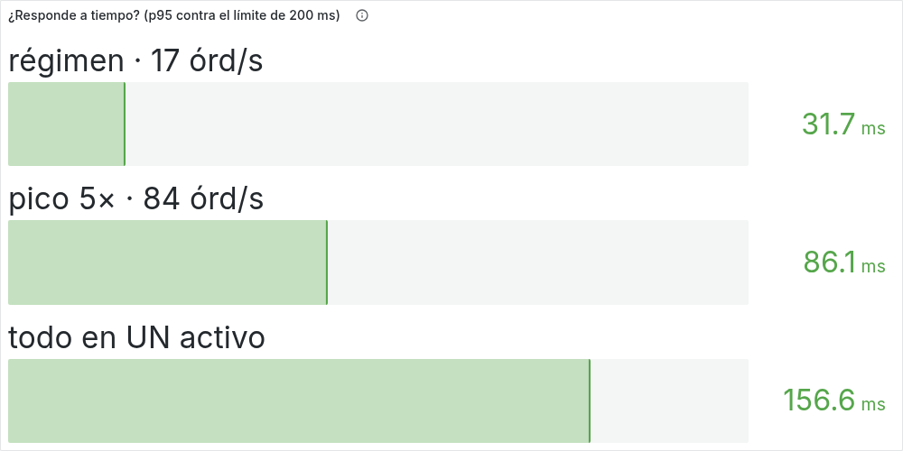

**En operación normal la fila casi no existe: 3,4 ms.** El 95 % de la latencia del motor es trabajo, no espera. Ese es el resultado que H1 predecía —procesar de a una, en memoria y sin esperar a nadie— y es también la razón de que sobre tanto margen: a esta carga el diseño ni siquiera está encolando.

Las dos particiones se repartieron 7.121 y 7.160 órdenes, un 49,86 / 50,14 %. La suma da 14.281, exactamente lo que contó el generador.

### La cláusula: registrar cada orden sin pagarlo en latencia

H1 incluye una condición que suele ser la primera en romperse — el registro durable va **fuera del camino crítico**. Se cablearon las dos disposiciones posibles contra la misma carga, y la diferencia entre ellas *es* la afirmación.

| Bitácora | Mediana del motor | Mediana de la espera | Contra apagada |
|---|---|---|---|
| Apagada | 4.657 µs | 39 µs | — |
| **En paralelo** con el cruce | 4.701 µs | 80 µs | **+0,9 %** |
| **En serie**, antes del cruce | 5.539 µs | 782 µs | **+19,0 %** |

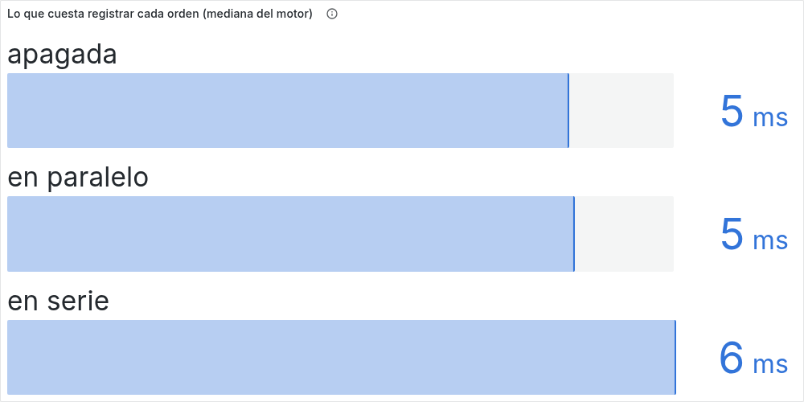

> **La cláusula queda probada, con un factor de 20× entre las dos disposiciones.** Escribir cuesta lo mismo en ambas; lo que cambia es **quién espera**. En paralelo la bitácora corre junto al cruce y el cliente no la paga. En serie va delante, y la espera mediana se multiplica por 20.

**Y el percentil 95 no ve nada de esto:** 87,07 · 88,87 · 87,74 ms. Ni siquiera las ordena bien — la disposición barata sale peor que la cara. El efecto es de medio milisegundo y ahí lo tapa la cola, así que el hallazgo se sostiene sobre la mediana. Solo es legible porque el ruido del banco es del 0,5 %.

## H2 — ¿Aguanta el pico repartido entre varios activos?

### Media hora al pico contractual, y la vuelta a régimen

ASR-03 pide subir de la carga normal al pico de cinco veces, sostenerlo treinta minutos y seguir respondiendo a tiempo. La ficha agrega una condición que el requisito da por hecha: que al bajar, **la fila se vacíe y la latencia vuelva** a la de operación normal. El pico exigido es transitorio, no permanente.

*La fase contractual completa —treinta minutos de pico sostenido más el retorno a régimen— se está midiendo en este momento. Sus cifras entran aquí al cerrar. Lo que ya está medido del mismo punto de operación son cuatro sondas independientes a 84 órdenes por segundo sobre dos particiones: **86,22 · 86,42 · 87,00 · 87,07 ms**.*

### ¿Cuántas particiones bastan?

**Una.** La misma carga de 84 órdenes por segundo, primero sobre una partición, después sobre dos y sobre cuatro:

| Particiones | **p95 del cliente** | espera p95 | servicio p95 | |
|---|---|---|---|---|
| 1 | **166,30 ms** | 143,49 ms | 27,60 ms | ✅ |
| 2 | **86,22 ms** | 52,26 ms | 27,60 ms | ✅ |
| 4 | **30,30 ms** | 13,82 ms | 27,60 ms | ✅ |

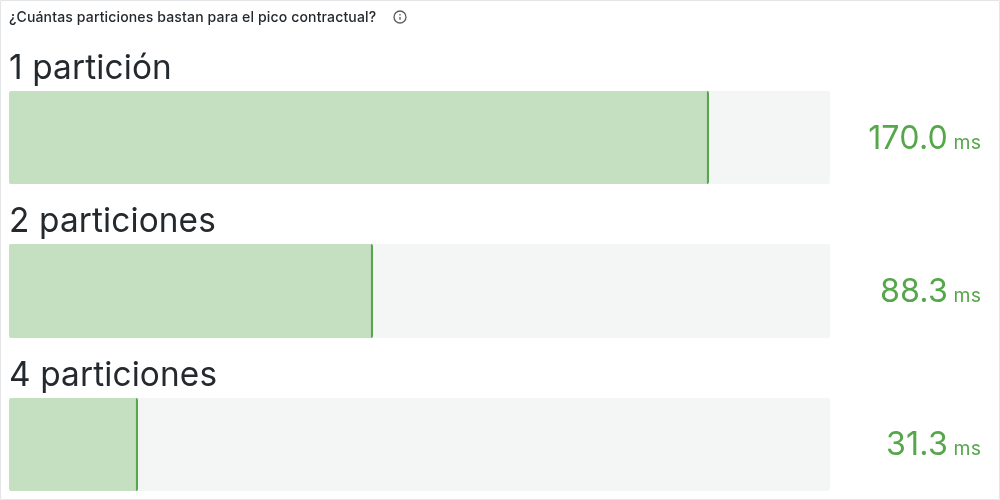

> **Una sola partición basta para el contrato.** El diseño oficial usa dos; el experimento dice que eso es margen, no necesidad. Y muestra dónde vive el margen: **la columna de espera se derrumba de 143 a 14 ms, la de servicio no se mueve un microsegundo.**

Ese par de columnas es el hallazgo entero de H2 en dos cifras. Repartir la carga compra **espera**, nunca **servicio**. Es lo que hará que el presupuesto suba 1,48× y no 2× al duplicar particiones. Y lo que vuelve inútil agregar motores cuando el problema es lo que cuesta cada orden.

### El punto de quiebre, y la ley que sale de él

Con el pico contractual todo pasa, así que la pregunta útil es otra: **¿a qué tasa deja de pasar?** Se subió la carga hasta cruzar los 200 ms, en las tres topologías.

| Con 1 partición | p95 | | Con 2 | p95 | | Con 4 | p95 | |
|---|---|---|---|---|---|---|---|---|
| 84/s | 166,30 ms | ✅ | 168/s | — | | 336/s | — | |
| 90/s | **187,09 ms** | ✅ | 180/s | **194,32 ms** | ✅ | 360/s | **199,77 ms** | ✅ |
| 100/s | **247,60 ms** | ❌ | 200/s | **281,37 ms** | ❌ | 400/s | **329,70 ms** | ❌ |
| 110/s | 373,59 ms | ❌ | 220/s | 415,27 ms | ❌ | 440/s | 4,09 s | ❌ |
| 120/s | 800,01 ms | ❌ | 240/s | 821,60 ms | ❌ | 480/s | 5,83 s | ❌ |

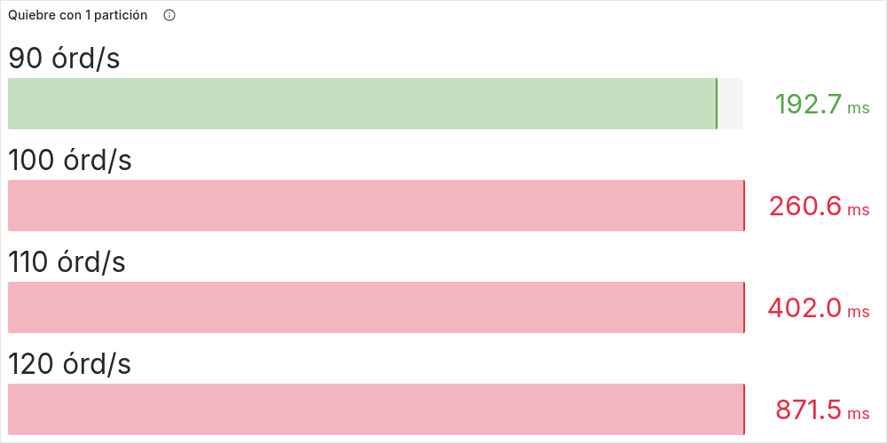
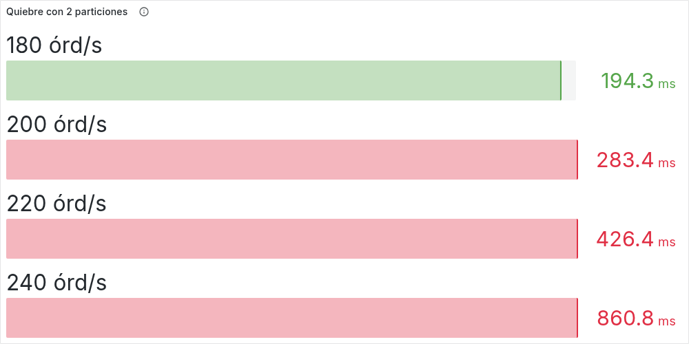
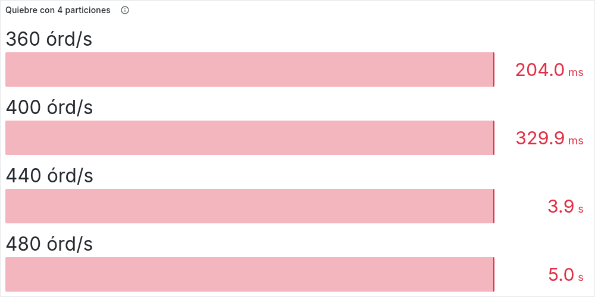

Interpolando entre el último que pasa y el primero que falla:

| Particiones | Punto de quiebre | Por partición | Contra el techo aritmético |
|---|---|---|---|
| 1 | **92 órd/s** | 92 | **73,7 %** |
| 2 | **181 órd/s** | 90,6 | **72,5 %** |
| 4 | **360 órd/s** | 90,0 | **72,0 %** |

> **El quiebre escala con las particiones: 1,97× al duplicarlas y 3,91× al cuadruplicarlas.** H2 apostaba a que cada motor aporta su propia capacidad, y eso es lo que muestra la primera columna.

**Pero la tercera columna es el hallazgo.** El techo aritmético de una partición es `1 ÷ costo por orden` = 125 órdenes por segundo con S = 8 ms. Las tres topologías se quiebran cerca del **73 % de ese techo**, no del 100 %. La capacidad restante no se pierde: se gasta en cola. Cuando la ocupación pasa de tres cuartos, la fila crece más rápido de lo que el percentil 95 tolera, y ningún ajuste de configuración lo compensa.

Eso convierte la pregunta de diseño en una cuenta: **particiones = tasa objetivo ÷ (0,73 ÷ costo por orden)**. Con 84 órdenes por segundo y 8 ms por orden, da 0,92 — una partición, redondeando hacia arriba.

*Ese 73 % está atado a estos 8 ms. El límite de 200 ms es absoluto y el eje de tiempo entero escala con el costo por orden, así que con otro `S` el porcentaje se mueve. Lo que no se mueve es el hecho de que el quiebre llega bastante antes del techo.*

### ¿Cabe una partición en un núcleo?

H2 afirma que una partición es un hilo escritor, y por tanto cabe en un núcleo. El prototipo corría sobre 14 CPU, cosa que ningún despliegue real hace, así que se confinó.

| Cuota | CPU que ve la máquina virtual | **p95 del cliente** | Contra la corrida libre | espera p95 |
|---|---|---|---|---|
| Sin límite | 14 | **86,42 ms** | — | 48,22 ms |
| 2 núcleos | 2 | **90,49 ms** | +4,7 % | 59,42 ms |
| **1 núcleo** | 1 | **133,91 ms** | **+55 %** | 96,77 ms |
| 0,5 núcleos | 1 | **2,11 s** | +2.342 % | 2,16 s |

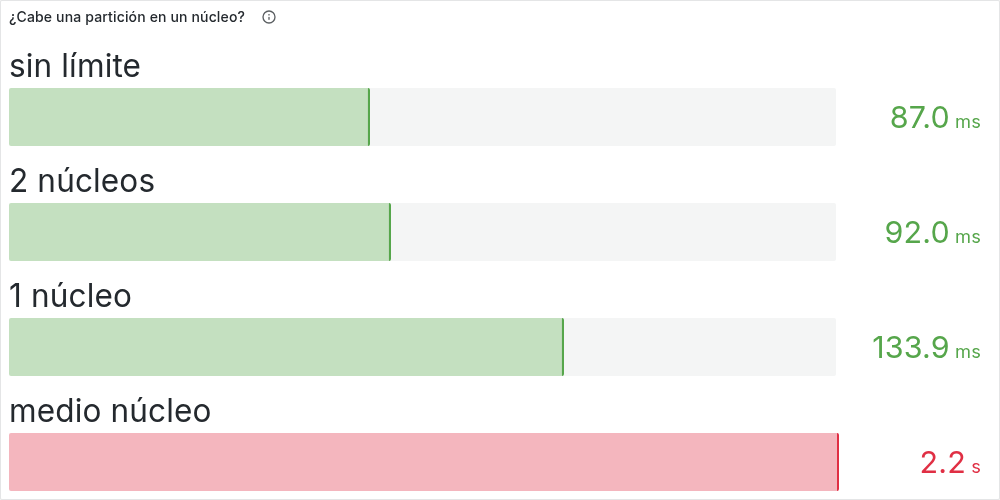

> **La cláusula se cumple, pero cuesta.** Con un núcleo por partición el sistema sostiene el contrato —133,91 ms contra 200— y con medio colapsa. El salto entre 1 y 0,5 es puro estrangulamiento del planificador. **La máquina virtual ve una sola CPU en los dos casos**, así que la diferencia no viene de cómo se dimensiona a sí misma. Viene de que el sistema operativo la suspende en cuanto agota su cuota.

**Esto corrige lo que este documento afirmaba antes.** Una versión anterior publicaba que confinar a un núcleo «no cuesta nada medible». Cuesta **+55 %**, cincuenta veces el ruido del banco. La conclusión anterior comparaba corridas de sesiones distintas sin haber establecido primero cuánto ruido tenía el instrumento.

## H2b — ¿Se cae con todo el pico en un solo activo?

**No.** H2b predecía que un activo caliente rompería el contrato antes de llegar al pico completo. Su razonamiento es impecable: las órdenes de un símbolo las atiende siempre el mismo motor, y los demás no pueden ayudarle. La predicción es la que falla.

| | Órdenes | p50 | **p95** | p99 | p99.9 | máx |
|---|---|---|---|---|---|---|
| **Cliente** | 159.300 | 13,16 ms | **155,39 ms** | 248,78 ms | 384,08 ms | 639,64 ms |
| **Motor** · espera | | 4,58 ms | **142,98 ms** | | 371,97 ms | 634,88 ms |
| **Motor** · servicio | | 4,60 ms | **27,60 ms** | | 137,98 ms | 138,24 ms |

Treinta minutos de pico contractual con el 100 % del tráfico en un símbolo, sin una sola orden perdida. La otra partición no procesó una sola orden —nunca llegó a publicar un resumen—, que es exactamente lo que el reparto por símbolo promete.

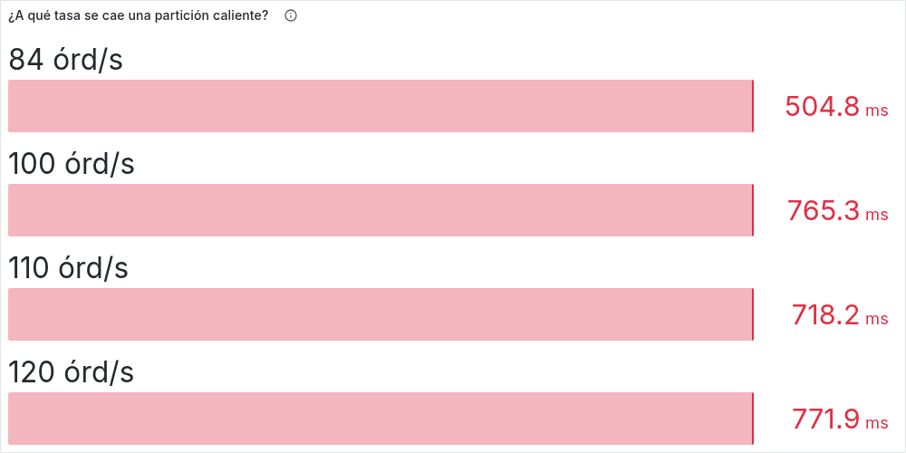

**El giro está en por qué no se cae.** Una partición caliente no es un fenómeno aparte: **es el caso N=1 con otro nombre.** Dos corridas ponen 84 órdenes por segundo sobre un único hilo escritor. Una reparte 36 activos en una sola partición; la otra concentra todo el tráfico en un activo:

| | p95 | espera p95 | Ocupación |
|---|---|---|---|
| Una partición, 36 activos | 166,30 ms | 143,49 ms | 67 % |
| Dos particiones, **un** activo caliente | 155,39 ms | 142,98 ms | 67 % |

Las dos aterrizan a 11 ms de distancia porque están haciendo exactamente lo mismo: **un escritor a 67 % de ocupación**. Y 67 % está por debajo del 73 % donde se quiebra. Por eso aguanta — no por holgura del diseño, sino porque el pico contractual, aun concentrado, no llega al punto de quiebre de un solo motor.

> **H2b no describe un modo de falla distinto: describe la ley de H2 vista desde el peor reparto posible.** El activo caliente no cambia dónde está el quiebre, cambia cuántos motores lo comparten — y concentrar el tráfico deja el número en uno.

**Dónde sí se cae.** Subiendo la tasa sobre el activo caliente, la latencia se dispara igual de rápido que en el caso N=1: **604 ms a 100 órdenes por segundo**, 625 a 110 y 772 a 120. El quiebre queda justo encima del pico contractual, donde la ley de H2 lo pone.

La sonda corta a 84 no se puede usar para ubicarlo: perdió 131 órdenes, lo que baja su cifra a un p94,0, y además marcó 341 ms donde la fase larga marcó 155. La culpable es la rampa —la sonda llega al pico en 30 segundos y la fase contractual se toma dos minutos—, y por eso el veredicto lo dicta la fase larga.

## El entregable: cuánto puede costar una orden

Este es el número verificable, el que no depende del supuesto de los 8 ms. Se barrió el costo por orden hasta encontrar dónde el criterio deja de cumplirse.

**Con el pico repartido entre dos particiones:**

| Costo por orden | **p95 del cliente** | espera p95 | servicio p50 | |
|---|---|---|---|---|
| 5 ms | 25,33 ms | 14,05 ms | 2,88 ms | ✅ |
| 10 ms | 132,97 ms | 95,74 ms | 5,76 ms | ✅ |
| **12 ms** | **192,30 ms** | 155,01 ms | 6,90 ms | ✅ el último que pasa |
| **13 ms** | **211,26 ms** | 182,40 ms | 7,48 ms | ❌ el primero que falla |
| 15 ms | 275,30 ms | 248,70 ms | 8,63 ms | ❌ |

**Con todo el pico en una sola partición:**

| Costo por orden | **p95 del cliente** | espera p95 | |
|---|---|---|---|
| 5 ms | 67,11 ms | 47,97 ms | ✅ |
| **8 ms** | **166,92 ms** | 151,17 ms | ✅ el último que pasa |
| **9 ms** | **250,88 ms** | 236,16 ms | ❌ |
| 10 ms | 410,93 ms | 392,96 ms | ❌ |

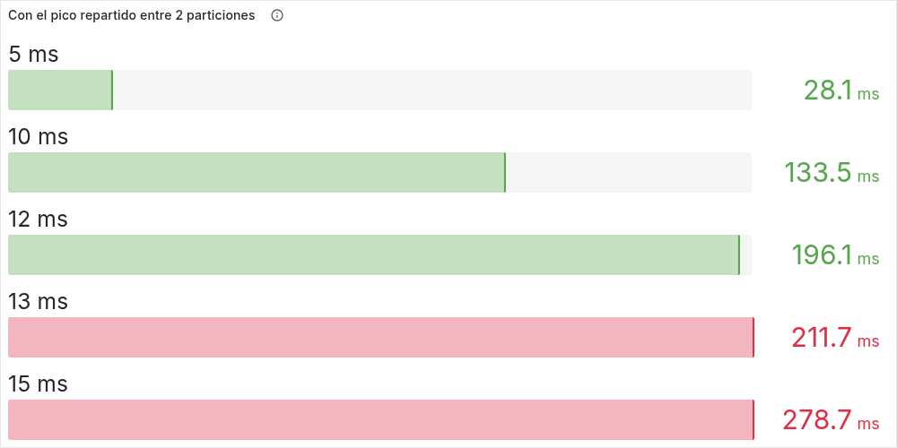

> **Presupuesto: 12,4 ms por orden repartiendo, 8,4 ms concentrando.** Los dos acotados por medición, no por extrapolación.

**Y aquí vuelve el hallazgo de H2.** Repartir el pico entre dos particiones sube el presupuesto de 8,4 a 12,4 ms. Eso es **1,48×, no 2×** — y la razón está en la columna de servicio, que sube con `S` y no baja con las particiones. Bajar la ocupación acorta la fila, pero el tiempo de servicio es latencia también.

> **Corolario:** ninguna cantidad de particiones permite que una orden que cuesta 200 ms cumpla un contrato de 200 ms. El particionamiento es la herramienta contra la **espera**, no contra el **costo por orden**.

## Por qué creerle a este instrumento

**El motor reproduce el modelo que declara.** El costo por orden se muestrea de una mezcla de tres clases: 90 % baratas, 9 % seis veces más caras y 1 % treinta veces más caras. Con S = 8 ms eso implica costos de 4.598, 27.586 y 137.931 µs. El histograma del motor, medido sobre 14.638 órdenes reales, publica:

```
servicio p50=4603us  p95=27599us  p99.9=137983us
```

Tres puntos de la distribución declarada, reproducidos dentro de la resolución del histograma. **Y ese `servicio p95` sale en 27,60 ms en veintisiete de las treinta corridas que declararon 8 ms**, sin importar cuántas particiones ni cuánta carga. Solo se mueve en tres, y las tres se explican solas: con media CPU por partición sube a 89 ms, y en las dos corridas que ahogaron la máquina —cuatro particiones más novecientos clientes sobre 14 núcleos— a 32.

Es la prueba de que las diferencias que esta página reporta vienen de la cola, no de un banco que se movió por debajo.

**El ruido del banco es del 1 %.** Cuatro corridas de la misma configuración, repartidas en dos horas y media de sesión:

```
86,22 ms  (10:41)   ·   87,07 ms  (12:03)   ·   86,42 ms  (12:18)   ·   87,00 ms  (13:20)
```

Un rango de 0,85 ms sobre una media de 86,68: **±0,5 %**. De ahí sale la regla de lectura: una diferencia del orden del 1 % no es señal. El +55 % del confinamiento a un núcleo y el +19 % de la bitácora en serie sí lo son, por dos órdenes de magnitud.

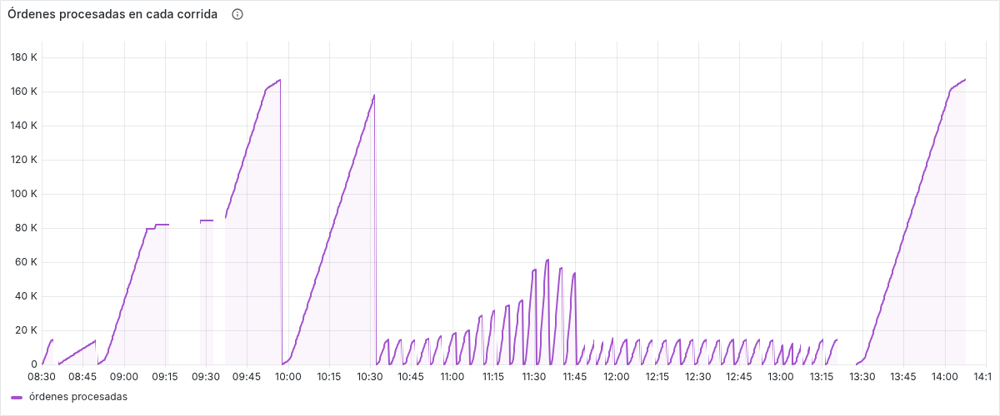
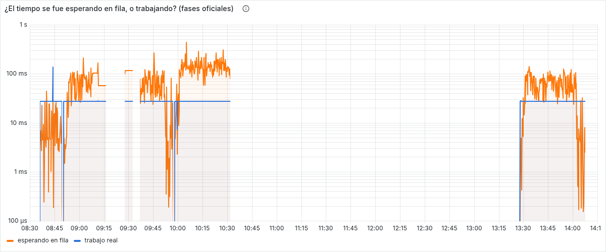

**Y el reparto nunca falló.** Cero violaciones de reparto, cero órdenes rechazadas y cero respuestas con error: cada símbolo lo respondió siempre la misma partición. También en las doce corridas que empujaron al motor más allá de su techo y le perdieron órdenes al generador.

## ¿Depende el resultado de la forma del costo?

La mezcla de tres clases está **acotada por construcción**: ninguna orden puede costar más de 30 veces la media. La lógica real no tiene esa cota. Se repitió la corrida con una distribución continua y sin tope, con la misma media y la misma variabilidad, de modo que lo único que cambia es la forma.

| | mezcla (acotada) | lognormal (sin tope) | |
|---|---|---|---|
| p95 del cliente | 86,42 ms | 58,43 ms | −32 % |
| p99 | 143,31 ms | 149,20 ms | +4 % |
| **p99.9** | **222,63 ms** | **370,95 ms** | **+67 %** |
| **servicio máximo de una orden** | **138,1 ms** | **580,1 ms** | **+320 %** |

**El veredicto del contrato es robusto a la forma:** 86 y 58 ms, los dos muy por debajo de 200. La conclusión sobre ASR-03 deja de depender de una decisión de modelado, y eso la hace más fuerte.

**La cola no lo es.** La mezcla topa en 138 ms de servicio porque así se construyó; la lognormal produjo **una sola orden de 580 ms**, bloqueando al único escritor durante más de medio segundo. Es un evento que la mezcla es incapaz de generar. Por lo tanto, la violación del percentil 99,9 que se reporta abajo es **un piso, no una cota**.

## ¿Qué causa los atascos de cientos de milisegundos?

El motor registra atascos aislados que ninguna ventana muestra: en la corrida instrumentada, **una orden esperó 298,5 ms** con la mediana en 4,7 ms. Un solo evento así incumple el contrato por sí mismo. Los tres sospechosos naturales viven dentro de la máquina virtual, así que se grabó la corrida con el perfilador de la propia plataforma.

| Qué se buscó | Evento más largo |
|---|---|
| Pausas del recolector de basura | **0,022 ms** |
| Operaciones internas que detienen la ejecución | **0,689 ms** |
| Puntos de parada de los hilos | **0,315 ms** |

> **La máquina virtual queda descartada por un factor de 433.** El atasco fue de 298,5 ms; lo más largo que la plataforma detuvo la ejecución fue 0,689 ms.

**Qué queda, por eliminación.** Si el atasco no aparece en la grabación, es que la máquina virtual **no estaba corriendo** durante esos 298 ms: algo la desprogramó desde fuera. Los candidatos son la máquina virtual de Docker y el planificador del anfitrión. El estudio de confinamiento apunta en la misma dirección — con media cuota, el planificador produjo esperas de más de dos segundos por el mismo mecanismo.

Es atribución por eliminación, no medición directa. Confirmarlo exige instrumentar el anfitrión, y eso pertenece al banco de tres nodos. **La grabación no distorsionó la medida:** 87,00 ms con el perfilador activo, contra 86,22 · 86,42 · 87,07 sin él.

## Lo que esta evidencia no prueba

- **Los 8 ms por orden son una hipótesis, no una medición.** Lo que las corridas demuestran es que *si* una orden costara 8 ms, el contrato se cumple. El número a verificar cuando la lógica exista es el presupuesto: **12,4 ms**.
- **El percentil 99,9 excede el contrato en el pico, y la cifra medida es un piso**: 384,08 ms con el activo caliente, contra 200. El contrato es sobre el percentil 95 y se cumple, pero una de cada mil órdenes lo excede. Con una distribución sin cota, empeora al menos un 67 %.
- **El 73 % de ocupación está medido con 8 ms por orden**, no es una constante del patrón. El límite de 200 ms es absoluto, y el eje de tiempo entero escala con el costo por orden.
- **Una sola máquina, por bucle local.** No representa la red de 1 Gbps del banco de tres nodos ni la alta disponibilidad. **Valida el patrón, no el dimensionamiento.**
- **Una repetición por punto de medida**, salvo los cuatro que fijan el ruido. Los efectos reportados son grandes frente a ese ±0,5 %, pero un solo punto no distingue un efecto de una casualidad.
- **La latencia por encima del quiebre no está medida.** Pasado el techo el generador deja de emitir órdenes, y lo que descarta son las de los peores momentos: el p95 que reporta es en realidad un p79 o un p69. Esas corridas sirven para leer dónde está el quiebre, nunca cuánto se degrada después.
- **El freno de entrada sigue sin probarse.** Ni el anillo del motor ni la fila del router se acercaron a su límite en ninguna corrida — ni siquiera en las que perdieron veinte mil órdenes. Que no se hayan activado no dice nada sobre si protegen.
- **Los atascos del anfitrión están atribuidos por eliminación**, no medidos.
- **El perfil corto sobrestima cuando la rampa es abrupta.** La sonda de cuatro minutos y medio llega al pico en 30 segundos; la fase contractual se toma dos minutos. En la partición caliente esa diferencia dio 341 ms contra 155 ms **con la misma configuración**. Las sondas cortas ubican el quiebre; las fases largas dictan el veredicto.

## Cómo repetir todo esto

```bash
make plan                    # las 40 corridas y a qué hipótesis sirve cada una
make experimento             # el plan completo, de punta a punta (~4h20m)
make grupo G=h2-quiebre      # solo un grupo
make tablero                 # la corrida, en vivo
```

Cada corrida archiva su salida cruda, el registro de las particiones y la línea de procedencia que el propio motor escribió al arrancar, en `load/k6/results/e01-<marca de tiempo>/`. Al lado queda `resultados.tsv` con una fila por corrida.

**Ninguna cifra de esta página se lee sin su costo por orden al lado.** Por eso el motor lo escribe en su primera línea de registro y el tablero lo muestra pegado al veredicto. Y por eso el orquestador **aborta la corrida** cuando lo que el motor declara no coincide con lo que el plan pidió.

Con qué: Java 21, Docker Compose, k6 como generador, Prometheus y Grafana, y una máquina de 14 CPU. El diseño que se puso a prueba está en la [ficha del experimento](experimento.html); qué corre cada una de las cuarenta, en el [diseño del experimento](diseno-experimento.html); cómo está construido lo que las ejecuta, en [Implementación](implementacion.html).
