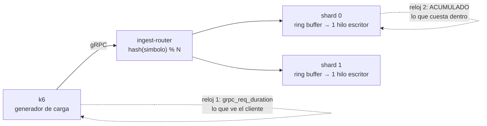
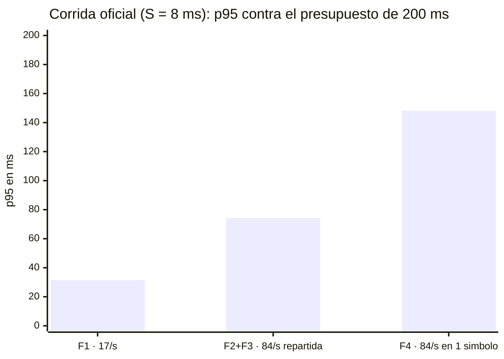

# Evidencia de corridas — Experimento E01

Esta página es la **evidencia externa** del experimento E01, enlazada desde la pestaña Experiments de Helix. Contiene qué se probó, los resultados y las salidas crudas.

---

## 1. Qué se probó

### El sistema

Un motor de emparejamiento construido con el **patrón LMAX**: el libro de órdenes vive en memoria y **un solo hilo escritor** por partición lo modifica, sin locks. Las órdenes entran por gRPC a un router que las reparte entre N particiones con `hash(símbolo) % N`.



### La pregunta

> ¿Sostiene este diseño **p95 ≤ 200 ms** con el pico contractual de 5.000 emparejamientos/minuto (≈ 84 órdenes/s), y sigue sosteniéndolo si todo el pico cae en una sola partición?

### El obstáculo, y cómo se resolvió

El PoC **no implementa la lógica de negocio**: no hay validación, control de riesgo, saldos, tipos de orden, comisiones ni generación de trades. Solo un cruce sobre un `TreeMap` que cuesta ~13 µs.

Eso no es un detalle: en un diseño de un único escritor **el costo por orden se serializa**, así que fija el techo de la partición (`techo = 1/S`, con `ρ = λ·S`). Medir la capacidad con 13 µs mide un `TreeMap`, no un motor de emparejamiento.

La solución es tratar ese costo como **parámetro declarado del experimento** — la variable `BIZ_MICROS`, o **S** — y responder con un **presupuesto** en vez de con un número:

> No «el sistema responde en X ms», sino «**el sistema cumple el ASR mientras procesar una orden cueste menos de S ms**».

Esa afirmación es falsable sin conocer todavía la lógica real: cuando exista, se mide su costo y se compara.

**S es una media, no el costo de cada orden.** La lógica de negocio real no responde siempre igual: la mayoría de las órdenes son límite baratas que no cruzan, unas pocas barren varios niveles y generan varios trades, y una fracción mínima dispara cascadas. El modelo (`BusinessLogicModel`) reproduce esa forma con una **mezcla de tres clases** — 90 % ×1, 9 % ×6, 1 % ×30 — que a S = 8 ms significa que **una orden cuesta 4,6 / 27,6 / 138 ms según su clase**, con un Cs² de 3,34. Una constante daría Cs² = 0 y una exponencial 1: el modelo es *más* variable que una exponencial, que es lo que un motor real exhibe.

La variable `BIZ_DIST` permite además cambiar la **forma** de esa distribución manteniendo media y Cs² —ver §4.4—, para verificar que el resultado no dependa de esa elección de modelado.

### Las tres corridas y qué aporta cada una

| # | Corrida | S | La pregunta que responde |
|---|---|---|---|
| **1** | **Oficial** (`make e2e BIZ_MICROS=8000`) | 8 ms | ¿Se cumple el ASR con un costo por orden realista? |
| **2** | **Barrido** (`make sweep-service`, `sweep-hot`) | 0 → 25 ms | ¿Hasta cuánto puede costar una orden sin romper el ASR? |
| **3** | **Patrón aislado** (`make e2e`, S = 0) | 0 | ¿Cuánto cuesta el patrón LMAX por sí solo? |
| **4** | **Confinamiento** (`make compare-cpus`) | 8 ms | ¿Se sostiene el ASR con los recursos que tendría en producción? |
| **5** | **Journaling** (`make compare-journal`) | 8 ms | ¿Se puede registrar cada orden sin pagarlo en latencia? |

**Por qué S = 8 ms en la corrida oficial.** El costo depende de dónde viva la lógica de negocio:

| Escenario | Qué hace por orden | S estimado |
|---|---|---|
| **A · en proceso** | validación, riesgo, saldos y libro en memoria; sin I/O en el camino crítico — lo que el patrón LMAX propone | ~0,2 ms |
| **B · con durabilidad** | A + journaling del evento antes de responder | ~1 ms |
| **C · con I/O remoto** | riesgo y saldos consultados a un servicio o BD **en cada orden** | ~8 ms |

Se eligió **C**: el más exigente que sigue siendo arquitectónicamente plausible. Si el ASR se cumple ahí, se cumple en A y B por añadidura.

---

## 2. Veredicto

> **ASR-02 ✅** — 17 órd/s durante 12 min: **p95 = 31,51 ms** contra 200 ms de presupuesto.
> **ASR-03 ✅** — rampa a 84 órd/s, pico de 30 min y retorno: **p95 = 74,32 ms**.
> **Partición caliente ⚠️** — todo el pico en un solo símbolo: **p95 = 148,09 ms**. Cumple, con 1,35× de margen.
>
> Todo lo anterior con **S = 8 ms por orden**, sobre 418.610 órdenes, 0 rechazos y 0 violaciones de routing.

Y el resultado que no depende del S elegido:

> **Presupuesto: 12,4 ms por orden** con el pico repartido entre 2 particiones; **8,5 ms** si todo el pico cae en una sola.

**Decisión:** ADOPTAR el patrón, con la condición explícita de verificar el costo real de la lógica de negocio contra ese presupuesto cuando exista.

---

## 3. Cómo se leen los números

### Los dos relojes

Cada corrida se mide **dos veces, en dos puntos distintos**, con el mismo estadístico:

| Reloj | Qué mide | Incluye |
|---|---|---|
| `grpc_req_duration` (k6) | lo que espera el cliente | red + router + motor |
| `ACUMULADO` (motor) | lo que cuesta dentro de la partición | solo el motor |

Los dos son **percentiles verdaderos sobre toda la población** de la fase, así que **su resta es el costo de transporte**. Esa comparación es el corazón del experimento: dice qué parte del tiempo es responsabilidad del patrón y qué parte es del montaje.

### La descomposición interna

El motor parte su propio tiempo en dos:

```
total = espera + servicio
        │        └── procesar la orden: el match() + el modelo de lógica de negocio
        └── el tiempo que la orden pasó en el ring buffer antes de ser atendida
```

Sirve para decidir: si crece el **servicio**, hay que abaratar la orden; si crece la **espera**, hay que agregar particiones. Con carga baja la espera es solo el costo de despertar al hilo escritor dormido.

### Un ejemplo, descifrado

Línea real de la corrida oficial, fase F2:

```text
ACUMULADO shard=1 n=83702 total p50=4635us p95=73151us | espera p95=50079us | servicio p95=27599us
```

- `shard=1` — una de las dos particiones; la otra emite su propia línea.
- `n=83702` — órdenes procesadas por esta partición (la otra hizo 83.727: reparto 50/50).
- `total p95=73151us` — el 95 % de las órdenes se resolvió dentro del motor en menos de **73,2 ms**.
- `espera p95=50079us` — de esos 73,2 ms, **50,1 ms** fueron cola.
- `servicio p95=27599us` — y **27,6 ms** fueron trabajo real.

Contra los **74,32 ms** que midió k6 para la misma fase: el transporte aporta ~1 ms. **El motor es la latencia.**

### Tres advertencias de lectura

1. **S es la media, no el costo de cada orden.** Las órdenes individuales cuestan entre 4,6 y 138 ms con la distribución por defecto. Ver §1 y §4.4.
2. **Ninguna cifra se lee sin su S al lado.** El techo de la partición, el reparto motor/transporte y el veredicto sobre la partición caliente cambian todos con el costo por orden. Por eso el motor publica su punto de operación al arrancar y el arnés lo estampa en el nombre del directorio de resultados y en `manifiesto.txt`.
3. **El motor también emite un histograma cada 10 s**, útil para ver la *evolución* dentro de una fase. Se reporta como mediana entre ventanas con [mín–máx]. La mediana de los p95 por ventana **no es** el p95 de la población.
4. **k6 omite del resumen los contadores que nunca se incrementaron.** Su ausencia significa cero, no falta de dato. En las fases con umbral aparecen siempre explícitos.

### Entorno

Una sola máquina (macOS, Apple Silicon, 14 vCPU), Docker Compose: `ingest-router` + **N=2 shards** (`RING_SIZE=16384`, `QUEUE_CAPACITY=10000`, ZGC). Generador k6 ≥ 0.49 con gRPC nativo en el host, tráfico por loopback. Arribo **estocástico** (desplazamiento exponencial por iteración, Ca² = 0,89 medido) y 36 símbolos que el hash reparte 18/18 con N=2. **Cada fase corre sobre una topología recién levantada**, de modo que sus percentiles internos son de esa fase y solo de esa.

**Fechas:** corrida oficial, 3 de septiembre de 2026 · barridos y patrón aislado, 2 de septiembre.

---

## 4. Resultados

### 4.1 ¿Se cumple el ASR con un costo por orden realista? — corrida oficial, S = 8 ms

| Fase | Carga | Órdenes | p50 | **p95** | p99 | p99.9 | Motor p95 | Motor / total | |
|---|---|---|---|---|---|---|---|---|---|
| **F1 · ASR-02** | 17/s · 12 min · 36 símbolos | 12.241 | 7,86 ms | **31,51 ms** | 140 ms | 153 ms | 27,76 ms | 88 % | ✅ 6,3× |
| **F2+F3 · ASR-03** | 17→84/s · pico 30 min | 167.429 | 5,61 ms | **74,32 ms** | 141 ms | 231 ms | 73,15 ms | 98 % | ✅ 2,7× |
| **F4 · partición caliente** | 84/s en 1 símbolo | 167.429 | 11,27 ms | **148,09 ms** | 243 ms | 352 ms | 147,07 ms | 99 % | ⚠️ 1,35× |
| F4-explore @250/s | 1 símbolo · 5 min | 23.183 | 6,14 s | **6,97 s** | 7,56 s | 7,86 s | 6,97 s | ~100 % | ❌ saturado |
| F4-explore @500/s | 1 símbolo · 5 min | 23.983 | 6,24 s | **7,03 s** | 7,58 s | 7,90 s | 7,04 s | ~100 % | ❌ saturado |
| F4-explore @1000/s | 1 símbolo · 5 min | 24.345 | 6,27 s | **7,03 s** | 7,57 s | 7,89 s | 7,03 s | ~100 % | ❌ saturado |

**418.610 órdenes**, 100 % de checks correctos, 0 rechazos por backpressure, 0 violaciones de routing. Las dos fases oficiales pasaron sus cuatro umbrales.



### 4.2 ¿Hasta cuánto puede costar una orden? — barrido de S

Se recorre S manteniendo todo lo demás fijo, y se busca el punto donde el p95 cruza los 200 ms.

**Con el pico repartido entre 2 particiones** (perfil de ASR-03; ρ sobre las 42 órd/s que recibe cada una):

| S | ρ | **k6 p95** | Motor p95 | Espera p95 | Servicio p50 | Descartes | |
|---|---|---|---|---|---|---|---|
| 0 | ~0 | **6,31 ms** | 239 µs | 187 µs | 19 µs | 0 | ✅ |
| 5 ms | 0,21 | **25,48 ms** | 22,45 ms | 13,69 ms | 2,88 ms | 0 | ✅ |
| 10 ms | 0,42 | **126,65 ms** | 126,46 ms | 101,06 ms | 5,75 ms | 0 | ✅ |
| **12 ms** | **0,50** | **186,02 ms** | 191,99 ms | 167,55 ms | 6,90 ms | 0 | ✅ |
| **13 ms** | **0,55** | **219,58 ms** | 218,88 ms | 194,18 ms | 7,48 ms | 0 | ❌ |
| 14 ms | 0,59 | **242,88 ms** | 242,82 ms | 222,46 ms | 8,05 ms | 0 | ❌ |
| 15 ms | 0,63 | **264,78 ms** | 266,75 ms | 246,02 ms | 8,63 ms | 0 | ❌ |
| 20 ms | 0,84 | **676,59 ms** | 717,31 ms | 692,22 ms | 11,50 ms | 0 | ❌ |
| 25 ms | 1,05 | **5,48 s** | 6,11 s | 6,08 s | 14,38 ms | 365 | ❌ |

> **Presupuesto ≈ 12,4 ms/orden**, acotado por medición: **12 ms pasa con 186 ms y 13 ms falla con 220 ms**.

Los puntos de 12, 13 y 14 ms afinan el cruce del umbral. El punto de 15 ms, repetido en otra instancia de contenedores y con horas de diferencia, dio 266,89 contra 264,78 ms (0,8 %): la medición es reproducible.

**Con todo el pico en una sola partición** (peor distribución posible):

| S | 0 | 1 ms | 5 ms | 8 ms | 10 ms | 12 ms |
|---|---|---|---|---|---|---|
| **k6 p95** | 5,93 ms | 7,87 ms | 65,59 ms | 148,19 ms | 346,43 ms | 2,68 s |
| | ✅ | ✅ | ✅ | ✅ | ❌ | ❌ |

> **Presupuesto ≈ 8,5 ms/orden.**

Los tres escenarios de la sección 1 caben en el presupuesto de N=2: **A consume el 1,6 %, B el 8 %, C el 63 %.**

### 4.3 ¿Cuánto cuesta el patrón por sí solo? — S = 0

Misma secuencia con la lógica de negocio apagada: el motor solo ejecuta el `match()` de 13 µs. Mide el **costo propio del patrón**, no un motor real.

| Fase | Órdenes | p95 (k6) | Motor p95 | Espera p95 | Servicio p50 |
|---|---|---|---|---|---|
| F1 · 17/s | 12.240 | 7,54 ms | 272 µs | 207 µs | 27 µs |
| F2+F3 · pico 84/s | 167.429 | 4,58 ms | 174 µs | 148 µs | 10 µs |
| F4 · 84/s en 1 símbolo | 167.429 | 4,00 ms | 149 µs | 133 µs | 6 µs |
| F4-explore @250/s | 39.539 | 3,54 ms | 127 µs | 110 µs | 2 µs |
| F4-explore @500/s | 77.038 | 2,03 ms | 73 µs | 67 µs | ≤1 µs |
| F4-explore @1000/s | 152.039 | 1,20 ms | 46 µs | 43 µs | ≤1 µs |

615.714 órdenes, 0 rechazos, **0 violaciones de routing** sobre las 179.669 de F1 y F2 — el aislamiento del sharding verificado en vivo.

Lo que esta corrida establece y sigue en pie:

- **El patrón cuesta microsegundos, y tres cuartas partes son despertar un hilo.** A 17/s, 207 de los 272 µs (**76 %**) son el costo de despertar al hilo escritor dormido bajo `BlockingWaitStrategy`; el trabajo real son 13 µs. Es la mayor palanca de latencia que queda en el motor *cuando la lógica de negocio es barata*; con S = 8 ms es ruido.
- **F3 drena por debajo del baseline.** La espera interna vuelve a 137 µs contra los 203 µs de F1: la escalabilidad transitoria que exige ASR-03 se absorbe sin dejar deuda.
- **Atascos aislados de cientos de milisegundos.** En F2 una orden tardó 300 ms en procesarse y otra esperó 375 ms en el ring buffer, con el p99.9 de la fase en 1,74 ms. Un solo evento así incumple el SLA, y **no se puede atribuir a GC, JIT o contención del host sin JFR**, declarado en el diseño y no implementado.

### 4.4 ¿Depende el resultado de la forma de la distribución? — A/B de forma

La mezcla de tres clases es discreta: solo existen tres costos posibles y nada entre ellos, mientras la lógica real sería continua. Para saber si esa simplificación cambia el veredicto, se corre la misma fase con una **lognormal** —el modelo estándar de tiempos de servicio, continua y **sin cota superior**— construida con la **misma media y el mismo Cs²**. Así el A/B varía solo la forma.

Verificación previa de que las dos son comparables (500.000 muestras, fuera del contenedor):

| | media | Cs² | p50 | p95 | p99 | max | valores distintos |
|---|---|---|---|---|---|---|---|
| mezcla | 8.011 µs | 3,327 | 4.598 | 27.586 | 27.586 | 137.931 | **3** |
| lognormal | 8.019 µs | 3,369 | 3.833 | 28.195 | 64.735 | 756.134 | **489.203** |

Resultado sobre la fase F2 (perfil corto, N=2, 84 órd/s, S = 8 ms, 14.639 órdenes cada una):

| | Mezcla | Lognormal | Δ |
|---|---|---|---|
| k6 p50 | 5,82 ms | 7,35 ms | +26 % |
| **k6 p95** | **74,7 ms** | **63,3 ms** | **−15 %** |
| k6 p99 | 140,95 ms | 148,59 ms | +5 % |
| **k6 p99.9** | **266,35 ms** | **326,54 ms** | **+23 %** |
| servicio p50 | 4.603 µs | 3.877 µs | −16 % |
| servicio p99.9 | 137.983 µs | 169.343 µs | +23 % |
| **servicio max** | **138.111 µs** | **369.407 µs** | **+167 %** |

Tres lecturas:

**El veredicto del ASR es robusto a la forma.** 74,7 y 63,3 ms, ambos muy por debajo de 200. La conclusión sobre ASR-03 se sostiene bajo las dos distribuciones, así que **deja de depender de una decisión de modelado** — es más fuerte que antes, no más débil.

**Pero la forma sí importa en los percentiles altos.** Con los dos primeros momentos idénticos, el p95 se movió 15 % y el p99.9 un 23 %. La aproximación de Kingman —«solo importan la media y el Cs²»— es de primer orden: se sostiene para la media, no para la cola, que es justo donde vive el SLA.

**Y la mezcla subestima la cola.** Está **acotada por construcción** en 30× la media (138 ms de servicio máximo); esa cota es artificial y la lógica real no la tiene. La lognormal produjo una orden de **369 ms de servicio**, un solo evento bloqueando al único escritor más de un tercio de segundo. La violación del p99.9 documentada en §6 es, por tanto, un **piso**: con colas sin cota empeora al menos un 23 %.

### 4.5 ¿Se puede registrar cada orden sin pagarlo en latencia? — journaling

H1 afirma que el patrón sostiene el p95 «con el journaling fuera del camino crítico». La cláusula nunca se probó porque el PoC no registraba nada. El Disruptor admite las dos disposiciones que la afirmación contrasta, y la diferencia entre ellas **es** la afirmación.

En **paralelo** —`handleEventsWith(journal, matcher)`— los dos consumidores leen la misma secuencia por separado. El registro no suma latencia al cliente, pero el matcher responde sin esperar al disco: **el acuse no garantiza durabilidad**. En **serie** —`handleEventsWith(journal).then(matcher)`— se invierte el trato: el acuse implica durabilidad y el journal entra al camino crítico.

Ninguna es la correcta. Son dos contratos distintos con el cliente, y esto mide el precio de cada uno.

| Modo | k6 p95 | **Total p50** | **Espera p50** | Journal p50 | Journal p95 | Órd/fsync |
|---|---|---|---|---|---|---|
| `off` | 78,00 ms | **4.663 µs** | **44 µs** | — | — | — |
| `paralelo` | 82,17 ms | **4.707 µs** | **85 µs** | 516 µs | 2.067 µs | 1,0 |
| `serie` | 73,03 ms | **5.899 µs** | **909 µs** | 529 µs | 3.643 µs | 1,0 |

**El p95 no responde la pregunta.** `serie` salió más rápido que `off`, y eso es mecánicamente imposible: añadir escritura sincrónica al camino crítico no acelera nada.

Seis corridas de esta configuración dan 73,0 / 74,7 / 78,0 / 78,0 / 79,2 / 82,2 ms: un rango del 12,5 %. El journal cuesta 516 µs, apenas el 11 % del tiempo de servicio, y se ahoga en esa dispersión.

**La mediana sí.** Es mucho menos ruidosa y separa los tres modos sin ambigüedad. La espera mediana pasa de 44 µs a 85 con el journal en paralelo, y a **909 µs** con el journal en serie. Los 909 µs cuadran con el mecanismo: en serie cada orden espera a que se registre la anterior.

> **La cláusula de H1 queda probada.** En paralelo el journaling cuesta el **0,9 %** de la latencia mediana del motor; en serie cuesta el **26,5 %**. Un factor de **29×** entre las dos disposiciones, que es justo lo que el patrón predice.

**El fsync no se amortiza a carga contractual.** El `force()` se hace una vez por lote y no por evento, que es el diseño de LMAX.

Pero `ordenes_por_fsync = 1,0` en ambos modos. El journaler es más rápido que el matcher, así que a 42 órd/s nunca se rezaga y cada despertar le trae un solo evento. **El lote solo crece cuando el consumidor va detrás**, es decir bajo saturación.

Está pagando entonces un fsync entero por orden. Eso refina la lectura de H1: la afirmación defendible no es «el journaling es barato» —cuesta 516 µs, el 11 % del servicio— sino «**el journaling no está en el camino crítico**». Son cosas distintas y solo la segunda se sostiene.

**Con un consumidor en paralelo, ningún consumidor puede mutar el evento.** `MatchingHandler` limpiaba el slot al terminar; con el journaler leyendo la misma entrada, eso anula `symbol` y `orderId` bajo sus pies.

El slot pertenece al ring hasta que todos pasaron, así que la limpieza se movió a un manejador encadenado al final. La restricción no existía mientras hubo un solo consumidor: **apareció al construir el experimento**.

---

## 5. Hallazgos

### 5.1 Con lógica de negocio realista, el motor **es** la latencia

| | Con S = 0 | Con S = 8 ms |
|---|---|---|
| Motor / total (F1) | 3,6 % | **88 %** |
| Motor / total (F4) | 3,7 % | **99 %** |

Con la lógica apagada, el 96 % del tiempo era transporte —gRPC, el router, la red virtualizada de Docker en macOS— y la conclusión natural era «esto mide el montaje, no el motor». Es cierto **solo con S = 0**. Ya con S = 5 ms el motor explica el 88 %, y desde S = 10 ms el transporte es ruido.

La lectura correcta se invierte: *con la lógica apagada se mide la VM de Docker; con lógica realista se mide el patrón.* De ahí que `BIZ_MICROS` sea hoy un parámetro obligatorio y registrado de cada corrida.

### 5.2 El sistema no se degrada: cae por un acantilado

Entre S = 0 y S = 25 ms, el **servicio crece lineal** (19 µs → 14,4 ms, exactamente lo configurado) mientras la **espera crece 32.500×** (187 µs → 6,08 s). No hay degradación suave al acercarse ρ a 1: entre 15 y 20 ms el p95 se multiplica por 2,6 con solo un tercio más de costo por orden.

Consecuencia práctica: **el margen no avisa**. Un sistema con p95 = 127 ms a S = 10 ms parece tener holgura, y a S = 15 ms ya incumple.

### 5.3 Se degrada por latencia, nunca por rechazo

**0 rechazos por backpressure en las 24 corridas**, incluso con la cola en 7 segundos y ρ = 8. A ρ = 1,05 el déficit es de ~2 órdenes/s y llenar un ring de 16.384 tomaría horas.

**El criterio de «0 rechazos», por sí solo, no protege de nada.** Lo que delata la saturación son los descartes del generador (365 a S = 25 ms; 127.694 a 1.000 órd/s), no el backpressure del motor.

### 5.4 La partición caliente sí degrada — y el techo es medible

Misma tasa, mismo S; lo único que cambia es la distribución de símbolos:

| | 84/s repartida 18/18 | 84/s en 1 símbolo | |
|---|---|---|---|
| k6 p95 | 74,32 ms | **148,09 ms** | ×2,0 |
| espera p95 | 50,08 ms | **137,09 ms** | ×2,7 |
| servicio p95 | 27,60 ms | 27,60 ms | invariante |

Con S = 0, F4 salía *más rápida* que F2 (4,00 contra 4,58 ms) y la hipótesis parecía no manifestarse. Con lógica realista, la partición caliente **duplica el p95**. Sigue cumpliendo el ASR, con 1,35× de margen en vez de los 50× que aparentaba.

**Y el techo de una partición es `1/S` = 125 órd/s**, confirmado por saturación: ofreciendo 250, 500 y 1.000 órd/s el motor entregó 23.183, 23.983 y 24.345 órdenes. Cuadruplicar la carga entregó un 5 % más de trabajo; el resto se convirtió en descartes. El pico contractual ocupa el **67 % de una sola partición**. La cifra de «techo no alcanzado a 1.000 órd/s» de la corrida con S = 0 era una propiedad del `TreeMap`.

### 5.5 Shardear reduce la espera, nunca el servicio

El presupuesto crece con N pero **sub-linealmente**: 8,5 ms con todo el pico en una partición, 12,4 ms repartido entre dos. Eso es **1,46×**, no el 2× que sugiere repartir la carga a la mitad.

**No es una pérdida de eficiencia: es aritmética del SLA.** Repartir la carga baja ρ y con ello la espera en cola, pero el tiempo de servicio **es latencia también**, y subir el presupuesto lo sube directamente. Con N=2 y S = 17 ms (el doble de 8,5) tendríamos ρ = 0,714, idéntico al del caso caliente — pero la latencia media sería 107 ms en lugar de 53, porque cada orden cuesta el doble. **Mismo ρ no significa misma latencia.**

Los dos montajes están sobre la misma curva. La razón entre el p95 y la media cae al subir ρ, y el punto de partición caliente cae exactamente donde su ρ lo coloca:

| Caso | ρ | Media (Kingman) | p95 medido | p95/media |
|---|---|---|---|---|
| N=2 · S=12 ms | 0,504 | 37,8 ms | 186,0 ms | 4,92 |
| N=2 · S=13 ms | 0,546 | 46,1 ms | 219,6 ms | 4,77 |
| N=2 · S=14 ms | 0,588 | 56,3 ms | 242,9 ms | 4,32 |
| N=2 · S=15 ms | 0,630 | 69,0 ms | 266,9 ms | 3,87 |
| N=2 · S=16 ms | 0,672 | 85,3 ms | 313,3 ms | 3,67 |
| **caliente · S=8,5 ms** | **0,714** | **53,4 ms** | **200 ms** | **3,75** |

A ρ bajo la cola la dicta la **distribución del servicio** (Cs² = 3,34, con una clase 30× más cara que la mediana); a ρ alto la dicta el **encolamiento**, que la suaviza. No hay dos regímenes distintos: es el mismo sistema en dos puntos de la misma curva.

> **Corolario práctico:** ninguna cantidad de particiones permite que una orden que cuesta 200 ms cumpla un SLA de 200 ms. A medida que S se acerca al presupuesto, shardear deja de comprar nada. Sharding es la herramienta contra la **espera**, no contra el **costo por orden**.

### 5.6 Una partición nunca pidió más de un núcleo

H2 afirma que el patrón sostiene el ASR «sin exigir más de un núcleo por partición». Medido durante F2 con S = 8 ms, muestreando cada contenedor cada 2 s (100 % = un núcleo):

| Contenedor | CPU media en el pico | CPU máx |
|---|---|---|
| `matching-shard-0` | 23,6 % | 58,3 % |
| `matching-shard-1` | 23,6 % | 46,9 % |
| `ingest-router` | 3,2 % | 13,4 % |

**La cláusula se cumple, y por una razón estructural.** A 42 órd/s por partición con 8 ms por orden, el trabajo es 336 ms de CPU por segundo = 33,6 % de un núcleo. Extrapolando a las 125 órd/s del techo `1/S`, daría exactamente **100 %**. Es decir: **el techo de throughput y el límite de un núcleo por partición son el mismo hecho**. En un diseño de único escritor, saturar el hilo *es* saturar un núcleo. H2 no se cumple por suerte: se cumple por construcción.

#### De observación a restricción

Lo anterior dice que el sistema *resultó* usar menos de un núcleo corriendo suelto sobre 14 vCPU — cosa que ningún despliegue real hace. Para convertirlo en una condición que el sistema debe cumplir, se repitió F2 confinando cada partición con una cuota de cgroup:

| Cuota | `availableProcessors` | **k6 p95** | k6 p99 | espera p95 | servicio p50 | |
|---|---|---|---|---|---|---|
| sin límite | 14 | **79,22 ms** | 143,55 ms | 53,7 ms | 4.607 µs | referencia |
| 2,0 núcleos | 2 | **85,73 ms** | 142,88 ms | 58,7 ms | 4.607 µs | dentro del ruido |
| **1,0 núcleo** | **1** | **81,05 ms** | 143,26 ms | 61,6 ms | 4.607 µs | **dentro del ruido** |
| 0,5 núcleos | 1 | **136,67 ms** | 199,93 ms | 108,0 ms | 4.607 µs | ❌ **+72 %** |

Verificado en el cgroup con `docker inspect` en cada punto (`NanoCpus` = cuota × 10⁹), no solo declarado en el YAML: `deploy.resources` **se ignora en silencio** fuera de Swarm, así que usar esa clave habría dado una restricción inexistente. El motor registra además su `availableProcessors`, que es lo que decide cuántos hilos levantan ZGC, el compilador JIT y el executor de gRPC.

> **Confinar cada partición a un solo núcleo no cuesta nada medible.** La cláusula de H2 pasa de observación a **restricción cumplida**: el sistema sostiene el ASR con `cpus=1.0` por partición.

Los tres primeros puntos están dentro del ±3 % de ruido de §5.7 —el de 1,0 salió *mejor* que el de 2,0, lo que no tiene mecanismo posible y confirma que ahí solo hay dispersión—. El de 0,5 es el control negativo: **debía** morder, porque el pico de uso observado es 0,58 núcleos, y mordió sin ambigüedad.

**El mecanismo del estrangulamiento, en los percentiles internos:**

| | Sin límite | 0,5 núcleos | |
|---|---|---|---|
| `servicio p50` | 4.607 µs | 4.607 µs | sin cambio |
| `servicio p95` | 27.599 µs | 27.615 µs | sin cambio |
| `servicio p99.9` | 137.983 µs | **183.423 µs** | +33 % |
| `servicio max` | 138.239 µs | **200.063 µs** | +45 % |
| `espera p95` | 53.695 µs | **107.967 µs** | ×2,0 |

El máximo que el modelo puede generar es 137.931 µs; sin límite el `servicio max` queda en 138.239, apenas 300 µs por encima. Estrangulado sube a 200.063: **62 ms de throttling puro sobre una sola orden.** El CFS suspende el proceso por lo que resta de su período de 100 ms, así que las órdenes baratas (4,6 ms) caben dentro de un período y casi nunca lo pagan —de ahí que p50 y p95 no se muevan— mientras las de 138 ms cruzan varios y sí. Y como el hilo recibe menos CPU en total, la cola drena más lento y la espera se duplica.

Consecuencia para el dimensionamiento: **una cuota de un núcleo por partición es suficiente y media es insuficiente**, con el punto de quiebre entre ambas y más cerca de 0,5 que de 1,0.

### 5.7 El instrumento es válido

Tres verificaciones independientes:

**El modelo de servicio entrega la distribución que declara.** Con `unit = 8.000/1,74 = 4.598 µs`, la mezcla 90/9/1 debe aparecer en tres percentiles distintos:

| Percentil | Clase de la mezcla | Predicho | Medido |
|---|---|---|---|
| p50 | 90 % · ×1 | 4.598 µs | **4.627 µs** |
| p95 | 9 % · ×6 | 27.586 µs | **27.615 µs** |
| p99 | 1 % · ×30 | 137.931 µs | **138.111 µs** |

En el barrido, la mediana teórica `0,575·S` acertó en los cinco puntos (2.875/2.883, 5.750/5.751, 8.625/8.631, 11.500/11.503, 14.375/14.375).

**El tiempo de servicio no se contamina con la carga.** `servicio p95` se mantiene entre 27,60 y 27,63 ms en las seis fases de la corrida oficial, con la tasa variando de 17 a 1.000 órd/s y la distribución pasando de 36 símbolos a uno solo — incluso en saturación completa con la cola en 7 segundos.

**El perfil corto replica al oficial, dentro de ±3 %.** F4 dio 148,09 ms contra los 148,19 ms del barrido corto al mismo S, y la fase F2 del A/B de forma dio 74,7 ms contra los 74,32 ms de la corrida oficial de 40 min.

Pero cuatro corridas de la *misma* configuración —F2 corto, S = 8 ms, sin límites— dieron 74,70 / 77,98 / 79,22 ms: una dispersión del **6 %**. El perfil corto no sesga la medición, pero **el piso de ruido con una repetición por punto es de ~±3 %**: ninguna diferencia menor a ~6 % entre dos corridas es interpretable. Eso descarta leer como señal las diferencias pequeñas de §5.6, y es el argumento más fuerte a favor de repetir cada punto en el banco TEC-2.

**El veredicto no depende de la forma de la distribución de servicio.** Con media y Cs² fijos, cambiar la mezcla discreta por una lognormal continua deja el p95 en 63,3 ms contra 74,7 — los dos muy por debajo de los 200 ms del criterio (§4.4). Lo que sí depende de la forma es la cola: ver la limitación correspondiente en §6.

### 5.8 Consecuencia: la latencia deja de mejorar con la carga

Con S = 0 el p95 **caía** al subir la tasa (7,54 → 1,20 ms): con 13 µs de trabajo por evento, más ráfaga significa más eventos por pasada del único escritor y datos calientes en caché, sin cola que pagar — lo contrario de un sistema con locks. El efecto es real y tiene mecanismo, pero **solo es visible cuando el trabajo por evento es despreciable**. Con S = 8 ms queda sepultado por el encolamiento y el sistema se comporta como predice la teoría: 31,5 → 74,3 → 148,1 ms.

---

## 6. Limitaciones

**Del entorno.** Una sola máquina, macOS con Docker en VM y **sin `cpuset`**. Sin la red real del banco TEC-2. Una sola repetición por punto, sin intervalos de confianza.

La medición de CPU (§5.6) acota cuánto puede importar: con los dos shards y el router usando ~0,5 núcleos de los 14 disponibles, **no hay escasez agregada de CPU**, así que la contención entre procesos no puede ser un factor grande. Y el experimento de confinamiento muestra que el resultado **no depende de correr sin límites**: con una cuota de un núcleo por partición el p95 no cambia.

Queda un mecanismo residual no medido: el host es Apple Silicon con 10 núcleos de rendimiento y 4 de eficiencia, y `cpuset` dentro de la VM de Docker fija el contenedor a vCPU de la VM, no a núcleos físicos del host. Nada impide que el hilo escritor termine en un núcleo de eficiencia. Eso afectaría al tiempo de servicio, no a la capacidad agregada, y **solo se resuelve en un host Linux con núcleos físicos dedicados** — es decir, en el banco TEC-2.

**Del alcance.** Tres cosas declaradas en el diseño y no implementadas, que dejan afirmaciones sin evidencia:

| Sin implementar | Qué queda sin probar |
|---|---|
| ~~Journaling~~ | ✅ **implementado y medido** (§4.5): en paralelo cuesta el 0,9 % de la latencia mediana; en serie, el 26,5 % |
| ~~CPU por proceso~~ | ✅ **medido** (§5.6): 23,6 % de un núcleo en media, 58,3 % máximo. La cláusula de H2 queda respaldada |
| **JFR** | atribuir los atascos aislados a GC, JIT o contención del host |

**De la interpretación.** Dos advertencias sobre el veredicto:

- **S = 8 ms es una hipótesis, no una medición.** Es el escenario C estimado, no el costo de una lógica de negocio real que el PoC no implementa. Lo que la corrida demuestra es que *si* el costo por orden fuera de 8 ms, el ASR se cumple. El número a verificar cuando la lógica exista sigue siendo el presupuesto de 12,4 ms.
- **El p99.9 excede el SLA en el pico, y la cifra medida es un piso**: 231 ms en F2+F3 y 352 ms en F4, contra 200 ms. El contrato es sobre p95 y se cumple, pero una de cada mil órdenes lo excede. Viene de la clase pesada del modelo —138 ms de servicio ella sola— sumada a la cola. Dos advertencias: si el contrato se endureciera a p99, S = 8 ms no alcanzaría; y como la mezcla está **acotada por construcción** en 30× la media, el A/B de forma (§4.4) muestra que con una distribución sin cota el mismo escenario da **+23 %**. La magnitud de esta violación depende de una decisión de modelado que no está medida contra la lógica real.

---

## 7. Salidas crudas

### Corrida oficial · S = 8 ms

Directorio `load/k6/results/20260902-192250-full-S8000us` · `manifiesto.txt`: `biz_micros=8000`, `commit=d5f1dae`, `k6 v2.2.0`.

```text
F1 · PHASE=f1 (oficial)
  ✓ p(95)<200 → p(95)=31.51ms · ✓ rechazos=0 · ✓ descartes=0 · ✓ routing=0 · checks 100% (12.241)
  grpc_req_duration: avg=12.83ms p(50)=7.86ms p(95)=31.51ms p(99)=139.77ms p(99.9)=152.9ms max=324.15ms
  ACUMULADO shard=1 n=6145 total p50=4715us p95=27743us p99=138111us p99.9=142719us max=153087us
            | espera p50=75us p95=3549us p99.9=129215us max=148479us | servicio p50=4627us p95=27615us p99.9=138111us max=139519us
  ACUMULADO shard=0 n=6096 total p50=4719us p95=27759us p99=138111us p99.9=141567us max=152831us
            | espera p50=78us p95=3787us p99.9=128255us max=138495us | servicio p50=4627us p95=27631us p99.9=138111us max=138239us
  ← reparto 6.145/6.096 = 50,2 %/49,8 %, el balance que los 36 símbolos producen

F2+F3 · PHASE=f2 (oficial)
  ✓ p(95)<200 → p(95)=74.32ms · ✓ rechazos=0 · ✓ descartes=0 · ✓ routing=0 · checks 100% (167.429)
  grpc_req_duration: avg=16.56ms p(50)=5.61ms p(95)=74.32ms p(99)=140.67ms p(99.9)=230.87ms max=534.19ms
  ACUMULADO shard=1 n=83702 total p50=4635us p95=73151us p99=139135us p99.9=208255us max=315391us
            | espera p50=28us p95=50079us p99.9=181119us max=310783us | servicio p50=4603us p95=27599us p99.9=137983us max=138239us
  ACUMULADO shard=0 n=83727 total p50=4635us p95=72255us p99=138751us p99.9=220287us max=366335us
            | espera p50=27us p95=48671us p99.9=197375us max=332543us | servicio p50=4603us p95=27599us p99.9=137983us max=139519us
  ← el p99.9 (231 ms extremo a extremo) excede el SLA; el p95 no

F4 · PHASE=f4 (partición caliente)
  grpc_req_duration: avg=37.12ms p(50)=11.27ms p(95)=148.09ms p(99)=242.91ms p(99.9)=351.74ms max=456.1ms
  iterations: 167429 · 0 rechazos · 0 descartes
  ACUMULADO shard=1 n=167429 total p50=10367us p95=147071us p99=241407us p99.9=349951us max=455423us
            | espera p50=3967us p95=137087us p99.9=339967us max=439039us | servicio p50=4599us p95=27599us p99.9=137983us max=138623us
  (shard=0 no emitió línea: no procesó ninguna orden — el 100 % del tráfico cayó en shard=1)
  ← misma tasa y mismo S que F2; solo cambia la distribución: espera 50→137 ms, servicio idéntico

F4-explore · techo de una partición (1/S = 125 órd/s)
  @250/s   grpc_req_duration: avg=5.15s p(50)=6.14s p(95)=6.97s p(99.9)=7.86s max=7.89s   n=23183  descartes=16356
           ACUMULADO shard=1 n=23183  total p50=6152191us p95=6971391us | espera p95=6963199us | servicio p50=4599us p95=27599us
  @500/s   grpc_req_duration: avg=5.48s p(50)=6.24s p(95)=7.03s p(99.9)=7.9s  max=7.94s   n=23983  descartes=53057
           ACUMULADO shard=1 n=23983  total p50=6250495us p95=7036927us | espera p95=7028735us | servicio p50=4599us p95=27599us
  @1000/s  grpc_req_duration: avg=5.65s p(50)=6.27s p(95)=7.03s p(99.9)=7.89s max=7.93s   n=24345  descartes=127694
           ACUMULADO shard=1 n=24345  total p50=6275071us p95=7032831us | espera p95=7028735us | servicio p50=4599us p95=27599us
  ← cuadruplicar la carga ofrecida entrega un 5 % más de trabajo: la partición está saturada
  ← `servicio p50/p95` idéntico en las seis fases: el tiempo de servicio no se contamina con la carga
```

### Patrón aislado · S = 0

```text
F1     ✓ p(95)=7.54ms · 0 rechazos · 0 descartes · 0 routing · 12.240 órdenes
       grpc_req_duration: avg=4.48ms p(50)=4.23ms p(95)=7.54ms p(99)=10.59ms p(99.9)=49.58ms max=143.78ms
       ACUMULADO shard=0 n=6131 total p50=131us p95=274us p99=581us p99.9=1655us max=18799us
                 | espera p50=97us p95=209us | servicio p50=28us p95=84us max=13703us
       ACUMULADO shard=1 n=6109 total p50=131us p95=269us p99=514us p99.9=1545us max=19599us
                 | espera p50=100us p95=205us | servicio p50=26us p95=85us max=17151us

F2+F3  ✓ p(95)=4.58ms · 0 rechazos · 0 descartes · 0 routing · 167.429 órdenes
       grpc_req_duration: avg=2.7ms p(50)=2.27ms p(95)=4.58ms p(99)=7.72ms p(99.9)=50.96ms max=511.94ms
       ACUMULADO shard=1 n=83811 total p50=77us p95=174us p99.9=1550us max=191103us
                 | espera p50=64us p95=148us | servicio p50=10us p95=35us max=179455us
       ACUMULADO shard=0 n=83618 total p50=78us p95=173us p99.9=1932us max=374783us
                 | espera p50=66us p95=147us max=374783us | servicio p50=10us p95=34us max=300031us
       ← los atascos aislados: 300 ms de servicio y 375 ms de espera, con el p99.9 en 1,74 ms

F4     grpc_req_duration: avg=2.38ms p(50)=2.13ms p(95)=4ms p(99.9)=21.17ms max=290.33ms · 167.429 órdenes
       ACUMULADO shard=1 n=167429 total p50=69us p95=149us | espera p50=60us p95=133us | servicio p50=6us p95=18us

F4-explore
  @250/s   p(95)=3.54ms  n=39539   ACUMULADO total p50=46us p95=127us | servicio p50=2us p95=15us
  @500/s   p(95)=2.03ms  n=77038   ACUMULADO total p50=32us p95=73us  | servicio p50=1us p95=7us
  @1000/s  p(95)=1.20ms  n=152039  ACUMULADO total p50=22us p95=46us  | servicio p50=1us p95=3us
  ← el techo no se alcanzó: pero es el techo de un TreeMap, no el de un motor
```

### A/B de forma de la distribución · S = 8 ms, F2 perfil corto, N=2

```text
A · mezcla (make sweep-service con BIZ_DIST=mezcla)
  modelo: mezcla 90/9/1 media=8000us Cs2=3.34 techo_teorico=125 ord/s
  grpc_req_duration: avg=16.63ms p(50)=5.82ms p(95)=74.7ms p(99)=140.95ms p(99.9)=266.35ms max=360.9ms
  14.639 órdenes · 0 descartes · 0 rechazos
  ACUMULADO shard=1 n=7249 total p50=4647us p95=77439us p99=139007us p99.9=246911us max=360191us
            | espera p50=32us p95=49727us | servicio p50=4603us p95=27599us p99.9=137983us max=138111us
  ACUMULADO shard=0 n=7390 total p50=4651us p95=70207us p99=140031us p99.9=293631us max=350975us
            | espera p50=33us p95=47295us | servicio p50=4603us p95=27599us p99.9=137983us max=137983us

B · lognormal (BIZ_DIST=lognormal, misma media y mismo Cs2)
  modelo: lognormal media=8000us Cs2=3.34 sigma=1.2116 (tope 100x) techo_teorico=125 ord/s
  grpc_req_duration: avg=16.84ms p(50)=7.35ms p(95)=63.3ms p(99)=148.59ms p(99.9)=326.54ms max=370.44ms
  14.639 órdenes · 0 descartes · 0 rechazos · 0 muestras recortadas por el tope
  ACUMULADO shard=1 n=7331 total p50=5963us p95=60575us p99=148607us p99.9=323071us max=369407us
            | espera p50=32us p95=40863us | servicio p50=3877us p95=29407us p99.9=169343us max=369407us
  ACUMULADO shard=0 n=7308 total p50=5883us p95=63615us p99=146303us p99.9=329215us max=369407us
            | espera p50=33us p95=42815us | servicio p50=3879us p95=29407us p99.9=169343us max=369407us
  ← `servicio max=369407us`: una sola orden bloqueó al único escritor 369 ms.
     La mezcla no puede producir eso: topa en 138 ms por construcción.
```

### Journaling · S = 8 ms, F2 perfil corto, N=2

```text
off       grpc_req_duration: p(95)=78ms p(99)=141.45ms
          ACUMULADO shard=0 n=7317 total p50=4663us p95=80767us | espera p50=44us p95=52799us | servicio p50=4607us

paralelo  handleEventsWith(journal, matcher).then(limpiador)
          grpc_req_duration: p(95)=82.17ms p(99)=142.96ms
          ACUMULADO shard=1 n=7264 total p50=4707us p95=62335us | espera p50=85us p95=37887us | servicio p50=4607us
          JOURNAL shard=0 modo=PARALELO registros=7375 bytes=349721 ordenes_por_fsync=1.0
                  | p50=516us p95=2067us p99.9=8839us max=26079us

serie     handleEventsWith(journal).then(matcher).then(limpiador)
          grpc_req_duration: p(95)=73.03ms p(99)=142.64ms
          ACUMULADO shard=1 n=7316 total p50=5899us p95=64159us | espera p50=909us p95=39935us | servicio p50=4607us
          JOURNAL shard=1 modo=SERIE registros=7316 bytes=348669 ordenes_por_fsync=1.0
                  | p50=529us p95=3643us p99.9=8967us max=24431us
  ← la espera mediana: 44 -> 85 -> 909 us. El p95 no resuelve la pregunta; la mediana si
  ← ordenes_por_fsync=1.0 en los dos modos: a 42 ord/s el journaler nunca se rezaga
```

### Confinamiento de CPU · S = 8 ms, F2 perfil corto, N=2

```text
cpus=0 (sin limite)   NanoCpus=0            availableProcessors=14
  grpc_req_duration: avg=... p(95)=79.22ms p(99)=143.55ms
  ACUMULADO shard=0 n=7238 total p95=81727us | espera p95=53695us | servicio p50=4607us p95=27599us p99.9=137983us max=138111us

cpus=2.0              NanoCpus=2000000000   availableProcessors=2
  grpc_req_duration: p(95)=85.73ms p(99)=142.88ms
  ACUMULADO         total p95=86847us | espera p95=58655us | servicio p50=4607us

cpus=1.0              NanoCpus=1000000000   availableProcessors=1
  grpc_req_duration: p(95)=81.05ms p(99)=143.26ms
  ACUMULADO         total p95=82495us | espera p95=61631us | servicio p50=4607us
  ← la clausula de H2 cumplida como RESTRICCION, no como observacion

cpus=0.5              NanoCpus=500000000    availableProcessors=1
  grpc_req_duration: p(95)=136.67ms p(99)=199.93ms
  ACUMULADO shard=0 n=7330 total p95=135679us | espera p95=107967us | servicio p50=4607us p95=27615us p99.9=183423us max=200063us
  ← servicio max 200.063us contra el tope de 137.931us del modelo: 62 ms de throttling del CFS
  ← control negativo: debia morder (el pico de uso es 0,58 nucleos) y mordio
```

### Barrido de S

```text
Perfil oficial (F2, N=2, 84 órd/s repartidas) — make sweep-service
  S=0        p(95)=6.31ms     | motor p95=239us      espera p95=187us      servicio p50=19us
  S=5000us   p(95)=25.48ms    | motor p95=22447us    espera p95=13687us    servicio p50=2883us
  S=10000us  p(95)=126.65ms   | motor p95=126463us   espera p95=101055us   servicio p50=5751us
  S=15000us  p(95)=264.78ms   | motor p95=266751us   espera p95=246015us   servicio p50=8631us
  S=20000us  p(95)=676.59ms   | motor p95=717311us   espera p95=692223us   servicio p50=11503us
  S=25000us  p(95)=5.48s      | motor p95=6111231us  espera p95=6082559us  servicio p50=14375us  descartes=365

Partición caliente (F4, todo el pico en un símbolo) — make sweep-hot
  S=0        p(95)=5.93ms      S=8000us   p(95)=148.19ms
  S=1000us   p(95)=7.87ms      S=10000us  p(95)=346.43ms
  S=5000us   p(95)=65.59ms     S=12000us  p(95)=2.68s  descartes=143
```

