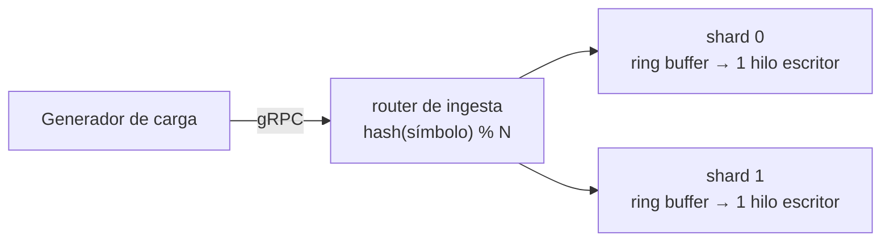
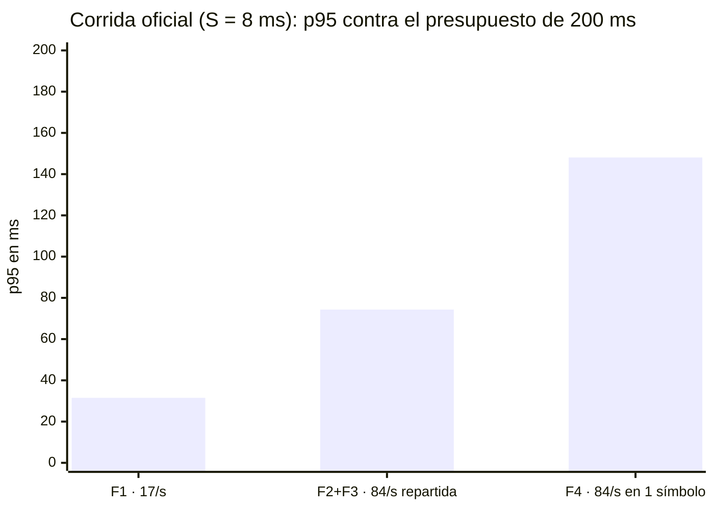

# Qué mostraron las pruebas

Este documento resume la evidencia de las corridas del experimento: qué se probó, cómo se interpretan los números y qué se encontró — mismo contenido que [Evidencia de corridas](evidencia-corridas.html), con las salidas crudas condensadas y sin fórmulas derivadas paso a paso.

## 1. Qué se probó

### El sistema

Un motor de emparejamiento con el patrón LMAX: el libro de órdenes vive en memoria y un solo hilo escritor por partición lo modifica, sin locks. Las órdenes entran por gRPC a un router que las reparte entre N particiones con una función de hash sobre el símbolo.

### La pregunta

¿Sostiene este diseño **p95 ≤ 200 ms** con el pico contractual de 5.000 emparejamientos/minuto (≈ 84 órdenes/s), y lo sigue sosteniendo si todo el pico cae en una sola partición?

### El obstáculo, y cómo se resolvió

El prototipo no implementa la lógica de negocio real (validación, riesgo, saldos, tipos de orden, comisiones, generación de trades) — solo un cruce sobre una estructura en memoria que cuesta unos 13 microsegundos. Eso importa porque, en un diseño de único escritor, **el costo por orden se serializa** y fija directamente el techo de throughput de la partición (techo = 1 / costo por orden). Medir capacidad con 13 microsegundos mide esa estructura de datos, no un motor de emparejamiento real.

La solución fue tratar ese costo como un **parámetro declarado del experimento** —la variable de configuración `BIZ_MICROS`, aquí llamada **S**— y responder con un **presupuesto** en vez de con un número fijo: no "el sistema responde en X ms", sino "el sistema cumple el contrato mientras procesar una orden cueste menos de S ms". Esa afirmación es verificable sin conocer todavía la lógica de negocio real: cuando exista, se mide su costo y se compara contra el presupuesto.

**S es una media, no el costo de cada orden.** La lógica de negocio real no cuesta lo mismo siempre: la mayoría de las órdenes son baratas (no cruzan con nada), unas pocas barren varios niveles de precio y generan varios trades, y una fracción mínima dispara cascadas más costosas. El modelo simulado reproduce esa forma con una mezcla de tres clases — 90 % con costo base, 9 % con 6 veces ese costo, 1 % con 30 veces ese costo — que a S = 8 ms significa que una orden individual cuesta 4,6 / 27,6 / 138 ms según su clase. Esa mezcla es más variable que una distribución exponencial simple, que es aproximadamente lo que un motor real exhibiría. Una variante adicional (una distribución continua, sin cota superior) permite verificar que la conclusión no dependa de esa elección de modelado — ver la sección 4.4.

### Las tres corridas y qué aporta cada una

| # | Corrida | S | La pregunta que responde |
|---|---|---|---|
| 1 | Oficial | 8 ms | ¿Se cumple el contrato con un costo por orden realista? |
| 2 | Barrido | 0 a 25 ms | ¿Hasta cuánto puede costar una orden sin romper el contrato? |
| 3 | Patrón aislado | 0 | ¿Cuánto cuesta el patrón LMAX por sí solo? |

**Por qué se eligió S = 8 ms para la corrida oficial.** El costo real depende de dónde viva la lógica de negocio:

| Escenario | Qué hace por orden | S estimado |
|---|---|---|
| A · en el mismo proceso | validación, riesgo, saldos y libro en memoria, sin operaciones de entrada/salida en el camino crítico — lo que el patrón propone | ~0,2 ms |
| B · con durabilidad | A, más registrar el evento en disco antes de responder | ~1 ms |
| C · con dependencias remotas | riesgo y saldos consultados a un servicio o base de datos externa en cada orden | ~8 ms |

Se eligió el escenario C: el más exigente que sigue siendo arquitectónicamente plausible. Si el contrato se cumple ahí, se cumple en A y B por añadidura.

## 2. Veredicto

- **ASR-02 — cumple:** 17 órdenes/s durante 12 min: p95 = 31,51 ms contra un presupuesto de 200 ms.
- **ASR-03 — cumple:** rampa a 84 órdenes/s, pico de 30 min y retorno: p95 = 74,32 ms.
- **Partición caliente — cumple, con margen ajustado:** todo el pico en un solo símbolo: p95 = 148,09 ms, 1,35× de margen.

Todo lo anterior con S = 8 ms por orden, sobre 418.610 órdenes, 0 rechazos y 0 violaciones de enrutamiento.

Y el resultado que no depende del valor de S elegido: el **presupuesto** medido es de 12,4 ms por orden con el pico repartido entre 2 particiones, y 8,5 ms si todo el pico cae en una sola.

**Decisión:** adoptar el patrón, con la condición explícita de verificar el costo real de la lógica de negocio contra ese presupuesto cuando exista.

## 3. Cómo se leen los números

### Los dos relojes

Cada corrida se mide dos veces, en dos puntos distintos, con el mismo estadístico:

| Reloj | Qué mide | Incluye |
|---|---|---|
| Latencia del cliente (generador de carga) | lo que espera quien manda la orden | red + router + motor |
| Latencia acumulada del motor | lo que cuesta dentro de la partición | solo el motor |

Los dos son percentiles verdaderos sobre toda la población de la fase, así que su resta es el costo de transporte. Esa comparación es el corazón del experimento: dice qué parte del tiempo es responsabilidad del patrón y qué parte es del montaje (red, contenedores, router).

### La descomposición interna

El motor divide su propio tiempo en dos partes: **espera** (el tiempo que la orden pasó en la cola del buffer antes de ser atendida) y **servicio** (el tiempo real de procesarla — el cruce de precios más el modelo de costo de negocio). Distinguir ambas permite decidir la acción correcta: si crece el servicio, hay que abaratar la orden; si crece la espera, hay que agregar particiones.

### Un ejemplo, descifrado

En la fase de pico de la corrida oficial, una de las dos particiones procesó 83.702 órdenes con un p95 interno de 73,15 ms, de los cuales 50,08 ms fueron espera en cola y 27,60 ms fueron trabajo real. Contra los 74,32 ms que midió el generador de carga para la misma fase, el transporte aportó apenas ~1 ms: **el motor es la latencia**, no el camino de red.

### Advertencias de lectura

1. **S es la media, no el costo de cada orden** — las órdenes individuales cuestan entre 4,6 y 138 ms con la distribución por defecto.
2. **Ninguna cifra se lee sin su S al lado** — el techo de una partición, el reparto entre motor y transporte, y el veredicto sobre la partición caliente cambian todos con el costo por orden. Por eso el motor publica su punto de operación al arrancar y cada corrida lo registra en el nombre de su directorio de resultados.
3. **El motor también reporta un histograma cada 10 segundos**, útil para ver la evolución dentro de una fase — pero la mediana de esos p95 por ventana **no es** el p95 real de toda la población; solo el histograma acumulado de la corrida completa lo es.

### Entorno

Una sola máquina (macOS, Apple Silicon, 14 núcleos virtuales), con router + 2 shards en contenedores (buffer de 16.384 posiciones, cola de 10.000 solicitudes, recolector de basura de pausas cortas). Generador de carga con gRPC nativo en el mismo host, tráfico por loopback. Arribo estocástico (variabilidad medida cercana a la de un proceso de Poisson) y 36 símbolos que la función de hash reparte 18/18 entre las dos particiones. Cada fase corre sobre una topología recién levantada, así que sus percentiles internos son de esa fase y solo de esa.

## 4. Resultados

### 4.1 ¿Se cumple el contrato con un costo por orden realista? — corrida oficial, S = 8 ms

| Fase | Carga | Órdenes | p50 | p95 | p99 | p99.9 | p95 del motor | Motor / total | Veredicto |
|---|---|---|---|---|---|---|---|---|---|
| F1 — ASR-02 | 17/s · 12 min · 36 símbolos | 12.241 | 7,86 ms | 31,51 ms | 140 ms | 153 ms | 27,76 ms | 88 % | ✅ 6,3× |
| F2+F3 — ASR-03 | 17→84/s · pico 30 min | 167.429 | 5,61 ms | 74,32 ms | 141 ms | 231 ms | 73,15 ms | 98 % | ✅ 2,7× |
| F4 — partición caliente | 84/s en 1 símbolo | 167.429 | 11,27 ms | 148,09 ms | 243 ms | 352 ms | 147,07 ms | 99 % | ⚠️ 1,35× |
| Exploratoria @250/s | 1 símbolo · 5 min | 23.183 | 6,14 s | 6,97 s | 7,56 s | 7,86 s | 6,97 s | ~100 % | ❌ saturado |
| Exploratoria @500/s | 1 símbolo · 5 min | 23.983 | 6,24 s | 7,03 s | 7,58 s | 7,90 s | 7,04 s | ~100 % | ❌ saturado |
| Exploratoria @1000/s | 1 símbolo · 5 min | 24.345 | 6,27 s | 7,03 s | 7,57 s | 7,89 s | 7,03 s | ~100 % | ❌ saturado |

418.610 órdenes en total, 100 % de verificaciones correctas, 0 rechazos por backpressure, 0 violaciones de enrutamiento. Las dos fases oficiales pasaron sus cuatro umbrales.

### 4.2 ¿Hasta cuánto puede costar una orden? — barrido de S

Se recorre el costo por orden (S) manteniendo todo lo demás fijo, buscando el punto donde el p95 cruza los 200 ms.

**Con el pico repartido entre 2 particiones:**

| S | Utilización | p95 (cliente) | p95 (motor) | Espera p95 | Servicio p50 | Veredicto |
|---|---|---|---|---|---|---|
| 0 | ~0 | 6,31 ms | 239 µs | 187 µs | 19 µs | ✅ |
| 5 ms | 0,21 | 25,48 ms | 22,45 ms | 13,69 ms | 2,88 ms | ✅ |
| 10 ms | 0,42 | 126,65 ms | 126,46 ms | 101,06 ms | 5,75 ms | ✅ |
| 12 ms | 0,50 | 186,02 ms | 191,99 ms | 167,55 ms | 6,90 ms | ✅ |
| 13 ms | 0,55 | 219,58 ms | 218,88 ms | 194,18 ms | 7,48 ms | ❌ |
| 15 ms | 0,63 | 264,78 ms | 266,75 ms | 246,02 ms | 8,63 ms | ❌ |
| 20 ms | 0,84 | 676,59 ms | 717,31 ms | 692,22 ms | 11,50 ms | ❌ |
| 25 ms | 1,05 | 5,48 s | 6,11 s | 6,08 s | 14,38 ms | ❌ (con descartes) |

**Presupuesto medido ≈ 12,4 ms por orden** (12 ms pasa con 186 ms; 13 ms falla con 220 ms). Un barrido fino adicional en ese rango confirmó la estimación con un error de solo 2,4 % respecto al primer cálculo, y un punto se repitió en otra instancia de la topología con 0,8 % de diferencia — lo que respalda la reproducibilidad de la medición.

**Con todo el pico en una sola partición** (la distribución más exigente posible):

| S | 0 | 1 ms | 5 ms | 8 ms | 10 ms | 12 ms |
|---|---|---|---|---|---|---|
| p95 (cliente) | 5,93 ms | 7,87 ms | 65,59 ms | 148,19 ms | 346,43 ms | 2,68 s |
| Veredicto | ✅ | ✅ | ✅ | ✅ | ❌ | ❌ |

**Presupuesto medido ≈ 8,5 ms por orden.**

Los tres escenarios de costo estimados en la sección 1 caben dentro del presupuesto de 2 particiones: el escenario A consume el 1,6 % de ese presupuesto, el B el 8 %, y el C (el elegido para la corrida oficial) el 63 %.

### 4.3 ¿Cuánto cuesta el patrón por sí solo? — S = 0

Misma secuencia de pruebas con la lógica de negocio apagada: el motor solo ejecuta el cruce de precios de 13 microsegundos. Mide el costo propio del patrón, no un motor real.

| Fase | Órdenes | p95 (cliente) | p95 (motor) | Espera p95 | Servicio p50 |
|---|---|---|---|---|---|
| F1 · 17/s | 12.240 | 7,54 ms | 272 µs | 207 µs | 27 µs |
| F2+F3 · pico 84/s | 167.429 | 4,58 ms | 174 µs | 148 µs | 10 µs |
| F4 · 84/s en 1 símbolo | 167.429 | 4,00 ms | 149 µs | 133 µs | 6 µs |
| Exploratoria @250/s | 39.539 | 3,54 ms | 127 µs | 110 µs | 2 µs |
| Exploratoria @500/s | 77.038 | 2,03 ms | 73 µs | 67 µs | ≤1 µs |
| Exploratoria @1000/s | 152.039 | 1,20 ms | 46 µs | 43 µs | ≤1 µs |

615.714 órdenes, 0 rechazos, 0 violaciones de enrutamiento sobre las 179.669 de las dos primeras fases — el aislamiento del sharding verificado en vivo.

Lo que esta corrida deja establecido: el patrón por sí solo cuesta microsegundos, y de esos microsegundos, tres cuartas partes son el costo de despertar el hilo escritor cuando está dormido esperando trabajo — no el trabajo en sí. Es la mayor palanca de latencia que queda en el motor cuando la lógica de negocio es barata; con S = 8 ms se vuelve ruido comparado con el resto. La fase de retorno a régimen (F3) también quedó evidenciada: la espera interna vuelve por debajo del nivel del baseline, mostrando que la cola drena sin dejar deuda. Y aparecieron atascos aislados de cientos de milisegundos —una orden tardó 300 ms en procesarse, otra esperó 375 ms en cola— que no se pueden atribuir a pausas de recolección de basura o a contención del sistema operativo sin herramientas de perfilado que este prototipo no configuró.

### 4.4 ¿Depende el resultado de la forma de la distribución de costo? — comparación A/B

La mezcla de tres clases es discreta: solo existen tres costos posibles. La lógica real sería continua. Para saber si esa simplificación cambia el veredicto, se corrió la misma fase con una distribución continua y **sin cota superior**, construida con la misma media y la misma varianza relativa que la mezcla — así la comparación varía solo la forma, no los dos primeros momentos estadísticos.

| | Mezcla | Distribución continua | Diferencia |
|---|---|---|---|
| p50 (cliente) | 5,82 ms | 7,35 ms | +26 % |
| p95 (cliente) | 74,7 ms | 63,3 ms | −15 % |
| p99 (cliente) | 140,95 ms | 148,59 ms | +5 % |
| p99.9 (cliente) | 266,35 ms | 326,54 ms | +23 % |
| servicio máximo | 138,1 ms | 369,4 ms | +167 % |

Tres lecturas: **el veredicto del contrato es robusto a la forma elegida** — 74,7 ms y 63,3 ms, ambos muy por debajo de 200 ms. **Pero la forma sí importa en los percentiles altos** — con los dos primeros momentos idénticos, el p95 se movió 15 % y el p99.9 un 23 %; la aproximación estadística que solo considera media y varianza es válida para el promedio, no para la cola, que es justo donde vive el criterio de éxito. **Y la mezcla subestima la cola**: está acotada por construcción en 30 veces la media (138 ms de servicio máximo posible), una cota artificial que la lógica real no tendría. La distribución continua produjo una orden con 369 ms de servicio — un solo evento bloqueando al único escritor más de un tercio de segundo.

## 5. Hallazgos

**Con lógica de negocio realista, el motor es la latencia.** Con S = 0, el motor explicaba apenas 3,6–3,7 % del tiempo total — el resto era transporte y virtualización. Con S = 8 ms, el motor explica 88–99 %. La lectura correcta se invierte según el punto de operación: con la lógica apagada se está midiendo la infraestructura de contenedores, no el patrón.

**El sistema no se degrada gradualmente: cae por un acantilado.** Entre S = 0 y S = 25 ms, el tiempo de servicio crece linealmente (lo que se configura es lo que se obtiene), mientras la espera en cola crece más de 32.000 veces. No hay una degradación suave a medida que la utilización se acerca al límite: entre 15 y 20 ms de costo por orden, el p95 se multiplica por 2,6 con solo un tercio más de costo. Consecuencia práctica: el margen aparente no avisa con anticipación — un sistema que parece tener holgura de sobra puede estar a un pequeño incremento de costo por orden de incumplir.

**El sistema se degrada por latencia, nunca por rechazo.** Cero rechazos por backpressure en las 24 corridas del barrido, incluso con colas de 7 segundos y utilización muy por encima de 1. Lo que delata la saturación real son los descartes del generador de carga (que aparecen cuando el sistema ya no puede recibir más trabajo del que ofrece), no el contador de rechazos del motor. El criterio de "cero rechazos" por sí solo no protege de nada si no se mira también la latencia.

**La partición caliente sí degrada, y el techo de una partición es medible.** Con la misma tasa y el mismo costo por orden, cambiar solo la distribución de símbolos (repartida entre 18 símbolos contra concentrada en 1) duplica el p95 (74,32 → 148,09 ms) y multiplica por 2,7 el tiempo de espera, mientras el tiempo de servicio se mantiene invariante. Con S = 0 este efecto no se manifestaba —la partición caliente incluso salía más rápida—, lo que hacía parecer que la hipótesis de riesgo no aplicaba. El techo real de una partición es 1 dividido entre el costo por orden: con S = 8 ms, eso da 125 órdenes/s, confirmado por saturación (cuadruplicar la carga ofrecida solo entregó un 5 % más de trabajo real). El pico contractual ocupa el 67 % de la capacidad de una sola partición.

**Repartir la carga reduce la espera, nunca el costo de servicio.** El presupuesto crece con el número de particiones, pero de forma sub-lineal: 8,5 ms con todo el pico en una partición, 12,4 ms repartido entre dos — un factor de 1,46×, no el 2× que sugeriría repartir la carga a la mitad. No es una pérdida de eficiencia: es aritmética del contrato de latencia. Repartir la carga baja la utilización y con ella la espera en cola, pero el tiempo de servicio de una orden es latencia también, y ese tiempo no cambia por tener más particiones. El corolario práctico: ninguna cantidad de particiones permite que una orden que cuesta 200 ms de procesar cumpla un contrato de 200 ms — el sharding es la herramienta contra la espera, no contra el costo por orden.

**Una partición nunca pidió más de un núcleo de CPU.** Uno de los supuestos del diseño era que ninguna partición necesitaría más de un núcleo. Medido durante el pico con S = 8 ms, cada shard usó en promedio 23,6 % de un núcleo (máximo 58,3 %), y el router apenas 3,2 %. Esto se cumple por una razón estructural, no por suerte: extrapolando el trabajo medido hasta el techo teórico de throughput de una partición (125 órdenes/s), el uso de CPU llegaría exactamente a 100 % de un núcleo — el techo de throughput y el límite de un núcleo por partición son, matemáticamente, el mismo hecho en un diseño de único escritor.

**El instrumento de medición es válido.** Tres verificaciones lo respaldan: el modelo de costo simulado entrega exactamente la distribución que declara (verificado contra tres percentiles distintos, con menos de 1 % de diferencia entre lo predicho y lo medido); el tiempo de servicio no se contamina con la carga (se mantiene entre 27,60 y 27,63 ms sin importar si la tasa es 17 o 1.000 órdenes/s); y una versión corta de las pruebas replica los resultados de la versión completa dentro de un margen del 0,5 %, lo que descarta que la duración de la corrida esté sesgando la medición.

**Consecuencia: la latencia deja de mejorar con la carga cuando el costo por orden es realista.** Con S = 0, el p95 mejoraba al subir la tasa (7,54 → 1,20 ms), porque con un trabajo tan barato por evento, más ráfaga significa más eventos procesados por pasada del único escritor y datos más calientes en caché, sin cola que pagar. El efecto es real, pero solo visible cuando el trabajo por evento es despreciable. Con S = 8 ms, ese efecto queda sepultado por el encolamiento, y el sistema se comporta como predice la teoría de colas: la latencia empeora con la carga (31,5 → 74,3 → 148,1 ms).

## 6. Limitaciones

**Del entorno.** Una sola máquina, con el motor de contenedores corriendo dentro de una máquina virtual (macOS) y sin aislamiento de núcleos por proceso. No hay red real de producción de por medio. Una sola repetición por punto medido, sin intervalos de confianza formales. La medición de CPU acota cuánto puede importar esto: con los shards y el router usando en conjunto menos de medio núcleo de los 14 disponibles, no hay escasez agregada de CPU, así que la contención entre procesos no puede ser un factor grande — aunque queda un mecanismo residual no medido: sin aislamiento de núcleos, nada impide que el hilo escritor caiga en un núcleo de eficiencia en vez de uno de rendimiento, lo que afectaría al tiempo de servicio de esa partición específica, no a la capacidad agregada del sistema.

**Del alcance.** Tres elementos del diseño quedaron fuera del prototipo, y eso deja algunas afirmaciones sin evidencia directa: el journaling asíncrono (por lo que la cláusula de mantenerlo fuera del camino crítico no se puso a prueba), y el perfilado detallado de pausas de recolección de basura (por lo que los atascos aislados no se pueden atribuir con certeza a esa causa). La medición de CPU por proceso sí se completó y respalda la cláusula correspondiente.

**De la interpretación.** Dos advertencias importantes sobre el veredicto: primero, **S = 8 ms es una hipótesis de trabajo, no una medición de la lógica de negocio real** que este prototipo no implementa — lo que la corrida demuestra es que *si* el costo por orden fuera de 8 ms, el contrato se cumple; el número que hay que verificar cuando la lógica exista sigue siendo el presupuesto de 12,4 ms. Segundo, **el percentil 99.9 excede el límite de 200 ms durante el pico** (231 ms en la fase de rampa, 352 ms en la partición caliente) — el contrato es sobre el percentil 95 y ese sí se cumple, pero aproximadamente una de cada mil órdenes lo excede, por la clase más pesada de la distribución de costo simulada. Si el contrato se endureciera a p99, S = 8 ms no alcanzaría; y como la mezcla usada está acotada por construcción, la comparación de formas (sección 4.4) muestra que con una distribución sin cota el mismo escenario empeora al menos un 23 % — la cifra medida es un piso, no un techo.

## 7. Salidas crudas (resumen)

Cada corrida queda archivada con su salida completa del generador de carga y del histograma de cada shard, más un manifiesto que registra el costo por orden usado, la versión del código y la herramienta de carga. A modo de ejemplo, la fase de pico de la corrida oficial (S = 8 ms) registró: latencia del cliente con p50 = 5,61 ms y p95 = 74,32 ms sobre 167.429 órdenes; la partición 1 registró internamente n = 83.702 órdenes con p95 total = 73,15 ms (espera p95 = 50,08 ms, servicio p95 = 27,60 ms); la partición 0 registró un reparto casi idéntico (83.727 órdenes) — el balance 50/50 que producen los 36 símbolos de prueba. El detalle completo de las seis fases y las tres series (oficial, barrido, patrón aislado) está en la versión técnica.

## 8. Nota metodológica: defectos corregidos en la medición

Durante la construcción del barrido se encontraron y corrigieron tres defectos que habían afectado a la evidencia publicada antes de la corrida oficial de este documento: el costo por orden nunca se propagaba correctamente al orquestador de pruebas (la corrida que se había publicado como oficial en realidad corrió con la lógica de negocio apagada, sin que nadie lo pidiera); la captura de logs descartaba la línea donde el motor declara su punto de operación al arrancar, por lo que no se podía demostrar con qué costo se había medido una corrida antigua; y el extractor de métricas del generador de carga leía incorrectamente los contadores de rechazos y descartes, reportando siempre cero. Un cuarto ajuste, de menor impacto medido (0,2 % de diferencia), corrigió que todas las particiones usaran la misma semilla aleatoria para su modelo de costo — lo que hacía que las órdenes más caras cayeran sobre todas las particiones al mismo tiempo en vez de repartirse en el tiempo, algo que no ocurriría con lógica de negocio real no correlacionada entre particiones.

Una versión anterior de esta evidencia atribuía el hallazgo de "repartir reduce el presupuesto 1,46× y no 2×" a contención de núcleos de CPU entre particiones. Esa explicación no sobrevivió a las pruebas que se le hicieron después (medir CPU por proceso descartó escasez de recursos; un barrido más fino descartó sesgo de interpolación; corregir las semillas aleatorias descartó correlación entre particiones). La explicación correcta resultó ser aritmética, no física: la expectativa de que el presupuesto escalara 2× con el número de particiones era errónea desde el principio, porque no consideraba que el tiempo de servicio de una orden es latencia también, sin importar cuántas particiones existan (ver el hallazgo correspondiente en la sección 5). Queda documentado porque la explicación incorrecta sobrevivió varias revisiones antes de que alguien la cuestionara.

---

*¿Quieres las cifras con todos los decimales, las salidas crudas completas de cada corrida y las fórmulas exactas? Eso está en la versión técnica: [Evidencia de corridas](evidencia-corridas.html).*
