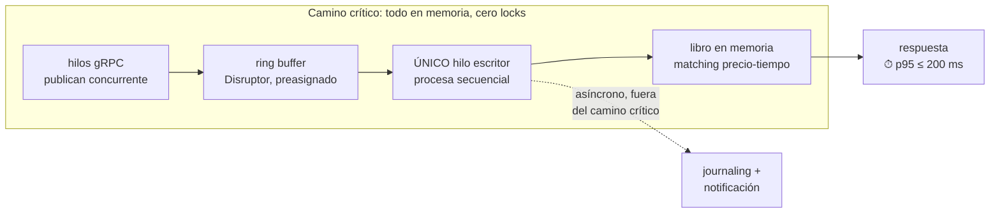
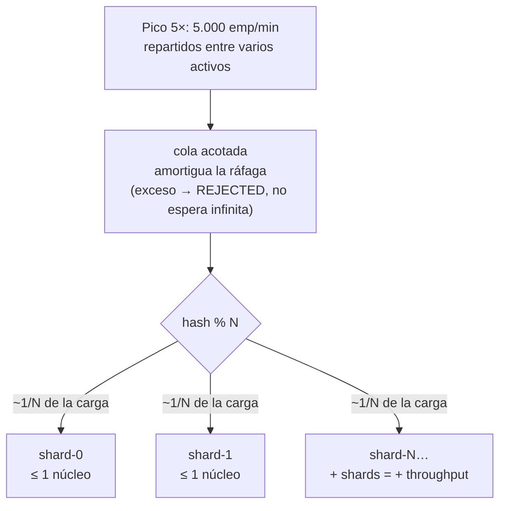
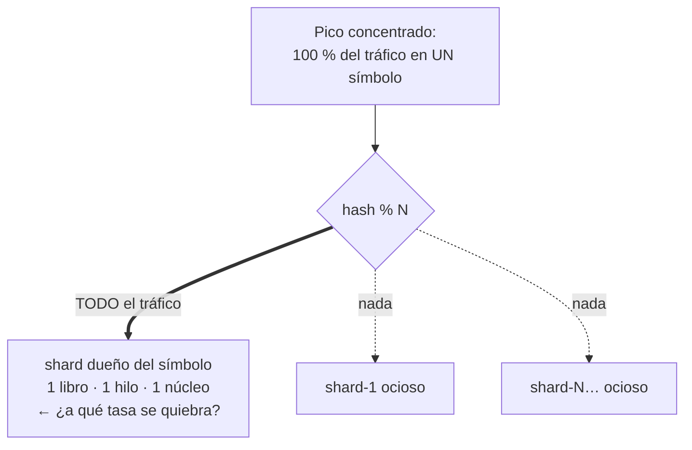
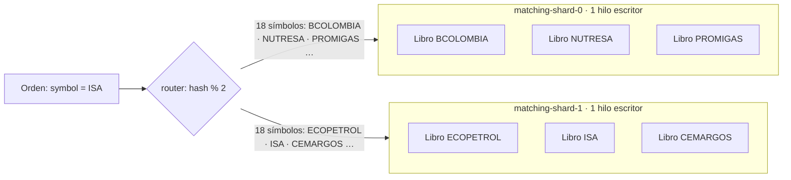
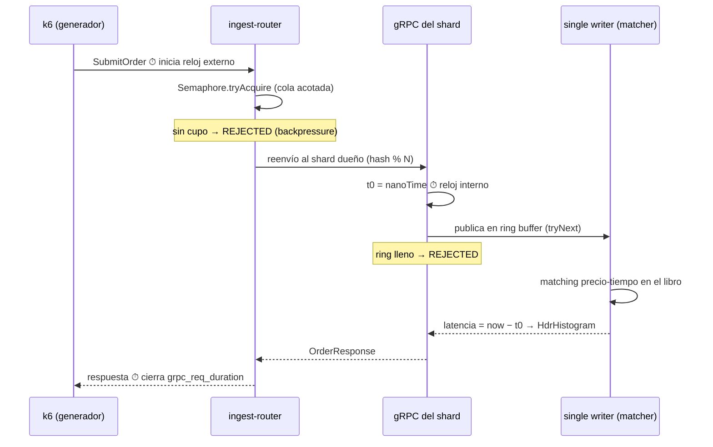
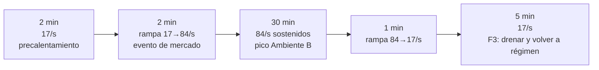
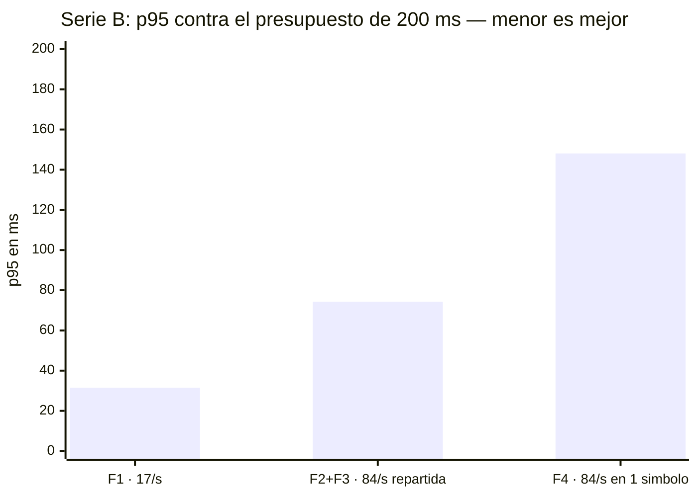
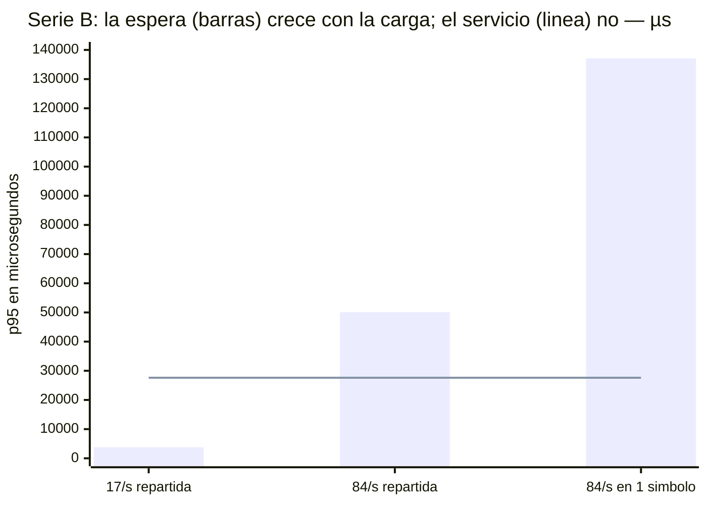

# E01 — Validar el patrón LMAX (motor en memoria con un único escritor) para el emparejamiento

**Reto 1: Desempeño · ARTI4109 · Pestaña Experiments de Helix**
Estado: **Ejecutado** · Ficha actualizada el 3 de septiembre de 2026. *La sincronización con Helix está pendiente: se hará cuando el equipo dé el experimento por firme.*

## La historia en corto

E01 pone a prueba una apuesta de diseño: que un motor de emparejamiento estilo **LMAX** —libro de órdenes en memoria, un solo hilo escritor por partición— más **sharding por activo** cumple los dos ASR críticos del sistema (latencia y escalabilidad). El experimento se corrió tres veces, y cada repetición corrigió un defecto real de medición:

| Fecha | Qué pasó | Qué queda de esas corridas |
|---|---|---|
| **30-ago** | Primeras corridas completas. Defecto encontrado después: el generador emitía órdenes a intervalos fijos, no estocásticos, y eso ocultaba la cola. | **Retiradas** de la evidencia. |
| **02-sep** | Generador corregido (arribo Poisson). Pero un defecto del arnés dejó la lógica de negocio **apagada**: cada orden costaba ~13 µs de `TreeMap`, no lo que cuesta una orden real. | Se conservan como **Serie A**: miden el costo propio del patrón, no un motor real. |
| **03-sep** | Secuencia repetida con un costo por orden **declarado de S = 8 ms** (validación, riesgo, saldos — lo que el PoC no implementa, inyectado como parámetro). | **Serie B — la que sostiene el veredicto.** |

El veredicto vigente, en una frase: con S = 8 ms el patrón **cumple los dos ASR** (márgenes 6,3× y 2,7×); la partición caliente **duplica el p95** sin romper el contrato (margen 1,35×); y la capacidad no es un número de órdenes por segundo sino un **presupuesto de costo por orden** — el patrón aguanta mientras S ≤ 12,4 ms con el pico repartido en 2 particiones, o ≤ 8,5 ms si todo cae en una.

## Referencias rápidas

Los términos que esta ficha usa como si el lector ya los conociera, definidos una vez:

| Referencia | Qué es |
|---|---|
| **ASR-02 / ASR-03** | Los dos requisitos críticos: latencia (p95 ≤ 200 ms en operación normal) y escalabilidad transitoria (sostener el pico 5× hasta 30 min con el mismo p95). Sus escenarios completos están en la pestaña Requirements & Quality de Helix. |
| **Ambiente A / B** | Los dos modos de operación definidos en los escenarios. A = operación normal: 1.000 emparejamientos/min (~17/s). B = pico de mercado: 5.000/min (~84/s), hasta 30 minutos. |
| **F1, F2, F3, F4** | Las fases de corrida: F1 baseline (Ambiente A), F2 rampa y pico sostenido (Ambiente B), F3 retorno a régimen, F4 partición caliente (todo el tráfico en un solo símbolo). |
| **Serie A / Serie B** | Las dos ejecuciones completas de F1–F4. A: lógica de negocio apagada (S = 0), mide el patrón solo. B: S = 8 ms declarado, mide un motor plausible. **B es la oficial.** |
| **S** (y `BIZ_MICROS`) | El costo de procesar una orden dentro del motor — la lógica de negocio. El PoC no la implementa, así que se inyecta como parámetro (`BIZ_MICROS`) y se declara en cada corrida. |
| **1/S — el techo** | Un escritor único procesa las órdenes en serie: si cada una cuesta S, no puede pasar de 1/S órdenes por segundo. Con S = 8 ms, 125 órd/s por partición. |
| **ρ (ocupación)** | Tasa × S: qué fracción del techo está en uso. Manda sobre la espera en cola: a mayor ρ, más cola. |
| **Cs² / Ca²** | Variabilidad (al cuadrado) del costo por orden (Cs²) y del tiempo entre llegadas (Ca²). 0 = constante/metrónomo, 1 = exponencial/Poisson. |
| **Mezcla 90/9/1** | El modelo del costo por orden en la Serie B: 90 % de órdenes simples (4,6 ms), 9 % medianas (27,6 ms) y 1 % pesadas (138 ms). Media: 8 ms; Cs² = 3,34. |
| **Los cuatro umbrales** | Lo que k6 verifica en vivo en las fases oficiales: p95 < 200 ms, 0 rechazos por backpressure, 0 violaciones de routing (un símbolo → siempre el mismo shard) y 0 iteraciones descartadas (órdenes que el generador no logró emitir a tiempo). |
| **Shard / partición** | Un proceso del motor con su hilo escritor y sus libros. Cada shard es dueño de varios símbolos; el router asigna por hash(símbolo) % N. |
| **TEC-2** | Restricción del reto: el banco de pruebas real es de 3 nodos con red de 1 Gbps. El PoC corre en una sola máquina — valida el patrón, no el dimensionamiento. |
| **Paso 7 / Paso 8** | Del método ADD 3.0 del curso: analizar los resultados del experimento (7) y registrar la decisión arquitectónica (8). |

## El experimento de un vistazo

---

## Pestaña Planning

### Design Hypothesis

*Redacción ajustada tras la retroalimentación del 01-sep: la hipótesis es la **apuesta de diseño** — la medida exigida vive en el escenario de calidad enlazado y no se transcribe aquí.*

**H1 — Latencia (ASR-02):** si el motor implementa el patrón LMAX —libro de órdenes en memoria por activo y un único hilo escritor por partición (single writer), alimentado por un ring buffer (Disruptor), con journaling y notificación asíncronos fuera del camino crítico—, entonces se cumplirá la medida del escenario Critical de latencia enlazado abajo, bajo la carga de su Ambiente A. La razón: el procesamiento secuencial en memoria elimina bloqueos y contención, y deja el costo por evento en el orden de microsegundos.

*La mecánica de H1: el camino crítico es una línea recta en memoria — nadie espera un lock, y lo lento (persistir, notificar) sale del camino:*

**H2 — Escalabilidad transitoria (ASR-03):** si la ingesta gRPC enruta cada orden por sharding determinístico (hash del símbolo % N) hacia N shards LMAX independientes, con cola acotada como amortiguación de ráfagas, entonces se cumplirá la medida del escenario Critical de escalabilidad enlazado abajo durante toda la ventana de pico de su Ambiente B — siempre que la carga se reparta entre varios activos. La razón: el throughput total crece agregando shards, sin exigir más de un núcleo por partición. Y la pregunta de fondo no es solo «¿funciona con el N elegido?», sino **cuál es el N mínimo de shards** que satisface el contrato — un número que no se sabe de antemano y se halla con las corridas.

*La mecánica de H2: el pico 5× se divide entre N shards que no comparten nada — cada uno recibe ~1/N de la carga, y si el pico creciera, la respuesta es sumar shards, no acelerar uno:*

**H2b — Partición caliente (exploratoria, subordinada a H2):** si el pico se concentra al 100 % en un solo activo, se espera que la medida del escenario enlazado deje de cumplirse antes de alcanzar el pico de Ambiente B, porque el techo de un shard es un solo núcleo por diseño. La Fase 4 busca ese punto de quiebre real, no un aprobado o reprobado.

*La mecánica de H2b — el caso donde el sharding no ayuda: un solo símbolo tiene un solo libro dueño, así que todo el pico cae en un shard y los demás miran. Como el libro es indivisible, ese único núcleo es el techo, y F4 pregunta a qué tasa se alcanza:*

*(Resultado: con la lógica de negocio apagada —la Serie A— la degradación no aparecía; con el costo por orden declarado en 8 ms, sí — la partición caliente duplica el p95. Ver Results.)*

### Linked Quality Scenarios

| Escenario | Atributo | ASR |
|---|---|---|
| Materializar una orden de compra mediante emparejamiento | Latency · **Critical** · p95 ≤ 200 ms (Ambiente A) | ASR-02 |
| Materializar una orden de compra mediante emparejamiento | Scalability · **Critical** · ramp-up 1 min, p95 ≤ 200 ms (Ambiente B) | ASR-03 |

*Son los dos únicos escenarios con prioridad Critical del árbol de Requirements & Quality: el experimento cubre exactamente los ASR críticos (uno de latencia, uno de escalabilidad).*

### Tactics and Patterns

El patrón LMAX Architecture (Disruptor) es un procesador de eventos secuencial: libro de órdenes en memoria y un único escritor lógico por partición de activo, con entrada por ring buffer sin bloqueos. La *mechanical sympathy* es parte del argumento — los datos del activo permanecen calientes en la caché del núcleo asignado. El sharding por activo enruta cada orden de forma determinística, hash(símbolo) % N, desde la ingesta gRPC/Protobuf hacia N shards independientes. Con eso la exclusión mutua queda garantizada por construcción, no por locks, y de paso aporta la garantía de no doble-materialización.

**Cómo reparte el sharding** — no hay un shard por símbolo: hay N shards fijos y cada uno es dueño de *varios* símbolos (con un libro por símbolo). El invariante es que todas las órdenes de un mismo símbolo caen siempre en el mismo shard, así el único escritor del shard es, transitivamente, el único escritor de cada uno de sus libros:

> *Nota sobre el diagrama de sharding:* el reparto mostrado es el que produce realmente `floorMod(String.hashCode(símbolo), 2)` sobre los 36 nemotécnicos del generador, verificado con el hash (18/18 con N=2, 9/9/9/9 con N=4). Una versión anterior de este diagrama ubicaba tres símbolos en el shard equivocado.

Tácticas de latencia: mantener los datos del camino crítico en memoria, reducir overhead evitando bloqueos y contención, y mover journaling y notificación a etapas asíncronas. Tácticas de escalabilidad: particionamiento por activo (el throughput total escala agregando shards) y cola acotada con backpressure en la ingesta — se prefiere frenar la entrada antes que prometer una latencia incumplible.

Alternativas descartadas: pool de workers con colas bloqueantes (reintroduce la contención); locks de grano fino por nivel de precio (deadlocks y latencia impredecible); PostgreSQL con `SELECT FOR UPDATE` (se mantiene como línea base de comparación); modelo de actores (overhead de mailbox); bloqueo distribuido (salto de red en el camino crítico).

### Experiment Design

PoC mínimo en una sola máquina (mínimo 8 vCPU/16 GB, ideal 12+/32), todo Java 21 sobre Docker Compose, sin Kubernetes ni broker. La cadena: generador k6 con gRPC nativo (`k6/net/grpc`, k6 ≥ 0.49 — no requiere xk6), en modelo abierto de tasa de llegada con desplazamiento exponencial por iteración → ingesta gRPC/Protobuf con router de sharding hash(símbolo) % N y cola acotada → N motores LMAX (Disruptor 4.0.0, libro en memoria por activo). El precalentamiento no se mide: solo estabiliza JIT y GC.

**Diferencias entre el diseño y lo construido** — declaradas para no atribuir al PoC alcance que no tiene:

| Elemento del diseño | Estado en el PoC |
|---|---|
| Journaling asíncrono a archivo | ❌ **no implementado**: no hay journaling de ningún tipo. La cláusula de H1 sobre sacarlo del camino crítico **no fue puesta a prueba** |
| Aislamiento por `cpuset` | ❌ **no aplicado**: las líneas están comentadas en el compose y en macOS Docker corre en una VM. Con ello, la «mechanical sympathy» de datos calientes en un núcleo dedicado tampoco se verificó |
| JFR para pausas de GC | ❌ no configurado: `JAVA_OPTS` solo lleva ZGC y heap |
| CPU por proceso | 🔶 no automatizada en el arnés; se midió puntualmente en la Serie B (ver Conclusion) |
| Exportación a Prometheus/Grafana | ❌ no implementada: las curvas salen de la salida de k6 y del log del motor |

El camino de una orden a través del montaje (los dos relojes de la medición marcados):

Corridas:

- **F1 — Baseline (ASR-02):** 1.000 emp/min (≈17/s) con **arribo estocástico** —tiempo entre llegadas exponencial, no equiespaciado— repartidos en 36 activos que el hash del router balancea 18/18 (N=2) y 9/9/9/9 (N=4), 10–15 min. Criterio: los cuatro umbrales (p95 ≤ 200 ms, 0 rechazos, 0 violaciones de routing, 0 iteraciones descartadas).
- **F2 — Rampa transitoria (ASR-03):** rampa de 1.000 a 5.000 emp/min en pocos minutos y sostenida hasta 30 min, repartida entre activos. Prevista con N=2 y N=4 shards, **ejecutada solo con N=2** (la comparación se descartó razonadamente, ver Results; `make compare-sharding` la deja disponible). Criterio: los mismos cuatro umbrales durante toda la ventana, con el backlog de la cola sin crecimiento descontrolado.
- **F3 — Retorno a régimen:** bajar a 1.000/min y verificar que el backlog drena y el p95 vuelve al valor de F1 (la escalabilidad exigida es transitoria, no permanente).
- **F4 — Partición caliente (exploratoria, sin criterio binario):** mismo perfil de F2 con el 100 % del tráfico en un solo activo, para encontrar el punto de quiebre de un shard.

El perfil de F2+F3 (el mismo que usa F4, cambiando solo la distribución de símbolos):

Métricas: latencia arribo→materialización p50/p95/p99/p99.9, medida en el generador y contrastada con el HdrHistogram interno del motor; throughput real contra objetivo; tasa de rechazo (backpressure); iteraciones descartadas por el generador. La medida nueva clave es la **descomposición de la latencia interna en espera (cola del ring buffer) y servicio (matching + modelo de negocio)**: distingue «shardear más» de «abaratar la orden». *No se recolectaron, pese a estar previstas, las pausas de GC (JFR)* — sin ellas, los atascos aislados observados quedan sin causa atribuible. Los thresholds de k6 marcan la corrida como fallida en vivo si p95 > 200 ms.

Limitación declarada — **el techo de un shard depende del costo por orden**. `OrderBook.match()` es un cruce sobre un `TreeMap` (~13 µs medidos), y el PoC no implementa validación, riesgo, tipos de orden, comisiones ni generación de trades. En un único escritor ese costo se serializa: si procesar una orden cuesta S, el hilo no puede pasar de `1/S` órdenes por segundo. Cualquier cifra de capacidad medida con S de microsegundos es, por lo tanto, un artefacto del juguete. El experimento trata S como parámetro barrido (`BusinessLogicModel` + `make sweep-service`) y reporta un **presupuesto**: el patrón sostiene el ASR mientras S ≤ **12,4 ms** con el pico repartido entre las 2 particiones, y S ≤ **8,5 ms** en la peor distribución posible (todo el pico en una sola).

Limitación declarada: el tráfico corre por loopback — no representa la red de 1 Gbps de TEC-2 ni alta disponibilidad. El PoC valida el patrón, no el dimensionamiento final.

### Experiment planning

**Required resources** *(lo efectivamente usado; entre paréntesis lo previsto que no se usó)*: Java 21 + LMAX Disruptor 4.0.0 + gRPC/Protobuf; Docker Compose (sin Kubernetes ni broker); **k6 ≥ 0.49 con gRPC nativo** —no hizo falta compilar xk6— como generador en modelo abierto con thresholds en vivo; HdrHistogram para los percentiles internos del motor; 1 máquina de 8 vCPU/16 GB o más; `Makefile` + `run-e2e.sh` como orquestación. *(Previstos y no usados: exportación a Prometheus/Grafana —las curvas salen de la salida de k6 y del log del motor—, JFR para pausas de GC, y núcleos aislados por cpuset.)*

**Architecture elements involved:** Servicio de ingesta gRPC con router de sharding por símbolo (hash % N) y cola acotada con backpressure; N shards del motor de emparejamiento (LMAX, libro en memoria por activo, un escritor por partición); generador de carga externo. **El journaling asíncrono forma parte del diseño pero no del PoC** (ver la tabla de diferencias arriba). Excluidos por no incidir en ASR-02/03: fan-out de notificaciones, proyecciones CQRS, persistencia, broker y autoescalado (declarados como limitación del PoC). Vistas afectadas: funcional y concurrencia.

**Estimated effort:** 2 personas × 1 semana (≈ 40 horas-persona): 2 días ingesta gRPC + router de sharding + motor LMAX; 1 día generador k6 e instrumentación; 1 día corridas F1–F4; 1 día análisis, informe y decisión (Paso 8).

---

## Pestaña Results & analysis

**Results** — dos series de seis corridas cada una, que se diferencian **solo** en el costo por orden de la lógica de negocio (S, el parámetro `BIZ_MICROS`). Detalle y salidas crudas en la [evidencia de corridas](evidencia-corridas.html).

### Serie B — punto de operación declarado (`S = 8 ms`) · **la que sostiene el veredicto**

Es el escenario más exigente que sigue siendo plausible: riesgo y saldos consultados a un servicio o BD **en cada orden**. Consume el 63 % del presupuesto de 12,4 ms.

| Fase | Carga | p95 (k6) | Motor p95 | Motor / total | Veredicto |
|---|---|---|---|---|---|
| **F1 — ASR-02** | 17/s repartidos en 36 símbolos | **31,51 ms** | 27,76 ms | 88 % | ✅ margen 6,3× |
| **F2+F3 — ASR-03** | 17→84/s repartidos · pico 30 min | **74,32 ms** | 73,15 ms | 98 % | ✅ margen 2,7× |
| **F4 — partición caliente** | 84/s en 1 símbolo | **148,09 ms** | 147,07 ms | 99 % | ⚠️ margen 1,35× |
| F4-explore | 250 / 500 / 1000 por s en 1 símbolo | 6,97 / 7,03 / 7,03 **s** | ídem | ~100 % | ❌ saturado |

418.610 órdenes, 100 % procesadas, 0 rechazos por backpressure, 0 violaciones de routing. Las dos fases oficiales pasaron sus cuatro umbrales.

**Analysis of results:** los dos relojes —k6 afuera, HdrHistogram adentro— registran **el mismo estadístico**: percentiles de toda la población. Por eso su resta es una atribución válida de dónde se va el tiempo. Con el punto de operación declarado, **el motor explica del 88 % al 99 % de la latencia que ve el cliente**: el transporte es ruido.

**El servicio no depende de la carga; la espera sí.** El `servicio p95` vale 27,60 ms en las seis fases, con la tasa variando de 17 a 1.000 órd/s y la distribución pasando de 36 símbolos a uno solo. Toda la degradación entra por la cola. Esa separación es la que permite decidir entre **abaratar la orden** y **agregar particiones** sin adivinar.

**El costo por orden es una distribución, no una constante.** `S = 8 ms` es la *media*. La mezcla 90/9/1 —90 % de órdenes simples, 9 % medianas, 1 % pesadas— hace que una orden cueste 4,6, 27,6 o 138 ms según su clase, con Cs² = 3,34 (una constante daría 0; una exponencial, 1). Los tres valores aparecen en los percentiles medidos: p50 predicho 4.598 µs contra 4.627 medido; p95, 27.586 contra 27.615; p99, 137.931 contra 138.111. La consecuencia práctica: **la clase pesada del 1 % cuesta 138 ms de servicio ella sola**, el 69 % del presupuesto sin nada de cola. Por eso el p99 se pega a 140 ms aunque el p95 esté en 31.

**Y el veredicto no depende de la forma elegida.** F2 se repitió con una distribución de servicio distinta —una lognormal continua y sin cota, construida con la misma media y el mismo Cs²—: el p95 pasa de 74,7 a 63,3 ms. Ambos quedan muy por debajo de los 200 ms del criterio, así que **la conclusión sobre ASR-03 es robusta a esa decisión de modelado**. La cola no lo es: el p99.9 sube un 23 % y una sola orden llegó a 369 ms de servicio, algo que la mezcla no puede producir porque está acotada en 30× la media. Detalle en la [evidencia de corridas](evidencia-corridas.html).

### Serie A — el patrón aislado (`S = 0`) · referencia

Corrida del 2 de septiembre, con la lógica de negocio apagada: el motor solo ejecuta un `match()` de ~13 µs sobre un `TreeMap`. Mide el **costo propio del patrón**, no un motor real.

| Corrida | Carga | p95 | Veredicto |
|---|---|---|---|
| F1 baseline | 17/s repartidos en 36 símbolos | 7,54 ms | ✅ margen ≈ 27× |
| F2+F3 rampa+pico+retorno | 17→84/s repartidos | 4,58 ms | ✅ margen ≈ 44× |
| F4 contractual | 84/s en 1 símbolo | 4,00 ms | sin degradación |
| F4-explore | 250 / 500 / 1000 por s en 1 símbolo | 3,54 / 2,03 / 1,20 ms | techo no alcanzado |

Sus cuatro umbrales también se cumplieron, con **0 iteraciones descartadas** y **0 violaciones de routing** sobre 179.669 órdenes. Esto último demuestra empíricamente el aislamiento del sharding (recomendación 2 de la retroalimentación, ver el final de la ficha). **F3 quedó evidenciado con número propio**: la espera interna vuelve a 137 µs contra los 203 µs de F1 — el backlog drena por debajo del baseline.

En esta serie **la latencia mejora al subir la carga** (7,54 → 1,20 ms). Con 13 µs de trabajo por evento, más ráfaga significa más eventos por pasada del único escritor y datos calientes en caché, sin cola que pagar — lo contrario de un sistema con locks. El fenómeno es real, pero **solo visible cuando el trabajo por evento es despreciable**. En la Serie B queda sepultado por el término de encolamiento, y el sistema se comporta como predice la teoría de colas (31,5 → 74,3 → 148,1 ms).

Dentro del motor, a tasa baja la espera domina sobre el trabajo: a 17/s, 207 de los 272 µs (**76 %**) son el costo de despertar al hilo matcher, dormido bajo `BlockingWaitStrategy`. Cuando la lógica de negocio es barata, la deuda de decisión sobre la estrategia de espera es la palanca de latencia más grande que queda en el motor.

El acumulado revela además **atascos aislados de cientos de milisegundos** que ninguna ventana individual mostraba: en F2 una orden tardó 300 ms en procesarse y otra esperó 375 ms en el ring buffer. Son rarísimos —el p99.9 se queda en 1,74 ms—, pero un solo evento así incumple el SLA por sí mismo. Y sin JFR, declarado en el diseño y no implementado, no se pueden atribuir a GC, a JIT ni a contención del host.

### Qué cambió al encender la lógica de negocio

| Afirmación con `S = 0` | Con `S = 8 ms` |
|---|---|
| «El 96 % del tiempo es transporte; el motor aporta el 3,7 %» | El motor aporta del **88 % al 99 %**; el transporte es ruido. |
| «H2b no se manifestó: la partición caliente no degradó» | **Se manifestó: ×2,0 en p95 y ×2,7 en espera.** |
| «El techo de un shard no se alcanzó ni a 1.000 órd/s» | El techo es `1/S` = **125 órd/s**; el pico contractual ocupa el 67 % de una partición. |
| «La latencia mejora al subir la carga» | Solo con trabajo despreciable por evento; con S realista, crece. |

Ninguna de las cuatro era un error de medición: todas eran correctas para lo que se midió, y ninguna era extrapolable a un motor con lógica de negocio. Ese es el argumento de por qué `BIZ_MICROS` es hoy un parámetro obligatorio y registrado de cada corrida. La comparación N=2 vs N=4 bajo estrés se descartó razonadamente; la aditividad entre shards queda argumentada por construcción (no comparten nada) y el aislamiento, verificado en vivo.

**Links & evidence:** [Repositorio](https://github.com/MATI-MBIT/arqsoft-reto-1) · [Sitio de documentación](https://mati-mbit.github.io/arqsoft-reto-1/) · [Evidencia de corridas](https://mati-mbit.github.io/arqsoft-reto-1/evidencia-corridas.html) (resumen + salidas crudas de k6).

**Conclusion:** **H1 y H2 se cumplen con el punto de operación declarado en 8 ms por orden** — ASR-02 con margen 6,3× y ASR-03 con margen 2,7×, bajo arribo estocástico y con el sharding balanceado y verificado en vivo. Los márgenes son mucho menores que los de la Serie A (27× y 44×), y esa reducción es el resultado, no un deterioro: aquella serie medía un `TreeMap`.

La cláusula «sin exigir más de un núcleo por partición» de H2 **quedó respaldada**: medida durante F2, cada partición usó el 23,6 % de un núcleo en media y el 58,3 % como máximo. El resultado tiene fondo. A 42 órd/s con 8 ms por orden, el trabajo ocupa el 33,6 % de un núcleo; extrapolado a las 125 órd/s del techo `1/S`, da exactamente el 100 %. **El techo de throughput y el límite de un núcleo son el mismo hecho**, consecuencia estructural del único escritor.

Esa medición dice que el sistema *resultó* caber en un núcleo corriendo suelto sobre 14 vCPU, cosa que ningún despliegue real hace. Repitiendo F2 con una **cuota de cgroup por partición**, la cláusula se sostiene también como restricción: con un núcleo el p95 no se movió (81,05 contra 79,22 ms, dentro del ±3 % de ruido del instrumento) y con medio se degradó un 72 %. Es decir, **el sistema cumple el ASR obligado a caber en un núcleo**, no solo cuando le sobran. La cuota se verificó en el cgroup con `docker inspect` en cada punto, porque `deploy.resources` se ignora en silencio fuera de Swarm y habría dado una restricción inexistente.

Lo que sigue abierto es el **p99.9, que excede los 200 ms en el pico** (231 ms en F2+F3, 352 ms en F4). El contrato es sobre p95 y se cumple; pero si se endureciera a p99, S = 8 ms no alcanzaría. Esa cifra es además un **piso**: la comparación de formas de distribución muestra que, con un tiempo de servicio sin cota superior, el mismo escenario empeora un 23 %.

**H2b se confirmó.** Con la lógica apagada, F4 salía *más rápida* que F2 (4,00 contra 4,58 ms) y se concluyó que la hipótesis «no se manifestó». Con S = 8 ms —misma tasa, mismo costo por orden; lo único que cambia es la distribución de símbolos— la partición caliente **duplica el p95**: de 74,32 a 148,09 ms, con la espera pasando de 50,08 a 137,09 ms y el servicio invariante. Sigue cumpliendo el ASR, pero con 1,35× de margen en vez de los 50× que aparentaba. La hipótesis de mayor riesgo del experimento pasa de no observarse a estar **medida**.

**Y el techo de un shard ya es medible.** Con S = 8 ms es `1/S` = 125 órd/s, y las tres exploraciones lo confirman por saturación: ofreciendo 250, 500 y 1.000 órd/s, el motor entregó 23.183, 23.983 y 24.345 órdenes. Cuadruplicar la carga ofrecida entregó apenas un 5 % más de trabajo; solo multiplicó los descartes del generador (16.356 → 127.694). El pico contractual ocupa el **67 % de una sola partición**. La cifra de «techo no alcanzado a 1.000 órd/s» de la Serie A era una propiedad del `TreeMap`.

El barrido acota todo esto a un **presupuesto**: el patrón sostiene el ASR mientras el costo por orden se mantenga bajo **12,4 ms** con el pico repartido entre 2 particiones, y bajo **8,5 ms** con todo el pico en una sola. Por encima, H2b se manifiesta.

El contraste entre esas dos cifras es en sí un resultado sobre H2. Repartir el pico entre dos particiones sube el presupuesto **1,46×**, no el 2× que sugiere partir la carga a la mitad. **No es una pérdida de eficiencia sino aritmética del SLA**: shardear baja la ocupación —ρ, la fracción del techo en uso— y con ella la espera; pero el tiempo de servicio *también es latencia*, y subir el presupuesto lo sube directamente. Con N=2 y S = 17 ms tendríamos el mismo ρ que el caso caliente, con el doble de latencia media. Verificado: los dos montajes caen sobre la misma curva de p95/media contra ρ.

> **Shardear reduce la espera, nunca el servicio.** Ninguna cantidad de particiones permite que una orden que cuesta 200 ms cumpla un SLA de 200 ms.

La hipótesis de mayor riesgo pasa de «amenaza al SLA» a **«condición verificable contra la lógica de negocio real»**.

**Architectural Decision (Paso 8 de ADD):** **ADOPTAR** LMAX (libro en memoria, único escritor por partición sobre ring buffer) + sharding determinístico por activo + cola acotada con backpressure como arquitectura del motor. La Iteración 1 **no cierra todavía**. La decisión de adoptar es firme por el mecanismo y los órdenes de magnitud, pero el criterio de parada queda condicionado a dos verificaciones: (a) ✅ repetir F1–F4 con el generador corregido y un punto de operación declarado — hecho el 3 de septiembre; y (b) verificar el presupuesto (12,4 ms con N=2; 8,5 ms en partición caliente) contra el costo real de la lógica de negocio, que el PoC no implementa. Deuda y trabajo futuro: repetir el diseño en el banco de 3 nodos (TEC-2) con red real; re-evaluar la estrategia de espera del Disruptor (Blocking en el PoC) con datos; profundizar el techo del shard solo si el negocio proyecta volúmenes de otro orden de magnitud; siguiente experimento candidato: E02 — fan-out de notificaciones (ASR-04).

---

## Refinamientos tras la retroalimentación (sesión 01-sep-2026)

De la revisión de experimentos con el profesor salieron cinco ajustes; su estado:

1. **Hipótesis sin transcribir el ASR** *(directo al grupo)* — ✅ aplicado: H1/H2/H2b reformuladas como apuestas de diseño que referencian el escenario enlazado; la medida vive en el escenario.
2. **Demostrar empíricamente el aislamiento del sharding** *(directo al grupo: «correlacionen IDs de entrada y salida, no solo el argumento matemático»)* — ✅ instrumentado: cada respuesta gRPC trae `shard_id`, y el script k6 verifica en vivo que cada símbolo sea respondido siempre por el mismo shard (contador `shard_routing_violations`, threshold `count==0` en las fases oficiales). **Verificado en la corrida del 02-sep: `shard_routing_violations = 0` sobre 179.670 órdenes en F1 y F2.** El invariante deja de sostenerse solo por el argumento matemático (`floorMod(hashCode, N)` es determinístico) y pasa a estar demostrado con los IDs de entrada y salida correlacionados en vivo.
3. **Hallar el N mínimo de shards, no solo validar el N elegido** *(recomendación general más fuerte de la sesión)* — ✅ **resuelto, y la respuesta es condicional**. El techo por shard no es una propiedad del patrón sino `1/S`, y la Serie A lo midió con un `match()` de ~13 µs — de ahí salía la cifra engañosa de «> 1.000 órdenes/s». Medido con el punto de operación declarado, **el techo es 125 órd/s** y el pico contractual ocupa el **67 % de una sola partición**. F4 de la Serie B *es* funcionalmente la corrida N=1 —todo el tráfico cae en un shard— y pasó con p95 = 148,09 ms.

   La conclusión de escalabilidad queda así: **N = 1 basta para el contrato si el costo por orden se mantiene bajo ~8,5 ms**; N = 2 sube ese límite a 12,4 ms y da margen. N no se elige por el patrón: se dimensiona contra el costo real de la lógica de negocio, que el PoC no implementa. La corrida `make f2-n1` deja de ser necesaria para esta conclusión.
4. **Protocolo explícito y repeticiones** *(a otros grupos)* — 🔶 parcial: el protocolo es ejecutable (`Makefile` + `run-e2e.sh`, resultados versionables por corrida); la significancia se sustenta en el volumen intra-corrida (12k–167k muestras por fase). La repetición de F1 (3–5 corridas para variabilidad entre corridas) queda como decisión abierta del equipo.
5. **Arribo verdaderamente estocástico** *(a otros grupos, aplicable)* — ✅ **implementado** (02-sep). Los ejecutores `*-arrival-rate` de k6 espacian los arribos de forma uniforme (a 17/s, uno cada ~59 ms), así que el generador desplaza cada iteración un tiempo **exponencial** independiente antes de emitir el RPC. Por Palm–Khintchine, la superposición de esos desplazamientos converge a un proceso de Poisson conservando la tasa media. Medido sobre 200.000 llegadas simuladas, **Ca² pasa de 0,00 a 0,89** — la variabilidad de un metrónomo contra la de un proceso casi Poisson — sin desviar la tasa. `JITTER_FACTOR=0` restaura el arribo periódico para la comparación A/B.

   El argumento previo de que «con márgenes de 20–40× la sensibilidad al patrón de llegada es baja» **quedó refutado por medición**. En un A/B sobre el mismo shard, la espera en cola p99.9 pasó de 83–303 µs (periódico) a 1.409–4.375 µs (estocástico): de 10 a 30 veces más. Con arribo uniforme no hay aglomeración, el ring buffer no acumula, y esa cola simplemente no se medía. **F1–F4 se repitieron el 02-sep con el generador corregido** y son las corridas vigentes; las del 30-ago se retiraron de la evidencia.

## Notas de trazabilidad para la validación

- El criterio de éxito quedó unificado en **p95 ≤ 200 ms** en todo E01 (hipótesis, fases, thresholds y decisión anticipada), consistente con la medida de los escenarios en Helix; p99/p99.9 se registran como métricas observadas.
- Del documento del compañero (*Escenario de Pruebas PoC ASR-02/ASR-03*) se conservaron: hipótesis H1/H2/H2b, las 4 fases con precalentamiento, el modelo abierto de llegada (coordinated omission), el aislamiento por cpuset, la doble medición generador/motor, las alternativas descartadas y la limitación de validez del host único.
- Se recortó para viabilidad: Kubernetes (k3d), Redpanda, HPA, StatefulSets y gateway Spring Boot. La amortiguación por log se reemplazó por cola acotada con backpressure en el router; broker y autoescalado quedan declarados como limitación.
- Pendiente del equipo: el documento del compañero cita decisiones D-01…D-10 de un archivo `Decisiones-Arquitectura-Intermedia_ok.md` que no está en Helix ni en el proyecto; conviene registrarlas como ADRs en el modo Razonamiento del diagrama.
