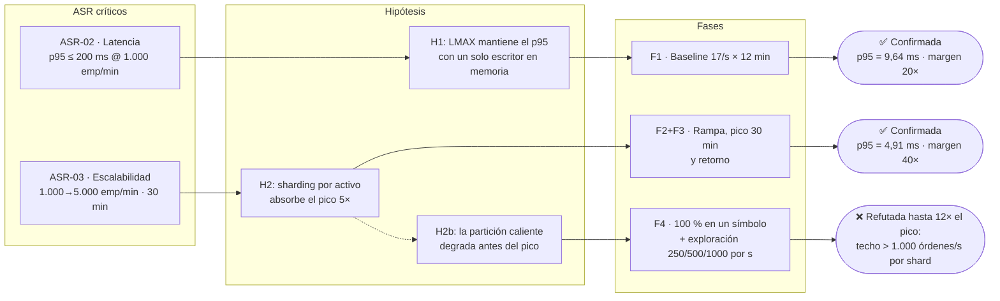
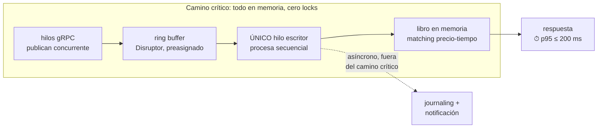
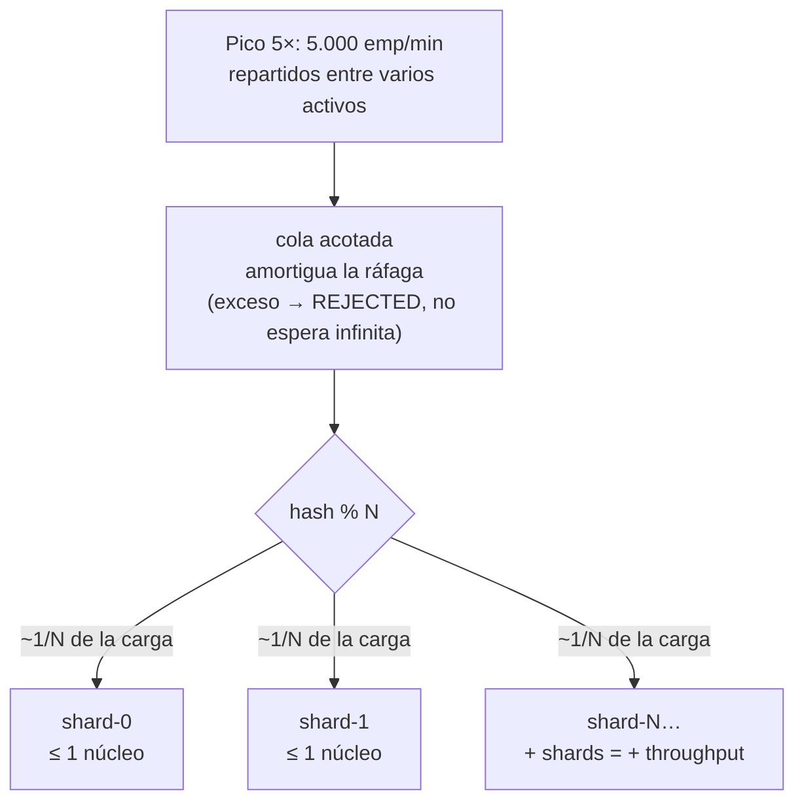
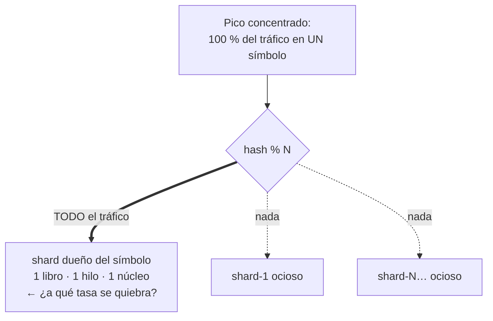
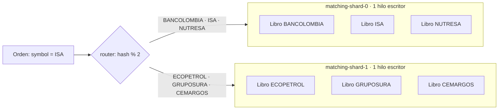
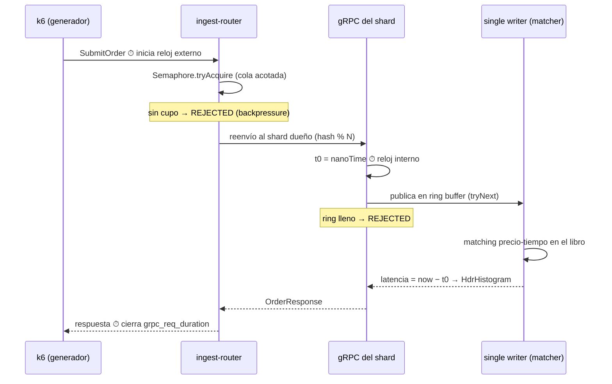
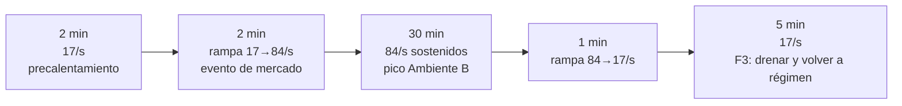
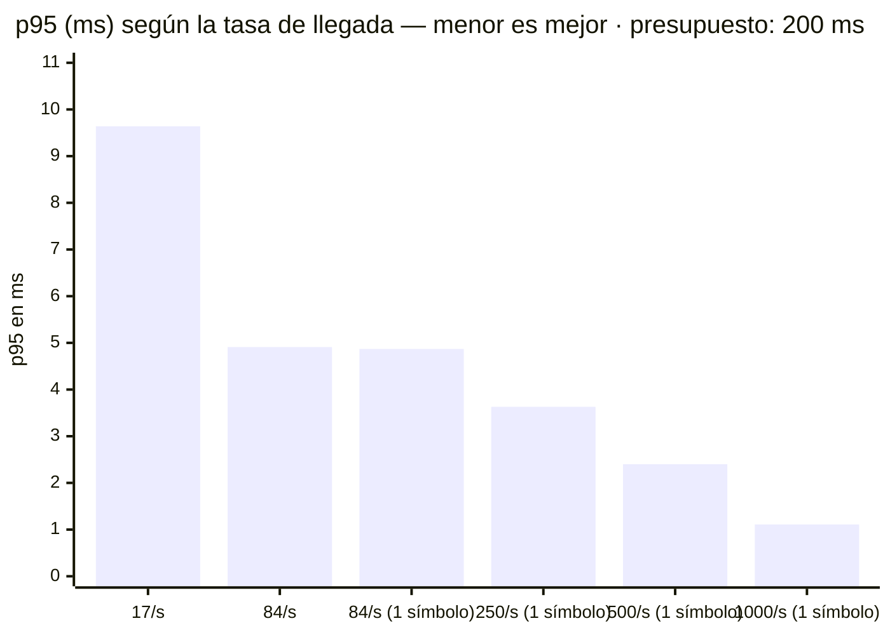

# E01 — Validar el patrón LMAX (motor en memoria con un único escritor) para el emparejamiento

**Reto 1: Desempeño · ARTI4109 · Pestaña Experiments de Helix**
Estado: **Ejecutado y cerrado** · Espejo de Helix actualizado el 1 de septiembre de 2026 (corridas del 30 de agosto).

## El experimento de un vistazo

---

## Pestaña Planning

### Design Hypothesis

*Redacción ajustada tras la retroalimentación del 01-sep: la hipótesis es la **apuesta de diseño** — la medida exigida vive en el escenario de calidad enlazado y no se transcribe aquí.*

**H1 — Latencia (ASR-02):** si el motor de emparejamiento implementa el patrón LMAX —libro de órdenes en memoria por activo, un único hilo escritor por partición (single writer) alimentado por un ring buffer (Disruptor), con journaling y notificación asíncronos fuera del camino crítico—, entonces se cumplirá la medida del escenario Critical de latencia enlazado abajo, bajo la carga de su Ambiente A, porque el procesamiento secuencial en memoria elimina bloqueos y contención y deja el costo por evento en el orden de microsegundos.

*La mecánica de H1: el camino crítico es una línea recta en memoria — nadie espera un lock, y lo lento (persistir, notificar) sale del camino:*

**H2 — Escalabilidad transitoria (ASR-03):** si la ingesta gRPC enruta cada orden por sharding determinístico (hash del símbolo % N) hacia N shards LMAX independientes, con cola acotada como amortiguación de ráfagas, entonces se cumplirá la medida del escenario Critical de escalabilidad enlazado abajo durante toda la ventana de pico de su Ambiente B —siempre que la carga se reparta entre varios activos—, porque el throughput total crece agregando shards sin exigir más de un núcleo por partición. La pregunta de fondo que este experimento debe responder no es solo "¿funciona con el N elegido?" sino **cuál es el N mínimo de shards** que satisface el contrato — un número que no se sabe de antemano y se halla con las corridas.

*La mecánica de H2: el pico 5× se divide entre N shards que no comparten nada — cada uno recibe ~1/N de la carga, y si el pico creciera, la respuesta es sumar shards, no acelerar uno:*

**H2b — Partición caliente (exploratoria, subordinada a H2):** si el pico se concentra al 100 % en un solo activo, se espera que la medida del escenario enlazado deje de cumplirse antes de alcanzar el pico de Ambiente B, porque el techo de un shard es un solo núcleo por diseño; la Fase 4 busca ese punto de quiebre real, no un aprobado/reprobado.

*La mecánica de H2b — el caso donde el sharding no ayuda: un solo símbolo tiene un solo libro dueño, así que todo el pico cae en un shard y los demás miran. Como el libro es indivisible, ese único núcleo es el techo, y F4 pregunta a qué tasa se alcanza:*

*(Resultado adelantado: la degradación esperada nunca llegó — el techo de ese único núcleo resultó estar por encima de 12× el pico contractual; ver Results.)*

### Linked Quality Scenarios

| Escenario | Atributo | ASR |
|---|---|---|
| Materializar una orden de compra mediante emparejamiento | Latency · **Critical** · p95 ≤ 200 ms (Ambiente A) | ASR-02 |
| Materializar una orden de compra mediante emparejamiento | Scalability · **Critical** · ramp-up 1 min, p95 ≤ 200 ms (Ambiente B) | ASR-03 |

*Son los dos únicos escenarios con prioridad Critical del árbol de Requirements & Quality: el experimento cubre exactamente los ASR críticos (uno de latencia, uno de escalabilidad).*

### Tactics and Patterns

Patrón LMAX Architecture (Disruptor): procesador de eventos secuencial con libro de órdenes en memoria y un único escritor lógico por partición de activo, entrada por ring buffer sin bloqueos (mechanical sympathy: los datos del activo permanecen calientes en la caché del núcleo asignado). Sharding por activo: enrutamiento determinístico hash(símbolo) % N desde el servicio de ingesta gRPC/Protobuf hacia N shards independientes; la exclusión mutua queda garantizada por construcción —no por locks— y aporta de paso la garantía de no doble-materialización.

**Cómo reparte el sharding** — no hay un shard por símbolo: hay N shards fijos y cada uno es dueño de *varios* símbolos (con un libro por símbolo). El invariante es que todas las órdenes de un mismo símbolo caen siempre en el mismo shard, así el único escritor del shard es, transitivamente, el único escritor de cada uno de sus libros:

Tácticas de latencia: mantener los datos del camino crítico en memoria, reducir overhead evitando bloqueos y contención, mover journaling y notificación a etapas asíncronas. Tácticas de escalabilidad: particionamiento por activo (el throughput total escala agregando shards) y cola acotada con backpressure en la ingesta (se prefiere frenar la entrada antes que prometer una latencia incumplible). Alternativas descartadas: pool de workers con colas bloqueantes (reintroduce la contención), locks de grano fino por nivel de precio (deadlocks y latencia impredecible), PostgreSQL con SELECT FOR UPDATE (se mantiene como línea base de comparación), modelo de actores (overhead de mailbox), bloqueo distribuido (salto de red en el camino crítico).

### Experiment Design

PoC mínimo en una sola máquina (mínimo 8 vCPU/16 GB, ideal 12+/32), todo Java 21 sobre Docker Compose —sin Kubernetes ni broker—: generador k6 + xk6-grpc (modelo abierto de tasa de llegada, evita coordinated omission) → servicio de ingesta gRPC/Protobuf con router de sharding hash(símbolo) % N y cola acotada → N motores LMAX (Disruptor 4.x, libro en memoria por activo, journaling asíncrono a archivo). Aislamiento por cpuset: núcleos dedicados al motor, separados del generador, para no contaminar los percentiles. Precalentamiento sin medir (estabilizar JIT y GC).

El camino de una orden a través del montaje (los dos relojes de la medición marcados):

Corridas:

- **F1 — Baseline (ASR-02):** 1.000 emp/min estocásticos (≈17/s) repartidos en ≥3 activos, 10–15 min; criterio p95 ≤ 200 ms.
- **F2 — Rampa transitoria (ASR-03):** rampa de 1.000 a 5.000 emp/min en pocos minutos y sostenida hasta 30 min repartida entre activos, corrida con N=2 y N=4 shards; criterio: p95 ≤ 200 ms durante toda la ventana y backlog de la cola sin crecimiento descontrolado.
- **F3 — Retorno a régimen:** bajar a 1.000/min y verificar que el backlog drena y el p95 vuelve al valor de F1 (la escalabilidad exigida es transitoria, no permanente).
- **F4 — Partición caliente (exploratoria, sin criterio binario):** mismo perfil de F2 con el 100 % del tráfico en un solo activo, para encontrar el punto de quiebre de un shard.

El perfil de F2+F3 (el mismo que usa F4, cambiando solo la distribución de símbolos):

Métricas: latencia arribo→materialización p50/p95/p99/p99.9 medida en el generador y contrastada con HdrHistogram interno del motor; throughput real vs. objetivo; profundidad de cola/backlog; tasa de rechazo (backpressure); pausas de GC (JFR); CPU por proceso. Los thresholds de k6 marcan la corrida como fallida si p95 > 200 ms en vivo.

Limitación declarada: el tráfico corre por loopback —no representa la red de 1 Gbps de TEC-2 ni alta disponibilidad—; el PoC valida el patrón, no el dimensionamiento final.

### Experiment planning

**Required resources:** Java 21 + LMAX Disruptor 4.x + gRPC/Protobuf; Docker Compose (sin Kubernetes ni broker); k6 con extensión xk6-grpc (compilado con xk6) como generador de carga en modelo abierto, con thresholds en vivo y exportación a Prometheus/Grafana para las curvas del informe; HdrHistogram y JFR para percentiles y pausas de GC; 1 máquina de 8 vCPU/16 GB (ideal 12 vCPU/32 GB) con núcleos aislados por cpuset; scripts de orquestación y análisis.

**Architecture elements involved:** Servicio de ingesta gRPC con router de sharding por símbolo (hash % N) y cola acotada con backpressure; N shards del motor de emparejamiento (LMAX, libro en memoria por activo, un escritor por partición); journaling asíncrono (stub a archivo); generador de carga externo. Excluidos por no incidir en ASR-02/03: fan-out de notificaciones, proyecciones CQRS, persistencia, broker y autoescalado (declarados como limitación del PoC). Vistas afectadas: funcional y concurrencia.

**Estimated effort:** 2 personas × 1 semana (≈ 40 horas-persona): 2 días ingesta gRPC + router de sharding + motor LMAX; 1 día generador k6 e instrumentación; 1 día corridas F1–F4; 1 día análisis, informe y decisión (Paso 8).

---

## Pestaña Results & analysis

**Results** (~560.000 órdenes en 7 corridas, 100 % procesadas, 0 rechazos — detalle y salidas crudas en la [evidencia de corridas](evidencia-corridas.html)):

| Corrida | Carga | p95 | Veredicto |
|---|---|---|---|
| F1 baseline | 17/s repartidos | 9,64 ms | ✅ margen ≈ 20× |
| F2+F3 rampa+pico+retorno | 17→84/s repartidos | 4,91 ms | ✅ margen ≈ 40× |
| F4 contractual | 84/s en 1 símbolo | 4,87 ms | sin degradación |
| F4-explore | 250 / 500 / 1000 por s en 1 símbolo | 3,63 / 2,40 / 1,11 ms | **techo no alcanzado** |

El hallazgo central en un gráfico — **la latencia mejora al subir la carga** (efecto de lote del Disruptor: más ráfaga → más eventos por pasada del único escritor → menor costo amortizado por evento; lo contrario de un sistema con locks):

**Analysis of results:** el patrón es coherente en las siete corridas: latencia decreciente con la carga, backpressure jamás activado (0 rechazos), máximos aislados explicados por el arranque en frío (JIT), y doble medición k6/HdrHistogram sin divergencias relevantes. Validez: host único por loopback — los valores absolutos no se extrapolan a TEC-2; el patrón de comportamiento y los órdenes de magnitud de los márgenes sí. La comparación N=2 vs N=4 bajo estrés se descartó razonadamente: exigiría superar el techo (no hallado) de cada shard, punto donde el host único deja de ser instrumento confiable; la aditividad entre shards queda argumentada por construcción (no comparten nada).

**Links & evidence:** [Repositorio](https://github.com/MATI-MBIT/arqsoft-reto-1) · [Sitio de documentación](https://mati-mbit.github.io/arqsoft-reto-1/) · [Evidencia de corridas](https://mati-mbit.github.io/arqsoft-reto-1/evidencia-corridas.html) (resumen + salidas crudas de k6).

**Conclusion:** **H1 y H2 confirmadas** con márgenes de 20–40×; **H2b refutada en todo el rango explorado** — la partición caliente, la hipótesis de mayor riesgo del diseño y criterio de parada de la iteración, no degrada el servicio ni a 12× el pico contractual concentrado en una sola partición: pasa de "amenaza al SLA" a "límite de capacidad medido" (techo > 1.000 órdenes/s por shard como cota inferior).

**Architectural Decision (Paso 8 de ADD):** **ADOPTAR** LMAX (libro en memoria, único escritor por partición sobre ring buffer) + sharding determinístico por activo + cola acotada con backpressure como arquitectura del motor. La Iteración 1 cierra: su criterio de parada quedó resuelto afirmativamente. Deuda y trabajo futuro: repetir el diseño en el banco de 3 nodos (TEC-2) con red real; re-evaluar la estrategia de espera del Disruptor (Blocking en el PoC) con datos; profundizar el techo del shard solo si el negocio proyecta volúmenes de otro orden de magnitud; siguiente experimento candidato: E02 — fan-out de notificaciones (ASR-04).

---

## Refinamientos tras la retroalimentación (sesión 01-sep-2026)

De la revisión de experimentos con el profesor salieron cinco ajustes; su estado:

1. **Hipótesis sin transcribir el ASR** *(directo al grupo)* — ✅ aplicado: H1/H2/H2b reformuladas como apuestas de diseño que referencian el escenario enlazado; la medida vive en el escenario.
2. **Demostrar empíricamente el aislamiento del sharding** *(directo al grupo: "correlacionen IDs de entrada y salida, no solo el argumento matemático")* — ✅ instrumentado: cada respuesta gRPC trae `shard_id`, y el script k6 ahora verifica en vivo que cada símbolo sea respondido siempre por el mismo shard (contador `shard_routing_violations`, threshold `count==0` en las fases oficiales). Aplica a toda corrida futura; las corridas ya ejecutadas conservan el argumento por construcción (`floorMod(hashCode, N)` es determinístico).
3. **Hallar el N mínimo de shards, no solo validar el N elegido** *(recomendación general más fuerte de la sesión)* — 🔶 en curso: el techo por shard medido en F4-explore (> 1.000 órdenes/s) predice que **N mínimo = 1** para el contrato; queda pendiente la corrida de evidencia directa `make f2-n1` (perfil F2 corto sobre un solo shard). Con ella, la conclusión de escalabilidad se reformula: N=1 basta para el contrato, N=2 es margen y N se dimensiona con el techo medido.
4. **Protocolo explícito y repeticiones** *(a otros grupos)* — 🔶 parcial: el protocolo es ejecutable (`Makefile` + `run-e2e.sh`, resultados versionables por corrida); la significancia se sustenta en el volumen intra-corrida (12k–167k muestras por fase). La repetición de F1 (3–5 corridas para variabilidad entre corridas) queda como decisión abierta del equipo.
5. **Arribo verdaderamente estocástico** *(a otros grupos, aplicable)* — ⚠️ limitación declarada: los ejecutores `*-arrival-rate` de k6 espacian los arribos de forma uniforme (a 17/s, uno cada ~59 ms); la aleatoriedad de la corrida está en símbolo, lado, precio y cantidad, no en el instante de llegada. Un arribo Poisson real requeriría otro generador o jitter artesanal; se declara como aproximación del modelo abierto y se argumenta que, con márgenes de 20–40×, la sensibilidad al patrón de llegada es baja. Decisión final pendiente de discusión del equipo.

## Notas de trazabilidad para la validación

- El criterio de éxito quedó unificado en **p95 ≤ 200 ms** en todo E01 (hipótesis, fases, thresholds y decisión anticipada), consistente con la medida de los escenarios en Helix; p99/p99.9 se registran como métricas observadas.
- Del documento del compañero (*Escenario de Pruebas PoC ASR-02/ASR-03*) se conservaron: hipótesis H1/H2/H2b, las 4 fases con precalentamiento, el modelo abierto de llegada (coordinated omission), el aislamiento por cpuset, la doble medición generador/motor, las alternativas descartadas y la limitación de validez del host único.
- Se recortó para viabilidad: Kubernetes (k3d), Redpanda, HPA, StatefulSets y gateway Spring Boot. La amortiguación por log se reemplazó por cola acotada con backpressure en el router; broker y autoescalado quedan declarados como limitación.
- Pendiente del equipo: el documento del compañero cita decisiones D-01…D-10 de un archivo `Decisiones-Arquitectura-Intermedia_ok.md` que no está en Helix ni en el proyecto; conviene registrarlas como ADRs en el modo Razonamiento del diagrama.
