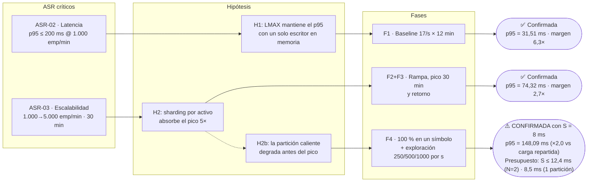
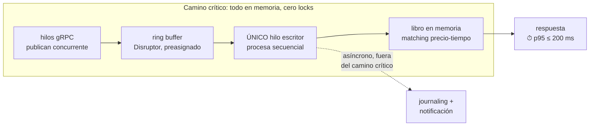
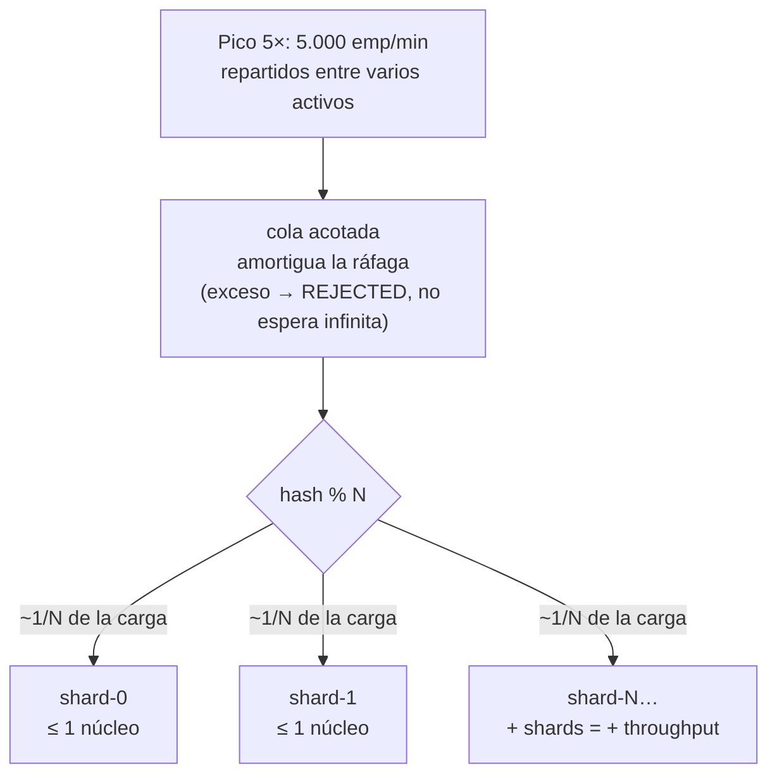
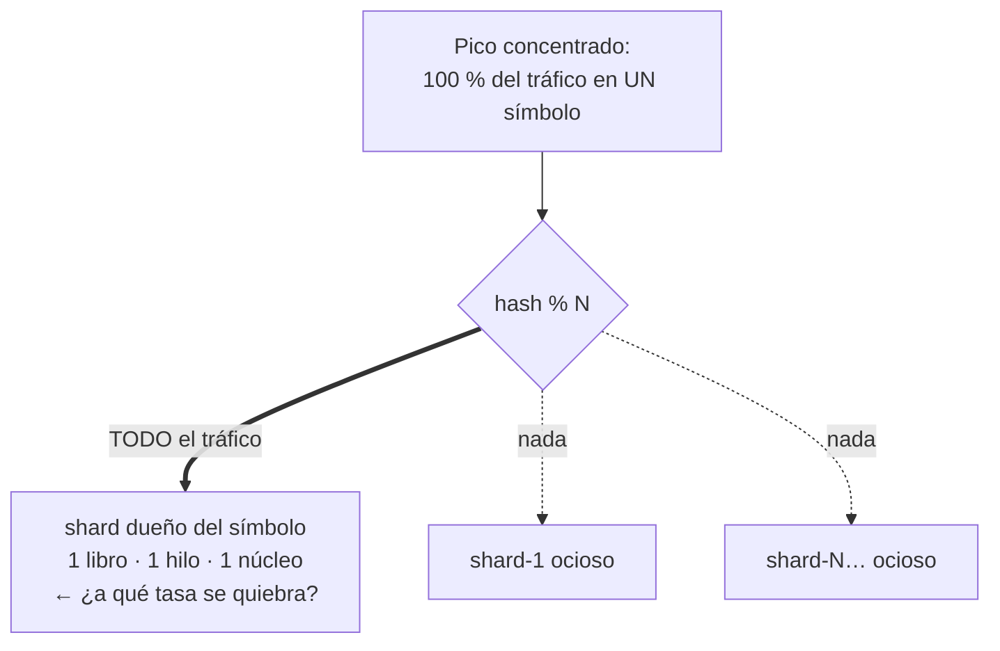
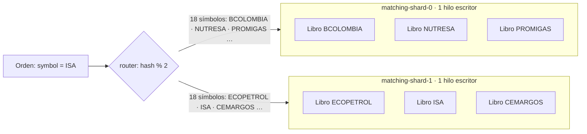
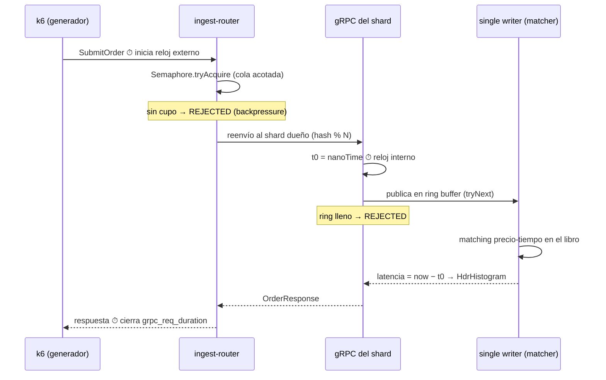
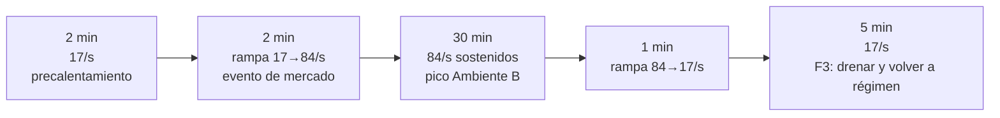
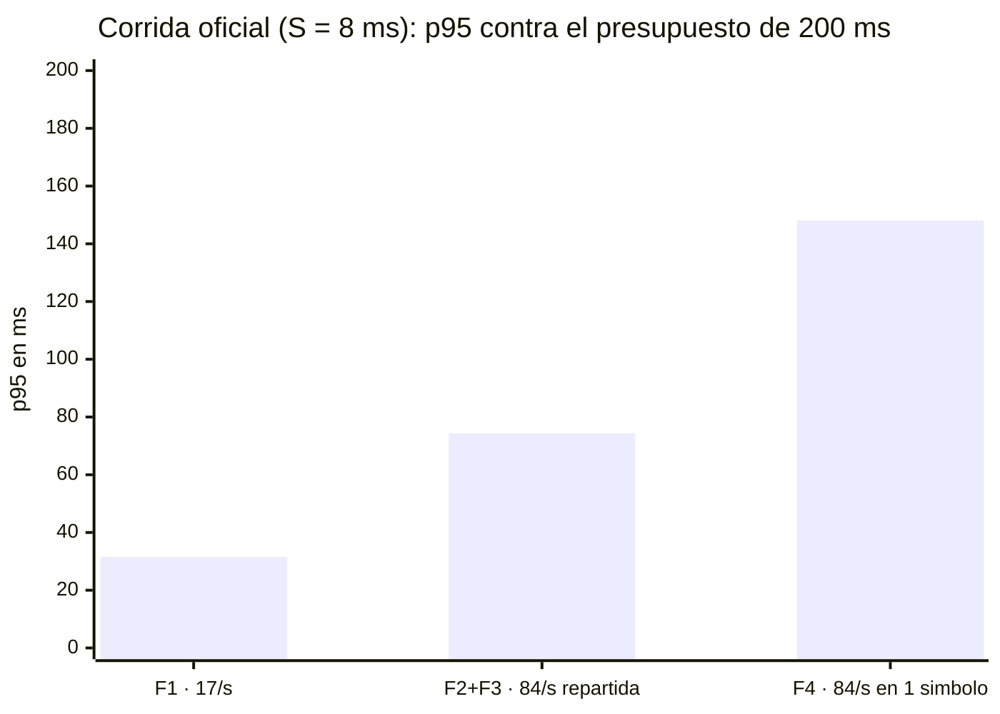
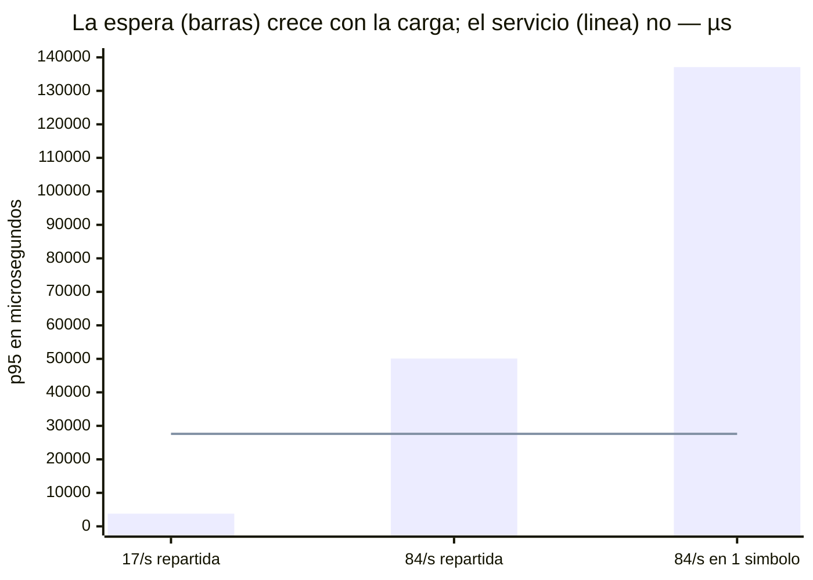

# E01 — Validar el patrón LMAX (motor en memoria con un único escritor) para el emparejamiento

**Reto 1: Desempeño · ARTI4109** · Estado: **Ejecutado** (corridas vigentes: 2–3 de septiembre de 2026). La pestaña Experiments de Helix aún refleja la versión anterior; el equipo la sincroniza al dar el experimento por firme.

## Resumen

> Con un costo declarado de **8 ms por orden**, el patrón cumple los dos ASR críticos: **ASR-02 con p95 = 31,51 ms** (margen 6,3×) y **ASR-03 con p95 = 74,32 ms** (margen 2,7×). La partición caliente **duplica el p95** (148,09 ms) sin romper el contrato. La capacidad se reporta como **presupuesto**: el patrón sostiene el ASR mientras procesar una orden cueste menos de **12,4 ms** con el pico repartido en 2 particiones, o **8,5 ms** si todo cae en una.
>
> **Decisión: adoptar el patrón**, condicionado a verificar ese presupuesto contra el costo real de la lógica de negocio cuando exista.

## Referencias rápidas

| Término | Qué es |
|---|---|
| **Ambiente A / B** | Operación normal: 1.000 emparejamientos/min (~17/s) · Pico de mercado: 5.000/min (~84/s), hasta 30 min. |
| **F1 · F2 · F3 · F4** | Las fases: baseline (A) · rampa y pico sostenido (B) · retorno a régimen · partición caliente (todo el tráfico en un símbolo). |
| **S** (`BIZ_MICROS`) | Costo medio de procesar una orden. El PoC no implementa la lógica de negocio, así que S se inyecta como parámetro declarado de cada corrida. |
| **1/S y ρ** | El techo de una partición (un escritor único serializa: máx. 1/S órdenes/s; 125 órd/s con S = 8 ms) y su ocupación (ρ = tasa × S). |
| **Mezcla 90/9/1** | La distribución del costo por orden: 90 % simples (4,6 ms), 9 % medianas (27,6 ms), 1 % pesadas (138 ms). Media 8 ms, Cs² = 3,34. |
| **Los cuatro umbrales** | Lo que k6 exige en vivo en las fases oficiales: p95 < 200 ms · 0 rechazos por backpressure · 0 violaciones de routing · 0 iteraciones descartadas. |
| **TEC-2** | Restricción del reto: el banco real es de 3 nodos con red de 1 Gbps. El PoC corre en una máquina — valida el patrón, no el dimensionamiento. |

## El experimento de un vistazo

---

## Pestaña Planning

### Design Hypothesis

**H1 — Latencia (ASR-02):** si el motor implementa el patrón LMAX —libro de órdenes en memoria por activo y un único hilo escritor por partición, alimentado por un ring buffer (Disruptor), con journaling y notificación asíncronos fuera del camino crítico—, entonces se cumple la medida del escenario Critical de latencia enlazado abajo, bajo la carga de su Ambiente A. La razón: el procesamiento secuencial en memoria elimina bloqueos y contención.

**H2 — Escalabilidad transitoria (ASR-03):** si la ingesta gRPC enruta cada orden por sharding determinístico (hash del símbolo % N) hacia N shards LMAX independientes, con cola acotada como amortiguación, entonces se cumple la medida del escenario Critical de escalabilidad enlazado abajo durante toda la ventana de pico de su Ambiente B — siempre que la carga se reparta entre varios activos. La razón: el throughput total crece agregando shards, sin exigir más de un núcleo por partición. El experimento debe hallar además el **N mínimo** que satisface el contrato.

**H2b — Partición caliente (exploratoria, subordinada a H2):** si el pico se concentra al 100 % en un solo activo, la medida del escenario deja de cumplirse antes de alcanzar el pico de Ambiente B, porque el techo de un shard es un solo núcleo por diseño. La Fase 4 busca ese punto de quiebre, no un aprobado o reprobado. *Veredicto: se manifiesta — la partición caliente duplica el p95 (ver Results).*

### Linked Quality Scenarios

| Escenario | Atributo | ASR |
|---|---|---|
| Materializar una orden de compra mediante emparejamiento | Latency · **Critical** · p95 ≤ 200 ms (Ambiente A) | ASR-02 |
| Materializar una orden de compra mediante emparejamiento | Scalability · **Critical** · ramp-up 1 min, p95 ≤ 200 ms (Ambiente B) | ASR-03 |

*Los dos únicos escenarios Critical del árbol de Requirements & Quality: el experimento cubre exactamente los ASR críticos.*

### Tactics and Patterns

El patrón LMAX Architecture (Disruptor): libro de órdenes en memoria, un único escritor lógico por partición de activo, entrada por ring buffer sin bloqueos, datos calientes en la caché del núcleo (*mechanical sympathy*). El sharding por activo enruta cada orden con hash(símbolo) % N hacia N shards independientes: la exclusión mutua queda garantizada por construcción —no por locks— y aporta la garantía de no doble-materialización.

**Cómo reparte el sharding:** hay N shards fijos y cada uno es dueño de *varios* símbolos, con un libro por símbolo — no un shard por símbolo. Todas las órdenes de un símbolo caen siempre en el mismo shard, así que el único escritor del shard es el único escritor de cada uno de sus libros. El reparto de los 36 símbolos del generador está verificado: 18/18 con N=2, 9/9/9/9 con N=4.

Tácticas de latencia: datos del camino crítico en memoria; sin bloqueos ni contención; journaling y notificación asíncronos. Tácticas de escalabilidad: particionamiento por activo y cola acotada con backpressure — se prefiere frenar la entrada antes que prometer una latencia incumplible.

Alternativas descartadas: pool de workers con colas bloqueantes (reintroduce la contención); locks por nivel de precio (deadlocks, latencia impredecible); PostgreSQL con `SELECT FOR UPDATE` (línea base de comparación); modelo de actores (overhead de mailbox); bloqueo distribuido (salto de red en el camino crítico).

### Experiment Design

PoC en una sola máquina (8+ vCPU/16 GB), Java 21 sobre Docker Compose, sin Kubernetes ni broker. La cadena: k6 con gRPC nativo, en modelo abierto con arribo estocástico (desplazamiento exponencial por iteración, Ca² = 0,89) → router de sharding con cola acotada → N motores LMAX (Disruptor 4.0.0). El precalentamiento no se mide.

**Diferencias entre el diseño y lo construido:**

| Elemento del diseño | Estado en el PoC |
|---|---|
| Journaling asíncrono a archivo | ❌ no implementado — la cláusula de H1 sobre sacarlo del camino crítico no fue puesta a prueba |
| Aislamiento por `cpuset` | ❌ no aplicado (macOS: Docker corre en VM) · el confinamiento se probó con cuotas de cgroup (`cpus=1.0` por partición: sin costo medible) |
| JFR para pausas de GC | ❌ no configurado — los atascos aislados quedan sin causa atribuible |
| CPU por proceso | ✅ medida en la corrida oficial: 23,6 % de un núcleo en media, 58,3 % máximo |
| Exportación a Prometheus/Grafana | ❌ no implementada — las curvas salen de k6 y del log del motor |

El camino de una orden, con los dos relojes de la medición:

Corridas:

- **F1 — Baseline (ASR-02):** 17/s estocásticos sobre 36 símbolos, 12 min. Criterio: los cuatro umbrales.
- **F2 — Rampa transitoria (ASR-03):** 17→84/s, pico sostenido 30 min, con N=2. Criterio: los cuatro umbrales durante toda la ventana, backlog sin crecimiento descontrolado.
- **F3 — Retorno a régimen:** bajar a 17/s y verificar que el backlog drena y el p95 vuelve al baseline.
- **F4 — Partición caliente (exploratoria):** perfil de F2 con el 100 % del tráfico en un símbolo, más exploración a 250/500/1000 órd/s.

Métricas: p50/p95/p99/p99.9 medidos en el generador y contrastados con el HdrHistogram del motor; la **descomposición interna en espera (cola del ring) y servicio (matching + modelo de negocio)**, que distingue «shardear más» de «abaratar la orden»; rechazos e iteraciones descartadas.

Limitaciones declaradas: el techo de una partición es `1/S`, así que toda cifra de capacidad depende del costo por orden — por eso S es un parámetro barrido (`make sweep-service`) y la conclusión es un presupuesto, no un número. El tráfico corre por loopback: sin la red de TEC-2 ni alta disponibilidad, el PoC valida el patrón, no el dimensionamiento.

### Experiment planning

**Required resources:** Java 21 + Disruptor 4.0.0 + gRPC/Protobuf; Docker Compose; k6 ≥ 0.49 con gRPC nativo; HdrHistogram; una máquina de 8+ vCPU/16 GB; `Makefile` + `run-e2e.sh` como orquestación. *(Previstos y no usados: Prometheus/Grafana, JFR, cpuset.)*

**Architecture elements involved:** ingesta gRPC con router de sharding y cola acotada; N shards LMAX; generador externo. Excluidos por no incidir en ASR-02/03: journaling, fan-out de notificaciones, CQRS, persistencia, broker, autoescalado. Vistas afectadas: funcional y concurrencia.

**Estimated effort:** 2 personas × 1 semana (≈ 40 horas-persona): 2 días de construcción, 1 de generador e instrumentación, 1 de corridas, 1 de análisis y decisión.

---

## Pestaña Results & analysis

**Results** — detalle, hallazgos y salidas crudas en la [evidencia de corridas](evidencia-corridas.html).

### Corrida oficial (S = 8 ms) — la que sostiene el veredicto

S = 8 ms modela el escenario más exigente que sigue siendo plausible: riesgo y saldos consultados a un servicio o BD en cada orden.

| Fase | Carga | p95 (k6) | Motor p95 | Motor / total | Veredicto |
|---|---|---|---|---|---|
| **F1 — ASR-02** | 17/s en 36 símbolos | **31,51 ms** | 27,76 ms | 88 % | ✅ margen 6,3× |
| **F2+F3 — ASR-03** | 17→84/s · pico 30 min | **74,32 ms** | 73,15 ms | 98 % | ✅ margen 2,7× |
| **F4 — partición caliente** | 84/s en 1 símbolo | **148,09 ms** | 147,07 ms | 99 % | ⚠️ margen 1,35× |
| F4-explore | 250/500/1000 por s en 1 símbolo | 6,97 / 7,03 / 7,03 **s** | ídem | ~100 % | ❌ saturado |

418.610 órdenes, 100 % procesadas, 0 rechazos, 0 violaciones de routing; las fases oficiales pasaron sus cuatro umbrales.

**Analysis of results.** Los dos relojes miden el mismo estadístico en dos puntos, así que su resta atribuye el tiempo: **el motor explica del 88 % al 99 % de la latencia**; el transporte es ruido. El **servicio no depende de la carga** (27,60 ms de p95 en las seis fases) **y la espera sí** — toda la degradación entra por la cola, y esa separación es la que decide entre abaratar la orden y agregar particiones.

S es una media, no el costo de cada orden: la clase pesada del 1 % cuesta 138 ms de servicio ella sola — por eso el p99 se pega a 140 ms aunque el p95 esté en 31. El veredicto es robusto a la forma de la distribución (con una lognormal de igual media y Cs², el p95 da 63,3 ms contra 74,7); la cola no lo es: el p99.9 empeora un 23 % sin cota superior.

### Patrón aislado (S = 0) — referencia

Con la lógica de negocio apagada el motor solo ejecuta un `match()` de ~13 µs: mide el costo propio del patrón, no un motor real. Sus cifras no son extrapolables — el «techo > 1.000 órd/s» que produce es una propiedad del `TreeMap`.

| Fase | Carga | p95 | Veredicto |
|---|---|---|---|
| F1 | 17/s en 36 símbolos | 7,54 ms | ✅ margen ≈ 27× |
| F2+F3 | 17→84/s repartidos | 4,58 ms | ✅ margen ≈ 44× |
| F4 | 84/s en 1 símbolo | 4,00 ms | sin degradación |
| F4-explore | 250/500/1000 por s | 3,54 / 2,03 / 1,20 ms | techo no alcanzado |

Lo que esta corrida establece: el patrón cuesta microsegundos y el 76 % es despertar al hilo escritor (`BlockingWaitStrategy` — la palanca de latencia que queda cuando la lógica es barata); F3 drena por debajo del baseline (137 µs contra 203); el aislamiento del sharding quedó verificado en vivo (0 violaciones sobre 179.669 órdenes); y existen atascos aislados de cientos de milisegundos que sin JFR no tienen causa atribuible.

**Links & evidence:** [Repositorio](https://github.com/MATI-MBIT/arqsoft-reto-1) · [Sitio de documentación](https://mati-mbit.github.io/arqsoft-reto-1/) · [Evidencia de corridas](https://mati-mbit.github.io/arqsoft-reto-1/evidencia-corridas.html).

**Conclusion:**

**H1 y H2 se cumplen con S = 8 ms** — márgenes 6,3× y 2,7×, arribo estocástico, sharding balanceado y verificado. La cláusula «sin exigir más de un núcleo por partición» quedó respaldada por medición (23,6 % de un núcleo en media; con cuota de `cpus=1.0` el p95 no cambia) y por estructura: a las 125 órd/s del techo `1/S`, el trabajo ocupa exactamente el 100 % de un núcleo — el techo de throughput y el límite de un núcleo son el mismo hecho.

**H2b se confirmó.** Misma tasa y mismo S; solo cambia la distribución de símbolos, y el p95 se duplica (74,32 → 148,09 ms) con el servicio invariante y la espera ×2,7. Cumple el ASR con 1,35× de margen.

**El N mínimo es condicional al costo por orden:** N = 1 basta si S ≤ ~8,5 ms (F4 es funcionalmente la corrida N=1, y pasó); N = 2 sube el presupuesto a 12,4 ms. N no se elige por el patrón: se dimensiona contra la lógica de negocio real. Repartir entre 2 particiones sube el presupuesto 1,46×, no 2×, porque shardear baja la espera pero el servicio también es latencia.

> **Shardear reduce la espera, nunca el servicio.** Ninguna cantidad de particiones permite que una orden que cuesta 200 ms cumpla un SLA de 200 ms.

Queda abierto el **p99.9, que excede los 200 ms en el pico** (231 ms en F2+F3, 352 en F4): el contrato es sobre p95 y se cumple, pero si se endureciera a p99, S = 8 ms no alcanzaría — y la cifra es un piso, porque la mezcla está acotada y la lógica real no lo estará.

**Architectural Decision (Paso 8 de ADD):** **ADOPTAR** LMAX + sharding determinístico por activo + cola acotada con backpressure como arquitectura del motor. La Iteración 1 cierra cuando el equipo verifique el presupuesto (12,4 ms con N=2; 8,5 ms en partición caliente) contra el costo real de la lógica de negocio. Deuda y trabajo futuro: repetir el diseño en TEC-2 con red real; re-evaluar la estrategia de espera del Disruptor con datos; siguiente experimento candidato: E02 — fan-out de notificaciones (ASR-04).
