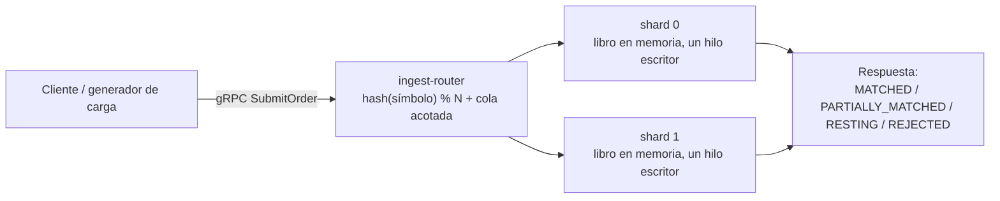
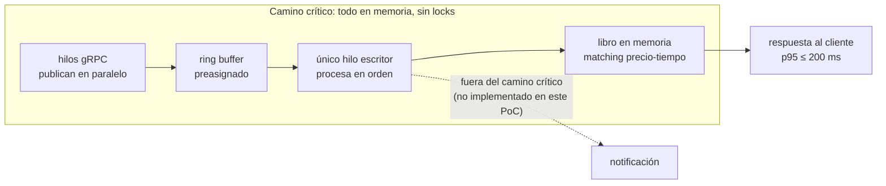
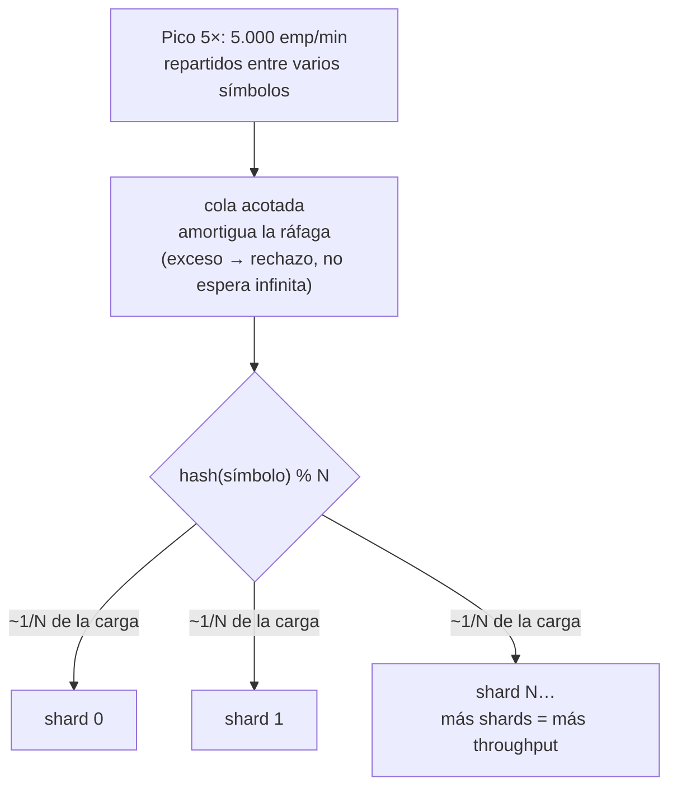
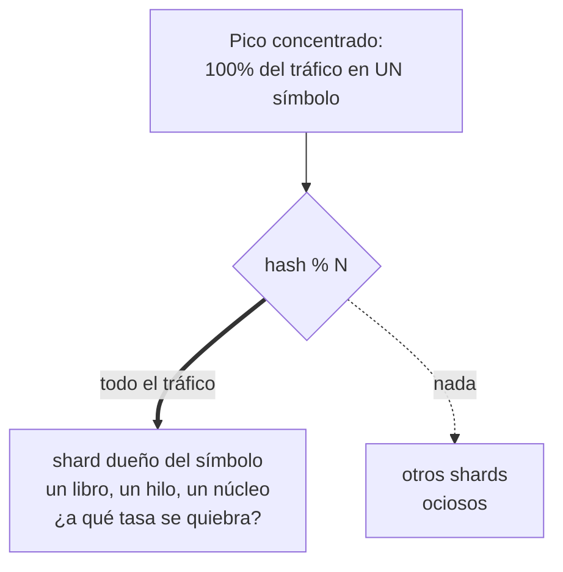
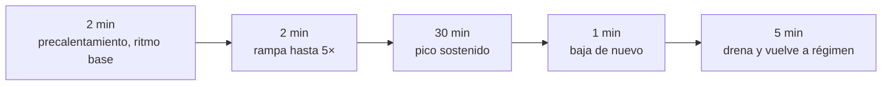
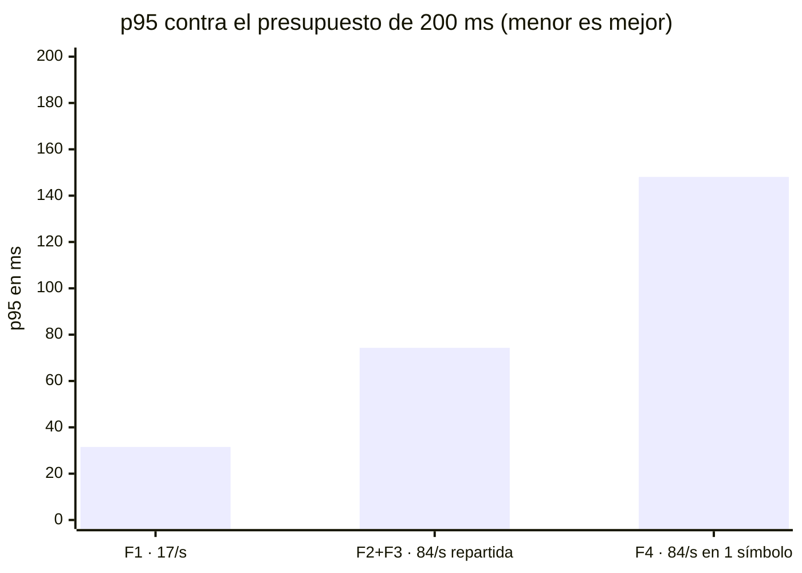

# El experimento

Este proyecto construye y prueba el motor de emparejamiento de una bolsa de valores: el servicio que recibe órdenes de compra y venta de acciones por gRPC y decide cuándo una orden de compra y una de venta coinciden en precio y cierran un trato. Este documento resume la misma información que la ficha técnica completa —[Experimento E01](experimento-e01.html)— con menos detalle de implementación (sin fórmulas derivadas, sin código, sin líneas de archivo), pensado para un equipo técnico que no conoce todavía este sistema en particular.

## El sistema, en una imagen

Cada acción (símbolo) tiene su propio **libro de órdenes** en memoria — la lista de compradores y vendedores esperando, ordenada por precio. Las órdenes entran por gRPC a un **router de ingesta**, que decide a qué partición del motor pertenece cada símbolo y reenvía la orden ahí.

## Las dos preguntas que el experimento responde

El diseño se valida contra dos requisitos de calidad críticos (ASR — Architecturally Significant Requirement):

| ASR | Atributo | Criterio |
|---|---|---|
| ASR-02 | Latencia | p95 ≤ 200 ms a 1.000 emparejamientos/min (carga base) |
| ASR-03 | Escalabilidad transitoria | rampa de 1.000 a 5.000 emparejamientos/min, sostenida 30 min, p95 ≤ 200 ms |

## H1 — El patrón LMAX responde ASR-02

**La apuesta:** si el libro de órdenes vive en memoria y un único hilo escritor por partición lo modifica —alimentado por un *ring buffer* (buffer circular preasignado, sin locks) tipo Disruptor, con journaling y notificaciones fuera del camino crítico—, entonces se cumple el criterio de latencia. La razón: procesar en memoria y en secuencia, sin que dos hilos compitan por el mismo dato, elimina la espera que normalmente introduce la sincronización.

## H2 — El sharding por símbolo absorbe el pico de 5×

**La apuesta:** si el router reparte cada orden con una función determinística —`hash(símbolo) % N`— entre N particiones (shards) independientes, con una cola acotada que amortigua las ráfagas (rechazando en vez de acumular sin límite), entonces se cumple el criterio de escalabilidad mientras la carga se reparta entre varios símbolos. La razón: el throughput total crece agregando particiones, sin que ninguna necesite más de un núcleo.

La pregunta de fondo no era solo si funcionaba con el N elegido, sino **cuál es el N mínimo** que satisface el contrato — un número que no se conocía de antemano.

Un shard no es dueño de un solo símbolo: hay N shards fijos y cada uno es dueño de *varios* símbolos. El invariante es que **un símbolo siempre cae en el mismo shard** — así el único escritor de ese shard es, transitivamente, el único escritor de cada uno de sus libros.

## H2b — La partición caliente: el caso donde el sharding no ayuda

**La apuesta exploratoria:** si el pico se concentra al 100 % en un solo símbolo, se espera que el criterio deje de cumplirse antes de llegar al pico contractual, porque el techo de un shard es un solo núcleo por diseño — un libro es indivisible, así que no se puede repartir su carga entre más de un shard. Esta prueba buscaba encontrar ese punto de quiebre real, no dar un aprobado/reprobado.

## Tácticas y alternativas descartadas

Además del patrón LMAX y el sharding determinístico, el diseño usa: mantener los datos del camino crítico en memoria, evitar bloqueos y contención (nunca esperar un lock), mover trabajo asíncrono (journaling, notificación) fuera del camino crítico, y cola acotada con backpressure en la ingesta (se prefiere frenar la entrada antes que prometer una latencia incumplible).

Se descartaron: un pool de workers con colas bloqueantes (reintroduce la contención que el diseño busca eliminar), locks de grano fino por nivel de precio (riesgo de deadlocks y latencia impredecible), una base de datos relacional con bloqueo pesimista por fila (se mantiene solo como línea base de comparación), un modelo de actores (overhead de buzón de mensajes) y bloqueo distribuido (agrega un salto de red al camino crítico).

## Cómo se diseñó el experimento

Cuatro fases, todas con precalentamiento sin medir para estabilizar la JVM:

- **F1 — Baseline (ASR-02):** 1.000 emp/min, arribo estocástico (no equiespaciado), repartidos en 36 símbolos, 10–15 min. Criterio: p95 ≤ 200 ms, cero rechazos, cero iteraciones descartadas.
- **F2 — Rampa transitoria (ASR-03):** rampa de 1.000 a 5.000 emp/min y pico sostenido hasta 30 min, repartida entre símbolos. Ejecutada con N=2 shards. Criterio: p95 ≤ 200 ms durante toda la ventana.
- **F3 — Retorno a régimen:** baja a 1.000/min y verifica que la cola drene y el p95 vuelva al nivel de F1 — la escalabilidad exigida es transitoria, no permanente.
- **F4 — Partición caliente (exploratoria):** mismo perfil de carga que F2 pero con el 100 % del tráfico en un solo símbolo, sin criterio de aprobado/reprobado — busca el punto de quiebre.

Métricas registradas: latencia arribo→materialización (p50/p95/p99/p99.9), contrastada entre el generador de carga y un histograma interno del motor; throughput real contra el objetivo; descomposición de la latencia interna en **espera** (tiempo en la cola del ring buffer) y **servicio** (tiempo de procesamiento real); tasa de rechazo por backpressure; iteraciones descartadas por el generador.

## Lo que el diseño describe pero el prototipo no implementa

| Elemento del diseño | Estado en el prototipo |
|---|---|
| Journaling asíncrono a archivo | No implementado — la cláusula de H1 sobre sacarlo del camino crítico no se puso a prueba |
| Aislamiento de núcleos por proceso | No aplicado en esta ronda de pruebas |
| Perfilado de pausas de recolección de basura | No configurado |
| CPU consumida por proceso | Medido en una ronda posterior (ver hallazgos, más abajo) |
| Exportación a un panel de monitoreo | No implementada — las curvas salen del generador de carga y de los logs del motor |

## El costo real de procesar una orden es el parámetro que faltaba

El prototipo no implementa la lógica de negocio real (validación, control de riesgo, saldos, tipos de orden, comisiones, generación de trades) — solo ejecuta un cruce de precios sobre una estructura de datos en memoria, que cuesta microsegundos. Como el diseño usa un único hilo escritor, ese costo por orden se serializa y **fija directamente el techo de throughput de una partición** (techo = 1 / costo por orden). Medir capacidad con un costo de microsegundos mide esa estructura de datos, no un motor real.

Por eso el experimento trata el costo de procesamiento por orden como un **parámetro declarado y barrido**, y responde con un presupuesto —"el patrón sostiene el contrato mientras procesar una orden cueste menos de X"— en vez de una cifra fija de throughput. El detalle completo de esa medición está en [Evidencia de corridas](evidencia-corridas.html).

## Resultados — con un costo de procesamiento realista (8 ms por orden)

| Fase | Carga | p95 (cliente) | p95 (motor) | Motor / total | Veredicto |
|---|---|---|---|---|---|
| F1 — ASR-02 | 17/s repartidos en 36 símbolos | 31,51 ms | 27,76 ms | 88 % | ✅ margen 6,3× |
| F2+F3 — ASR-03 | 17→84/s repartidos, pico 30 min | 74,32 ms | 73,15 ms | 98 % | ✅ margen 2,7× |
| F4 — partición caliente | 84/s en 1 símbolo | 148,09 ms | 147,07 ms | 99 % | ⚠️ margen 1,35× |
| F4 exploratoria | 250 / 500 / 1000 por s en 1 símbolo | 6,97 / 7,03 / 7,03 s | ídem | ~100 % | ❌ saturado |

418.610 órdenes procesadas, 0 rechazos por backpressure, 0 violaciones de enrutamiento (verificado correlacionando el símbolo de cada orden con el shard que la respondió).

Con este costo de procesamiento, **el motor explica del 88 % al 99 % de la latencia que ve el cliente** — el transporte (red, router) es ruido comparado con el costo real de procesar cada orden.

## Qué cambió al usar un costo de procesamiento realista en vez de uno trivial

| Con costo trivial (microsegundos) | Con costo realista (8 ms) |
|---|---|
| "El 96 % del tiempo es transporte; el motor aporta el 3,7 %" | El motor aporta del 88 % al 99 %; el transporte es ruido |
| "La partición caliente no degradó" | Sí degrada: ×2,0 en p95 y ×2,7 en tiempo de espera |
| "El techo de una partición no se alcanzó ni a 1.000 órdenes/s" | El techo real es 125 órdenes/s; el pico contractual ocupa el 67 % de una sola partición |
| "La latencia mejora al subir la carga" | Solo ocurre con trabajo despreciable por orden; con un costo realista, empeora |

Ninguna de esas primeras afirmaciones era un error de medición — todas eran correctas para lo que medían, pero ninguna era extrapolable a un motor con lógica de negocio real. Por eso el costo de procesamiento por orden pasó a ser un parámetro obligatorio y registrado en cada corrida.

## Conclusión y decisión

**H1 y H2 se cumplen** con el costo de procesamiento declarado en 8 ms por orden: ASR-02 con margen 6,3× y ASR-03 con margen 2,7×. **H2b se confirma**: con lógica de negocio realista, la partición caliente duplica el p95 (74,32 → 148,09 ms) aunque sigue cumpliendo el contrato, con 1,35× de margen en vez del margen amplio que aparentaba con el costo trivial.

La respuesta a "cuál es el N mínimo de shards": el techo de una partición es **1 dividido entre el costo de procesar una orden**, no una propiedad fija del patrón. Con el costo declarado de 8 ms, **N = 1 basta para el contrato si el costo por orden se mantiene bajo ~8,5 ms**; N = 2 sube ese límite a un presupuesto mayor. El número de particiones necesarias no lo decide el patrón — lo decide el costo real de la lógica de negocio, que este prototipo todavía no implementa.

**Decisión arquitectónica:** adoptar el patrón LMAX (libro en memoria, único escritor por partición) más sharding determinístico por símbolo y cola acotada con backpressure. La decisión es firme en el mecanismo y en los órdenes de magnitud, condicionada a verificar el presupuesto medido contra el costo real de la lógica de negocio cuando exista, y a repetir el diseño en un banco de pruebas con red real (no en una sola máquina por loopback).

**Trabajo futuro:** repetir el experimento en un banco de 3 nodos con red real; reevaluar la estrategia de espera del hilo escritor con datos; profundizar el techo de una partición solo si el negocio proyecta volúmenes de otro orden de magnitud; siguiente experimento candidato: el fan-out de notificaciones (otro requisito de calidad, no cubierto aquí).

---

*¿Quieres las cifras con todos los decimales, las fórmulas exactas y el historial completo de correcciones a la medición? Eso está en la versión técnica: [Experimento E01](experimento-e01.html) y [Evidencia de corridas](evidencia-corridas.html).*
