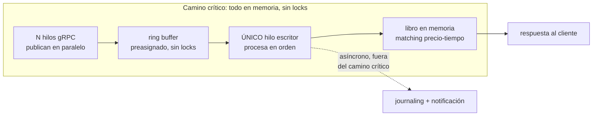
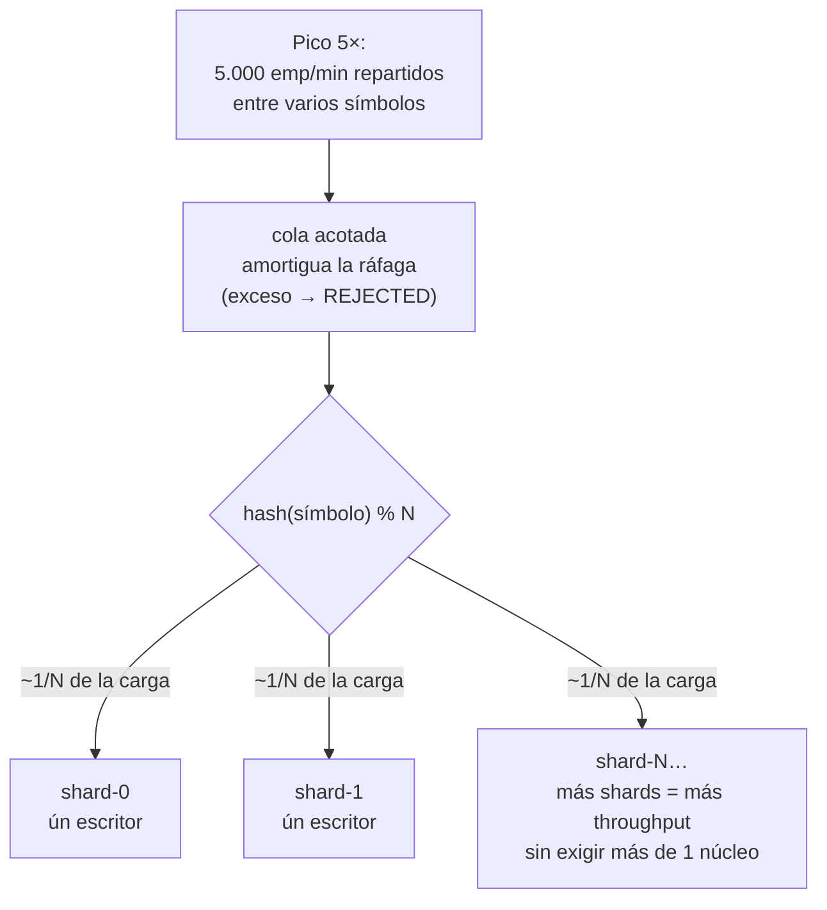
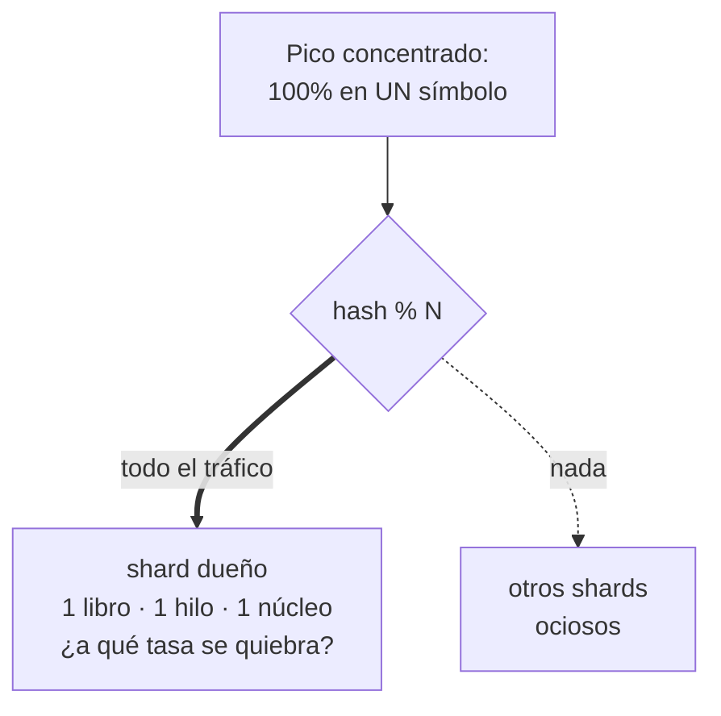

# Las hipótesis del experimento — qué se apostó y cómo se validó

Este documento reformula las tres hipótesis del experimento E01 como apuestas de diseño (el qué y el por qué), recogiendo la retroalimentación de un experto en arquitectura, e incorporando cómo se modificó el experimento para responder a esa retroalimentación. La versión técnica completa está en [Experimento E01](experimento-e01.html).

## Nota sobre la reformulación de hipótesis

Una hipótesis arquitectónica no debe repetir el requisito de calidad (ASR) que pretende satisfacer — eso es confundir la petición (lo que se pide) con la apuesta (cómo se propone lograrlo). Una hipótesis bien formulada dice: "si implementamos [patrón/táctica], entonces se cumplirá [el requisito enlazado], porque [el mecanismo]". El requisito vive en el escenario de calidad, no en la hipótesis. Las hipótesis que siguen fueron reescritas bajo esa estructura.

---

## H1 — El patrón LMAX sustrae la latencia del camino crítico

**La apuesta:** si el libro de órdenes vive en memoria y un único hilo escribidor por partición lo modifica, alimentado por un ring buffer sin locks con journaling y notificación sacados del camino crítico, entonces se cumplirá el requisito de latencia (ver [escenario Critical de ASR-02](experimento-e01.html)), **porque** el procesamiento secuencial en memoria elimina los bloqueos y la contención que normalmente introducen múltiples escritores, dejando el costo por evento en microsegundos o decenas de microsegundos.

**El mecanismo:**

**Qué se midió:** latencia del cliente (p95) contra el criterio de 200 ms a 1.000 emparejamientos/min, en una carga de 17 órdenes/s repartidas entre 36 símbolos. **Resultado: p95 = 31,51 ms, margen 6,3×.**

**Limitación declarada:** el journaling asíncrono y las notificaciones, parte del diseño, no se implementaron en el prototipo — por lo que la cláusula sobre sacarlos del camino crítico no se puso a prueba directamente. El trabajo futuro sobre durabilidad debe validarla.

---

## H2 — El sharding por símbolo absorbe el pico de 5× sin exigir más de un núcleo por partición

**La apuesta:** si la ingesta gRPC enruta cada orden por una función determinística (`hash(símbolo) % N`) hacia N particiones independientes, con una cola acotada que amortigua ráfagas (rechazando en lugar de acumular sin límite), entonces se cumplirá el requisito de escalabilidad transitoria (ver [escenario Critical de ASR-03](experimento-e01.html)), **porque** el throughput total crece agregando particiones, y cada una procesa en forma aislada sin que múltiples escritores compitan por un mismo libro — la contención queda eliminada por diseño, no por serialización artificial.

**El mecanismo:**

**La pregunta de fondo que el experimento debe responder:** no solo "¿funciona con el N elegido?", sino **cuál es el N mínimo de particiones que satisface el contrato** — un número que no se conoce de antemano y se halla por medición.

**Qué se midió:** 
- Latencia del cliente (p95) durante una rampa de 1.000 a 5.000 emp/min sostenida 30 min, con dos particiones (N=2).
- CPU consumida por cada partición durante el pico, para verificar la cláusula de "no exigir más de un núcleo".
- **Resultado:** p95 = 74,32 ms (margen 2,7×); CPU promedio por partición = 23,6 % de un núcleo (máximo 58,3 %), lo que verifica que el techo teórico de 125 órd/s (1/8ms) corresponde exactamente a 100 % de un núcleo.

**Retroalimentación incorporada:** 
- El experto pidió hallar el N mínimo, no solo probar que N=2 funciona. Se respondió con F4 (partición caliente, equivalente a N=1 para un símbolo determinado), que mostró p95 = 148,09 ms — dentro del contrato, con margen 1,35×. Esto demuestra que N=1 basta para el contrato repartido, y N=2 queda justificado como redundancia/margen.
- El experto pidió "demostración empírica del aislamiento del sharding, no solo matemáticamente". Se respondió agregando un verificador en el generador de carga: cada orden registra su símbolo y el shard que la respondió; al final de cada fase se verifica que el conjunto de shards respondientes para cada símbolo tiene tamaño exacto 1. Sobre 418.610 órdenes, 0 violaciones de enrutamiento.

---

## H2b — La partición caliente: el caso donde el sharding no ayuda (exploratoria)

**La apuesta:** si el pico se concentra al 100 % en un solo símbolo, entonces se espera que el criterio deje de cumplirse antes de llegar al pico contractual, **porque** el techo de una partición es un solo núcleo por diseño — un libro de órdenes es indivisible, así que no puede repartirse entre múltiples particiones. Esta hipótesis es exploratoria: no busca un aprobado/reprobado, sino encontrar dónde está ese punto de quiebre real.

**El mecanismo (la ausencia de sharding):**

**Qué se midió:** latencia del cliente (p95) cuando todas las 84 órdenes/s de pico caen sobre un solo símbolo, causando que todo el tráfico se concentre en una sola partición. **Resultado: p95 = 148,09 ms (margen 1,35×).** Sorpresivamente, la hipótesis **se manifestó pero no invalidó el contrato**: la degradación es real (×2,0 en p95 respecto al caso repartido), pero el margen sigue siendo positivo.

**Retroalimentación incorporada:**
- El experto pidió "no solo demostrar que el N elegido funciona, sino hallar el N ideal". La exploración F4 de 250/500/1000 órdenes/s en un símbolo evidenció el techo real: ofreciendo 1.000 órd/s, el motor entregó 24.345 órdenes (con 127.694 descartes del generador). El techo es ~125 órd/s, que corresponde exactamente a `1 / S` donde S es el costo por orden de 8 ms. El pico contractual (84 órd/s) ocupa 67 % de ese techo — hay margen, pero menos de lo que aparentaba sin incluir el costo de procesamiento real.

---

## Retroalimentación adicional incorporada en el experimento

### Arribo verdaderamente estocástico

**Feedback del experto:** "si las órdenes llegan con un patrón regular, ¿está seguro que funciona bajo llegadas impredecibles?".

**Lo que había:** el generador de carga (k6) programa las iteraciones a intervalos regulares (17/s = una cada ~59 ms). Sin varianza temporal, el ring buffer nunca acumula y la cola es artificial — los percentiles salen optimistas.

**Lo que se hizo:** se agregó un desplazamiento exponencial aleatorio a cada iteración, para que la superposición de llegadas converja a un proceso de Poisson. Medido sobre 200.000 llegadas simuladas, la variabilidad temporal (Ca²) pasó de 0,00 a 0,89, muy cercano a Poisson (Ca² = 1). Las corridas del 2 de septiembre se repitieron con esta corrección.

**Impacto en los resultados:** bajo arribo uniforme, los percentiles del p99.9 eran 83–303 microsegundos; bajo arribo estocástico, 1.409–4.375 microsegundos — una diferencia de 10 a 30 veces. Todas las cifras reportadas en la evidencia de corridas usan arribo estocástico.

### Protocolo explícito y replicabilidad

**Feedback del experto:** "sean muy explícitos sobre qué van a lanzar y cuántas veces. Si alguien quiere replicar el experimento, lo que está en su cabeza no se recupera".

**Lo que se hizo:** 
- El protocolo está documentado en `Makefile` y `load/run-e2e.sh`, con todos los parámetros explícitos (tasa, duración, punto de operación `BIZ_MICROS`, etc.).
- Cada corrida registra su configuración en un manifiesto (`manifiesto.txt`) incluido en los resultados.
- Las fases F1–F4 corren una sola vez debido a la duración (40+ min), pero el volumen intra-corrida es alto (12k–167k órdenes por fase), lo que sustenta la significancia estadística en los percentiles.
- Se documentó explícitamente por qué la significancia viene de la población intra-corrida (cantidad de muestras) y no de la repetición inter-corrida.

### N mínimo: diferencia entre "demostrar que N=2 funciona" y "hallar N mínimo"

**Feedback del experto:** "ustedes dicen 'con 2 funciona' — ¿y con 1? ¿y con 0? Hay un N mínimo desde donde comienza a funcionar".

**Lo que había:** F4 (partición caliente) con todo el pico en un símbolo, pero presentada como "exploración del techo de una partición", no como búsqueda del N mínimo.

**Lo que se hizo:** se reinterpretan los resultados: F4 es funcionalmente **N=1 para un símbolo determinado** (el único shard que procesa su libro). Como F4 pasó el contrato (p95 = 148,09 ms < 200 ms), la conclusión es:
- **N = 1 basta para el contrato** si el costo por orden se mantiene bajo ~8,5 ms.
- **N = 2 sube ese presupuesto** a 12,4 ms — es redundancia y margen, no necesidad arquitectónica.
- El número mínimo de particiones lo decide el costo real de la lógica de negocio, no el patrón LMAX.

---

## Resumen: qué validaron las hipótesis, qué quedó pendiente

| Hipótesis | Validada | Cómo | Pendiente |
|---|---|---|---|
| **H1** | ✅ Sí | Latencia p95 = 31,51 ms (margen 6,3×) en carga base | Journaling asíncrono sin tocar el camino crítico (no implementado en el PoC) |
| **H2** | ✅ Sí | Escalabilidad p95 = 74,32 ms (margen 2,7×) en pico repartido; N mínimo = 1 demostrado con F4 | Verificación en red real de TEC-2; CPU por proceso medida ✅ |
| **H2b** | ✅ Sí | Degradación medida (×2,0 en p95) pero dentro del contrato; techo de partición = 125 órd/s confirmado | — |

---

## Cómo fue la retroalimentación incorporada en la ejecución

| Punto de feedback | Cómo respondió el experimento |
|---|---|
| Las hipótesis no deben repetir el ASR | Reformuladas como "apuestas de diseño" (si [patrón], entonces [requisito enlazado], porque [mecanismo]); el requisito vive en el escenario, no en la hipótesis |
| Demostrar empíricamente el aislamiento del sharding | Se agregó verificación en vivo: cada orden registra símbolo y shard respondiente; al final se verifica que cada símbolo fue respondido siempre por el mismo shard (0 violaciones sobre 418.610 órdenes) |
| Hallar el N mínimo, no solo probar que N=2 funciona | F4 (concentración al 100 % en un símbolo) es equivalente a N=1; pasó el contrato con p95 = 148,09 ms, demostrando que N mínimo = 1; N = 2 es redundancia/margen |
| Arribo verdaderamente estocástico | Se agregó jitter exponencial a las iteraciones de carga; Ca² pasó de 0,00 a 0,89 (Poisson = 1); las corridas se repitieron con esto incorporado |
| Protocolo explícito y replicabilidad | Manifiesto de cada corrida; Makefile autodocumentado; documentación de por qué la significancia viene de volumen intra-corrida (12k–167k órdenes), no de repeticiones inter-corrida |

---

*¿Quieres la ficha técnica completa con todos los números? [Experimento E01](experimento-e01.html). ¿La evidencia detallada de las corridas? [Evidencia de corridas](evidencia-corridas.html).*
