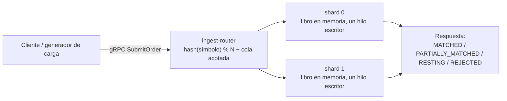
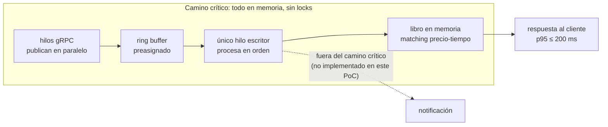
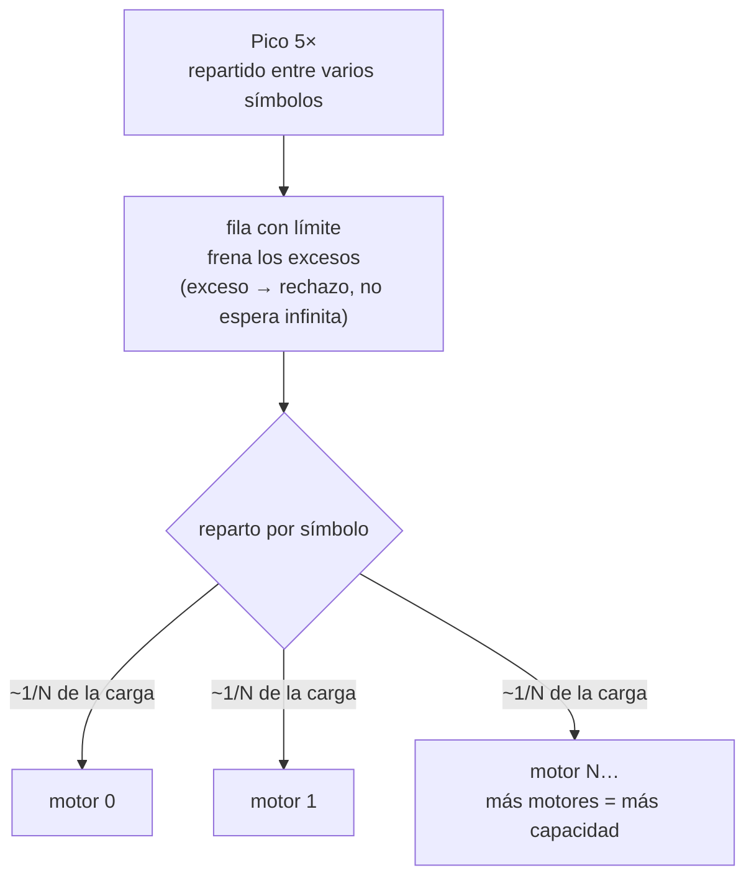
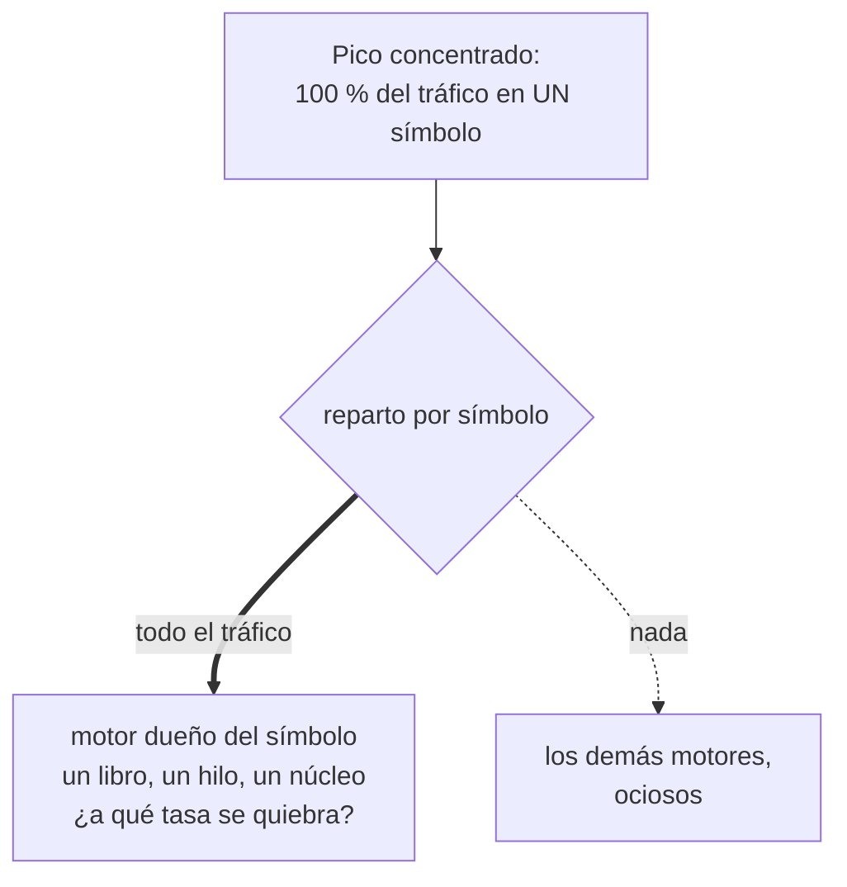
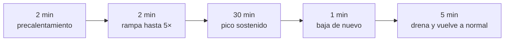

# E01 — ¿Un motor que procesa de a una orden puede ser el más rápido?

Este proyecto construye y prueba el **motor de emparejamiento** de una bolsa de valores: el servicio que recibe órdenes de compra y venta de acciones y decide cuándo dos de ellas coinciden en precio y cierran un trato. El experimento somete un diseño concreto a la carga del reto y responde con evidencia si cumple o no lo prometido.

## El sistema, en una imagen

Cada acción (símbolo) tiene su propio **libro de órdenes** en memoria: la lista de compradores y vendedores esperando. Las órdenes entran por gRPC a un **router**, que decide qué motor atiende cada símbolo y reenvía la orden ahí.

## Las dos preguntas que el experimento responde

El diseño se valida contra los dos requisitos de calidad críticos del sistema (ASR):

| ASR | Atributo | Criterio |
|---|---|---|
| ASR-02 | Latencia | p95 ≤ 200 ms a 1.000 emparejamientos/min (carga base) |
| ASR-03 | Escalabilidad transitoria | rampa de 1.000 a 5.000 emparejamientos/min, sostenida 30 min, p95 ≤ 200 ms |

## Las tres apuestas

**H1 — Latencia**: si el motor procesa las órdenes una por una, en memoria y sin esperar a nadie **—ni base de datos, ni candados, ni otros hilos—**, entonces responde a tiempo en operación normal.
La demora no esta en el trabajo en si, sino en las esperas: espera de turnos y  viajes a la base de datos. Al quitar todas las esperas y bloqueos, procesar una orden cuesta microsegundos permitiendo que esta táctica deje de ser un límite.

**H2 — Escalabilidad:** si las órdenes se reparten entre varios motores independientes —**cada activo pertenece siempre al mismo motor, y una fila de entrada con límite frena los excesos**—, entonces el sistema aguanta el pico de mercado (cinco veces la carga normal, hasta 30 minutos) sin dejar de responder a tiempo, siempre que el pico venga entre varios activos.
¿Por qué lo creemos?: cada motor aporta su propia capacidad; para crecer se agregan motores, no se exprime uno. El experimento debe decir además **cuántos motores bastan** — ese número no se supone, se mide.

Un motor no atiende un solo símbolo: hay N motores fijos y cada uno es dueño de *varios* símbolos. lo que importa es que **un símbolo siempre cae en el mismo motor** — así nadie más toca el mismo libro.

**H2b — Partición caliente** (el caso donde H2 no ayuda): si todo el pico se concentra en un solo activo, el sistema deja de responder a tiempo antes de llegar al pico completo.
¿Por qué lo creemos?: las órdenes de un activo las atiende siempre el mismo motor — los demás no pueden ayudarle — y un motor solo tiene la fuerza de un núcleo y la pregunta es ¿Cuál es el punto de quiebre del motor?.

## Tácticas, y lo que se descartó

Además del patrón LMAX y el sharding determinístico, el diseño busca mantener los datos del camino crítico en memoria, evitar bloqueos y contención (nunca esperar un lock), mover trabajo asíncrono fuera del camino crítico, y cola acotada con backpressure en la ingesta (se prefiere frenar la entrada antes que prometer una latencia incumplible).

Se descartaron: un pool de workers con colas bloqueantes (reintroduce la contención que el diseño busca eliminar), locks por nivel (riesgo de deadlocks y latencia impredecible), una base de datos relacional (se mantiene solo como línea base de comparación), un modelo de actores (overhead de buzón de mensajes) y bloqueo distribuido (agrega un salto de red al camino crítico).

## Cómo se diseñó el experimento

Todas arrancan con un precalentamiento que no se mide, para que la máquina virtual de Java se estabilice.

- **F1 — Línea base (ASR-02):** carga normal, 12 minutos, órdenes llegando a ritmo irregular (estocástico) —como en la realidad— repartidas en 36 símbolos.
- **F2 — Rampa y pico (ASR-03):** subir de la carga normal al pico 5× y sostenerlo 30 minutos, repartido entre símbolos.
- **F3 — Retorno a régimen:** bajar de nuevo a carga normal y verificar que la fila se vacía y la latencia vuelve a la de F1 — el pico exigido es transitorio, no permanente.
- **F4 — Partición caliente (exploratoria):** el mismo pico, pero el 100 % en un solo símbolo; y después más allá del contrato —250, 500 y 1.000 órdenes/s— hasta encontrar el punto de quiebre.

**Criterio de éxito en las fases oficiales (F1 y F2), verificado en vivo:** responder a tiempo (p95 bajo 200 ms), cero órdenes rechazadas, cero órdenes que el generador no logró emitir, y cero error de la entrega — cada símbolo respondido siempre por el mismo motor.

## Qué vamos a medir

Cada ejecución mide dos momentos clave, el primer momento ocurre cuando el generador de carga toma la medida de  cuanto tiempo esperaría un cliente (desde que envía la orden hasta que recibe la respuesta) y el segundo momento es cuando llega la orden y es resuelta por el motor. La resta de ambos tiempos nos indica cuanto cuesta el transporte completo.

Adentro de motor, el tiempo de ejecución se parte en dos: "En Espera" (el tiempo en que la orden hizo fila para ser atendida por el motor) y "En servicio" (el tiempo que cuesta procesarla). Estos momentos permiten tomar acciones en caso de que algo falle ( si crece en estado "En servicio", se debe agilizar la atención, si crece el estado "En Espera", hay que agregar motores)

## El parámetro clave: cuánto cuesta procesar una orden

El prototipo no implementa la lógica de negocio real —validar, verificar riesgo y saldos, calcular comisiones, generar el trato— y ese costo lo cambia todo: como un motor procesa de a una, **su techo es 1 dividido por el costo de cada orden**. Medir la capacidad con el costo casi nulo del prototipo mediría una estructura de datos, no un motor de bolsa.

Por eso el costo por orden entra al experimento como **parámetro declarado**, y se barre en un rango. El entregable no será una cifra suelta de capacidad sino un **presupuesto**: *"el diseño cumple el contrato mientras procesar una orden cueste menos de X"*. Cuando la lógica real exista, se mide su costo y se compara contra X — la afirmación es verificable desde hoy.

Para la corrida oficial se declara un costo de **8 ms por orden**: el escenario más exigente que sigue siendo plausible (consultar riesgo y saldos a otro servicio en cada orden). Si el contrato se cumple ahí, se cumple también en los escenarios más baratos.

## Lo que el prototipo deja fuera, a propósito

Corre en una sola máquina, sin la red real del banco de pruebas del reto (3 nodos, 1 Gbps): valida el patrón, no el dimensionamiento final. Quedan fuera por no afectar a los dos ASR: el envío de notificaciones a los clientes, la persistencia durable, el bus de eventos y el autoescalado. Todo lo diseñado y no construido se declara en una tabla propia, con lo que deja sin probar.

## Qué decide el resultado

Si F1 y F2 pasan sus criterios, las apuestas H1 y H2 quedan confirmadas y la decisión es **adoptar el patrón**. Si solo falla la partición caliente, la decisión se abre: dividir el libro del símbolo caliente, rebalancear o aceptar un contrato distinto para picos concentrados. Si falla en general, se evalúa un diseño con varios escritores y se compara contra la línea base relacional. En cualquier caso, el experimento debe salir con dos números: **cuántos motores bastan** para el contrato y **cuánto puede costar una orden** sin romperlo.

Con qué: Java 21, Docker Compose, Grafana, k6 como generador de carga y una máquina de 8+ núcleos. Esfuerzo estimado: 2 personas × 1 semana. Los resultados, cuando existan, viven en la [Evidencia de corridas](evidencia-corridas.html).