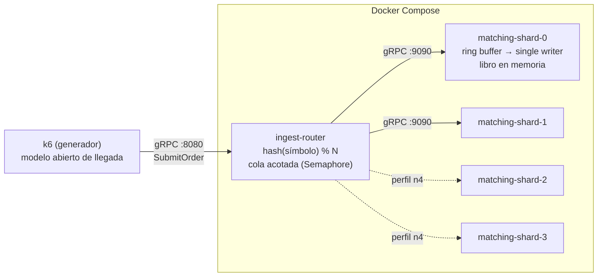

# Implementación del PoC — Motor de Emparejamiento (E01)

Este documento describe **cómo está implementado** el PoC: componentes, flujo de una orden, mapeo de cada táctica arquitectónica a código concreto, configuración, metodología de medición y limitaciones. La ficha del experimento (hipótesis, fases y criterios) está en [`experimento-e01.md`](experimento-e01.md); este documento explica el artefacto que lo ejecuta.

## 1. Visión general

Tres módulos Java 21 en un monorepo Gradle, desplegados como contenedores independientes:

Cada **shard es un proceso** (un contenedor): una partición del universo de activos con su propio ring buffer y su único hilo escritor. Esa igualdad proceso = partición = escritor es la que replica, en pequeño, el patrón del despliegue real (D-03/D-09), y es lo que permite probar escalabilidad agregando shards (N=2 → N=4) sin tocar código.

## 2. Flujo de una orden (camino crítico)

1. **k6** invoca `matching.v1.MatchingIngest/SubmitOrder` contra el router (`:8080`). Aquí empieza la medición externa (latencia extremo a extremo del RPC).
2. **`RouterService`** intenta adquirir un permiso del `Semaphore` (cola acotada). Si no hay cupo, responde `REJECTED` de inmediato — esa es la señal de backpressure; nada se encola sin límite.
3. Con permiso, calcula `shard = Math.floorMod(symbol.hashCode(), N)` y reenvía la orden por el stub asíncrono del shard dueño. Todas las órdenes de un mismo símbolo caen siempre en el mismo shard: el enrutamiento es determinístico.
4. **`IngestGrpcService`** (en el shard) toma `t0 = System.nanoTime()` — el "arribo al motor" de la medida de ASR-02 — e intenta publicar en el ring buffer con `tryNext()`. Si el ring está lleno responde `REJECTED` sin bloquear los hilos de gRPC.
5. El **único hilo consumidor** (`MatchingHandler`, hilo `matcher-shard-N`) toma el evento en orden de llegada, busca el `OrderBook` del símbolo y ejecuta el matching por prioridad precio-tiempo. No hay locks: nadie más puede tocar ese libro, por construcción.
6. El handler registra `latencia = now − t0` (µs) en el `Recorder` de HdrHistogram, completa el `CompletableFuture` con el `OrderResponse` (estado `MATCHED` / `PARTIALLY_MATCHED` / `RESTING`, cantidad materializada, latencia interna y shard) y **limpia el slot** para que se recicle sin generar basura.
7. La respuesta viaja de vuelta shard → router → k6, que la cuenta en `grpc_req_duration`. El permiso del semáforo se libera al completarse el RPC.

Dos relojes miden lo mismo desde extremos distintos: k6 mide la latencia completa del RPC y el shard mide arribo → materialización. La diferencia entre ambos es el costo del transporte + router, y contrastarlas descarta que el generador contamine el resultado.

## 3. Módulos

### `services/common-proto`

Contrato único de ingesta (`matching.proto`), compilado con `protobuf-gradle-plugin`. Decisiones del contrato: precios como `int64 price_cents` (sin aritmética flotante en el camino crítico), `Status.REJECTED` como parte del contrato (el backpressure es semántica del dominio, no un error de transporte), y `engine_latency_micros` en la respuesta para el contraste de relojes descrito arriba. Tanto el router como los shards implementan **el mismo servicio gRPC**, lo que permite apuntar k6 directo a un shard si se quiere aislar el costo del router.

### `services/ingest-router`

| Clase | Responsabilidad |
|---|---|
| `RouterMain` | Arranque: lee `PORT`, `SHARDS` (lista `host:puerto` separada por comas — el orden define el índice de shard) y `QUEUE_CAPACITY`; crea un `ManagedChannel` + stub asíncrono por shard; reporta cada 10 s solicitudes en vuelo y rechazos acumulados. |
| `RouterService` | El camino crítico de ingesta: cola acotada (`Semaphore.tryAcquire`, sin bloqueo), sharding determinístico (`floorMod(hashCode, N)` — estable porque `String.hashCode` está especificado en Java), y relevo asíncrono de la respuesta del shard al cliente. |

El router es **sin estado**: no conoce libros ni órdenes. Por eso en el diseño real puede replicarse con HPA; en el PoC basta una instancia.

### `services/matching-engine`

| Clase | Responsabilidad |
|---|---|
| `EngineMain` | Arranque del shard: construye el `Disruptor` (`ProducerType.MULTI` — publican varios hilos gRPC; consume uno solo), levanta el servidor gRPC y el reporte de percentiles cada 10 s. |
| `IngestGrpcService` | Borde gRPC → ring buffer con `tryNext()` (backpressure sin bloqueo). Estampa el `t0` de la medición. |
| `MatchingHandler` | El *single writer* del patrón LMAX: procesa secuencialmente, sin locks; un `HashMap<String, OrderBook>` por shard; registra latencia y completa el futuro. |
| `OrderBook` | Libro de un activo: `TreeMap<precio, ArrayDeque<Resting>>` para compras (descendente) y ventas (ascendente); matching por prioridad precio-tiempo con cruce parcial y resto en reposo. **No es thread-safe a propósito** — la exclusión la da el diseño, no los locks. |
| `OrderSlot` | Entrada mutable y preasignada del ring: se rellena al publicar y se limpia al consumir, para que en régimen el camino crítico no genere basura (menos presión de GC). |

## 4. Mapeo táctica → código

| Táctica (E01 / cap. 08–09) | Dónde vive en el código |
|---|---|
| Único escritor por partición (D-03) | Un solo `EventHandler` por `Disruptor`; `OrderBook` sin sincronización |
| Datos del camino crítico en memoria | `OrderBook` (`TreeMap`/`ArrayDeque`), sin I/O en el matching |
| Reducir overhead: sin bloqueos ni contención | `tryNext`/`tryAcquire` en vez de esperas; ring buffer preasignado |
| Cola acotada + backpressure (D-10) | `Semaphore` del router y capacidad fija del ring; ambos responden `REJECTED` |
| Particionamiento por activo (escalar agregando shards) | `floorMod(symbol.hashCode(), N)` en `RouterService`; un contenedor por shard |
| Asíncrono fuera del camino crítico | Respuesta por `CompletableFuture`; journaling/notificación excluidos del PoC |
| GC de pausas cortas (D-02) | `-XX:+UseZGC -XX:+ZGenerational` en el Dockerfile |
| No doble-materialización | Consecuencia del single writer: solo un hilo decide sobre cada libro |

## 5. Configuración

| Variable | Servicio | Default | Significado |
|---|---|---|---|
| `PORT` | ambos | 8080 / 9090 | Puerto gRPC |
| `SHARDS` | router | `localhost:9090` | Lista `host:puerto`; su orden define el índice de sharding |
| `QUEUE_CAPACITY` | router | 10000 | Solicitudes en vuelo antes de rechazar (cola acotada) |
| `SHARD_ID` | engine | 0 | Identificador reportado en respuestas y logs |
| `RING_SIZE` | engine | 16384 | Tamaño del ring buffer (potencia de 2) |
| `JAVA_OPTS` | ambos (Docker) | ZGC, 256–512 MB | Flags de la JVM |

Todo el ciclo de vida está en el **Makefile**: `make build`, `make up` / `make up-n4`, `make smoke`, `make f1|f2|f4`, `make experimento`, `make logs`, `make down`. Cambiar N=2 → N=4 no toca código: el perfil `n4` del compose levanta dos shards más y `make up-n4` le pasa al router la lista de 4.

## 6. Metodología de medición

- **Modelo abierto de llegada** (k6 `constant/ramping-arrival-rate`): la carga se expresa como tasa objetivo, no como usuarios que esperan respuesta; el modelo cerrado subestima los percentiles bajo saturación (*coordinated omission*). Limitación declarada: estos ejecutores espacian los arribos de forma uniforme (no Poisson) — la aleatoriedad de la corrida está en símbolo, lado, precio y cantidad, no en el instante de llegada.
- **Verificación de aislamiento del sharding** (retroalimentación 01-sep): cada respuesta trae el `shard_id` que la procesó y k6 verifica en vivo que un mismo símbolo sea respondido siempre por el mismo shard (contador `shard_routing_violations` con threshold `count==0` en las fases oficiales) — evidencia empírica de la correlación entrada↔salida, además del argumento por construcción (`floorMod(hashCode, N)`).
- **Criterio de éxito p95 ≤ 200 ms** como threshold de k6 (falla la corrida en vivo); p99/p99.9 se registran como observación (`summaryTrendStats`).
- **Doble punto de medida**: `grpc_req_duration` en k6 vs. HdrHistogram del shard (logueado cada 10 s). La brecha entre ambos aísla el costo de red/router.
- **Rechazos como métrica de primera clase**: el contador `orders_rejected_backpressure` debe ser 0 en F1–F3; en F4 su aparición es parte del resultado (dónde se activa la protección).
- **Precalentamiento**: los primeros minutos de cada corrida estabilizan JIT/GC y se excluyen del análisis.

## 7. Despliegue

`deploy/Dockerfile` es multi-etapa (Gradle 8.14 + JDK 21 → JRE 21) y parametrizado por `--build-arg SERVICE=...`, así una sola definición construye ambos servicios. El compose levanta router + 2 shards (N=2) o + 4 con `--profile n4`. Los `cpuset` de aislamiento de núcleos están comentados: solo aplican en hosts Linux (en macOS Docker corre en una VM); para la corrida oficial en Linux, descomentarlos y dedicar núcleos distintos a shards, router y generador.

## 8. Limitaciones y deuda (declaradas en E01)

Una sola máquina por loopback — no representa la red de 1 Gbps de TEC-2 ni alta disponibilidad; valida el patrón, no el dimensionamiento. Excluidos por no incidir en ASR-02/03: fan-out de notificaciones, proyecciones CQRS, persistencia durable, broker de eventos y autoescalado. Deuda de decisión a re-evaluar con datos: la estrategia de espera del Disruptor (el PoC usa `BlockingWaitStrategy`, amable con la máquina compartida; `Yielding`/`BusySpin` bajan latencia a costa de quemar un núcleo por shard) y la estructura interna del libro. El `hashCode` de `String` como función de sharding es suficiente para el PoC; un despliegue real usaría una función consistente con rebalanceo.

## 9. Extensiones naturales (post-experimento)

Si E01 valida el patrón: (1) journaling real por shard (append-only asíncrono) para durabilidad; (2) sustituir la cola acotada del router por el log de eventos (Redpanda/Kafka) recuperando la amortiguación de D-10 tal como la describe el escenario de pruebas del equipo; (3) publicar los eventos de materialización hacia el bus para el fan-out de ASR-04 (candidato a E02); (4) repetir el mismo diseño de experimento en el banco de pruebas de 3 nodos (TEC-2) para confirmar que la reducción de escala no ocultó efectos de red.
