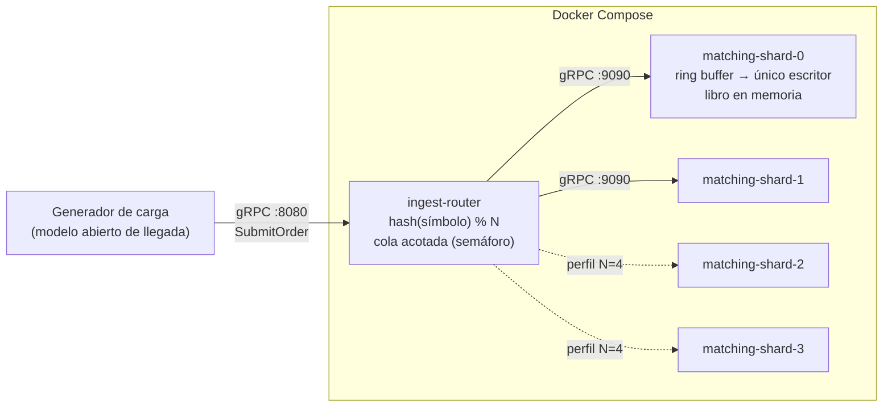

# Cómo está armado el sistema

Este documento describe los componentes del prototipo, cómo viaja una orden a través de ellos, cómo se mide la latencia y qué limitaciones tiene el montaje — con el mismo contenido que [Implementación](implementacion.html), pero sin código ni referencias a líneas de archivo específicas.

## Vista general

Tres servicios Java 21, cada uno en su propio contenedor:

Cada **shard es un proceso** (un contenedor): una partición del universo de símbolos con su propio ring buffer y su único hilo escritor. Esa igualdad proceso = partición = escritor es la que permite escalar agregando shards (N=2 → N=4) sin tocar código.

## El recorrido de una orden

1. El **generador de carga** invoca el servicio de ingesta contra el router. Aquí arranca la medición externa (latencia extremo a extremo).
2. El **router** intenta adquirir un permiso de una cola acotada (implementada con un semáforo). Si no hay cupo, responde con rechazo inmediato — esa es la señal de backpressure; nada se encola sin límite.
3. Con permiso, el router calcula el shard dueño del símbolo (`hash % N`) y reenvía la orden por un canal asíncrono. Todas las órdenes de un mismo símbolo caen siempre en el mismo shard.
4. En el shard, el borde gRPC toma la marca de tiempo de "arribo al motor" — la que define el inicio de la medida de latencia interna — e intenta publicar la orden en el ring buffer sin bloquear el hilo. Si el ring está lleno, responde con rechazo sin esperar.
5. El **único hilo consumidor** del shard toma el evento en el orden en que llegó, busca el libro de órdenes del símbolo y ejecuta el matching por prioridad precio-tiempo. No hay locks: por construcción, nadie más puede tocar ese libro al mismo tiempo.
6. El hilo registra la latencia interna en un histograma (HdrHistogram), completa la respuesta (estado: cerrado / cerrado parcial / en espera / rechazado, cantidad materializada, latencia interna y shard que respondió) y limpia la entrada del ring para reutilizarla sin generar basura de memoria.
7. La respuesta viaja de vuelta shard → router → generador, que la cuenta como latencia extremo a extremo. El permiso de la cola se libera al completarse la solicitud.

Dos relojes miden lo mismo desde extremos distintos: el generador mide la latencia completa de la solicitud; el shard mide desde el arribo al motor hasta la materialización. La diferencia entre ambos es el costo del transporte y el router, y contrastarlos descarta que el propio generador esté contaminando el resultado. Para que la resta sea válida, los dos lados deben publicar el mismo estadístico: un histograma acumulado de toda la corrida, no el promedio de percentiles por ventanas de tiempo — la mediana de varios p95 no es un p95.

## Los tres módulos

### El contrato compartido

Un único contrato gRPC/Protobuf que define cómo se ve una orden y una respuesta. Decisiones relevantes: los precios se representan como enteros (centavos), no como punto flotante, para no arriesgar redondeos en el camino crítico; "rechazado" es un valor válido del contrato (el backpressure es semántica del dominio, no un error de transporte); la respuesta incluye la latencia interna medida por el motor, para poder contrastarla con la del generador. Tanto el router como los shards implementan el mismo servicio, así que el generador puede apuntar directo a un shard si se quiere aislar el costo del router.

### El router de ingesta

Responsable de la cola acotada (backpressure sin bloqueo), el enrutamiento determinístico por símbolo, y el relevo asíncrono de la respuesta de vuelta al cliente. No guarda estado — no conoce libros ni órdenes — por lo que en un diseño real podría replicarse horizontalmente sin coordinación adicional.

### El motor de emparejamiento (cada shard)

| Responsabilidad | Descripción |
|---|---|
| Arranque del shard | Construye el pipeline de procesamiento (varios hilos publican, uno solo consume), levanta el servidor gRPC y un reporte periódico de percentiles cada 10 segundos |
| Borde gRPC → ring buffer | Publica sin bloquear los hilos de red; si el ring está lleno, rechaza de inmediato. Marca el instante de arribo para la medición |
| El único escritor | Procesa secuencialmente, sin locks; mantiene el libro de órdenes de cada símbolo de su grupo, ejecuta el matching y registra la latencia |
| El libro de un símbolo | Estructura ordenada por precio (mejor precio primero) con orden de llegada dentro de cada nivel de precio (FIFO); cruza mientras el precio de compra y venta coincidan, deja el remanente en espera. No es seguro para concurrencia a propósito — la exclusión la garantiza el diseño (un solo hilo lo toca), no un lock |
| El modelo de costo de negocio | Simula el tiempo que tomaría la lógica de negocio real (validación, riesgo, saldos, comisiones) que el prototipo no implementa — ver [Experimento E01](experimento-e01_v2.html) |
| La entrada reutilizable del ring | Se preasigna al arrancar y se recicla en cada uso, para que el camino crítico en régimen no genere basura de memoria |

## Cómo cada táctica de diseño se traduce en el sistema

| Táctica | Cómo se aplica |
|---|---|
| Único escritor por partición | Un solo consumidor por pipeline; el libro de órdenes no se sincroniza porque nadie más lo toca |
| Datos del camino crítico en memoria | El libro de órdenes vive en memoria, sin operaciones de entrada/salida durante el matching |
| Reducir overhead: sin bloqueos ni contención | Publicación y adquisición de cupo sin esperar — se rechaza en vez de bloquear |
| Cola acotada con backpressure | Semáforo en el router y capacidad fija del ring buffer; ambos responden con rechazo en vez de acumular sin límite |
| Particionamiento por símbolo | Enrutamiento determinístico hacia N shards independientes; un contenedor por shard |
| Trabajo asíncrono fuera del camino crítico | La respuesta se entrega de forma asíncrona; journaling y notificaciones quedan fuera del alcance de este prototipo |
| Pausas cortas de recolección de basura | El recolector de basura se configura explícitamente para pausas sub-milisegundo |
| Sin doble materialización | Consecuencia directa del único escritor: solo un hilo decide sobre cada libro |

## Configuración

| Variable | Servicio | Default | Qué controla |
|---|---|---|---|
| Puerto | ambos | 8080 (router) / 9090 (motor) | Puerto gRPC del servicio |
| Lista de shards | router | un shard local | Los destinos del enrutamiento; su orden define el índice de sharding |
| Capacidad de la cola | router | 10.000 | Solicitudes en vuelo antes de empezar a rechazar |
| Identificador de shard | motor | 0 | Se reporta en respuestas y logs, y sirve para verificar el enrutamiento |
| Tamaño del ring buffer | motor | 16.384 | Cuántas órdenes puede tener el shard "en tránsito" antes de rechazar |
| Costo medio de procesamiento por orden | motor | apagado (0) | El parámetro central del experimento: cuánto simula costar procesar una orden. Sin fijarlo, el resultado mide una estructura de datos vacía, no un motor real |
| Forma de la distribución de ese costo | motor | una mezcla de tres clases de orden | Permite verificar que la conclusión no dependa de cómo se modele esa distribución |

Todo el ciclo de vida (compilar, levantar la topología con N=2 o N=4, correr cada fase de prueba, apagar) está automatizado en comandos reproducibles — cambiar de N=2 a N=4 no requiere tocar código.

## Metodología de medición

- **Modelo abierto de llegada**: la carga se expresa como una tasa objetivo, no como un número fijo de clientes esperando turno — el modelo cerrado subestima los percentiles bajo saturación.
- **Verificación del aislamiento del sharding**: cada respuesta trae el identificador del shard que la procesó, y el generador verifica en vivo que un mismo símbolo sea respondido siempre por el mismo shard — evidencia empírica, no solo el argumento de que la función de reparto es determinística.
- **Arribo estocástico**: sin varianza en los tiempos de llegada, la cola nunca acumula y los percentiles salen artificialmente optimistas. El generador desplaza cada solicitud un tiempo aleatorio antes de emitirla, para que la superposición de llegadas se aproxime a un proceso realista.
- **Doble punto de medida**: la latencia medida por el generador contra el histograma interno de cada shard — la brecha entre ambas aísla el costo de red y del router.
- **Rechazos e iteraciones descartadas como métricas de primera clase**: un rechazo por backpressure debe ser cero en las fases oficiales; una iteración descartada por el generador es carga que nunca llegó a aplicarse, y su presencia invalida la corrida.
- **Precalentamiento**: los primeros minutos de cada corrida se excluyen del análisis, para estabilizar la JVM antes de medir.

## Despliegue

Una única definición de contenedor, parametrizada por el servicio a construir, sirve para ambos servicios (router y motor). La topología por defecto levanta el router más dos shards; un perfil alternativo agrega dos shards más. El aislamiento de núcleos de CPU por proceso está disponible pero no activado en esta ronda de pruebas.

## Limitaciones declaradas

Todo el tráfico corre en una sola máquina, por loopback — no representa una red de producción ni alta disponibilidad; el prototipo valida el patrón, no el dimensionamiento final. Quedan fuera de alcance, porque no inciden en los dos requisitos de calidad probados: el fan-out de notificaciones, las proyecciones de lectura, la persistencia durable, un bus de eventos y el autoescalado. Deuda de decisión pendiente de reevaluar con datos: la estrategia de espera del hilo escritor (la versión actual es amigable con una máquina compartida; hay alternativas más agresivas en latencia a costa de dedicar un núcleo completo por shard) y la estructura interna del libro de órdenes.

## Extensiones naturales si el patrón se valida

Journaling real por shard para durabilidad; sustituir la cola acotada del router por un log de eventos distribuido; publicar los eventos de materialización hacia un bus para el fan-out de notificaciones; repetir el mismo diseño de experimento en un banco de varios nodos con red real, para confirmar que la reducción de escala de este prototipo no ocultó efectos de red.

---

*¿Quieres el nombre exacto de cada clase, cada variable de entorno con su valor por defecto citado en el código, y los fragmentos de implementación? Eso está en la versión técnica: [Implementación](implementacion.html).*
