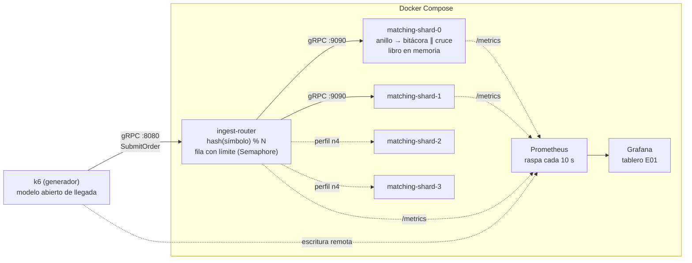

# Cómo funciona el prototipo, y por qué sus cifras son creíbles

La [ficha del experimento](experimento.html) dice qué se apuesta. Este documento dice cómo está construido el artefacto que la pone a prueba: el viaje de una orden, dónde vive cada táctica del diseño, qué perillas tiene y cómo se mide.

Conviene entrar sabiendo cuál es el entregable, porque no es el que uno esperaría. **No es un percentil.** El prototipo no implementa la lógica de negocio real, y en un diseño de un único escritor ese costo por orden gobierna todo lo demás. Así que lo que sale de aquí es un **presupuesto**: cuánto puede costar procesar una orden sin romper el contrato. Medido, **12,4 ms** con el pico repartido entre dos particiones y **8,5 ms** con todo el pico en una sola.

## 1. El sistema en ejecución

Tres módulos Java 21 en un monorepo Gradle, desplegados como contenedores independientes:



Cada **partición es un proceso** —un contenedor, llamado *shard* aquí y en los nombres de los servicios— con su propio anillo de entrada y su único hilo escritor. Esa igualdad **proceso = partición = escritor** replica en pequeño el patrón del despliegue real. Es también lo que permite probar la escalabilidad agregando particiones, sin tocar una línea de código.

## 2. El viaje de una orden

1. **k6** invoca `matching.v1.MatchingIngest/SubmitOrder` contra el router en el puerto 8080. Ahí empieza la medición externa: la latencia completa de la llamada, como la ve un cliente.
2. **`RouterService`** pide un permiso al `Semaphore` que acota la fila. Si no hay cupo responde `REJECTED` de inmediato — esa es la señal de que la entrada se está frenando. Nada se encola sin límite.
3. Con permiso, calcula `shard = Math.floorMod(symbol.hashCode(), N)` y reenvía la orden al dueño del símbolo, sin esperar. Todas las órdenes de un símbolo caen siempre en la misma partición.
4. **`IngestGrpcService`**, ya dentro de la partición, toma `t0 = System.nanoTime()` —el "arribo al motor"— e intenta publicar en el anillo con `tryNext()`. Si el anillo está lleno responde `REJECTED` sin bloquear los hilos de red.
5. El **único hilo escritor** (`MatchingHandler`) toma el evento en orden de llegada, busca el `OrderBook` del símbolo y ejecuta el cruce por prioridad precio-tiempo. No hay candados: nadie más puede tocar ese libro, por construcción. Luego aplica `BusinessLogicModel`, que consume el costo por orden declarado para la corrida.
6. El escritor registra tres tiempos en HdrHistogram —espera, servicio y total— y completa la respuesta: estado `MATCHED`, `PARTIALLY_MATCHED` o `RESTING`, cantidad materializada, latencia interna y partición.
7. Con la bitácora encendida, **`JournalHandler` consume el mismo evento en paralelo** y lo escribe en un archivo de solo-anexado, forzando el volcado a disco una vez por lote. No suma latencia al cliente, pero el acuse se emite sin esperar al disco. En modo `serie` va encadenado *antes* del cruce: el acuse implica durabilidad, al precio de meter el disco en el camino crítico.
8. Un **manejador de limpieza encadenado al final** vacía la casilla para que se recicle sin generar basura. Va ahí y no dentro del escritor porque, con dos consumidores en paralelo, **ninguno de los dos puede modificar el evento**: la casilla pertenece al anillo hasta que ambos pasaron.
9. La respuesta viaja de vuelta hasta k6, que la cuenta en `grpc_req_duration`. El permiso del semáforo se libera cuando la llamada termina.

## 3. Dos relojes que miden lo mismo desde extremos distintos

k6 mide la llamada completa; la partición mide arribo → materialización. **La diferencia entre ambos es el costo del transporte y del router**, y contrastarlos descarta que el generador esté contaminando el resultado.

Para que esa resta valga, los dos lados tienen que publicar el mismo estadístico. La partición publica dos cosas distintas. Una es un histograma por ventana de diez segundos, útil para ver cómo evoluciona una fase por dentro. La otra acumula todas las ventanas y sale al recibir la señal de apagado, con el prefijo `ACUMULADO`.

Solo el acumulado da percentiles de la población entera, y solo esos son comparables cifra a cifra con los de k6: **la mediana de los percentiles 95 por ventana no es un percentil 95.** Es la media de una muestra de percentiles, un estadístico distinto que esconde la dispersión.

La partición además parte su tiempo en `total = espera + servicio`. Esa descomposición es la que distingue **«hay que abaratar la orden»** de **«hay que agregar particiones»**.

## 4. Las clases, y qué hace cada una

### `services/common-proto`

Contrato único de ingesta (`matching.proto`), compilado con `protobuf-gradle-plugin`. Tres decisiones viven ahí. Precios como `int64 price_cents`, sin aritmética flotante en el camino crítico. `Status.REJECTED` dentro del contrato, porque frenar la entrada es semántica del negocio y no un error de transporte. Y `engine_latency_micros` en la respuesta, para el contraste de relojes. Router y particiones implementan **el mismo servicio gRPC**, lo que permite apuntar k6 directo a una partición si se quiere aislar el costo del router.

### `services/ingest-router`

| Clase | Responsabilidad |
|---|---|
| `RouterMain` | Arranque: lee `PORT`, `SHARDS` (lista `host:puerto` separada por comas — el orden define el índice de partición) y `QUEUE_CAPACITY`; abre un canal y un cliente asíncrono por partición; reporta cada 10 s solicitudes en vuelo y rechazos acumulados. |
| `RouterService` | El camino crítico de ingesta: fila con límite (`Semaphore.tryAcquire`, sin bloqueo), reparto determinístico (`floorMod(hashCode, N)`, estable porque `String.hashCode` está fijado por la especificación de Java) y relevo asíncrono de la respuesta al cliente. |

El router es **sin estado**: no conoce libros ni órdenes. Por eso en el diseño real puede correr con varias réplicas y escalar solo; en el prototipo basta una.

### `services/matching-engine`

| Clase | Responsabilidad |
|---|---|
| `EngineMain` | Arranque de la partición: construye el `Disruptor` (`ProducerType.MULTI`, porque publican varios hilos de gRPC), cablea la cadena de consumidores según la disposición de bitácora elegida, levanta el servidor gRPC y el reporte de percentiles cada 10 s. Al apagarse publica el `ACUMULADO` de la fase. **Declara en el log su punto de operación y los recursos que ve**: ninguna corrida debe quedar ambigua. |
| `IngestGrpcService` | Borde gRPC → anillo con `tryNext()`: si no hay casilla, rechazo inmediato sin bloquear. Estampa el `t0` de la medición interna. |
| `MatchingHandler` | El *único escritor* del patrón LMAX: procesa en secuencia, sin candados; un `HashMap<String, OrderBook>` por partición; parte la latencia en espera y servicio, y completa la respuesta. **No modifica la casilla** — ver el paso 8 del viaje de una orden. |
| `JournalHandler` | Bitácora de solo-anexado, con volcado a disco una vez por lote (`endOfBatch`) y escritura que no reserva memoria en el camino crítico. Se cablea en paralelo o en serie con el cruce: la diferencia entre esas dos disposiciones **es** la cláusula de H1 sobre mantener el registro fuera del camino crítico. |
| `OrderBook` | Libro de un activo: `TreeMap<precio, ArrayDeque<Resting>>` para compras (descendente) y ventas (ascendente); cruce por prioridad precio-tiempo, con llenado parcial y remanente en reposo. **No es seguro para concurrencia a propósito** — la exclusión la da el diseño, no los candados. |
| `BusinessLogicModel` | **Modelo sintético del costo por orden** de la lógica que el prototipo no implementa (validación, riesgo, tipos de orden, comisiones, trades). Quema CPU —no duerme— en el hilo del escritor. Dos perillas: la media y la forma de la distribución. Apagado por defecto. |
| `PrometheusEndpoint` | Vive en `common-proto` y lo usan los dos servicios: sirve `/metrics` con el servidor HTTP del JDK, sin dependencia nueva. La partición le pasa una cadena **que el hilo del reporte ya dejó armada**, así que raspar las métricas no toca un histograma ni toma un candado: la observación no puede alterar lo observado. |
| `OrderSlot` | Casilla del anillo: mutable y preasignada, se rellena al publicar y se limpia al final de la cadena, para que en régimen el camino crítico no genere basura. |

## 5. De la táctica al código

| Táctica del diseño | Dónde vive en el código |
|---|---|
| Único escritor por partición (D-03, D-09) | Un solo `EventHandler` de cruce por `Disruptor`; `OrderBook` sin sincronización |
| Datos del camino crítico en memoria | `OrderBook` (`TreeMap` / `ArrayDeque`), sin entrada ni salida durante el cruce |
| Sin bloqueos ni contención | `tryNext` y `tryAcquire` en vez de esperas; anillo preasignado |
| Fila con límite que frena la entrada (D-10) | `Semaphore` en el router y capacidad fija del anillo; ambos responden `REJECTED` |
| Partición por activo, escalar agregando particiones | `floorMod(symbol.hashCode(), N)` en `RouterService`; un contenedor por partición |
| Trabajo asíncrono fuera del camino crítico | Respuesta por `CompletableFuture`; bitácora como consumidor paralelo del anillo (medida en §7); notificaciones excluidas del prototipo |
| Recolector de basura de pausas cortas (D-02) | `-XX:+UseZGC -XX:+ZGenerational` en el `Dockerfile` |
| Nada se materializa dos veces | Consecuencia del único escritor: un solo hilo decide sobre cada libro |

## 6. Las perillas

| Variable | Servicio | Default | Significado |
|---|---|---|---|
| `PORT` | ambos | 8080 / 9090 | Puerto gRPC |
| `SHARDS` | router | `localhost:9090` | Lista `host:puerto`; su orden define el índice de partición |
| `QUEUE_CAPACITY` | router | 10000 | Solicitudes en vuelo antes de rechazar |
| `SHARD_ID` | motor | 0 | Identificador que se reporta en respuestas y logs |
| `RING_SIZE` | motor | 16384 | Casillas del anillo (potencia de 2) |
| `BIZ_MICROS` | motor | 0 | Costo **medio** por orden, en µs; 0 = apagado. No es el costo de cada orden: el modelo es una distribución |
| `BIZ_DIST` | motor | `mezcla` | Forma de esa distribución: `mezcla` (tres clases discretas) o `lognormal` (continua, sin cota). Ambas comparten media y varianza, así que compararlas aísla la forma |
| `JOURNAL` | motor | `off` | Disposición de la bitácora: `off`, `paralelo` (consumidor paralelo del anillo) o `serie` (encadenada antes del cruce) |
| `JOURNAL_DIR` | motor | `/var/lib/engine/journal` | Directorio del archivo de solo-anexado, montado en un volumen |
| `METRICS_PORT` | ambos | 8085 / 9095 | Puerto del endpoint `/metrics` que raspa Prometheus |
| `JFR_OPTS` | motor | vacío | Opciones de Java Flight Recorder. Se **anexan** a `JAVA_OPTS`, no lo reemplazan: sustituirlo apagaría ZGC sin avisar |
| `SHARD_CPUS` | motor | `0` (sin límite) | Cuota de CPU por partición, en núcleos |
| `SHARD_CPUSET` | motor | vacío | Núcleos concretos a los que se fija el contenedor |
| `SHARD_MEM` | motor | `0` (sin límite) | Tope de memoria del contenedor |
| `JAVA_OPTS` | ambos | ZGC, 256–512 MB | Opciones de la máquina virtual. **Se definen en el `Dockerfile`**; Compose solo puede sobreescribirlas |

**Los límites de recursos se verifican, no se declaran.** `make verify-limits` lee el grupo de control real con `docker inspect`, lo contrasta con lo pedido e imprime cuántas CPU cree tener la máquina virtual. Hace falta porque la forma habitual de declararlos en Compose, `deploy.resources`, **se ignora en silencio** fuera de Swarm: produce una corrida que parece confinada y no lo está.

**Volúmenes.** Ocho con nombre: `journal-0..3` para las bitácoras y `jfr-0..3` para las grabaciones. La bitácora no puede escribirse en la capa del contenedor, que es un sistema de archivos superpuesto y no representa a un disco.

**Comandos.** El **qué** se corre es dato y el **cómo** es código. `load/plan.tsv` tiene una fila por corrida —su fase, sus particiones, su costo por orden, su criterio y la hipótesis a la que sirve— y `load/experimento.sh` lo ejecuta. Agregar un punto de medida es agregar una línea, no escribir un script.

El ciclo es `make plan` para ver qué hay, `make experimento` para correrlo todo, `make oficial` para solo las fases contractuales y `make grupo G=<grupo>` para una parte. Alrededor: `make build`, `make up` / `up-n4`, `make smoke`, `make tablero`, `make logs`, `make down`, y `make verify-limits`, que comprueba en el cgroup lo que el YAML solo declara. Pasar de 2 a 4 particiones no toca código: es la columna `n` del plan.

## 7. Cómo se mide, y por qué la medida es válida

- **El calentamiento no entra en el criterio, y eso es estructura y no una nota al pie.** Cada fase son dos o tres escenarios de k6 encadenados, y el umbral se aplica por escenario: `grpc_req_duration{scenario:f1}`. Una JVM que todavía está compilando aporta tráfico y no aporta veredicto. Medido en una corrida corta, la diferencia no es cosmética: con el calentamiento dentro, el p99.9 daba 125 ms y el máximo 160 ms; el escenario medido solo da 15 ms y 68 ms.
- **F3 tiene veredicto propio.** La ficha le pide algo que F2 no puede responder —«la fila se vacía y la latencia *vuelve* a la de F1»— y eso exige percentiles suyos. Dentro del escenario de F2 quedaban promediados con los del pico, que es justamente contra lo que hay que compararlos.
- **Modelo abierto de llegada.** La carga se expresa como tasa objetivo, no como usuarios que esperan respuesta. El modelo cerrado subestima los percentiles bajo saturación, porque cuando el sistema se atasca el generador deja de pedir — el sesgo se conoce como *coordinated omission*.
- **Arribo irregular, no acompasado.** Los ejecutores de k6 espacian las llegadas de forma uniforme: a 17 por segundo, una cada 58,8 ms exactos. Con varianza de llegada nula la fila no acumula y los percentiles salen optimistas. El generador desplaza cada iteración un tiempo **exponencial** independiente antes de la llamada, lo que converge a un arribo Poisson conservando la tasa. El indicador es Ca², cuánto varían los intervalos entre llegadas: pasa de 0,00 a **0,89**, medido sobre 200.000 llegadas.
- **Verificación del aislamiento entre particiones.** Cada respuesta trae la partición que la procesó, y k6 comprueba en vivo que un símbolo sea respondido siempre por la misma. El contador de violaciones tiene umbral cero en las fases oficiales.
- **Símbolos que reparten parejo.** El reparto es la dispersión del nombre del símbolo, así que el conjunto de prueba decide el balance. Los 36 símbolos del generador reparten **18/18 con dos particiones y 9/9/9/9 con cuatro**; al cambiar la lista hay que reverificar el reparto.
- **El criterio es un umbral ejecutable**, no una lectura posterior: percentil 95 bajo 200 ms hace fallar la corrida en vivo. Los percentiles 99 y 99,9 se registran como observación.
- **Los rechazos son una métrica de primera clase.** Deben ser cero en las fases oficiales. Y el barrido dejó un hallazgo incómodo: **el sistema se degrada por latencia mucho antes que por rechazo.** Ni siquiera con la partición pedida al 101 % de su capacidad teórica se activó el freno, así que este criterio por sí solo no protege de nada.
- **Las iteraciones descartadas invalidan la corrida.** k6 descarta una iteración cuando no tiene un cliente libre, y esa es carga que **nunca se aplicó**: el percentil resultante subestima al sistema. Umbral cero en las fases oficiales.
- **Las dos mitades de la medición comparten línea de tiempo.** Prometheus raspa cada diez segundos el `/metrics` de cada partición y del router, y k6 escribe ahí sus propias métricas. El tablero de Grafana cruza ambas: la resta entre el reloj del cliente y el del motor —el costo del transporte— la dibuja un panel en vez de calcularse a mano. La cadencia del raspado es la misma ventana de diez segundos del histograma del motor: raspar más seguido devolvería dos veces la misma cadena, y raspar menos perdería ventanas.
- **La observabilidad no se recicla entre fases.** El ciclo oficial levanta una topología limpia por fase —requisito de la medición, porque el `ACUMULADO` de una partición solo es de esa fase si el proceso vivió exactamente esa fase— pero Prometheus y Grafana siguen arriba. Si se bajaran con el resto, la serie quedaría partida en cinco pedazos y el tablero dejaría de ser evidencia del ciclo.

## 8. El parámetro que gobierna todo: cuánto cuesta procesar una orden

El cruce del prototipo cuesta **~13 µs** medidos. Un motor real además valida, verifica riesgo, saldos y posiciones, resuelve tipos de orden, calcula comisiones, previene el auto-cruce y genera trades. En un diseño de **único escritor** ese costo se serializa, así que fija el techo de la partición:

```
techo de una partición = 1 / S          ρ = λ · S
```

donde `S` es el costo medio por orden, `λ` la tasa de llegada y `ρ` la fracción del tiempo que el escritor pasa ocupado. Medir la capacidad con 13 µs mide un `TreeMap`, no un motor de bolsa. Como no existe todavía una estimación del costo real, `BusinessLogicModel` lo convierte en un **parámetro que se barre**. Así el entregable deja de ser un número suelto y pasa a ser un presupuesto: falsable hoy, sin conocer la lógica de negocio.

El modelo respeta dos reglas. **Quema CPU en vez de dormir**, porque un `sleep` devuelve el núcleo, no ensucia la caché ni compite con gRPC, y en la máquina virtual su granularidad es de milisegundos. Y **muestrea una distribución sesgada** en vez de una constante. El costo real depende de los datos: una orden que no cruza es barata, una que barre cinco niveles es cara. Esa variabilidad pesa en la fila tanto como la del arribo, y se mide con Cs² — el equivalente de Ca² del lado del servicio.

Por eso `BIZ_MICROS` fija la **media**, no el costo de cada orden. La distribución por defecto es una mezcla de tres clases (90 % ×1, 9 % ×6, 1 % ×30) con Cs² = 3,34, más variable que una exponencial —que da 1— y acotada por construcción en unas 17 veces la media. A S = 8 ms, una orden cuesta **4,6, 27,6 o 138 ms** según su clase.

La forma `lognormal` ofrece una segunda distribución, continua y **sin cota superior**, con la misma media y el mismo Cs². Existe para una sola pregunta: *¿el resultado depende de la forma, o solo de sus dos primeros momentos?* Medido, la respuesta es mixta. El percentil 95 es robusto —74,7 contra 63,3 ms, los dos muy por debajo del criterio— pero la cola no: el percentil 99,9 empeora un 23 %. **La mezcla subestima la cola justamente por estar acotada.**

Y el resultado que reordena el diseño. El presupuesto es de 12,4 ms repartiendo el pico entre dos particiones y 8,5 ms con todo el pico en una. Eso es **1,46×, no 2×**, y la razón es aritmética y no una ineficiencia: **repartir reduce la espera, nunca el servicio.** Bajar ρ acorta la fila, pero el tiempo de servicio es latencia también, y subir el presupuesto lo sube directo. El corolario incomoda: **ninguna cantidad de particiones permite que una orden que cuesta 200 ms cumpla un contrato de 200 ms.**

Una última precaución. La semilla del generador aleatorio es `42 + índice de partición`, **distinta en cada una a propósito**. Con una semilla común todas sacaban la misma secuencia de costos. Como reciben la misma tasa, las órdenes caras caían sobre todas a la vez en lugar de repartirse en el tiempo, y eso engordaba la cola. La lógica real no está correlacionada entre particiones. La semilla efectiva se imprime al arrancar.

## 9. Despliegue

`deploy/Dockerfile` es multi-etapa (Gradle 8.14 sobre JDK 21 → Temurin 21 JRE) y parametrizado por servicio, así que una sola definición construye los dos. Compose levanta el router más dos particiones, o cuatro con el perfil `n4`.

El confinamiento de recursos por partición está activo y es parametrizable, pero **la fijación a núcleos concretos solo muerde en un anfitrión Linux**: en macOS Docker corre dentro de una máquina virtual. Para la corrida oficial en Linux conviene dedicar núcleos distintos a las particiones, al router y al generador.

## 10. Lo que el prototipo deja fuera

Una sola máquina por bucle local: no representa la red de 1 Gbps del banco de pruebas del reto, ni la alta disponibilidad. **Valida el patrón, no el dimensionamiento.**

Quedan fuera por no incidir en los dos requisitos de calidad críticos —ASR-02, latencia, y ASR-03, escalabilidad transitoria—: el reparto de notificaciones a muchos destinos, las proyecciones de lectura separadas de la escritura, la persistencia durable, el bus de eventos y el autoescalado.

Dos decisiones quedaron registradas como deuda, a re-evaluar con datos. La primera es la estrategia con la que el escritor espera cuando no hay trabajo. La elegida es amable con una máquina compartida; las alternativas bajan la latencia a costa de quemar un núcleo por partición. La segunda es la función de reparto: la dispersión del nombre del símbolo alcanza para el prototipo, pero un despliegue real necesitaría una función que admita rebalanceo sin mover todo.

## 11. Qué sigue, si el patrón queda validado

1. **Sustituir la fila con límite del router por un log de eventos** (Redpanda o Kafka), recuperando la amortiguación tal como la describe el escenario de pruebas del equipo.
2. **Publicar los eventos de materialización hacia el bus**, para el reparto de notificaciones — candidato al experimento E02.
3. **Repetir el mismo diseño en el banco de tres nodos**, para confirmar que reducir la escala no ocultó efectos de red. Es también donde cada punto de medida debería repetirse: con una sola corrida por punto, el piso de ruido del instrumento es de ±3 %.
