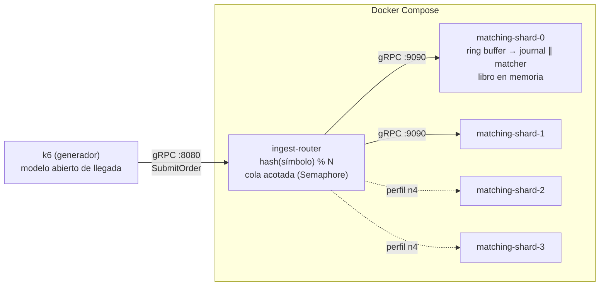

# Implementación del PoC — Motor de Emparejamiento (E01)

Este documento describe **cómo está implementado** el PoC: componentes, flujo de una orden, mapeo de cada táctica arquitectónica a código concreto, configuración, metodología de medición y limitaciones. La ficha del experimento (hipótesis, fases y criterios) está en [`experimento-e01.md`](experimento-e01.md); este documento explica el artefacto que lo ejecuta.

## 1. Visión general

Tres módulos Java 21 en un monorepo Gradle, desplegados como contenedores independientes:



Cada **shard es un proceso** (un contenedor): una partición del universo de activos con su propio ring buffer y su único hilo escritor. Esa igualdad proceso = partición = escritor es la que replica, en pequeño, el patrón del despliegue real (D-03/D-09), y es lo que permite probar escalabilidad agregando shards (N=2 → N=4) sin tocar código.

## 2. Flujo de una orden (camino crítico)

1. **k6** invoca `matching.v1.MatchingIngest/SubmitOrder` contra el router (`:8080`). Aquí empieza la medición externa (latencia extremo a extremo del RPC).
2. **`RouterService`** intenta adquirir un permiso del `Semaphore` (cola acotada). Si no hay cupo, responde `REJECTED` de inmediato — esa es la señal de backpressure; nada se encola sin límite.
3. Con permiso, calcula `shard = Math.floorMod(symbol.hashCode(), N)` y reenvía la orden por el stub asíncrono del shard dueño. Todas las órdenes de un mismo símbolo caen siempre en el mismo shard: el enrutamiento es determinístico.
4. **`IngestGrpcService`** (en el shard) toma `t0 = System.nanoTime()` — el "arribo al motor" de la medida de ASR-02 — e intenta publicar en el ring buffer con `tryNext()`. Si el ring está lleno responde `REJECTED` sin bloquear los hilos de gRPC.
5. El **único hilo escritor** (`MatchingHandler`, hilo `matcher-shard-N`) toma el evento en orden de llegada, busca el `OrderBook` del símbolo y ejecuta el matching por prioridad precio-tiempo. No hay locks: nadie más puede tocar ese libro, por construcción. Luego aplica `BusinessLogicModel`, que consume el costo por orden declarado en la corrida.
6. El handler registra en tres `Recorder` de HdrHistogram —espera, servicio y total— y completa el `CompletableFuture` con el `OrderResponse`: estado `MATCHED` / `PARTIALLY_MATCHED` / `RESTING`, cantidad materializada, latencia interna y shard.
7. Con `JOURNAL` activo, un **`JournalHandler` consume el mismo evento en paralelo** y lo escribe en un archivo de solo-anexado, con `force()` una vez por lote. No suma latencia al cliente, pero el acuse se emite sin esperar al disco. En modo `serie` va encadenado *antes* del matcher: el acuse implica durabilidad y el journal entra al camino crítico.
8. Un **manejador de limpieza encadenado al final** vacía el slot para que se recicle sin generar basura. Va ahí y no en el matcher porque, con consumidores en paralelo, **ninguno puede mutar el evento**: el slot pertenece al ring hasta que todos pasaron.
9. La respuesta viaja de vuelta shard → router → k6, que la cuenta en `grpc_req_duration`. El permiso del semáforo se libera al completarse el RPC.

Dos relojes miden lo mismo desde extremos distintos: k6 mide la latencia completa del RPC y el shard mide arribo → materialización. La diferencia entre ambos es el costo del transporte + router, y contrastarlas descarta que el generador contamine el resultado.

Para que esa resta sea válida los dos lados deben publicar **el mismo estadístico**. El shard publica dos cosas distintas. Una es un histograma por ventana de 10 s, útil para ver la evolución dentro de una fase. La otra acumula todas las ventanas y sale al recibir `SIGTERM`, con el prefijo `ACUMULADO`.

Solo el acumulado da percentiles de la población entera, y solo esos son comparables cifra a cifra con los de k6: **la mediana de los p95 por ventana no es un p95**. El shard descompone además su tiempo en `total = espera + servicio`, lo que distingue «hay que abaratar la orden» de «hay que shardear más».

## 3. Módulos

### `services/common-proto`

Contrato único de ingesta (`matching.proto`), compilado con `protobuf-gradle-plugin`. Tres decisiones del contrato. Precios como `int64 price_cents`, sin aritmética flotante en el camino crítico. `Status.REJECTED` dentro del contrato, porque el backpressure es semántica del dominio y no un error de transporte. Y `engine_latency_micros` en la respuesta, para el contraste de relojes. Tanto el router como los shards implementan **el mismo servicio gRPC**, lo que permite apuntar k6 directo a un shard si se quiere aislar el costo del router.

### `services/ingest-router`

| Clase | Responsabilidad |
|---|---|
| `RouterMain` | Arranque: lee `PORT`, `SHARDS` (lista `host:puerto` separada por comas — el orden define el índice de shard) y `QUEUE_CAPACITY`; crea un `ManagedChannel` + stub asíncrono por shard; reporta cada 10 s solicitudes en vuelo y rechazos acumulados. |
| `RouterService` | El camino crítico de ingesta: cola acotada (`Semaphore.tryAcquire`, sin bloqueo), sharding determinístico (`floorMod(hashCode, N)` — estable porque `String.hashCode` está especificado en Java), y relevo asíncrono de la respuesta del shard al cliente. |

El router es **sin estado**: no conoce libros ni órdenes. Por eso en el diseño real puede replicarse con HPA; en el PoC basta una instancia.

### `services/matching-engine`

| Clase | Responsabilidad |
|---|---|
| `EngineMain` | Arranque del shard: construye el `Disruptor` (`ProducerType.MULTI` — publican varios hilos gRPC), cablea la cadena de consumidores según `JOURNAL`, levanta el servidor gRPC y el reporte de percentiles cada 10 s. Al recibir `SIGTERM` publica los percentiles `ACUMULADO` de la fase completa. Declara en el log su punto de operación y sus recursos visibles: ninguna corrida debe ser ambigua. |
| `IngestGrpcService` | Borde gRPC → ring buffer con `tryNext()` (backpressure sin bloqueo). Estampa el `t0` de la medición. |
| `MatchingHandler` | El *single writer* del patrón LMAX: procesa secuencialmente, sin locks; un `HashMap<String, OrderBook>` por shard; descompone la latencia en espera y servicio, y completa el futuro. **No muta el slot** — ver el paso 8 del camino crítico. |
| `JournalHandler` | Registro de solo-anexado, con `force()` una vez por lote (`endOfBatch`) y escritura sin asignar en el camino crítico. Se cablea en paralelo o en serie con el matcher: la diferencia entre las dos disposiciones es la cláusula de H1 sobre mantener el journaling fuera del camino crítico. |
| `OrderBook` | Libro de un activo: `TreeMap<precio, ArrayDeque<Resting>>` para compras (descendente) y ventas (ascendente); matching por prioridad precio-tiempo con cruce parcial y resto en reposo. **No es thread-safe a propósito** — la exclusión la da el diseño, no los locks. |
| `BusinessLogicModel` | **Modelo sintético del tiempo de servicio** de la lógica que el PoC no implementa (validación, riesgo, tipos de orden, comisiones, trades). Quema CPU —no duerme— en el hilo del único escritor. Dos perillas: `BIZ_MICROS` (la media) y `BIZ_DIST` (la forma). Apagado por defecto. |
| `OrderSlot` | Entrada mutable y preasignada del ring: se rellena al publicar y se limpia al consumir, para que en régimen el camino crítico no genere basura (menos presión de GC). |

## 4. Mapeo táctica → código

| Táctica (E01 / cap. 08–09) | Dónde vive en el código |
|---|---|
| Único escritor por partición (D-03) | Un solo `EventHandler` por `Disruptor`; `OrderBook` sin sincronización |
| Datos del camino crítico en memoria | `OrderBook` (`TreeMap`/`ArrayDeque`), sin I/O en el matching |
| Reducir overhead: sin bloqueos ni contención | `tryNext`/`tryAcquire` en vez de esperas; ring buffer preasignado |
| Cola acotada + backpressure (D-10) | `Semaphore` del router y capacidad fija del ring; ambos responden `REJECTED` |
| Particionamiento por activo (escalar agregando shards) | `floorMod(symbol.hashCode(), N)` en `RouterService`; un contenedor por shard |
| Asíncrono fuera del camino crítico | Respuesta por `CompletableFuture`; journaling/notificación excluidos del PoC |
| GC de pausas cortas (D-02) | `-XX:+UseZGC -XX:+ZGenerational` en el Dockerfile |
| No doble-materialización | Consecuencia del single writer: solo un hilo decide sobre cada libro |

## 5. Configuración

| Variable | Servicio | Default | Significado |
|---|---|---|---|
| `PORT` | ambos | 8080 / 9090 | Puerto gRPC |
| `SHARDS` | router | `localhost:9090` | Lista `host:puerto`; su orden define el índice de sharding |
| `QUEUE_CAPACITY` | router | 10000 | Solicitudes en vuelo antes de rechazar (cola acotada) |
| `SHARD_ID` | engine | 0 | Identificador reportado en respuestas y logs |
| `RING_SIZE` | engine | 16384 | Tamaño del ring buffer (potencia de 2) |
| `BIZ_MICROS` | engine | 0 | Costo **medio** por orden (µs) del modelo de tiempo de servicio; 0 = apagado. No es el costo de cada orden: el modelo es una distribución |
| `BIZ_DIST` | engine | `mezcla` | Forma de esa distribución: `mezcla` (tres clases discretas) o `lognormal` (continua, sin cota). Ambas comparten media y Cs², así que un A/B entre ellas aísla la forma |
| `JOURNAL` | engine | `off` | Disposición del journaling: `off`, `paralelo` (consumidor paralelo del ring) o `serie` (encadenado antes del matcher). Ver §6 |
| `JOURNAL_DIR` | engine | `/var/lib/engine/journal` | Directorio del archivo de solo-anexado, montado en un volumen |
| `JFR_OPTS` | engine | vacío | Flags de Java Flight Recorder. Se **anexan** a `JAVA_OPTS`, no lo reemplazan: sustituirlo apagaría ZGC sin avisar |
| `SHARD_CPUS` | engine | `0` (sin límite) | Cuota de CPU por partición, en núcleos. Clave `cpus` de nivel superior — `deploy.resources` se ignora en silencio fuera de Swarm |
| `SHARD_CPUSET` | engine | vacío | Núcleos concretos a los que se fija el contenedor |
| `SHARD_MEM` | engine | `0` (sin límite) | Límite de memoria del contenedor |
| `JAVA_OPTS` | ambos | ZGC, 256–512 MB | Flags de la JVM. **Se define en el `Dockerfile`**, no en Compose; Compose solo puede sobreescribirla |

**Los límites de recursos se verifican, no se declaran.** `make verify-limits` lee el cgroup real con `docker inspect` y lo contrasta con lo pedido, además de imprimir el `availableProcessors` que la JVM cree tener. Sin esa comprobación, un límite escrito en el YAML pero no aplicado produce una corrida que parece confinada y no lo está.

**Volúmenes.** Ocho volúmenes con nombre: `journal-0..3` para los archivos de journaling y `jfr-0..3` para las grabaciones. El journal no puede ir a la capa de escritura del contenedor, que es un overlay y no representa un disco.

Todo el ciclo de vida está en el **Makefile**: `make build`, `make up` / `make up-n4`, `make smoke`, `make f1|f2|f4`, `make experimento`, `make logs`, `make down`. Cambiar N=2 → N=4 no toca código: el perfil `n4` del compose levanta dos shards más y `make up-n4` le pasa al router la lista de 4.

## 6. Metodología de medición

- **Modelo abierto de llegada** (k6 `constant/ramping-arrival-rate`): la carga se expresa como tasa objetivo, no como usuarios que esperan respuesta; el modelo cerrado subestima los percentiles bajo saturación (*coordinated omission*).
- **Verificación de aislamiento del sharding**: cada respuesta trae el `shard_id` que la procesó y k6 verifica en vivo que un mismo símbolo sea respondido siempre por el mismo shard (`shard_routing_violations` con threshold `count==0` en las fases oficiales).
- **Arribo estocástico**: los ejecutores `*-arrival-rate` de k6 espacian los arribos de forma uniforme (a 17/s, uno cada 58,8 ms exactos), y con varianza de arribo nula la cola no acumula y los percentiles salen optimistas. El generador desplaza cada iteración un tiempo **exponencial** independiente antes del RPC, lo que converge a un arribo Poisson conservando la tasa: Ca² pasa de 0,00 a **0,89** medido sobre 200.000 llegadas. `JITTER_FACTOR=0` restaura el arribo periódico para comparar.
- **Símbolos que reparten parejo**: el sharding es `floorMod(String.hashCode(símbolo), N)`, así que el conjunto de prueba decide el balance. Los 36 nemotécnicos del generador reparten **18/18 con N=2 y 9/9/9/9 con N=4**; al cambiar la lista hay que reverificar el reparto.
- **Criterio de éxito p95 ≤ 200 ms** como threshold de k6 (falla la corrida en vivo); p99/p99.9 se registran como observación (`summaryTrendStats`).
- **Doble punto de medida**: `grpc_req_duration` en k6 vs. HdrHistogram del shard (logueado cada 10 s). La brecha entre ambos aísla el costo de red/router.
- **Rechazos como métrica de primera clase**: el contador `orders_rejected_backpressure` debe ser 0 en F1–F3; en F4 su aparición es parte del resultado (dónde se activa la protección). Medido en el barrido de servicio: **el sistema se degrada por latencia mucho antes que por rechazo** — ni siquiera a ρ = 1,01 se activó el backpressure, así que este criterio por sí solo no protege de nada.
- **Iteraciones descartadas como criterio de validez**: `dropped_iterations` debe ser 0 en F1–F3, con umbral de k6. k6 descarta una iteración cuando no tiene un VU libre, y esa es carga que **nunca se aplicó**: el p95 resultante subestima al sistema. Según la documentación de k6, si los descartes aparecen ya avanzada la corrida son además síntoma de degradación del propio motor.
- **Precalentamiento**: los primeros minutos de cada corrida estabilizan JIT/GC y se excluyen del análisis.

### El tiempo de servicio como parámetro del experimento

`OrderBook.match()` cuesta ~13 µs medidos. Un motor real además valida, verifica riesgo, saldos y posiciones, resuelve tipos de orden, calcula comisiones, previene el auto-cruce y genera trades. En un diseño de **un único escritor** ese costo se serializa, así que fija el techo del shard:

```
techo de un shard = 1 / S          ρ = λ · S
```

Medir la capacidad con S de microsegundos mide un `TreeMap`, no un motor. Como no hay estimación del costo real, `BusinessLogicModel` lo vuelve un **parámetro barrido** (`make sweep-service`) y el entregable deja de ser un número suelto para ser un **presupuesto de tiempo de servicio**, falsable sin conocer todavía la lógica de negocio.

El modelo respeta dos reglas. **Quema CPU en vez de dormir**: un `sleep` devuelve el núcleo, no ensucia la caché ni compite con gRPC, y su granularidad en la JVM es de milisegundos.

Y **muestrea de una distribución sesgada** en vez de una constante. El costo real depende de los datos —una orden que no cruza es barata, una que barre cinco niveles es cara— y esa varianza entra en Kingman igual que la del arribo.

`BIZ_MICROS` fija la **media**, no el costo de cada orden. Por defecto la distribución es una mezcla de tres clases (90 % ×1, 9 % ×6, 1 % ×30) con Cs² = 3,34 —más variable que una exponencial, que da 1— acotada por construcción en ~17× la media. A S = 8 ms eso significa que una orden cuesta **4,6, 27,6 o 138 ms** según su clase.

`BIZ_DIST=lognormal` ofrece una segunda forma, continua y **sin cota superior**, con la misma media y el mismo Cs² (la σ se deriva del Cs², no se expone: exponerla permitiría elegir la varianza que conviene al resultado). Existe para una sola pregunta: *¿el resultado depende de la forma, o solo de sus dos primeros momentos?* Medido, la respuesta es mixta — el p95 es robusto (74,7 vs 63,3 ms) pero la cola no (p99.9 +23 %), así que la mezcla **subestima el p99.9** por estar acotada.

Resultados medidos (ver `evidencia-corridas.md`): **el presupuesto es ≈ 12,4 ms por orden** con el pico contractual repartido entre 2 particiones, y **≈ 8,5 ms** con todo el pico concentrado en una sola.

Esas dos cifras dan 1,46×, no 2×, y la razón es aritmética y no una ineficiencia: **shardear reduce la espera, nunca el servicio**. Repartir la carga baja ρ, pero el tiempo de servicio es latencia también y subir el presupuesto lo sube directo. Corolario de diseño: ninguna cantidad de particiones permite que una orden que cuesta 200 ms cumpla un SLA de 200 ms.

La semilla del modelo es `42 + shardId`, **distinta por partición a propósito**. Con una semilla común todas sacaban la misma secuencia de tiempos de servicio; como reciben la misma tasa, las órdenes caras caían sobre todas a la vez en vez de repartirse en el tiempo. La lógica real no está correlacionada entre particiones. La semilla efectiva se imprime en el log de arranque.

## 7. Despliegue

`deploy/Dockerfile` es multi-etapa (Gradle 8.14 + JDK 21 → JRE 21) y parametrizado por `--build-arg SERVICE=...`, así una sola definición construye ambos servicios. El compose levanta router + 2 shards (N=2) o + 4 con `--profile n4`. Los `cpuset` de aislamiento de núcleos están comentados: solo aplican en hosts Linux (en macOS Docker corre en una VM); para la corrida oficial en Linux, descomentarlos y dedicar núcleos distintos a shards, router y generador.

## 8. Limitaciones y deuda (declaradas en E01)

Una sola máquina por loopback: no representa la red de 1 Gbps de TEC-2 ni la alta disponibilidad. Valida el patrón, no el dimensionamiento.

Excluidos por no incidir en ASR-02/03: fan-out de notificaciones, proyecciones CQRS, persistencia durable, broker de eventos y autoescalado. Deuda de decisión a re-evaluar con datos: la estrategia de espera del Disruptor y la estructura interna del libro. El PoC usa `BlockingWaitStrategy`, amable con la máquina compartida; `Yielding` y `BusySpin` bajan la latencia a costa de quemar un núcleo por shard. El `hashCode` de `String` como función de sharding es suficiente para el PoC; un despliegue real usaría una función consistente con rebalanceo.

## 9. Extensiones naturales (post-experimento)

Si E01 valida el patrón:

1. **Sustituir la cola acotada del router por un log de eventos** (Redpanda o Kafka), recuperando la amortiguación de D-10 tal como la describe el escenario de pruebas del equipo.
2. **Publicar los eventos de materialización hacia el bus** para el fan-out de ASR-04, candidato a E02.
3. **Repetir el mismo diseño en el banco de 3 nodos (TEC-2)**, para confirmar que la reducción de escala no ocultó efectos de red.

El journaling por shard ya no está en esta lista: se construyó como consumidor paralelo del ring y se midió (§6).
